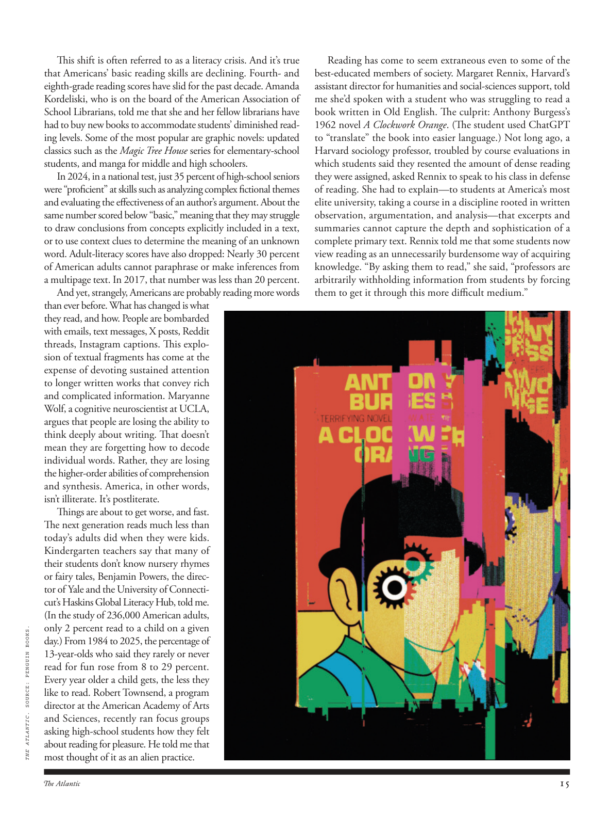

# The Atlantic — August 2026

## Page 17

---

This shift is often referred to as a literacy crisis. And it’s true that Americans’ basic reading skills are declining. Fourthand eighth-grade reading scores have slid for the past decade. Amanda Kordeliski, who is on the board of the American Association of School Librarians, told me that she and her fellow librarians have had to buy new books to accommodate students’ diminished reading levels. Some of the most popular are graphic novels: updated classics such as the Magic Tree House series for elementary-school students, and manga for middle and high schoolers.

**【中文翻译】** 这种转变通常被称为识字危机。美国人的基本阅读能力确实在下降。过去十年里，四年级和八年级的阅读成绩有所下滑。美国学校图书馆员协会董事会成员阿曼达·科德里斯基 (Amanda Kordeliski) 告诉我，她和她的图书馆员同事不得不购买新书，以适应学生阅读水平下降的情况。其中最受欢迎的是图画小说：更新的经典作品，例如适合小学生的《魔法树屋》系列，以及适合中学生和高中生的漫画。

In 2024, in a national test, just 35 percent of high-school seniors were “proficient” at skills such as analyzing complex fictional themes and evaluating the effectiveness of an author’s argument. About the same number scored below “basic,” meaning that they may struggle to draw conclusions from concepts explicitly included in a text, or to use context clues to determine the meaning of an unknown word. Adult-literacy scores have also dropped: Nearly 30 percent of American adults cannot paraphrase or make inferences from a multipage text. In 2017, that number was less than 20 percent.

**【中文翻译】** 2024 年，在一项全国测试中，只有 35% 的高中生“精通”分析复杂的虚构主题和评估作者论证的有效性等技能。大约相同的数字得分低于“基本”，这意味着他们可能很难从文本中明确包含的概念中得出结论，或者使用上下文线索来确定未知单词的含义。成人识字成绩也有所下降：近 30% 的美国成年人无法对多页文本进行释义或推理。 2017 年，这一数字还不到 20%。

And yet, strangely, Americans are probably reading more words than ever before. What has changed is what they read, and how. People are bombarded with emails, text messages, X posts, Reddit threads, Instagram captions. This explosion of textual fragments has come at the expense of devoting sustained attention to longer written works that convey rich and complicated information. Maryanne Wolf, a cognitive neuroscientist at UCLA, argues that people are losing the ability to think deeply about writing. That doesn’t mean they are forgetting how to decode individual words. Rather, they are losing the higher-order abilities of comprehension and synthesis. America, in other words, isn’t illiterate. It’s post literate.

**【中文翻译】** 然而，奇怪的是，美国人阅读的单词可能比以往任何时候都多。改变的是他们阅读的内容以及方式。人们受到电子邮件、短信、X 帖子、Reddit 帖子、Instagram 标题的轰炸。文本片段的爆炸性增长是以牺牲对传达丰富而复杂信息的较长书面作品的持续关注为代价的。加州大学洛杉矶分校的认知神经科学家玛丽安·沃尔夫认为，人们正在失去深入思考写作的能力。这并不意味着他们忘记了如何解码单个单词。相反，他们正在失去理解和综合的高阶能力。换句话说，美国并不是文盲。这是后识字。

Things are about to get worse, and fast. The next generation reads much less than today’s adults did when they were kids. Kinder garten teachers say that many of their students don’t know nursery rhymes or fairy tales, Benjamin Powers, the director of Yale and the University of Connecticut’s Haskins Global Literacy Hub, told me.

**【中文翻译】** 事情将会变得更糟，而且速度更快。下一代人的阅读量比今天的成年人小时候少得多。耶鲁大学和康涅狄格大学哈斯金斯全球读写中心主任本杰明·鲍尔斯告诉我，幼儿园老师说他们的许多学生不懂童谣或童话故事。

(In the study of 236,000 American adults, only 2 percent read to a child on a given THE ATLANTIC . SOURCE: PENGUIN BOOKS. day.) From 1984 to 2025, the percentage of 13-year-olds who said they rarely or never read for fun rose from 8 to 29 percent.

**【中文翻译】** （在对 236,000 名美国成年人进行的研究中，只有 2% 的人在特定的《大西洋》日给孩子读书。来源：企鹅图书。）从 1984 年到 2025 年，表示很少或从不读书的 13 岁青少年比例从 8% 上升到 29%。

Every year older a child gets, the less they like to read. Robert Townsend, a program director at the American Academy of Arts and Sciences, recently ran focus groups asking high-school students how they felt about reading for pleasure. He told me that most thought of it as an alien practice.

**【中文翻译】** 孩子越大，他们就越不喜欢读书。美国艺术与科学学院的项目主任罗伯特·汤森最近组织了焦点小组，询问高中生对于阅读乐趣的感受。他告诉我，大多数人认为这是一种外星人的做法。

Reading has come to seem extraneous even to some of the best-educated members of society. Margaret Rennix, Harvard’s assistant director for humanities and social-sciences support, told me she’d spoken with a student who was struggling to read a book written in Old English. The culprit: Anthony Burgess’s 1962 novel A Clockwork Orange . (The student used ChatGPT to “translate” the book into easier language.) Not long ago, a Harvard sociology professor, troubled by course evaluations in which students said they resented the amount of dense reading they were assigned, asked Rennix to speak to his class in defense of reading. She had to explain—to students at America’s most elite university, taking a course in a discipline rooted in written observation, argumentation, and analysis—that excerpts and summaries cannot capture the depth and sophistication of a complete primary text. Rennix told me that some students now view reading as an unnecessarily burdensome way of acquiring knowledge. “By asking them to read,” she said, “professors are arbitrarily withholding information from students by forcing them to get it through this more difficult medium.”

**【中文翻译】** 即使对于一些受过最好教育的社会成员来说，阅读也似乎变得无关紧要。哈佛大学负责人文和社会科学支持的助理主任玛格丽特·雷尼克斯 (Margaret Rennix) 告诉我，她曾与一名学生交谈过，这名学生正在努力阅读一本用古英语写的书。罪魁祸首：安东尼·伯吉斯 1962 年的小说《发条橙》。 （该学生使用 ChatGPT 将这本书“翻译”成更简单的语言。）不久前，哈佛大学的一位社会学教授对课程评估感到困扰，学生表示他们对分配给他们的密集阅读量感到不满，因此要求雷尼克斯在全班上发表讲话，为阅读辩护。她必须向美国最精英大学的学生解释，摘录和摘要无法捕捉完整原始文本的深度和复杂性，这些学生正在学习一门植根于书面观察、论证和分析的学科课程。雷尼克斯告诉我，一些学生现在认为阅读是一种获取知识的不必要的负担方式。 “通过要求他们阅读，”她说，“教授们强迫学生通过这种更困难的媒介来获取信息，从而任意向他们隐瞒信息。”
