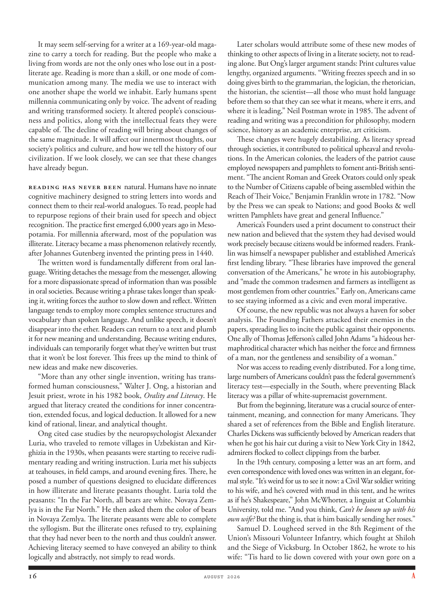

# The Atlantic — August 2026

## Page 18

---

It may seem selfserving for a writer at a 169-year-old magazine to carry a torch for reading. But the people who make a living from words are not the only ones who lose out in a postliterate age. Reading is more than a skill, or one mode of communication among many. The media we use to interact with one another shape the world we inhabit. Early humans spent millennia communicating only by voice. The advent of reading and writing transformed society. It altered people’s consciousness and politics, along with the intellectual feats they were capable of. The decline of reading will bring about changes of the same magnitude. It will affect our innermost thoughts, our society’s politics and culture, and how we tell the history of our civilization. If we look closely, we can see that these changes have already begun.

**【中文翻译】** 对于一家拥有 169 年历史的杂志社的作家来说，高举阅读火炬似乎有些自私。但在后文盲时代，并不是唯一靠文字谋生的人。阅读不仅仅是一种技能，或者是许多人之间的一种交流方式。我们用来相互交流的媒体塑造了我们所居住的世界。早期人类几千年来仅通过声音进行交流。阅读和写作的出现改变了社会。它改变了人们的意识和政治，以及他们所能达到的智力成就。阅读量的下降也会带来同样幅度的变化。它会影响我们内心的思想，影响我们社会的政治和文化，影响我们如何讲述我们的文明历史。如果我们仔细观察，就会发现这些变化已经开始了。

Reading has never been natural. Humans have no innate cognitive machinery designed to string letters into words and connect them to their real-world analogues. To read, people had to re purpose regions of their brain used for speech and object recognition. The practice first emerged 6,000 years ago in Mesopotamia. For millennia afterward, most of the population was illiterate. Literacy became a mass phenomenon relatively recently, after Johannes Gutenberg invented the printing press in 1440.

**【中文翻译】** 阅读从来都不是自然而然的事情。人类没有天生的认知机制来将字母串成单词并将它们与现实世界的类似物联系起来。为了阅读，人们必须重新利用大脑中用于语音和物体识别的区域。这种做法最早出现于 6000 年前的美索不达米亚。此后的几千年里，大多数人口都是文盲。约翰内斯·古腾堡 (Johannes Gutenberg) 于 1440 年发明了印刷机后，识字才成为一种大众现象。

The written word is fundamentally different from oral language. Writing detaches the message from the messenger, allowing for a more dispassionate spread of information than was possible in oral societies. Because writing a phrase takes longer than speaking it, writing forces the author to slow down and reflect. Written language tends to employ more complex sentence structures and vocabulary than spoken language. And unlike speech, it doesn’t disappear into the ether. Readers can return to a text and plumb it for new meaning and understanding. Because writing endures, individuals can temporarily forget what they’ve written but trust that it won’t be lost forever. This frees up the mind to think of new ideas and make new discoveries.

**【中文翻译】** 书面语言与口头语言有根本的不同。书写将信息与信使分开，使得信息的传播比口头社会更加冷静。因为写一个短语比说它需要更长的时间，所以写作迫使作者放慢速度并反思。书面语言往往比口语使用更复杂的句子结构和词汇。与言语不同的是，它不会消失在空中。读者可以返回文本并探索新的含义和理解。由于书写可以持久，人们可以暂时忘记自己所写的内容，但相信它不会永远丢失。这可以解放思想，思考新想法并做出新发现。

“More than any other single invention, writing has transformed human consciousness,” Walter J. Ong, a historian and Jesuit priest, wrote in his 1982 book, Orality and Literacy . He argued that literacy created the conditions for inner concentration, extended focus, and logical deduction. It allowed for a new kind of rational, linear, and analytical thought.

**【中文翻译】** 历史学家兼耶稣会牧师沃尔特·J·翁 (Walter J. Ong) 在其 1982 年出版的《口语与识字》一书中写道：“书写对人类意识的改变比任何其他单一发明都更重要。”他认为识字能力为内在专注、扩展注意力和逻辑推理创造了条件。它允许一种新的理性、线性和分析思维。

Ong cited case studies by the neuro psychologist Alexander Luria, who traveled to remote villages in Uzbekistan and Kirghizia in the 1930s, when peasants were starting to receive rudimentary reading and writing instruction. Luria met his subjects at teahouses, in field camps, and around evening fires. There, he posed a number of questions designed to elucidate differences in how illiterate and literate peasants thought. Luria told the peasants: “In the Far North, all bears are white. Novaya Zemlya is in the Far North.” He then asked them the color of bears in Novaya Zemlya. The literate peasants were able to complete the syllogism. But the illiterate ones refused to try, explaining that they had never been to the north and thus couldn’t answer.

**【中文翻译】** Ong 引用了神经心理学家亚历山大·卢里亚 (Alexander Luria) 的案例研究，他在 20 世纪 30 年代前往乌兹别克斯坦和吉尔吉斯斯坦的偏远村庄，当时农民开始接受基本的阅读和写作指导。卢里亚在茶馆、野战营地和傍晚的篝火旁会见了他的拍摄对象。在那里，他提出了一些旨在阐明文盲和识字农民思维方式差异的问题。卢里亚告诉农民们：“在极北地区，所有的熊都是白色的。新地岛就在极北地区。”然后他问他们新地岛的熊是什么颜色的。有文化的农民能够完成这个三段论。但那些不识字的人拒绝尝试，并解释说他们从未去过北方，因此无法回答。

Achieving literacy seemed to have conveyed an ability to think logically and abstractly, not simply to read words. Later scholars would attribute some of these new modes of thinking to other aspects of living in a literate society, not to reading alone. But Ong’s larger argument stands: Print cultures value lengthy, organized arguments. “Writing freezes speech and in so doing gives birth to the grammarian, the logician, the rhetorician, the historian, the scientist— all those who must hold language before them so that they can see what it means, where it errs, and where it is leading,” Neil Postman wrote in 1985. The advent of reading and writing was a pre condition for philosophy, modern science, history as an academic enterprise, art criticism.

**【中文翻译】** 读写能力似乎体现了逻辑和抽象思维的能力，而不仅仅是阅读单词的能力。后来的学者将这些新的思维模式中的一些归因于文学社会生活的其他方面，而不仅仅是阅读。但翁的更大论点是：印刷文化重视冗长、有组织的论点。尼尔·波兹曼 (Neil Postman) 在 1985 年写道：“写作冻结了言语，从而诞生了语法学家、逻辑学家、修辞学家、历史学家、科学家——所有这些人都必须将语言摆在面前，这样他们才能明白它的含义、它的错误以及它的走向。”阅读和写作的出现是哲学、现代科学、作为学术事业的历史和艺术批评的先决条件。

These changes were hugely destabilizing. As literacy spread through societies, it contributed to political upheaval and revolutions. In the American colonies, the leaders of the patriot cause employed newspapers and pamphlets to foment antiBritish sentiment. “The ancient Roman and Greek Orators could only speak to the Number of Citizens capable of being assembled within the Reach of Their Voice,” Benjamin Franklin wrote in 1782. “Now by the Press we can speak to Nations; and good Books & well written Pamphlets have great and general Influence.”

**【中文翻译】** 这些变化极大地破坏了稳定。随着识字能力在社会中的传播，它促成了政治动乱和革命。在美洲殖民地，爱国事业的领导人利用报纸和小册子煽动反英情绪。本杰明·富兰克林 (Benjamin Franklin) 在 1782 年写道：“古罗马和希腊的演说家只能对能够在其声音范围内聚集的公民进行演讲。现在，通过媒体，我们可以对国家进行演讲；好书和写得好的小册子具有巨大而普遍的影响力。”

America’s Founders used a print document to construct their new nation and believed that the system they had devised would work precisely because citizens would be informed readers. Franklin was himself a newspaper publisher and established America’s first lending library. “These libraries have improved the general conversation of the Americans,” he wrote in his autobiography, and “made the common tradesmen and farmers as intelligent as most gentlemen from other countries.” Early on, Americans came to see staying informed as a civic and even moral imperative.

**【中文翻译】** 美国的开国元勋们使用印刷文件来建设他们的新国家，并相信他们设计的系统将会有效，因为公民将成为知情的读者。富兰克林本人是一名报纸出版商，并建立了美国第一个借阅图书馆。 “这些图书馆改善了美国人的一般对话，”他在自传中写道，“让普通商人和农民变得像其他国家的大多数绅士一样聪明。”美国人很早就开始将及时了解情况视为一项公民甚至道德义务。

Of course, the new republic was not always a haven for sober analysis. The Founding Fathers attacked their enemies in the papers, spreading lies to incite the public against their opponents.

**【中文翻译】** 当然，新共和国并不总是进行冷静分析的避风港。开国元勋们在报纸上攻击他们的敌人，散布谎言煽动公众反对他们的对手。

One ally of Thomas Jefferson’s called John Adams “a hideous hermaphroditical character which has neither the force and firmness of a man, nor the gentleness and sensibility of a woman.”

**【中文翻译】** 托马斯·杰斐逊的一位盟友称约翰·亚当斯为“一个可怕的雌雄同体的人物，既没有男人的力量和坚定，也没有女人的温柔和感性。”

Nor was access to reading evenly distributed. For a long time, large numbers of Americans couldn’t pass the federal government’s literacy test—especially in the South, where preventing Black literacy was a pillar of white-supremacist government.

**【中文翻译】** 阅读的机会分布也不均匀。长期以来，大量美国人无法通过联邦政府的识字测试，尤其是在南方，阻止黑人识字是白人至上主义政府的支柱。

But from the beginning, literature was a crucial source of entertainment, meaning, and connection for many Americans. They shared a set of references from the Bible and English literature.

**【中文翻译】** 但从一开始，文学就是许多美国人娱乐、意义和联系的重要来源。他们分享了一系列圣经和英语文献的参考文献。

Charles Dickens was sufficiently beloved by American readers that when he got his hair cut during a visit to New York City in 1842, admirers flocked to collect clippings from the barber.

**【中文翻译】** 查尔斯·狄更斯深受美国读者的喜爱，当他 1842 年访问纽约时理发时，崇拜者蜂拥而至，从理发师那里收集剪报。

In the 19th century, composing a letter was an art form, and even correspondence with loved ones was written in an elegant, formal style. “It’s weird for us to see it now: a Civil War soldier writing to his wife, and he’s covered with mud in this tent, and he writes as if he’s Shakespeare,” John McWhorter, a linguist at Columbia University, told me. “And you think, Can’t he loosen up with his own wife? But the thing is, that is him basically sending her roses.”

**【中文翻译】** 在19世纪，写信是一种艺术形式，甚至与亲人的信件也是以优雅、正式的风格书写的。 “我们现在看到的很奇怪：一名内战士兵给他的妻子写信，他在这个帐篷里浑身是泥，他写得就像莎士比亚一样，”哥伦比亚大学的语言学家约翰·麦克沃特告诉我。 “你会想，他不能和自己的妻子放松一下吗？但问题是，他基本上就是给她送玫瑰花。”

Samuel D. Lougheed served in the 8th Regiment of the Union’s Missouri Volunteer Infantry, which fought at Shiloh and the Siege of Vicksburg. In October 1862, he wrote to his wife: “Tis hard to lie down covered with your own gore on a

**【中文翻译】** 塞缪尔·D·洛希德 (Samuel D. Lougheed) 在联邦密苏里州志愿步兵第 8 团服役，参加了夏洛和维克斯堡围攻战。 1862 年 10 月，他在给妻子的信中写道：“躺在床上沾满自己的血迹真是太难了。
