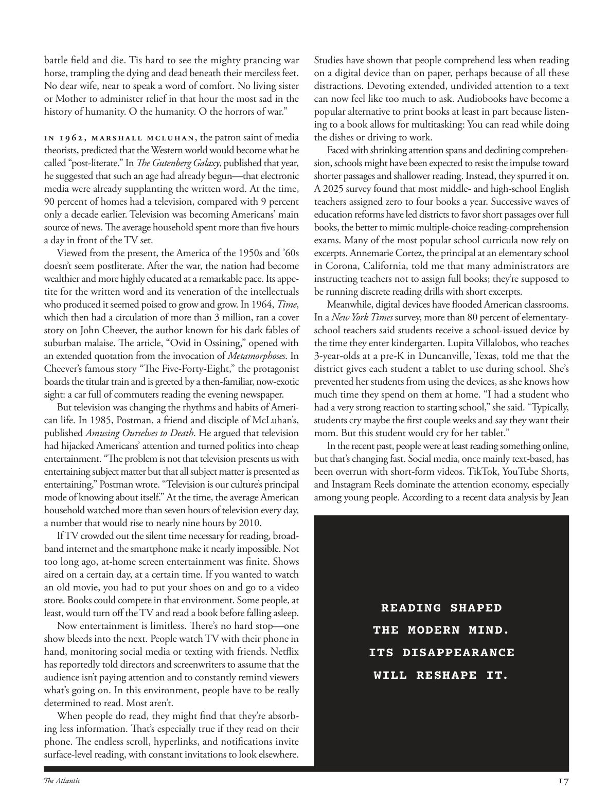

# The Atlantic — August 2026

## Page 19

---

battle field and die. Tis hard to see the mighty prancing war horse, trampling the dying and dead beneath their merciless feet. No dear wife, near to speak a word of comfort. No living sister or Mother to administer relief in that hour the most sad in the history of humanity. O the humanity. O the horrors of war.”

**【中文翻译】** 战场并死亡。很难看到那匹腾跃的战马，无情地将垂死的人和死者踩在脚下。没有亲爱的妻子，靠近说一句安慰的话。在人类历史上最悲伤的时刻，没有活着的姐妹或母亲来提供救济。哦，人类。哦，战争的恐怖。”

In 1962, Marshall McLuhan , the patron saint of media theorists, predicted that the Western world would become what he called “postliterate.” In The Gutenberg Galaxy , published that year, he suggested that such an age had already begun— that electronic media were already supplanting the written word. At the time, 90 percent of homes had a television, compared with 9 percent only a decade earlier. Television was becoming Americans’ main source of news. The average household spent more than five hours a day in front of the TV set.

**【中文翻译】** 1962年，媒体理论家的守护神马歇尔·麦克卢汉预言，西方世界将进入他所谓的“后文学时代”。在当年出版的《古腾堡银河》中，他提出这样一个时代已经开始——电子媒体已经取代了书面文字。当时，90% 的家庭拥有电视，而十年前只有 9%。电视正在成为美国人的主要新闻来源。平均家庭每天花在电视机前的时间超过五个小时。

Viewed from the present, the America of the 1950s and ’60s doesn’t seem post literate. After the war, the nation had become wealthier and more highly educated at a remarkable pace. Its appetite for the written word and its veneration of the intellectuals who produced it seemed poised to grow and grow. In 1964, Time , which then had a circulation of more than 3 million, ran a cover story on John Cheever, the author known for his dark fables of suburban malaise. The article, “Ovid in Ossining,” opened with an extended quotation from the invocation of Metamorphoses . In Cheever’s famous story “The Five-Forty-Eight,” the protagonist boards the titular train and is greeted by a then-familiar, now-exotic sight: a car full of commuters reading the evening newspaper.

**【中文翻译】** 从现在来看，20世纪50年代和60年代的美国似乎还没有进入后文化时代。战后，这个国家以惊人的速度变得更加富裕，受教育程度更高。它对书面文字的兴趣以及对创造文字的知识分子的崇敬似乎即将与日俱增。 1964 年，当时发行量超过 300 万份的《时代》周刊刊登了约翰·奇弗 (John Cheever) 的封面故事，这位作家因描写郊区忧郁的黑暗寓言而闻名。这篇题为“奥维德在奥西宁”的文章开头引用了《变形记》的一段引述。在奇弗的著名故事《五四十八》中，主人公登上了名义上的火车，映入眼帘的是当时熟悉、现在却充满异国情调的景象：一车车厢里挤满了正在阅读晚报的通勤者。

But television was changing the rhythms and habits of American life. In 1985, Postman, a friend and disciple of Mc Luhan’s, published Amusing Ourselves to Death . He argued that television had hijacked Americans’ attention and turned politics into cheap entertainment. “The problem is not that television presents us with entertaining subject matter but that all subject matter is presented as entertaining,” Postman wrote. “Television is our culture’s principal mode of knowing about itself.” At the time, the average American household watched more than seven hours of television every day, a number that would rise to nearly nine hours by 2010.

**【中文翻译】** 但电视正在改变美国人的生活节奏和习惯。 1985年，麦克卢汉的朋友兼弟子波兹曼出版了《自娱自乐至死》。他认为电视劫持了美国人的注意力，并将政治变成了廉价的娱乐。 “问题不在于电视为我们呈现了娱乐性的主题，而在于所有的主题都以娱乐性的方式呈现，”波兹曼写道。 “电视是我们文化了解自身的主要方式。”当时，美国家庭平均每天看电视的时间超过 7 小时，到 2010 年这一数字将增加到近 9 小时。

If TV crowded out the silent time necessary for reading, broadband internet and the smartphone make it nearly impossible. Not too long ago, at-home screen entertainment was finite. Shows aired on a certain day, at a certain time. If you wanted to watch an old movie, you had to put your shoes on and go to a video store. Books could compete in that environment. Some people, at least, would turn off the TV and read a book before falling asleep.

**【中文翻译】** 如果说电视挤占了阅读所需的安静时间，那么宽带互联网和智能手机则让这几乎变得不可能。不久前，家庭屏幕娱乐还很有限。节目在某一天、某一时间播出。如果你想看一部老电影，你必须穿上鞋子去音像店。书籍可以在那种环境下竞争。至少有些人会在入睡前关掉电视看书。

Now entertainment is limitless. There’s no hard stop— one show bleeds into the next. People watch TV with their phone in hand, monitoring social media or texting with friends. Netflix has reportedly told directors and screenwriters to assume that the audience isn’t paying attention and to constantly remind viewers what’s going on. In this environment, people have to be really determined to read. Most aren’t.

**【中文翻译】** 现在娱乐是无限的。没有硬性停止——一场演出会渗透到下一场演出。人们手里拿着手机看电视、监控社交媒体或与朋友发短信。据报道，Netflix 告诉导演和编剧要假设观众没有集中注意力，并不断提醒观众发生了什么事。在这种环境下，人们必须真正下定决心去读书。大多数都不是。

When people do read, they might find that they’re absorbing less information. That’s especially true if they read on their phone. The endless scroll, hyperlinks, and notifications invite surface-level reading, with constant invitations to look elsewhere.

**【中文翻译】** 当人们阅读时，他们可能会发现自己吸收的信息较少。如果他们在手机上阅读，情况尤其如此。无休无止的滚动、超链接和通知会吸引人们进行表面阅读，并不断邀请人们去其他地方寻找。

Studies have shown that people comprehend less when reading on a digital device than on paper, perhaps because of all these distractions. Devoting extended, undivided attention to a text can now feel like too much to ask. Audiobooks have become a popular alternative to print books at least in part because listening to a book allows for multitasking: You can read while doing the dishes or driving to work.

**【中文翻译】** 研究表明，人们在数字设备上阅读时的理解能力低于在纸质设备上阅读的能力，这可能是因为所有这些干扰因素。现在，将长时间的、全神贯注的注意力集中在文本上似乎要求太多了。有声读物已成为印刷书籍的流行替代品，至少部分原因是听书可以进行多任务处理：您可以在洗碗或开车上班时阅读。

Faced with shrinking attention spans and declining comprehension, schools might have been expected to resist the impulse toward shorter passages and shallower reading. Instead, they spurred it on.

**【中文翻译】** 面对注意力持续时间的缩短和理解力的下降，学校可能会被期望抵制较短的段落和较浅的阅读的冲动。相反，他们刺激了它。

A 2025 survey found that most middleand high-school English teachers assigned zero to four books a year. Successive waves of education reforms have led districts to favor short passages over full books, the better to mimic multiple-choice readingcomprehension exams. Many of the most popular school curricula now rely on excerpts. Annemarie Cortez, the principal at an elementary school in Corona, California, told me that many administrators are instructing teachers not to assign full books; they’re supposed to be running discrete reading drills with short excerpts.

**【中文翻译】** 2025 年的一项调查发现，大多数初中和高中英语教师每年布置的书籍数为 0 到 4 本书。一波又一波的教育改革浪潮导致各地区更青睐短文而不是完整的书籍，这样可以更好地模仿多项选择阅读理解考试。现在许多最受欢迎的学校课程都依赖于摘录。加利福尼亚州科罗纳市一所小学的校长安妮玛丽·科尔特斯 (Annemarie Cortez) 告诉我，许多管理人员指示教师不要布置完整的课本；他们应该进行带有简短摘录的离散阅读练习。

Meanwhile, digital devices have flooded American classrooms. In a New York Times survey, more than 80 percent of elementaryschool teachers said students receive a school-issued device by the time they enter kindergarten. Lupita Villalobos, who teaches 3-year-olds at a pre-K in Duncanville, Texas, told me that the district gives each student a tablet to use during school. She’s prevented her students from using the devices, as she knows how much time they spend on them at home. “I had a student who had a very strong reaction to starting school,” she said. “Typically, students cry maybe the first couple weeks and say they want their mom. But this student would cry for her tablet.”

**【中文翻译】** 与此同时，数字设备充斥着美国的教室。 《纽约时报》的一项调查显示，超过 80% 的小学教师表示，学生在进入幼儿园时会收到学校发放的设备。露皮塔·维拉洛博斯 (Lupita Villalobos) 在德克萨斯州邓肯维尔的学前班教 3 岁的孩子，她告诉我，该学区为每个学生提供了一台平板电脑，供在校期间使用。她阻止学生使用这些设备，因为她知道他们在家花多少时间在这些设备上。 “我有一个学生对开学反应非常强烈，”她说。 “通常情况下，学生们可能会在前几周哭泣，并说他们想要妈妈。但这个学生会为她的平板电脑而哭泣。”

In the recent past, people were at least reading something online, but that’s changing fast. Social media, once mainly text-based, has been overrun with short-form videos. TikTok, YouTube Shorts, and Instagram Reels dominate the attention economy, especially among young people. According to a recent data analysis by Jean READING SHAPED THE MODERN MIND. ITS DISAPPEARANCE WILL RESHAPE IT.

**【中文翻译】** 不久前，人们至少会在网上阅读一些东西，但这种情况正在迅速改变。曾经主要基于文本的社交媒体已被短视频淹没。 TikTok、YouTube Shorts 和 Instagram Reels 主导着注意力经济，尤其是在年轻人中。根据让·雷丁最近的一项数据分析，《塑造了现代思维》。它的消失将重塑它。
