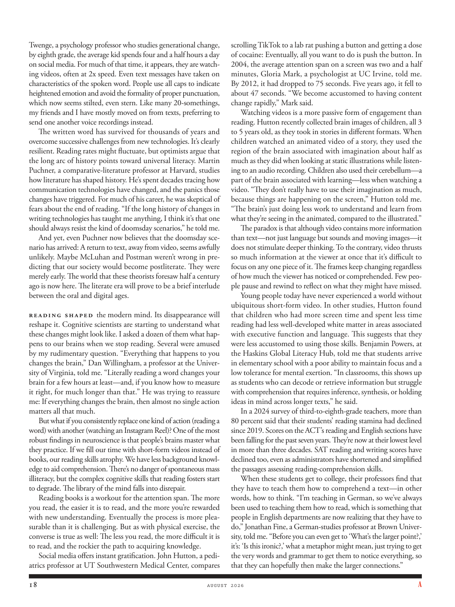

# The Atlantic — August 2026

## Page 20

---

Twenge, a psychology professor who studies generational change, by eighth grade, the average kid spends four and a half hours a day on social media. For much of that time, it appears, they are watching videos, often at 2x speed. Even text messages have taken on characteristics of the spoken word. People use all caps to indicate heightened emotion and avoid the formality of proper punctuation, which now seems stilted, even stern. Like many 20somethings, my friends and I have mostly moved on from texts, preferring to send one another voice recordings instead.

**【中文翻译】** 研究代际变化的心理学教授特温格表示，到了八年级，孩子们平均每天在社交媒体上花费四个半小时。看来，他们大部分时间都在观看视频，而且速度通常是 2 倍。甚至短信也具有了口头语言的特征。人们使用全部大写字母来表达强烈的情感，并避免使用正式的标点符号，这种形式现在看起来很生硬，甚至很严厉。像许多 20 多岁的人一样，我和我的朋友们已经不再发短信了，而是更喜欢互相发送录音。

The written word has survived for thousands of years and overcome successive challenges from new technologies. It’s clearly resilient. Reading rates might fluctuate, but optimists argue that the long arc of history points toward universal literacy. Martin Puchner, a comparative-literature professor at Harvard, studies how literature has shaped history. He’s spent decades tracing how communication technologies have changed, and the panics those changes have triggered. For much of his career, he was skeptical of fears about the end of reading. “If the long history of changes in writing technologies has taught me anything, I think it’s that one should always resist the kind of doomsday scenarios,” he told me.

**【中文翻译】** 书面文字已经存在了数千年，并克服了新技术的连续挑战。它显然具有弹性。阅读率可能会波动，但乐观主义者认为，历史的长河指向全民识字。哈佛大学比较文学教授马丁·普赫纳（Martin Puchner）研究文学如何塑造历史。他花了几十年的时间追踪通信技术的变化以及这些变化引发的恐慌。在他职业生涯的大部分时间里，他都对阅读终结的担忧持怀疑态度。 “如果说书写技术变革的悠久历史教会了我什么的话，我认为那就是人们应该始终抵制那种世界末日场景，”他告诉我。

And yet, even Puchner now believes that the doomsday scenario has arrived: A return to text, away from video, seems awfully unlikely. Maybe McLuhan and Postman weren’t wrong in predicting that our society would become post literate. They were merely early. The world that these theorists foresaw half a century ago is now here. The literate era will prove to be a brief interlude between the oral and digital ages.

**【中文翻译】** 然而，就连普赫纳现在也相信世界末日的场景已经到来：远离视频而回归文本似乎是极不可能的。也许麦克卢汉和波兹曼预测我们的社会将进入后识字时代并没有错。他们只是来得早而已。这些理论家半个世纪前所预见的世界现在已经到来。文字时代将被证明是口头时代和数字时代之间的短暂插曲。

Reading shaped the modern mind. Its disappearance will reshape it. Cognitive scientists are starting to understand what these changes might look like. I asked a dozen of them what happens to our brains when we stop reading. Several were amused by my rudimentary question. “Everything that happens to you changes the brain,” Dan Willing ham, a professor at the University of Virginia, told me. “Literally reading a word changes your brain for a few hours at least— and, if you know how to measure it right, for much longer than that.” He was trying to reassure me: If everything changes the brain, then almost no single action matters all that much.

**【中文翻译】** 阅读塑造了现代人的思想。它的消失将重塑它。认知科学家开始了解这些变化可能是什么样子。我问了十几个人，当我们停止阅读时，我们的大脑会发生什么变化。有几个人对我这个简单的问题感到好笑。 “发生在你身上的每件事都会改变大脑，”弗吉尼亚大学教授丹·威林·汉姆告诉我。 “从字面上看，阅读一个单词至少会改变你的大脑几个小时——而且，如果你知道如何正确衡量它，那么改变的时间会更长。”他试图让我放心：如果一切都会改变大脑，那么几乎没有任何单一行动那么重要。

But what if you consistently replace one kind of action (reading a word) with another (watching an Instagram Reel)? One of the most robust findings in neuro science is that people’s brains master what they practice. If we fill our time with short-form videos instead of books, our reading skills atrophy. We have less background knowledge to aid comprehension. There’s no danger of spontaneous mass illiteracy, but the complex cognitive skills that reading fosters start to degrade. The library of the mind falls into disrepair.

**【中文翻译】** 但是，如果您始终将一种行为（阅读单词）替换为另一种行为（观看 Instagram Reel），会怎样呢？神经科学最有力的发现之一是，人们的大脑掌握他们的实践。如果我们用短视频而不是书籍来填满时间，我们的阅读能力就会萎缩。我们缺乏帮助理解的背景知识。不存在自发性大规模文盲的危险，但阅读所培养的复杂认知技能开始退化。心灵的图书馆年久失修。

Reading books is a workout for the attention span. The more you read, the easier it is to read, and the more you’re rewarded with new understanding. Eventually the process is more pleasurable than it is challenging. But as with physical exercise, the converse is true as well: The less you read, the more difficult it is to read, and the rockier the path to acquiring knowledge.

**【中文翻译】** 读书是对注意力的锻炼。你读得越多，读起来就越容易，你获得的新理解就越多。最终，这个过程带来的乐趣多于挑战。但与体育锻炼一样，反之亦然：你读书越少，阅读就越困难，获取知识的道路就越坎坷。

Social media offers instant gratification. John Hutton, a pediatrics professor at UT Southwestern Medical Center, compares scrolling TikTok to a lab rat pushing a button and getting a dose of cocaine: Eventually, all you want to do is push the button. In 2004, the average attention span on a screen was two and a half minutes, Gloria Mark, a psychologist at UC Irvine, told me.

**【中文翻译】** 社交媒体提供即时满足感。德克萨斯大学西南医学中心的儿科教授约翰·赫顿 (John Hutton) 将滚动 TikTok 比作实验室老鼠按下按钮并获取一定剂量的可卡因：最终，你想做的就是按下按钮。加州大学欧文分校心理学家格洛丽亚·马克 (Gloria Mark) 告诉我，2004 年，屏幕上的平均注意力持续时间为两分半钟。

By 2012, it had dropped to 75 seconds. Five years ago, it fell to about 47 seconds. “We become accustomed to having content change rapidly,” Mark said.

**【中文翻译】** 到 2012 年，时间已降至 75 秒。五年前，这个时间下降到了 47 秒左右。 “我们已经习惯了内容的快速变化，”马克说。

Watching videos is a more passive form of engagement than reading. Hutton recently collected brain images of children, all 3 to 5 years old, as they took in stories in different formats. When children watched an animated video of a story, they used the region of the brain associated with imagination about half as much as they did when looking at static illustrations while listening to an audio recording. Children also used their cerebellum—a part of the brain associated with learning—less when watching a video. “They don’t really have to use their imagination as much, because things are happening on the screen,” Hutton told me.

**【中文翻译】** 观看视频是一种比阅读更为被动的参与形式。赫顿最近收集了 3 至 5 岁儿童在听不同格式的故事时的大脑图像。当孩子们观看故事的动画视频时，他们使用与想象力相关的大脑区域的次数大约是在听录音时观看静态插图时的一半。孩子们在观看视频时也较少使用小脑（大脑中与学习相关的部分）。 “他们实际上并不需要发挥太多想象力，因为事情都发生在屏幕上，”赫顿告诉我。

“The brain’s just doing less work to understand and learn from what they’re seeing in the animated, compared to the illustrated.” The paradox is that although video contains more information than text— not just language but sounds and moving images— it does not stimulate deeper thinking. To the contrary, video thrusts so much information at the viewer at once that it’s difficult to focus on any one piece of it. The frames keep changing regardless of how much the viewer has noticed or comprehended. Few people pause and rewind to reflect on what they might have missed.

**【中文翻译】** “与插图相比，大脑在理解和学习动画中所看到的内容方面所做的工作较少。”矛盾的是，尽管视频比文本包含更多信息——不仅是语言，还有声音和移动图像——但它并不能激发更深入的思考。相反，视频一次向观看者提供如此多的信息，以至于很难将注意力集中在其中的任何一个部分上。无论观众注意到或理解了多少，框架都会不断变化。很少有人停下来回顾一下他们可能错过了什么。

Young people today have never experienced a world without ubiquitous short-form video. In other studies, Hutton found that children who had more screen time and spent less time reading had less well-developed white matter in areas associated with executive function and language. This suggests that they were less accustomed to using those skills. Benjamin Powers, at the Haskins Global Literacy Hub, told me that students arrive in elementary school with a poor ability to maintain focus and a low tolerance for mental exertion. “In classrooms, this shows up as students who can decode or retrieve information but struggle with comprehension that requires inference, synthesis, or holding ideas in mind across longer texts,” he said.

**【中文翻译】** 今天的年轻人从未经历过一个没有无处不在的短视频的世界。在其他研究中，赫顿发现，屏幕时间较多、阅读时间较少的儿童，与执行功能和语言相关的区域的白质发育较差。这表明他们不太习惯使用这些技能。哈斯金斯全球扫盲中心的本杰明·鲍尔斯告诉我，学生进入小学时保持注意力集中的能力很差，对脑力消耗的容忍度也很低。 “在课堂上，这表现为学生能够解码或检索信息，但在理解方面遇到困难，需要推理、综合或在较长的文本中记住想法，”他说。

In a 2024 survey of third-to-eighth-grade teachers, more than 80 percent said that their students’ reading stamina had declined since 2019. Scores on the ACT’s reading and English sections have been falling for the past seven years. They’re now at their lowest level in more than three decades. SAT reading and writing scores have declined too, even as administrators have shortened and simplified the passages assessing reading-comprehension skills.

**【中文翻译】** 在 2024 年对三至八年级教师的调查中，超过 80% 的教师表示，自 2019 年以来，学生的阅读耐力有所下降。过去七年，ACT 阅读和英语部分的分数一直在下降。它们现在处于三十多年来的最低水平。尽管管理人员缩短并简化了评估阅读理解能力的段落，但 SAT 阅读和写作成绩也有所下降。

When these students get to college, their professors find that they have to teach them how to comprehend a text— in other words, how to think. “I’m teaching in German, so we’ve always been used to teaching them how to read, which is something that people in English departments are now realizing that they have to do,” Jonathan Fine, a German-studies professor at Brown University, told me. “Before you can even get to ‘What’s the larger point?,’ it’s: ‘Is this ironic?,’ what a metaphor might mean, just trying to get the very words and grammar to get them to notice everything, so that they can hopefully then make the larger connections.”

**【中文翻译】** 当这些学生进入大学时，他们的教授发现他们必须教他们如何理解文本——换句话说，如何思考。 “我用德语教学，所以我们一直习惯教他们如何阅读，这是英语系的人们现在意识到他们必须做的事情，”布朗大学德国研究教授乔纳森·法恩告诉我。 “在你问‘更重要的意义是什么？’之前，先问‘这是讽刺吗？’隐喻可能意味着什么，只是试图通过单词和语法让他们注意到一切，这样他们就有希望建立更大的联系。”
