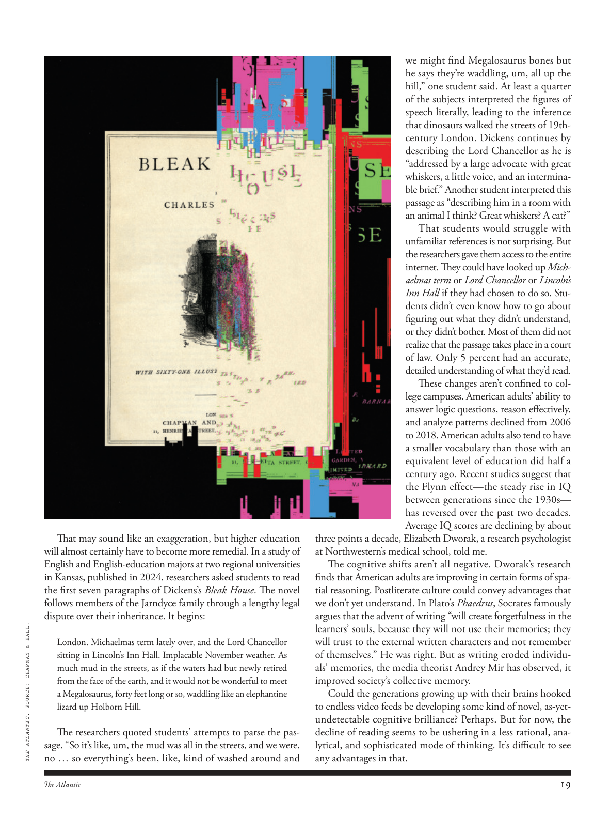

# The Atlantic — August 2026

## Page 21

---

That may sound like an exaggeration, but higher education will almost certainly have to become more remedial. In a study of English and English-education majors at two regional universities in Kansas, published in 2024, researchers asked students to read the first seven paragraphs of Dickens’s Bleak House . The novel follows members of the Jarn dyce family through a lengthy legal dispute over their inheritance. It begins: THE ATLANTIC . SOURCE: CHAPMAN & HALL.

**【中文翻译】** 这听起来可能有点夸张，但高等教育几乎肯定必须变得更具补救性。在 2024 年发表的一项针对堪萨斯州两所地区大学英语和英语教育专业的研究中，研究人员要求学生阅读狄更斯的《荒凉山庄》的前七段。小说讲述了贾恩·戴斯家族的成员经历了一场漫长的继承权法律纠纷。它开始于：大西洋。资料来源：查普曼和霍尔。

London. Michaelmas term lately over, and the Lord Chancellor sitting in Lincoln’s Inn Hall. Implacable November weather. As much mud in the streets, as if the waters had but newly retired from the face of the earth, and it would not be wonderful to meet a Megalosaurus, forty feet long or so, waddling like an elephantine lizard up Holborn Hill.

**【中文翻译】** 伦敦。米迦勒节的任期最近结束了，大法官坐在林肯旅馆大厅里。十一月的天气无情。街道上有那么多泥巴，就好像海水刚刚从地球表面退去一样，如果遇到一只四十英尺左右长、像大象蜥蜴一样摇摇晃晃爬上霍尔本山的斑龙，那可就不是什么好事了。

The researchers quoted students’ attempts to parse the passage. “So it’s like, um, the mud was all in the streets, and we were, no … so everything’s been, like, kind of washed around and three points a decade, Elizabeth Dworak, a research psychologist at North western’s medical school, told me.

**【中文翻译】** 研究人员引用了学生尝试解析该段落的内容。西北大学医学院的研究心理学家伊丽莎白·德沃拉克（Elizabeth Dworak）告诉我，“所以，嗯，街上都是泥，而我们，不……所以一切都被冲走了，十年三点。”

The cognitive shifts aren’t all negative. Dworak’s research finds that American adults are improving in certain forms of spatial reasoning. Post literate culture could convey advantages that we don’t yet understand. In Plato’s Phaedrus , Socrates famously argues that the advent of writing “will create forgetfulness in the learners’ souls, because they will not use their memories; they will trust to the external written characters and not remember of themselves.” He was right. But as writing eroded individuals’ memories, the media theorist Andrey Mir has observed, it improved society’s collective memory.

**【中文翻译】** 认知转变并不都是负面的。德沃拉克的研究发现，美国成年人在某些形式的空间推理方面正在进步。后识字文化可以传达我们尚不了解的优势。在柏拉图的《斐德罗篇》中，苏格拉底提出了著名的论点，写作的出现“将在学习者的灵魂中造成健忘，因为他们不会使用自己的记忆；他们会相信外部的书面字符，而不记得自己。”他是对的。但媒体理论家安德烈·米尔（Andrey Mir）观察到，随着写作侵蚀个人记忆，它却改善了社会的集体记忆。

Could the generations growing up with their brains hooked to endless video feeds be developing some kind of novel, as-yetundetectable cognitive brilliance? Perhaps. But for now, the decline of reading seems to be ushering in a less rational, analytical, and sophisticated mode of thinking. It’s difficult to see any advantages in that. we might find Megalosaurus bones but he says they’re waddling, um, all up the hill,” one student said. At least a quarter of the subjects interpreted the figures of speech literally, leading to the inference that dinosaurs walked the streets of 19thcentury London. Dickens continues by describing the Lord Chancellor as he is “addressed by a large advocate with great whiskers, a little voice, and an interminable brief.” Another student interpreted this passage as “describing him in a room with an animal I think? Great whiskers? A cat?”

**【中文翻译】** 那些在大脑沉迷于无休止的视频流中长大的一代人是否会发展出某种新颖的、迄今为止无法察觉的认知才华？也许。但就目前而言，阅读的衰落似乎正在带来一种不那么理性、不那么分析、不那么复杂的思维方式。很难看出这有什么好处。一名学生说：“我们可能会发现巨龙的骨头，但他说它们正在摇摇晃晃地走上山。”至少四分之一的受试者从字面上解释了这些修辞格，从而得出恐龙行走在 19 世纪伦敦街道上的推论。狄更斯继续描述大法官，因为他“受到一位长着大胡子、声音很小和没完没了的简短陈述的大律师的讲话”。另一位学生将这段话解释为“我想是在描述他和一只动物在一个房间里？伟大的胡须？一只猫？

That students would struggle with un familiar references is not surprising. But the researchers gave them access to the entire internet. They could have looked up Michaelmas term or Lord Chancellor or Lincoln’s Inn Hall if they had chosen to do so. Students didn’t even know how to go about figuring out what they didn’t understand, or they didn’t bother. Most of them did not realize that the passage takes place in a court of law. Only 5 percent had an accurate, detailed understanding of what they’d read.

**【中文翻译】** 学生们会很难应对不熟悉的参考文献，这并不奇怪。但研究人员让他们可以访问整个互联网。如果他们愿意的话，他们可以查找米迦勒节、大法官或林肯律师学院大厅。学生们甚至不知道如何去弄清楚他们不明白的地方，或者他们懒得去理会。他们中的大多数人没有意识到这段经文是在法庭上发生的。只有 5% 的人对他们所阅读的内容有准确、详细的理解。

These changes aren’t confined to college campuses. American adults’ ability to answer logic questions, reason effectively, and analyze patterns declined from 2006 to 2018. American adults also tend to have a smaller vocabulary than those with an equivalent level of education did half a century ago. Recent studies suggest that the Flynn effect— the steady rise in IQ between generations since the 1930s— has reversed over the past two decades. Average IQ scores are declining by about

**【中文翻译】** 这些变化并不局限于大学校园。从 2006 年到 2018 年，美国成年人回答逻辑问题、有效推理和分析模式的能力有所下降。美国成年人的词汇量也往往比半个世纪前同等教育水平的人要少。最近的研究表明，弗林效应（自 20 世纪 30 年代以来各代人之间智商的稳步上升）在过去二十年中发生了逆转。平均智商分数下降了约
