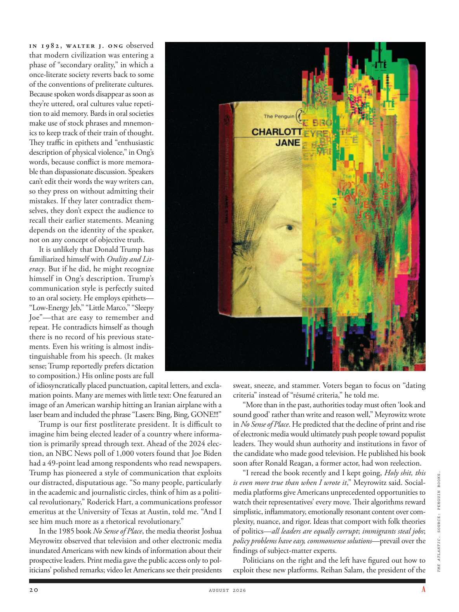

# The Atlantic — August 2026

## Page 22

---

In 1982, Walter J. Ong observed that modern civilization was entering a phase of “secondary orality,” in which a onceliterate society reverts back to some of the conventions of pre literate cultures.

**【中文翻译】** 1982 年，沃尔特·J·翁 (Walter J. Ong) 观察到，现代文明正在进入“第二口头语言”阶段，在这个阶段，曾经有文字的社会又回到了有文字之前的文化的一些习俗。

Because spoken words disappear as soon as they’re uttered, oral cultures value repetition to aid memory. Bards in oral societies make use of stock phrases and mnemonics to keep track of their train of thought.

**【中文翻译】** 由于口语一旦说出就消失了，因此口头文化重视重复以帮助记忆。口头社会中的吟游诗人利用常用短语和助记符来记录他们的思路。

They traffic in epithets and “enthusiastic description of physical violence,” in Ong’s words, because conflict is more memorable than dispassionate discussion. Speakers can’t edit their words the way writers can, so they press on without admitting their mistakes. If they later contradict themselves, they don’t expect the audience to recall their earlier statements. Meaning depends on the identity of the speaker, not on any concept of objective truth.

**【中文翻译】** 用 Ong 的话说，他们使用绰号和“对身体暴力的热情描述”，因为冲突比冷静的讨论更令人难忘。演讲者无法像作家那样编辑自己的文字，因此他们会继续坚持而不承认自己的错误。如果他们后来自相矛盾，他们不会指望观众记得他们之前的陈述。意义取决于说话者的身份，而不是任何客观真理的概念。

It is unlikely that Donald Trump has familiarized himself with Orality and Literacy . But if he did, he might recognize himself in Ong’s description. Trump’s communication style is perfectly suited to an oral society. He employs epithets— “Low-Energy Jeb,” “Little Marco,” “Sleepy Joe”— that are easy to remember and repeat. He contradicts himself as though there is no record of his previous statements. Even his writing is almost indistinguishable from his speech. (It makes sense; Trump reportedly prefers dictation to composition.) His online posts are full of idiosyncratically placed punctuation, capital letters, and exclamation points. Many are memes with little text: One featured an image of an American warship hitting an Iranian airplane with a laser beam and included the phrase “Lasers: Bing, Bing, GONE!!!”

**【中文翻译】** 唐纳德·特朗普不太可能熟悉口语和识字能力。但如果他这样做了，他可能会在翁的描述中认出自己。特朗普的沟通方式非常适合口头社会。他使用的绰号——“低能量杰布”、“小马可”、“瞌睡乔”——这些绰号都很容易记住和重复。他自相矛盾，就好像他以前的言论没有记录一样。甚至他的写作与他的演讲几乎没有区别。 （这是有道理的；据报道，特朗普更喜欢听写而不是写作。）他的网上帖子充满了特殊的标点符号、大写字母和感叹号。许多表情包都没有文字：其中一个表情包的图片是一艘美国军舰用激光束击中一架伊朗飞机，并包含短语“激光：Bing，Bing，GONE！！！”

Trump is our first post literate president. It is difficult to imagine him being elected leader of a country where information is primarily spread through text. Ahead of the 2024 election, an NBC News poll of 1,000 voters found that Joe Biden had a 49point lead among respondents who read newspapers.

**【中文翻译】** 特朗普是我们第一位后识字总统。很难想象他会当选一个信息主要通过文字传播的国家的领导人。在 2024 年大选之前，NBC 新闻对 1,000 名选民进行的民意调查发现，乔·拜登在阅读报纸的受访者中领先 49 个百分点。

Trump has pioneered a style of communication that exploits our distracted, disputatious age. “So many people, particularly in the academic and journalistic circles, think of him as a political revolutionary,” Roderick Hart, a communications professor emeritus at the University of Texas at Austin, told me. “And I see him much more as a rhetorical revolutionary.”

**【中文翻译】** 特朗普开创了一种利用我们心烦意乱、好争论的时代的沟通方式。 “很多人，尤其是学术界和新闻界的人，认为他是一位政治革命者，”德克萨斯大学奥斯汀分校传播学名誉教授罗德里克·哈特告诉我。 “我认为他更像是一位修辞上的革命者。”

In the 1985 book No Sense of Place , the media theorist Joshua Meyrowitz observed that television and other electronic media inundated Americans with new kinds of information about their prospective leaders. Print media gave the public access only to politicians’ polished remarks; video let Americans see their presidents sweat, sneeze, and stammer. Voters began to focus on “dating criteria” instead of “résumé criteria,” he told me.

**【中文翻译】** 在 1985 年出版的《No Sense of Place》一书中，媒体理论家约书亚·梅罗维茨 (Joshua Meyrowitz) 观察到，电视和其他电子媒体向美国人提供了大量有关未来领导人的新信息。平面媒体只向公众提供政客精美的言论；视频让美国人看到他们的总统出汗、打喷嚏和结巴。他告诉我，选民开始关注“约会标准”而不是“简历标准”。

“More than in the past, authorities today must often ‘look and sound good’ rather than write and reason well,” Meyrowitz wrote in No Sense of Place . He predicted that the decline of print and rise of electronic media would ultimately push people toward populist leaders. They would shun authority and institutions in favor of the candidate who made good television. He published his book soon after Ronald Reagan, a former actor, had won reelection.

**【中文翻译】** “与过去相比，今天的当局往往必须‘看起来和听起来都不错’，而不是很好地写作和推理，”梅洛维茨在《No Sense of Place》中写道。他预测印刷媒体的衰落和电子媒体的崛起最终将把人们推向民粹主义领导人。他们会避开权威和机构，转而支持那些拍得好的电视节目的候选人。前演员罗纳德·里根赢得连任后不久，他就出版了这本书。

“I reread the book recently and I kept going, Holy shit, this is even more true than when I wrote it ,” Meyrowitz said. Socialmedia platforms give Americans unprecedented opportunities to watch their representatives’ every move. Their algorithms reward simplistic, inflammatory, emotionally resonant content over complexity, nuance, and rigor. Ideas that comport with folk theories of politics— all leaders are equally corrupt ; immigrants steal jobs ; policy problems have easy, commonsense solutions — prevail over the findings of subject-matter experts.

**【中文翻译】** “我最近重读了这本书，我继续说，天哪，这比我写这本书时更真实，”梅洛维茨说。社交媒体平台为美国人提供了前所未有的机会来观察其代表的一举一动。他们的算法奖励简单化、煽动性、情感共鸣的内容，而不是复杂性、细微差别和严谨性。符合民间政治理论的观点——所有领导人都同样腐败；移民偷走了工作；政策问题有简单、常识性的解决方案——胜过主题专家的研究结果。

Politicians on the right and the left have figured out how to exploit these new platforms. Reihan Salam, the president of the THE ATLANTIC . SOURCE: PENGUIN BOOKS.

**【中文翻译】** 左右翼政客已经找到了如何利用这些新平台的方法。雷汉·萨拉姆 (Reihan Salam)，大西洋航空公司总裁。资料来源：企鹅图书。
