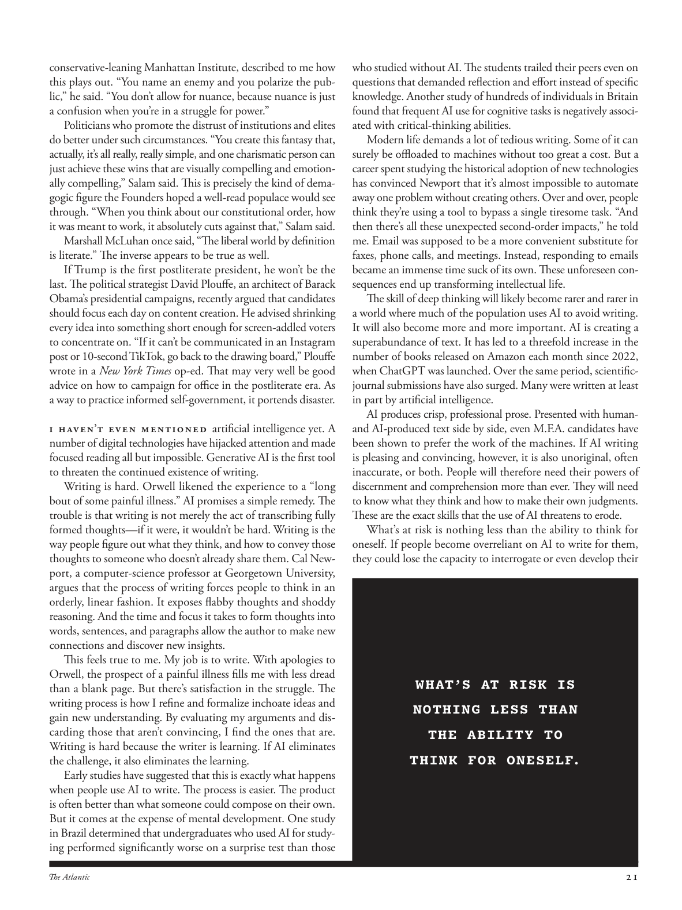

# The Atlantic — August 2026

## Page 23

---

conservative-leaning Manhattan Institute, described to me how this plays out. “You name an enemy and you polarize the public,” he said. “You don’t allow for nuance, because nuance is just a confusion when you’re in a struggle for power.”

**【中文翻译】** 倾向保守的曼哈顿研究所向我描述了这是如何发生的。 “你说出一个敌人的名字，就会使公众两极分化，”他说。 “你不允许出现细微差别，因为当你处于权力斗争中时，细微差别只会带来混乱。”

Politicians who promote the distrust of institutions and elites do better under such circumstances. “You create this fantasy that, actually, it’s all really, really simple, and one charismatic person can just achieve these wins that are visually compelling and emotionally compelling,” Salam said. This is precisely the kind of demagogic figure the Founders hoped a well-read populace would see through. “When you think about our constitutional order, how it was meant to work, it absolutely cuts against that,” Salam said.

**【中文翻译】** 在这种情况下，提倡对机构和精英不信任的政客会做得更好。萨拉姆说：“你创造了一种幻想，实际上，这一切都非常非常简单，一个有魅力的人就可以实现这些视觉上和情感上引人注目的胜利。”这正是开国元勋们希望博览群书的民众能够看穿的那种煽动性人物。萨拉姆说：“当你思考我们的宪法秩序，以及它的运作方式时，你会发现它绝对违背了这一点。”

Marshall McLuhan once said, “The liberal world by definition is literate.” The inverse appears to be true as well. If Trump is the first post literate president, he won’t be the last. The political strategist David Plouffe, an architect of Barack Obama’s presidential campaigns, recently argued that candidates should focus each day on content creation. He advised shrinking every idea into something short enough for screen-addled voters to concentrate on. “If it can’t be communicated in an Instagram post or 10-second TikTok, go back to the drawing board,” Plouffe wrote in a New York Times op-ed. That may very well be good advice on how to campaign for office in the post literate era. As a way to practice informed selfgovernment, it portends disaster.

**【中文翻译】** 马歇尔·麦克卢汉曾经说过：“自由世界从定义上来说就是有文化的。”反之亦然。如果特朗普是第一位后识字总统，他也不会是最后一位。巴拉克·奥巴马(Barack Obama)总统竞选活动的策划者、政治战略家大卫·普洛夫(David Plouffe)最近认为，候选人应该每天专注于内容创作。他建议将每个想法压缩成足够短的内容，以便沉迷于屏幕的选民能够集中注意力。 “如果无法在 Instagram 帖子或 10 秒的 TikTok 中传达出来，那就回到绘图板，”普洛夫在《纽约时报》专栏中写道。对于如何在后识字时代竞选公职，这很可能是一个很好的建议。作为一种实践知情自治的方式，它预示着灾难。

I haven’t even mentioned artificial intelligence yet. A number of digital technologies have hijacked attention and made focused reading all but impossible. Generative AI is the first tool to threaten the continued existence of writing.

**【中文翻译】** 我什至还没有提到人工智能。许多数字技术已经劫持了人们的注意力，使集中阅读变得几乎不可能。生成式人工智能是第一个威胁写作持续存在的工具。

Writing is hard. Orwell likened the experience to a “long bout of some painful illness.” AI promises a simple remedy. The trouble is that writing is not merely the act of transcribing fully formed thoughts— if it were, it wouldn’t be hard. Writing is the way people figure out what they think, and how to convey those thoughts to someone who doesn’t already share them. Cal Newport, a computer-science professor at Georgetown University, argues that the process of writing forces people to think in an orderly, linear fashion. It exposes flabby thoughts and shoddy reasoning. And the time and focus it takes to form thoughts into words, sentences, and paragraphs allow the author to make new connections and discover new insights.

**【中文翻译】** 写作很难。奥威尔将这段经历比作“某种痛苦的疾病的长期发作”。人工智能承诺提供一种简单的补救措施。问题在于，写作不仅仅是记录完全成形的思想的行为——如果是的话，那就不难了。写作是人们弄清楚自己的想法以及如何将这些想法传达给尚未分享这些想法的人的方式。乔治城大学计算机科学教授卡尔·纽波特认为，写作的过程迫使人们以有序、线性的方式思考。它暴露了软弱的思想和拙劣的推理。将思想形成单词、句子和段落所需的时间和注意力使作者能够建立新的联系并发现新的见解。

This feels true to me. My job is to write. With apologies to Orwell, the prospect of a painful illness fills me with less dread than a blank page. But there’s satisfaction in the struggle. The writing process is how I refine and formalize inchoate ideas and gain new understanding. By evaluating my arguments and discarding those that aren’t convincing, I find the ones that are.

**【中文翻译】** 这对我来说是真实的。我的工作是写作。向奥威尔表示歉意，但我对即将患上痛苦疾病的恐惧并不如一张白纸那么恐惧。但奋斗中也有满足感。写作过程是我如何完善和形式化早期想法并获得新的理解的过程。通过评估我的论点并丢弃那些不令人信服的论点，我找到了那些有说服力的论点。

Writing is hard because the writer is learning. If AI eliminates the challenge, it also eliminates the learning. Early studies have suggested that this is exactly what happens when people use AI to write. The process is easier. The product is often better than what someone could compose on their own.

**【中文翻译】** 写作很难，因为作家正在学习。如果人工智能消除了挑战，那么它也消除了学习。早期研究表明，这正是人们使用人工智能写作时发生的情况。这个过程更容易。该产品通常比某人自己制作的产品更好。

But it comes at the expense of mental development. One study in Brazil determined that undergraduates who used AI for studying performed significantly worse on a surprise test than those who studied without AI. The students trailed their peers even on questions that demanded reflection and effort instead of specific knowledge. Another study of hundreds of individuals in Britain found that frequent AI use for cognitive tasks is negatively associated with critical-thinking abilities.

**【中文翻译】** 但这是以牺牲智力发展为代价的。巴西的一项研究发现，使用人工智能进行学习的本科生在突击测试中的表现明显低于那些没有使用人工智能进行学习的学生。即使在需要反思和努力而不是具体知识的问题上，学生们也落后于同龄人。另一项针对英国数百人的研究发现，频繁使用人工智能执行认知任务与批判性思维能力呈负相关。

Modern life demands a lot of tedious writing. Some of it can surely be offl oaded to machines without too great a cost. But a career spent studying the historical adoption of new technologies has convinced Newport that it’s almost impossible to automate away one problem without creating others. Over and over, people think they’re using a tool to bypass a single tiresome task. “And then there’s all these unexpected second-order impacts,” he told me. Email was supposed to be a more convenient substitute for faxes, phone calls, and meetings. Instead, responding to emails became an immense time suck of its own. These unforeseen consequences end up transforming intellectual life.

**【中文翻译】** 现代生活需要大量乏味的写作。其中一些肯定可以转移到机器上，而无需花费太多成本。但纽波特在研究新技术的历史应用方面的职业生涯让他相信，在不产生其他问题的情况下自动化解决一个问题几乎是不可能的。人们一次又一次地认为他们正在使用某种工具来绕过一项繁琐的任务。 “然后就会出现所有这些意想不到的二级影响，”他告诉我。电子邮件被认为是传真、电话和会议的更方便的替代品。相反，回复电子邮件本身就变得非常浪费时间。这些不可预见的后果最终改变了知识分子的生活。

The skill of deep thinking will likely become rarer and rarer in a world where much of the population uses AI to avoid writing. It will also become more and more important. AI is creating a super abundance of text. It has led to a threefold increase in the number of books released on Amazon each month since 2022, when ChatGPT was launched. Over the same period, scientificjournal submissions have also surged. Many were written at least in part by artificial intelligence.

**【中文翻译】** 在一个大多数人使用人工智能来避免写作的世界里，深度思考的技能可能会变得越来越稀有。它也将变得越来越重要。人工智能正在创造极其丰富的文本。自 2022 年 ChatGPT 推出以来，亚马逊每月发布的图书数量增加了三倍。同一时期，科学期刊的投稿量也激增。许多内容至少部分是由人工智能编写的。

AI produces crisp, professional prose. Presented with humanand AI-produced text side by side, even M.F.A. candidates have been shown to prefer the work of the machines. If AI writing is pleasing and convincing, however, it is also unoriginal, often in accurate, or both. People will therefore need their powers of discernment and comprehension more than ever. They will need to know what they think and how to make their own judgments.

**【中文翻译】** 人工智能创作出清晰、专业的散文。人类和人工智能生成的文本并排呈现，甚至是 M.F.A.事实证明，候选人更喜欢机器的工作。然而，即使人工智能的写作令人愉悦且令人信服，它也不是原创的，通常是不准确的，或者两者兼而有之。因此，人们比以往任何时候都更需要洞察力和理解力。他们需要知道自己的想法以及如何做出自己的判断。

These are the exact skills that the use of AI threatens to erode. What’s at risk is nothing less than the ability to think for oneself. If people become over reliant on AI to write for them, they could lose the capacity to interrogate or even develop their WHAT’S AT RISK IS NOTHING LESS THAN THE ABILITY TO THINK FOR ONESELF.

**【中文翻译】** 这些正是人工智能的使用可能会削弱的技能。面临风险的无非就是独立思考的能力。如果人们过度依赖人工智能为他们写作，他们可能会失去审问甚至发展自己的能力。面临风险的无非是独立思考的能力。
