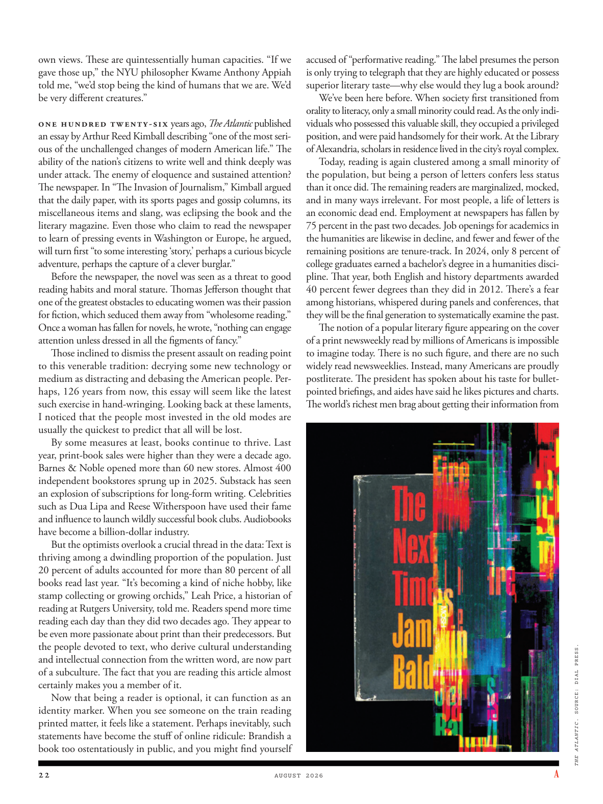

# The Atlantic — August 2026

## Page 24

---

own views. These are quintessentially human capacities. “If we gave those up,” the NYU philosopher Kwame Anthony Appiah told me, “we’d stop being the kind of humans that we are. We’d be very different creatures.”

**【中文翻译】** 自己的看法。这些是典型的人类能力。纽约大学哲学家夸梅·安东尼·阿皮亚（Kwame Anthony Appiah）告诉我：“如果我们放弃这些，我们就不再是现在的人类了。我们会成为截然不同的生物。”

One hundred twenty-six years ago, The Atlantic published an essay by Arthur Reed Kimball describing “one of the most serious of the unchallenged changes of modern American life.” The ability of the nation’s citizens to write well and think deeply was under attack. The enemy of eloquence and sustained attention?

**【中文翻译】** 一百二十六年前，《大西洋月刊》发表了阿瑟·里德·金博尔 (Arthur Reed Kimball) 的一篇文章，描述了“现代美国生活中无可争议的最严重的变化之一”。该国公民良好写作和深入思考的能力受到了攻击。口才和持续关注的敌人？

The newspaper. In “The Invasion of Journalism,” Kimball argued that the daily paper, with its sports pages and gossip columns, its miscellaneous items and slang, was eclipsing the book and the literary magazine. Even those who claim to read the newspaper to learn of pressing events in Washington or Europe, he argued, will turn first “to some interesting ‘story,’ perhaps a curious bicycle adventure, perhaps the capture of a clever burglar.”

**【中文翻译】** 报纸。在《新闻业的入侵》一书中，金博尔认为，日报及其体育版和八卦专栏、杂项和俚语正在使书籍和文学杂志黯然失色。他认为，即使是那些声称通过报纸了解华盛顿或欧洲发生的紧迫事件的人，也会首先“看到一些有趣的‘故事’，也许是一次好奇的自行车冒险，也许是抓获一个聪明的窃贼。”

Before the newspaper, the novel was seen as a threat to good reading habits and moral stature. Thomas Jefferson thought that one of the greatest obstacles to educating women was their passion for fiction, which seduced them away from “wholesome reading.”

**【中文翻译】** 在报纸问世之前，这部小说被视为对良好阅读习惯和道德地位的威胁。托马斯·杰斐逊认为，教育女性的最大障碍之一是她们对小说的热情，这引诱她们远离“健康的阅读”。

Once a woman has fallen for novels, he wrote, “nothing can engage attention unless dressed in all the figments of fancy.” Those inclined to dismiss the present assault on reading point to this venerable tradition: decrying some new technology or medium as distracting and debasing the American people. Perhaps, 126 years from now, this essay will seem like the latest such exercise in hand-wringing. Looking back at these laments, I noticed that the people most invested in the old modes are usually the quickest to predict that all will be lost.

**【中文翻译】** 他写道，一旦女人爱上了小说，“除非穿上所有奇特的虚构服装，否则没有什么能吸引人们的注意力。”那些倾向于驳斥当前对阅读的攻击的人指出了这一古老的传统：谴责某些新技术或媒介分散了美国人民的注意力并贬低了美国人民。或许，126 年后，这篇文章看起来像是最新的此类令人沮丧的练习。回顾这些哀叹，我注意到那些对旧模式投入最多的人通常是最快预测一切都会失败的人。

By some measures at least, books continue to thrive. Last year, print-book sales were higher than they were a decade ago. Barnes & Noble opened more than 60 new stores. Almost 400 independent bookstores sprung up in 2025. Substack has seen an explosion of subscriptions for long-form writing. Celebrities such as Dua Lipa and Reese Witherspoon have used their fame and influence to launch wildly successful book clubs. Audiobooks have become a billion-dollar industry.

**【中文翻译】** 至少从某些方面来看，书籍继续蓬勃发展。去年，纸质书的销量高于十年前。 Barnes & Noble 开设了 60 多家新店。 2025 年，近 400 家独立书店如雨后春笋般涌现。Substack 的长篇写作订阅量呈爆炸式增长。杜阿·利帕 (Dua Lipa) 和瑞茜·威瑟斯彭 (Reese Witherspoon) 等名人利用自己的名气和影响力创办了非常成功的读书俱乐部。有声读物已成为一个价值数十亿美元的产业。

But the optimists overlook a crucial thread in the data: Text is thriving among a dwindling proportion of the population. Just 20 percent of adults accounted for more than 80 percent of all books read last year. “It’s becoming a kind of niche hobby, like stamp collecting or growing orchids,” Leah Price, a historian of reading at Rutgers University, told me. Readers spend more time reading each day than they did two decades ago. They appear to be even more passionate about print than their predecessors. But the people devoted to text, who derive cultural understanding and intellectual connection from the written word, are now part of a sub culture. The fact that you are reading this article almost certainly makes you a member of it.

**【中文翻译】** 但乐观主义者忽视了数据中的一个关键线索：文本在人口比例不断下降的情况下蓬勃发展。去年，仅 20% 的成年人阅读了所有书籍的 80% 以上。 “它正在成为一种小众爱好，就像集邮或种植兰花一样，”罗格斯大学阅读历史学家利亚·普莱斯告诉我。读者每天花在阅读上的时间比二十年前更多。他们似乎比他们的前辈更热衷于印刷。但那些致力于文本的人，从书面文字中获得文化理解和智力联系，现在已经成为亚文化的一部分。您正在阅读这篇文章的事实几乎肯定会让您成为其中的一员。

Now that being a reader is optional, it can function as an identity marker. When you see someone on the train reading printed matter, it feels like a statement. Perhaps inevitably, such statements have become the stuff of online ridicule: Brandish a book too ostentatiously in public, and you might find yourself accused of “performative reading.” The label presumes the person is only trying to telegraph that they are highly educated or possess superior literary taste— why else would they lug a book around?

**【中文翻译】** 现在成为读者是可选的，它可以充当身份标记。当你看到火车上有人阅读印刷品时，感觉就像是在发表声明。也许不可避免的是，这样的言论已经成为网上嘲笑的对象：在公共场合过于招摇地炫耀一本书，你可能会发现自己被指责为“表演式阅读”。该标签假定这个人只是想表明他们受过高等教育或拥有卓越的文学品味——否则他们为什么会带着一本书到处走呢？

We’ve been here before. When society first transitioned from orality to literacy, only a small minority could read. As the only individuals who possessed this valuable skill, they occupied a privileged position, and were paid handsomely for their work. At the Library of Alexandria, scholars in residence lived in the city’s royal complex.

**【中文翻译】** 我们以前来过这里。当社会最初从口头转向文字时，只有一小部分人能够阅读。作为唯一拥有这种宝贵技能的人，他们占据着特权地位，并因其工作而获得丰厚的报酬。在亚历山大图书馆，常驻学者住在该市的皇家建筑群中。

Today, reading is again clustered among a small minority of the population, but being a person of letters confers less status than it once did. The remaining readers are marginalized, mocked, and in many ways irrelevant. For most people, a life of letters is an economic dead end. Employment at newspapers has fallen by 75 percent in the past two decades. Job openings for academics in the humanities are likewise in decline, and fewer and fewer of the remaining positions are tenure-track. In 2024, only 8 percent of college graduates earned a bachelor’s degree in a humanities discipline. That year, both English and history departments awarded 40 percent fewer degrees than they did in 2012. There’s a fear among historians, whispered during panels and conferences, that they will be the final generation to systematically examine the past.

**【中文翻译】** 如今，阅读再次集中在一小部分人口中，但作为一个文人的地位却比以前低了。剩下的读者被边缘化、被嘲笑，并且在很多方面都无关紧要。对于大多数人来说，文学生涯是经济上的死胡同。过去 20 年来，报纸的就业人数下降了 75%。人文学科学者的职位空缺也在减少，剩下的职位中终身教授职位也越来越少。 2024 年，只有 8% 的大学毕业生获得人文学科学士学位。那一年，英语系和历史系授予的学位比 2012 年减少了 40%。在小组和会议上低声议论的历史学家们担心，他们将是系统审视过去的最后一代。

The notion of a popular literary figure appearing on the cover of a print newsweekly read by millions of Americans is impossible to imagine today. There is no such figure, and there are no such widely read newsweeklies. Instead, many Americans are proudly post literate. The president has spoken about his taste for bulletpointed briefings, and aides have said he likes pictures and charts. The world’s richest men brag about getting their information from THE ATLANTIC . SOURCE: DIAL PRESS.

**【中文翻译】** 一位受欢迎的文学人物出现在数百万美国人阅读的纸质新闻周刊的封面上的想法在今天是无法想象的。没有这样的数字，也没有这样被广泛阅读的新闻周刊。相反，许多美国人为自己识字后感到自豪。总统谈到了他对要点简报的品味，助手们表示他喜欢图片和图表。世界上最富有的人吹嘘自己从大西洋获取信息。资料来源：Dial Press。
