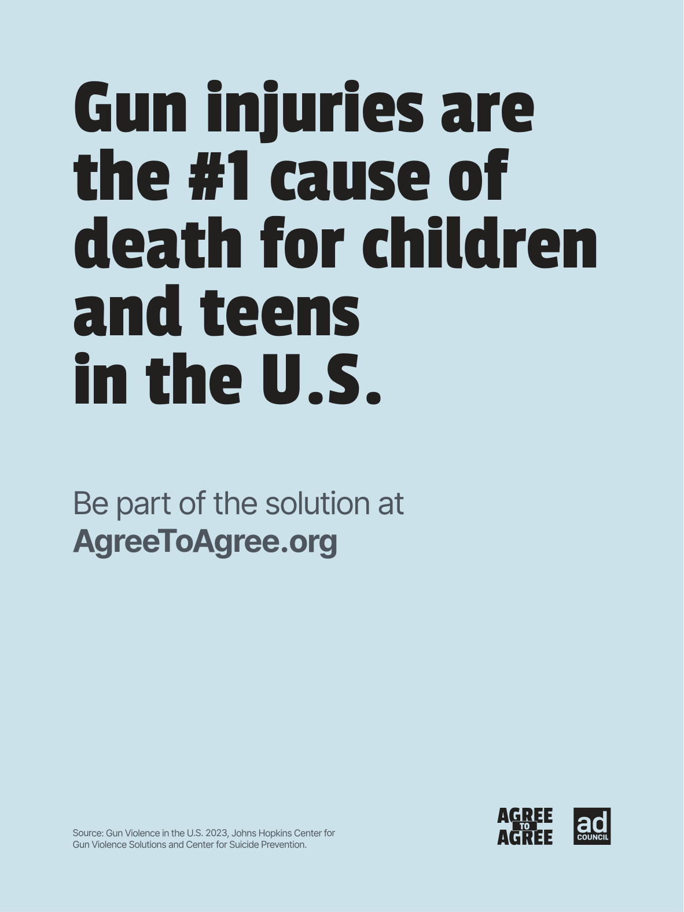

# The Atlantic — August 2026

## Page 25

---

### Gun injuries are

**【标题翻译】** 枪伤是

### the #1 cause of

**【标题翻译】** 第一个原因

### death for children

**【标题翻译】** 儿童死亡

### and teens

**【标题翻译】** 和青少年

### in the U.S.

**【标题翻译】** 在美国

### B

### ar

**【标题翻译】** 阿尔

### gr

**【标题翻译】** 格

### To gr

**【标题翻译】** 至格

Sour .S. 2023

**【中文翻译】** 酸.S. 2023年

### g

or v

**【中文翻译】** 或v
