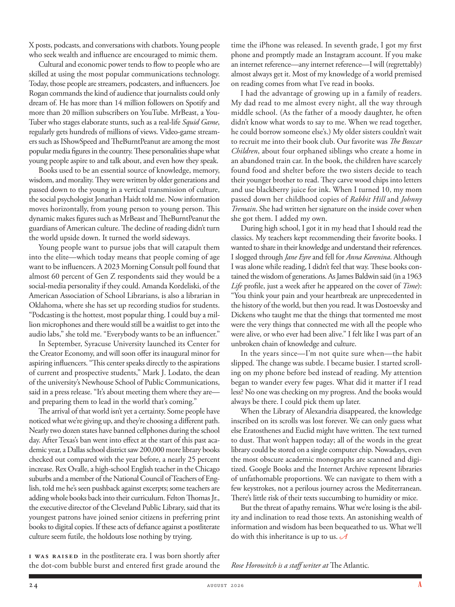

# The Atlantic — August 2026

## Page 26

---

X posts, podcasts, and conversations with chatbots. Young people who seek wealth and influence are encouraged to mimic them. Cultural and economic power tends to flow to people who are skilled at using the most popular communications technology.

**【中文翻译】** X 帖子、播客以及与聊天机器人的对话。寻求财富和影响力的年轻人被鼓励效仿他们。文化和经济力量往往会流向熟练使用最流行的通信技术的人。

Today, those people are streamers, pod casters, and influencers. Joe Rogan commands the kind of audience that journalists could only dream of. He has more than 14 million followers on Spotify and more than 20 million subscribers on YouTube. MrBeast, a YouTuber who stages elaborate stunts, such as a real-life Squid Game , regularly gets hundreds of millions of views. Video-game streamers such as IShowSpeed and TheBurntPeanut are among the most popular media figures in the country. These personalities shape what young people aspire to and talk about, and even how they speak.

**【中文翻译】** 如今，这些人是主播、播客和影响者。乔·罗根所拥有的观众是记者梦寐以求的。他在 Spotify 上拥有超过 1400 万粉丝，在 YouTube 上拥有超过 2000 万订阅者。 MrBeast 是一位 YouTuber，他上演精心制作的特技，例如现实生活中的鱿鱼游戏，经常获得数亿次观看。 IShowSpeed 和 TheBurntPeanut 等视频游戏主播是该国最受欢迎的媒体人物之一。这些个性塑造了年轻人的渴望和谈论的内容，甚至他们说话的方式。

Books used to be an essential source of knowledge, memory, wisdom, and morality. They were written by older generations and passed down to the young in a vertical transmission of culture, the social psychologist Jonathan Haidt told me. Now information moves horizontally, from young person to young person. This dynamic makes figures such as MrBeast and TheBurntPeanut the guardians of American culture. The decline of reading didn’t turn the world upside down. It turned the world sideways.

**【中文翻译】** 书籍曾经是知识、记忆、智慧和道德的重要来源。社会心理学家乔纳森·海特告诉我，它们是由老一辈人写的，并通过文化的垂直传播传递给年轻人。现在信息是横向流动的，从一个年轻人到另​​一个年轻人。这种动力使得野兽先生和烧花生这样的人物成为美国文化的守护者。阅读量的下降并没有让世界发生翻天覆地的变化。它让世界发生了翻天覆地的变化。

Young people want to pursue jobs that will catapult them into the elite—which today means that people coming of age want to be influencers. A 2023 Morning Consult poll found that almost 60 percent of Gen Z respondents said they would be a social-media personality if they could. Amanda Kordeliski, of the American Association of School Librarians, is also a librarian in Oklahoma, where she has set up recording studios for students.

**【中文翻译】** 年轻人希望从事能够让他们跻身精英阶层的工作，这意味着如今的成年人希望成为有影响力的人。 Morning Consult 2023 年的一项民意调查发现，近 60% 的 Z 世代受访者表示，如果可以的话，他们想成为社交媒体名人。美国学校图书馆员协会的阿曼达·科德里斯基 (Amanda Kordeliski) 也是俄克拉荷马州的一名图书馆员，她在那里为学生设立了录音室。

“Pod casting is the hottest, most popular thing. I could buy a million microphones and there would still be a waitlist to get into the audio labs,” she told me. “Everybody wants to be an influencer.”

**【中文翻译】** “播客是最热门、最受欢迎的事情。我可以买一百万个麦克风，但进入音频实验室仍然需要排队，”她告诉我。 “每个人都想成为有影响力的人。”

In September, Syracuse University launched its Center for the Creator Economy, and will soon offer its inaugural minor for aspiring influencers. “This center speaks directly to the aspirations of current and prospective students,” Mark J. Lodato, the dean of the university’s Newhouse School of Public Communications, said in a press release. “It’s about meeting them where they are— and preparing them to lead in the world that’s coming.”

**【中文翻译】** 九月，雪城大学成立了创造者经济中心，并将很快为有抱负的影响者提供首个辅修课程。 “该中心直接满足了当前和未来学生的愿望，”该大学纽豪斯公共传播学院院长马克·J·洛达托 (Mark J. Lodato) 在一份新闻稿中表示。 “这是为了在他们所在的地方与他们会面，并让他们做好准备，领导即将到来的世界。”

The arrival of that world isn’t yet a certainty. Some people have noticed what we’re giving up, and they’re choosing a different path. Nearly two dozen states have banned cellphones during the school day. After Texas’s ban went into effect at the start of this past academic year, a Dallas school district saw 200,000 more library books checked out compared with the year before, a nearly 25 percent increase. Rex Ovalle, a high-school English teacher in the Chicago suburbs and a member of the National Council of Teachers of English, told me he’s seen pushback against excerpts; some teachers are adding whole books back into their curriculum. Felton Thomas Jr., the executive director of the Cleveland Public Library, said that its youngest patrons have joined senior citizens in preferring print books to digital copies. If these acts of defiance against a post literate culture seem futile, the holdouts lose nothing by trying.

**【中文翻译】** 这个世界的到来还不确定。有些人已经注意到我们正在放弃什么，他们正在选择一条不同的道路。近两打州已禁止在上课期间使用手机。得克萨斯州的禁令于上学年年初生效后，达拉斯学区的图书馆图书借阅量比前一年增加了 20 万册，增加了近 25%。雷克斯·奥瓦勒 (Rex Ovalle) 是芝加哥郊区的一名高中英语教师，也是全国英语教师委员会的成员，他告诉我，他看到了对摘录的抵制；一些老师正在将整本书重新添加到他们的课程中。克利夫兰公共图书馆执行馆长小费尔顿·托马斯 (Felton Thomas Jr.) 表示，与老年人相比，该图书馆最年轻的顾客也更喜欢纸质图书。如果这些反抗后文学文化的行为看起来徒劳无功，那么坚持不懈的人尝试也不会失去任何东西。

I was raised in the post literate era. I was born shortly after the dotcom bubble burst and entered first grade around the time the iPhone was released. In seventh grade, I got my first phone and promptly made an Instagram account. If you make an internet reference—any internet reference—I will (regrettably) almost always get it. Most of my knowledge of a world premised on reading comes from what I’ve read in books.

**【中文翻译】** 我是在后识字时代长大的。我出生于互联网泡沫破灭后不久，并在 iPhone 发布前后进入一年级。七年级时，我拿到了第一部手机，并立即注册了一个 Instagram 帐户。如果你做一个互联网参考——任何互联网参考——我（遗憾的是）几乎总是能得到它。我对以阅读为基础的世界的大部分了解都来自于我在书中读到的内容。

I had the advantage of growing up in a family of readers. My dad read to me almost every night, all the way through middle school. (As the father of a moody daughter, he often didn’t know what words to say to me. When we read together, he could borrow someone else’s.) My older sisters couldn’t wait to recruit me into their book club. Our favorite was The Boxcar Children , about four orphaned siblings who create a home in an abandoned train car. In the book, the children have scarcely found food and shelter before the two sisters decide to teach their younger brother to read. They carve wood chips into letters and use blackberry juice for ink. When I turned 10, my mom passed down her childhood copies of Rabbit Hill and Johnny Tremain . She had written her signature on the inside cover when she got them. I added my own.

**【中文翻译】** 我的优势在于成长在一个读书家庭。我爸爸几乎每天晚上都读书给我听，一直到中学。 （作为一个喜怒无常的女儿的父亲，他常常不知道该对我说什么。当我们一起读书时，他可以借别人的。） 我的姐姐们迫不及待地邀请我加入她们的读书俱乐部。我们最喜欢的是《棚车儿童》，讲述了四个孤儿兄弟姐妹在废弃的火车车厢里建立了一个家的故事。书中，孩子们还没有找到食物和住所，两姐妹就决定教弟弟读书。他们将木片雕刻成字母，并使用黑莓汁作为墨水。当我 10 岁的时候，我妈妈把她童年时读过的《兔子山》和《约翰尼·特雷梅》传给了我。当她拿到它们时，她已经在内封面上写下了自己的签名。我添加了我自己的。

During high school, I got it in my head that I should read the classics. My teachers kept recommending their favorite books. I wanted to share in their knowledge and understand their references.

**【中文翻译】** 高中的时候，我就觉得应该读经典。我的老师不断推荐他们最喜欢的书。我想分享他们的知识并了解他们的参考资料。

I slogged through Jane Eyre and fell for Anna Karenina . Although I was alone while reading, I didn’t feel that way. These books contained the wisdom of generations. As James Baldwin said (in a 1963 Life profile, just a week after he appeared on the cover of Time ): “You think your pain and your heartbreak are unprecedented in the history of the world, but then you read. It was Dostoevsky and Dickens who taught me that the things that tormented me most were the very things that connected me with all the people who were alive, or who ever had been alive.” I felt like I was part of an unbroken chain of knowledge and culture.

**【中文翻译】** 我艰难地读完了《简·爱》，并爱上了《安娜·卡列尼娜》。虽然我是一个人读书，但我却没有这样的感觉。这些书蕴含了几代人的智慧。正如詹姆斯·鲍德温（James Baldwin）在 1963 年《生活》杂志上所说（就在他登上《时代》杂志封面一周后）：“你认为你的痛苦和心碎在世界历史上是前所未有的，但后来你读到了。陀思妥耶夫斯基和狄更斯告诉我，最折磨我的事情正是那些将我与所有活着的人或曾经活着的人联系在一起的事情。”我感觉自己是不间断的知识和文化链条的一部分。

In the years since—I’m not quite sure when— the habit slipped. The change was subtle. I became busier. I started scrolling on my phone before bed instead of reading. My attention began to wander every few pages. What did it matter if I read less? No one was checking on my progress. And the books would always be there. I could pick them up later.

**【中文翻译】** 从那以后的几年里——我不太确定是什么时候——这个习惯消失了。这种变化是微妙的。我变得更忙了。我开始在睡觉前玩手机而不是看书。我的注意力开始每隔几页就走开。我读书少又有什么关系呢？没有人检查我的进展。书永远都在那里。我可以稍后再去接它们。

When the Library of Alexandria disappeared, the knowledge inscribed on its scrolls was lost forever. We can only guess what else Eratosthenes and Euclid might have written. The text turned to dust. That won’t happen today; all of the words in the great library could be stored on a single computer chip. Nowadays, even the most obscure academic monographs are scanned and digitized. Google Books and the Internet Archive represent libraries of unfathomable proportions. We can navigate to them with a few keystrokes, not a perilous journey across the Mediterranean.

**【中文翻译】** 当亚历山大图书馆消失后，其卷轴上铭刻的知识也永远消失了。我们只能猜测埃拉托色尼和欧几里得可能还写过什么。文字化作尘埃。今天这种情况不会发生；伟大图书馆中的所有单词都可以存储在单个计算机芯片上。如今，即使是最晦涩的学术专着也被扫描和数字化。 Google 图书和互联网档案馆代表着规模深不可测的图书馆。我们只需按几下键盘就可以导航到它们，而不是穿越地中海的危险旅程。

There’s little risk of their texts succumbing to humidity or mice. But the threat of apathy remains. What we’re losing is the ability and inclination to read those texts. An astonishing wealth of information and wisdom has been bequeathed to us. What we’ll do with this inheritance is up to us.

**【中文翻译】** 他们的文本因潮湿或老鼠而损坏的风险很小。但冷漠的威胁仍然存在。我们失去的是阅读这些文本的能力和倾向。惊人的信息和智慧财富被遗赠给了我们。我们将如何处理这份遗产取决于我们自己。

*— Rose Horowitch is a staff writer at The Atlantic .*

*【作者署名】罗斯·霍洛维奇是《大西洋月刊》的特约撰稿人。*
