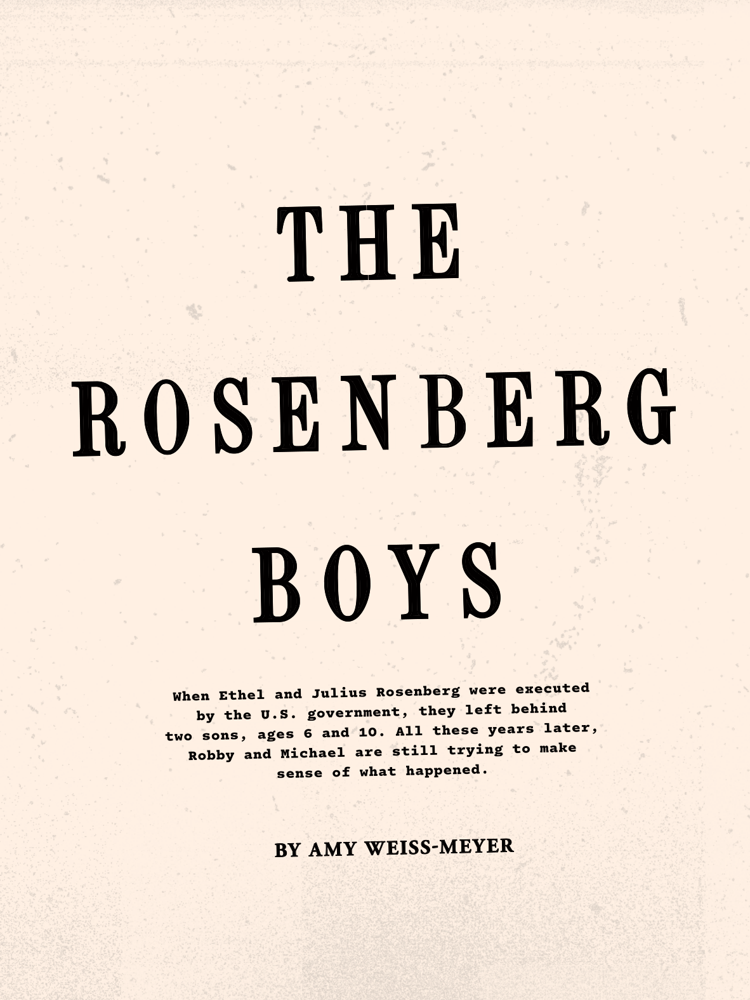

# The Atlantic — August 2026

## Page 28

---

### T H E

**【标题翻译】** 这

### R O S E N B E R G

**【标题翻译】** 罗森伯格

### B O Y S

**【标题翻译】** 男孩们

When Ethel and Julius Rosenberg were executed by the U.S. government, they left behind two sons, ages 6 and 10. All these years later, Robby and Michael are still trying to make sense of what happened.

**【中文翻译】** 当埃塞尔和朱利叶斯·罗森伯格被美国政府处决时，他们留下了两个儿子，分别为 6 岁和 10 岁。这么多年过去了，罗比和迈克尔仍在试图弄清楚所发生的事情。

#### BY AMY WEISS-MEYER

**【副标题翻译】** 作者：艾米·韦斯·迈耶
