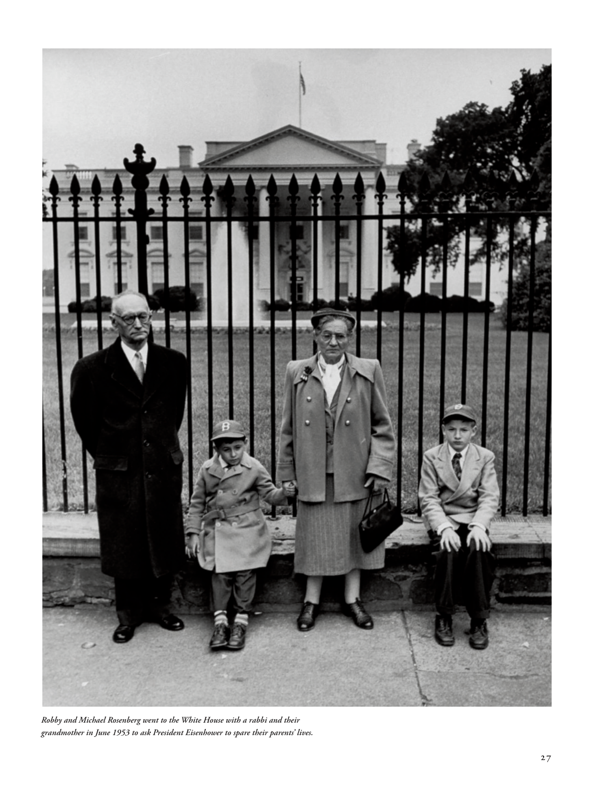

# The Atlantic — August 2026

## Page 29

---

Robby and Michael Rosenberg went to the White House with a rabbi and their grandmother in June 1953 to ask President Eisenhower to spare their parents’ lives.

**【中文翻译】** 1953 年 6 月，罗比和迈克尔·罗森伯格与一位拉比和他们的祖母一起前往白宫，请求艾森豪威尔总统饶恕他们父母的生命。
