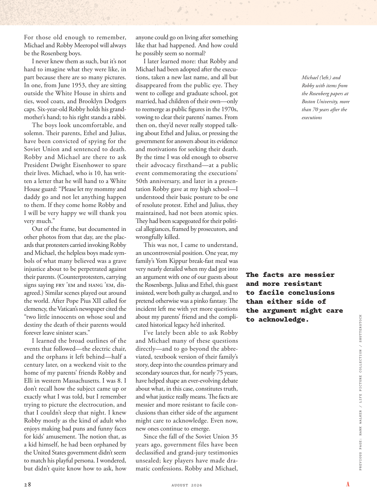

# The Atlantic — August 2026

## Page 30

---

For those old enough to remember, Michael and Robby Meeropol will always be the Rosenberg boys. I never knew them as such, but it’s not hard to imagine what they were like, in part because there are so many pictures.

**【中文翻译】** 对于那些年龄足够大的人来说，迈克尔和罗比·梅罗波尔将永远是罗森伯格男孩。我从来不了解他们，但不难想象他们是什么样子，部分原因是有太多的照片。

In one, from June 1953, they are sitting outside the White House in shirts and ties, wool coats, and Brooklyn Dodgers caps. Six-year-old Robby holds his grandmother’s hand; to his right stands a rabbi.

**【中文翻译】** 其中一张是 1953 年 6 月的照片，他们穿着衬衫、打领带、羊毛大衣，戴着布鲁克林道奇队的帽子，坐在白宫外。六岁的罗比握着祖母的手；他的右边站着一位拉比。

The boys look uncomfortable, and solemn. Th eir parents, Ethel and Julius, have been convicted of spying for the Soviet Union and sentenced to death.

**【中文翻译】** 男孩们看上去很不舒服，而且很严肃。他们的父母埃塞尔和朱利叶斯被判为苏联从事间谍活动并被判处死刑。

Robby and Michael are there to ask President Dwight Eisenhower to spare their lives. Michael, who is 10, has written a letter that he will hand to a White House guard: “Please let my mommy and daddy go and not let anything happen to them. If they come home Robby and I will be very happy we will thank you very much.”

**【中文翻译】** 罗比和迈克尔前来请求德怀特·艾森豪威尔总统饶恕他们的生命。 10 岁的迈克尔写了一封信，他将交给一名白宫警卫：“请让我的妈妈和爸爸走，不要让他们发生任何事情。如果他们回家，罗比和我会很高兴，我们会非常感谢你。”

Out of the frame, but documented in other photos from that day, are the placards that protesters carried invoking Robby and Michael, the helpless boys made symbols of what many believed was a grave injustice about to be perpetrated against their parents. (Counter protesters, carrying signs saying FRY ’EM and HANG ’EM, disagreed.) Similar scenes played out around the world. After Pope Pius XII called for clemency, the Vatican’s newspaper cited the “two little innocents on whose soul and destiny the death of their parents would forever leave sinister scars.”

**【中文翻译】** 在画面之外，但在那天的其他照片中记录了抗议者举着的标语牌，呼吁罗比和迈克尔，这两个无助的男孩象征着许多人认为他们的父母即将遭受的严重不公正行为。 （反抗议者举着“炸它们”和“绞死它们”的标语，表示不同意。）类似的场景在世界各地上演。在教皇庇护十二世呼吁宽大处理后，梵蒂冈的报纸引用了“两个无辜的小孩子，他们父母的去世将永远在他们的灵魂和命运上留下险恶的伤痕”。

I learned the broad outlines of the events that followed— the electric chair, and the orphans it left behind— half a century later, on a weekend visit to the home of my parents’ friends Robby and

**【中文翻译】** 半个世纪后，在周末拜访我父母的朋友罗比和

*— Elli in western Massachusetts. I was 8. I*

*【作者署名】埃利在马萨诸塞州西部。我当时8岁。我*

don’t recall how the subject came up or exactly what I was told, but I remember trying to picture the electrocution, and that I couldn’t sleep that night. I knew Robby mostly as the kind of adult who enjoys making bad puns and funny faces for kids’ amusement. The notion that, as a kid himself, he had been orphaned by the United States government didn’t seem to match his playful persona. I wondered, but didn’t quite know how to ask, how anyone could go on living after something like that had happened. And how could he possibly seem so normal?

**【中文翻译】** 我不记得这个话题是如何出现的，也不记得我被告知了什么，但我记得我试图想象触电的情景，那天晚上我无法入睡。我认识的罗比主要是那种喜欢为孩子们制造糟糕的双关语和滑稽面孔的成年人。他自己小时候是美国政府的孤儿，这一想法似乎与他顽皮的性格不相符。我想知道，但不太知道如何问，在发生这样的事情之后，一个人如何能够继续生活。而且他怎么可能看起来这么正常？

I later learned more: that Robby and Michael had been adopted after the executions, taken a new last name, and all but disappeared from the public eye. They went to college and graduate school, got married, had children of their own— only to reemerge as public figures in the 1970s, vowing to clear their parents’ names. From then on, they’d never really stopped talking about Ethel and Julius, or pressing the government for answers about its evidence and motivations for seeking their death.

**【中文翻译】** 后来我了解到更多信息：罗比和迈克尔在处决后被收养，取了新的姓氏，几乎从公众视野中消失了。他们读了大学和研究生，结婚了，有了自己的孩子——只是在 20 世纪 70 年代重新成为公众人物，并发誓要为父母洗清罪名。从那时起，他们就从未真正停止谈论埃塞尔和朱利叶斯，或者敦促政府回答其证据和寻求死亡的动机。

By the time I was old enough to observe their advocacy firsthand— at a public event commemorating the executions’ 50th anniversary, and later in a presentation Robby gave at my high school— I understood their basic posture to be one of resolute protest. Ethel and Julius, they maintained, had not been atomic spies.

**【中文翻译】** 当我长大到能够亲眼观察他们的主张时——在纪念处决 50 周年的公共活动中，以及后来罗比在我高中所做的演讲中——我明白他们的基本姿态是坚决抗议。他们坚称，埃塞尔和朱利叶斯并不是原子间谍。

They had been scapegoated for their political allegiances, framed by prosecutors, and wrongfully killed. This was not, I came to understand, an uncontroversial position. One year, my family’s Yom Kippur break-fast meal was very nearly derailed when my dad got into The facts are messier an argument with one of our guests about and more resistant the Rosenbergs. Julius and Ethel, this guest to facile conclusions insisted, were both guilty as charged, and to pretend otherwise was a pinko fantasy. The than either side of incident left me with yet more questions the argument might care about my parents’ friend and the complito acknowledge. cated historical legacy he’d inherited.

**【中文翻译】** 他们因政治忠诚而成为替罪羊，受到检察官的陷害，并被错误杀害。我逐渐明白，这并不是一个没有争议的立场。有一年，当我父亲与我们的一位客人就罗森博格一家发生争执时，事实变得更加混乱，而且更加抵制。这位得出轻率结论的客人坚持认为，朱利叶斯和埃塞尔都被指控有罪，假装不然只是一种粉红幻想。事件的任何一方都给我留下了更多的疑问，这场争论可能关心我父母的朋友和同谋承认的事情。他继承的历史遗产。

I’ve lately been able to ask Robby and Michael many of these questions directly— and to go beyond the abbreviated, textbook version of their family’s story, deep into the countless primary and secondary sources that, for nearly 75 years, have helped shape an ever-evolving debate about what, in this case, constitutes truth, and what justice really means. The facts are messier and more resistant to facile conclusions than either side of the argument might care to acknowledge. Even now, new ones continue to emerge.

**【中文翻译】** 最近，我能够直接向罗比和迈克尔提出许多这样的问题，并且超越了他们家庭故事的缩略版、教科书版本，深入了解了无数的一手和二手资料，这些资料在近 75 年来帮助形成了一场不断发展的辩论，关于在本案中什么是真相，以及正义的真正含义。事实比争论的任何一方都愿意承认的更加混乱，并且更难以得出简单的结论。即使现在，新的事物仍在不断出现。

Since the fall of the Soviet Union 35 years ago, government files have been declassifi ed and grand-jury testimonies unsealed; key players have made dramatic confessions. Robby and Michael, Michael ( left ) and Robby with items from the Rosenberg papers at Boston University, more than 70 years after the executions PREVIOUS PAGE: HANK WALKER / LIFE PICTURE COLLECTION / SHUTTERSTOCK

**【中文翻译】** 自 35 年前苏联解体以来，政府档案已被解密，大陪审团的证词已被解封。关键人物做出了戏剧性的坦白。罗比和迈克尔，迈克尔（左）和罗比与波士顿大学罗森伯格论文中的物品，处决 70 多年后 上一页：HANK WALKER / LIFE PICTURE COLLECTION / SHUTTERSTOCK
