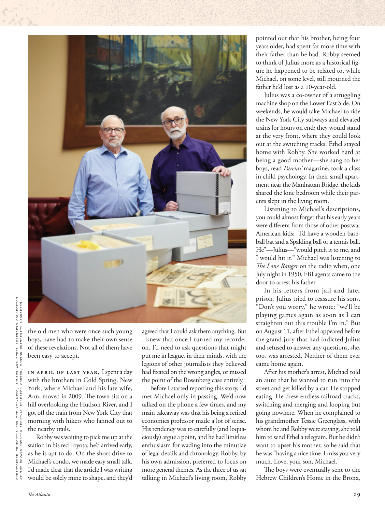

# The Atlantic — August 2026

## Page 31

---

CHRISTOPHER CHURCHILL FOR THE ATLANTIC ; JULIUS AND ETHEL ROSENBERG COLLECTION AT THE HOWARD GOTLIEB ARCHIVAL RESEARCH CENTER, BOSTON UNIVERSITY LIBRARIES the old men who were once such young boys, have had to make their own sense of these revelations. Not all of them have been easy to accept.

**【中文翻译】** 大西洋的克里斯托弗·丘吉尔；波士顿大学图书馆霍华德·戈特利布档案研究中心的朱利叶斯和埃塞尔·罗森伯格藏品这些曾经还是小男孩的老人不得不对这些启示有自己的理解。并非所有这些都容易被接受。

In April of last year, I spent a day with the brothers in Cold Spring, New York, where Michael and his late wife, Ann, moved in 2009. The town sits on a hill overlooking the Hudson River, and I got off the train from New York City that morning with hikers who fanned out to the nearby trails.

**【中文翻译】** 去年 4 月，我和兄弟们在纽约冷泉度过了一天，迈克尔和他已故的妻子安于 2009 年搬到了那里。这个小镇坐落在一座小山上，俯瞰着哈德逊河，那天早上我从纽约市下了火车，徒步旅行者们散开到附近的小径。

Robby was waiting to pick me up at the station in his red Toyota; he’d arrived early, as he is apt to do. On the short drive to Michael’s condo, we made easy small talk.

**【中文翻译】** 罗比开着他的红色丰田车在车站等着接我。他来得很早，这是他惯常做的事。在前往迈克尔公寓的短暂车程中，我们轻松闲聊。

I’d made clear that the article I was writing would be solely mine to shape, and they’d agreed that I could ask them anything. But I knew that once I turned my recorder on, I’d need to ask questions that might put me in league, in their minds, with the legions of other journalists they believed had fi xated on the wrong angles, or missed the point of the Rosenberg case entirely.

**【中文翻译】** 我已经明确表示，我正在写的文章将完全由我来制定，他们也同意我可以问他们任何问题。但我知道，一旦我打开录音机，我就需要提出一些问题，这些问题可能会让我在他们的心目中与其他大批记者结成联盟，他们认为这些记者的角度是错误的，或者完全没有抓住罗森伯格案的要点。

Before I started reporting this story, I’d met Michael only in passing. We’d now talked on the phone a few times, and my main takeaway was that his being a retired economics professor made a lot of sense.

**【中文翻译】** 在我开始报道这个故事之前，我只是偶然认识了迈克尔。我们现在已经通了几次电话，我的主要收获是，他作为一名退休的经济学教授很有意义。

His tendency was to carefully (and loquaciously) argue a point, and he had limitless enthusiasm for wading into the minutiae of legal details and chronology. Robby, by his own admission, preferred to focus on more general themes. As the three of us sat talking in Michael’s living room, Robby pointed out that his brother, being four years older, had spent far more time with their father than he had. Robby seemed to think of Julius more as a historical figure he happened to be related to, while Michael, on some level, still mourned the father he’d lost as a 10-year-old.

**【中文翻译】** 他倾向于仔细地（并且滔滔不绝地）论证一个观点，并且他对深入研究法律细节和年代的细节有着无限的热情。罗比自己承认，他更喜欢关注更普遍的主题。当我们三个人坐在迈克尔的客厅里聊天时，罗比指出，他的哥哥比他大四岁，和父亲在一起的时间比他多得多。罗比似乎更多地将朱利叶斯视为与他碰巧有亲戚关系的历史人物，而迈克尔在某种程度上仍然哀悼他十岁时失去的父亲。

Julius was a co-owner of a struggling machine shop on the Lower East Side. On weekends, he would take Michael to ride the New York City subways and elevated trains for hours on end; they would stand at the very front, where they could look out at the switching tracks. Ethel stayed home with Robby. She worked hard at being a good mother— she sang to her boys, read Parents’ magazine, took a class in child psychology. In their small apartment near the Manhattan Bridge, the kids shared the lone bedroom while their parents slept in the living room.

**【中文翻译】** 朱利叶斯是下东区一家陷入困境的机械厂的共同所有人。周末，他会带迈克尔连续几个小时乘坐纽约地铁和高架列车；他们会站在最前面，在那里他们可以看到正在变换的轨道。埃塞尔和罗比呆在家里。她努力成为一名好母亲——她给儿子们唱歌、阅读《家长》杂志、参加儿童心理学课程。在曼哈顿大桥附近的小公寓里，孩子们共用一间卧室，而父母则睡在客厅。

Listening to Michael’s descriptions, you could almost forget that his early years were diff erent from those of other postwar American kids: “I’d have a wooden baseball bat and a Spalding ball or a tennis ball.

**【中文翻译】** 听迈克尔的描述，你几乎会忘记他的早年与其他战后美国孩子的不同：“我有一根木制棒球棒和一个斯伯丁球或一个网球。

He”—Julius—“would pitch it to me, and I would hit it.” Michael was listening to The Lone Ranger on the radio when, one July night in 1950, FBI agents came to the door to arrest his father.

**【中文翻译】** 他”——朱利叶斯——“会把球扔给我，我就会击中它。” 1950 年 7 月的一个晚上，迈克尔正在听收音机里的《独行侠》，联邦调查局特工上门逮捕了他的父亲。

In his letters from jail and later prison, Julius tried to reassure his sons. “Don’t you worry,” he wrote; “we’ll be playing games again as soon as I can straighten out this trouble I’m in.” But on August 11, after Ethel appeared before the grand jury that had indicted Julius and refused to answer any questions, she, too, was arrested. Neither of them ever came home again.

**【中文翻译】** 在监狱和后来入狱的信中，朱利叶斯试图安抚儿子们。 “别担心，”他写道； “一旦我解决了这个麻烦，我们就会再次玩游戏。”但 8 月 11 日，埃塞尔出现在起诉朱利叶斯的大陪审团面前并拒绝回答任何问题后，她也被捕了。他们俩再也没有回家过。

After his mother’s arrest, Michael told an aunt that he wanted to run into the street and get killed by a car. He stopped eating. He drew endless railroad tracks, switching and merging and looping but going nowhere. When he complained to his grandmother Tessie Greenglass, with whom he and Robby were staying, she told him to send Ethel a telegram. But he didn’t want to upset his mother, so he said that he was “having a nice time. I miss you very much. Love, your son, Michael.” The boys were eventually sent to the Hebrew Children’s Home in the Bronx,

**【中文翻译】** 母亲被捕后，迈克尔告诉一位阿姨，他想跑到街上被车撞死。他停止进食。他画了无尽的铁轨，变换、合并、循环，却无处可去。当他向他和罗比住在一起的祖母泰西·格林格拉斯抱怨时，她让他给埃塞尔发一封电报。但他不想让母亲难过，所以他说他“玩得很开心。我非常想念你。爱你的儿子迈克尔。”这些男孩最终被送往布朗克斯的希伯来儿童之家，
