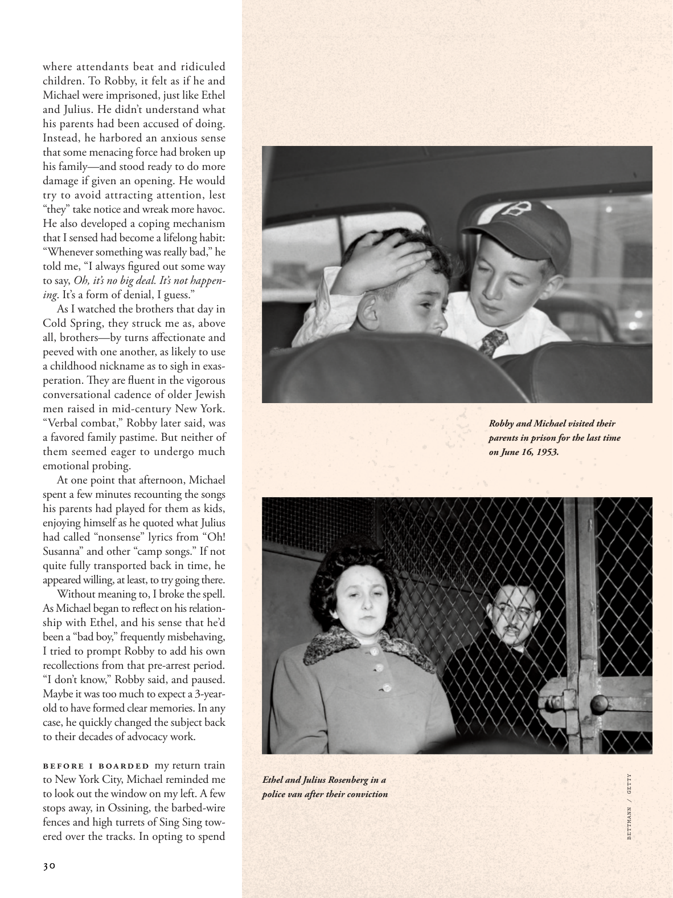

# The Atlantic — August 2026

## Page 32

---

where attendants beat and ridiculed children. To Robby, it felt as if he and Michael were imprisoned, just like Ethel and Julius. He didn’t understand what his parents had been accused of doing.

**【中文翻译】** 服务员殴打和嘲笑儿童。对于罗比来说，他和迈克尔就像被囚禁一样，就像埃塞尔和朱利叶斯一样。他不明白他的父母被指控做了什么。

Instead, he harbored an anxious sense that some menacing force had broken up his family— and stood ready to do more damage if given an opening. He would try to avoid attracting attention, lest “they” take notice and wreak more havoc.

**【中文翻译】** 相反，他怀有一种焦虑的感觉，认为某种威胁性的力量已经拆散了他的家庭，并且一旦有机会就会造成更大的伤害。他会尽量避免引起注意，以免“他们”注意到并造成更大的破坏。

He also developed a coping mechanism that I sensed had become a lifelong habit: “Whenever something was really bad,” he told me, “I always figured out some way to say, Oh, it’s no big deal. It’s not happening . It’s a form of denial, I guess.”

**【中文翻译】** 他还发展了一种应对机制，我觉得这种机制已经成为一种终生的习惯：“每当事情真的很糟糕时，”他告诉我，“我总是想办法说，哦，这没什么大不了的。这并没有发生。我想，这是一种否认的形式。”

As I watched the brothers that day in Cold Spring, they struck me as, above all, brothers— by turns aff ectionate and peeved with one another, as likely to use a childhood nickname as to sigh in exasperation. They are fl uent in the vigorous conversational cadence of older Jewish men raised in mid-century New York.

**【中文翻译】** 那天我在冷泉看着这对兄弟，最重要的是，他们给我的印象就是兄弟——时而深情，时而彼此恼怒，既可能使用儿时的绰号，也可能恼怒地叹息。他们能流利地运用在本世纪中叶纽约长大的年长犹太男子的充满活力的对话节奏。

“Verbal combat,” Robby later said, was a favored family pastime. But neither of them seemed eager to undergo much emotional probing. At one point that afternoon, Michael spent a few minutes recounting the songs his parents had played for them as kids, enjoying himself as he quoted what Julius had called “nonsense” lyrics from “Oh!

**【中文翻译】** 罗比后来说，“口斗”是一种深受家庭喜爱的消遣方式。但他们似乎都不愿意接受太多的情感探索。那天下午的某个时刻，迈克尔花了几分钟的时间回忆起父母小时候为他们演奏过的歌曲，并自娱自乐地引用了朱利叶斯所说的《哦！

Susanna” and other “camp songs.” If not quite fully transported back in time, he appeared willing, at least, to try going there. Without meaning to, I broke the spell.

**【中文翻译】** 苏珊娜”和其他“营地歌曲”。即使没有完全回到过去，他至少也愿意尝试去那里。我无意间打破了咒语。

As Michael began to refl ect on his relationship with Ethel, and his sense that he’d been a “bad boy,” frequently mis behaving, I tried to prompt Robby to add his own recollections from that pre-arrest period.

**【中文翻译】** 当迈克尔开始反思他与埃塞尔的关系，以及他认为自己是一个“坏男孩”，经常行为不端时，我试图促使罗比添加他自己对被捕前时期的回忆。

“I don’t know,” Robby said, and paused. Maybe it was too much to expect a 3-yearold to have formed clear memories. In any case, he quickly changed the subject back to their decades of advocacy work.

**【中文翻译】** “我不知道，”罗比说，然后停了下来。也许期望一个三岁的孩子就能形成清晰的记忆有点太过分了。无论如何，他很快就把话题转回到他们几十年来的宣传工作上。

Before I boarded my return train to New York City, Michael reminded me to look out the window on my left. A few stops away, in Ossining, the barbed-wire fences and high turrets of Sing Sing towered over the tracks. In opting to spend Ethel and Julius Rosenberg in a police van after their conviction TK 2021 Robby and Michael visited their parents in prison for the last time on June 16, 1953.

**【中文翻译】** 在我登上返回纽约市的回程火车之前，迈克尔提醒我看左边的窗外。几站之外的奥西宁，辛辛的铁丝网和高塔耸立在铁轨上。 1953 年 6 月 16 日，罗比和迈克尔在 TK 2021 定罪后选择将埃塞尔和朱利叶斯·罗森伯格放在警车里，最后一次探望他们在监狱里的父母。

*ART / PHOTO CREDIT TK*

*【图注与署名】艺术/照片来源 TK*

*BETTMANN / GETTY*

*【图注与署名】贝特曼/盖蒂图片社*
