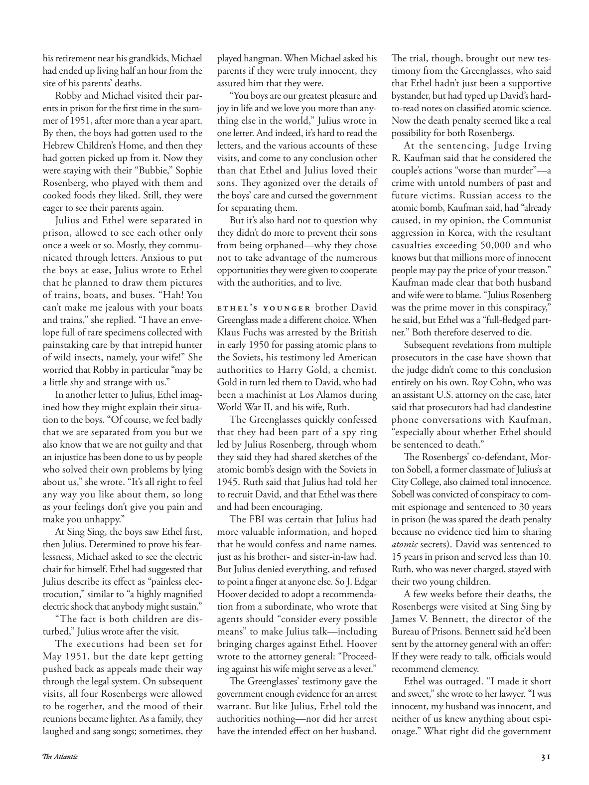

# The Atlantic — August 2026

## Page 33

---

his retirement near his grandkids, Michael had ended up living half an hour from the site of his parents’ deaths. Robby and Michael visited their parents in prison for the first time in the summer of 1951, after more than a year apart.

**【中文翻译】** 迈克尔在孙辈附近退休，最终住在距离父母去世地点半小时车程的地方。 1951 年夏天，罗比和迈克尔在分开一年多后第一次去监狱探望父母。

By then, the boys had gotten used to the Hebrew Children’s Home, and then they had gotten picked up from it. Now they were staying with their “Bubbie,” Sophie Rosenberg, who played with them and cooked foods they liked. Still, they were eager to see their parents again.

**【中文翻译】** 那时，男孩们已经习惯了希伯来儿童之家，然后他们就被接走了。现在，他们和他们的“布比”索菲·罗森伯格住在一起，她和他们一起玩耍，煮他们喜欢的食物。尽管如此，他们还是渴望再次见到父母。

Julius and Ethel were separated in prison, allowed to see each other only once a week or so. Mostly, they communicated through letters. Anxious to put the boys at ease, Julius wrote to Ethel that he planned to draw them pictures of trains, boats, and buses. “Hah! You can’t make me jealous with your boats and trains,” she replied. “I have an envelope full of rare specimens collected with painstaking care by that intrepid hunter of wild insects, namely, your wife!” She worried that Robby in particular “may be a little shy and strange with us.”

**【中文翻译】** 朱利叶斯和埃塞尔在监狱里被分开，每周只能见面一次。大多数情况下，他们通过信件进行交流。朱利叶斯急于让孩子们放松，他写信给埃塞尔，说他计划给他们画火车、轮船和公共汽车的图画。 “哈！你的船和火车不能让我嫉妒，”她回答道。 “我有一个信封，里面装满了那个勇敢的野生昆虫猎人，也就是你的妻子，精心采集的珍稀标本！”她担心罗比“可能对我们有点害羞和陌生”。

In another letter to Julius, Ethel imagined how they might explain their situation to the boys. “Of course, we feel badly that we are separated from you but we also know that we are not guilty and that an injustice has been done to us by people who solved their own problems by lying about us,” she wrote. “It’s all right to feel any way you like about them, so long as your feelings don’t give you pain and make you unhappy.”

**【中文翻译】** 在另一封写给朱利叶斯的信中，埃塞尔设想了如何向男孩们解释他们的处境。她写道：“当然，我们对与你们分离感到难过，但我们也知道我们没有罪，那些通过对我们撒谎来解决自己问题的人对我们造成了不公正。” “对他们有任何你喜欢的感觉都可以，只要你的感觉不会给你带来痛苦或让你不快乐。”

At Sing Sing, the boys saw Ethel first, then Julius. Determined to prove his fearlessness, Michael asked to see the electric chair for himself. Ethel had suggested that Julius describe its effect as “painless electrocution,” similar to “a highly magnified electric shock that anybody might sustain.”

**【中文翻译】** 在新新，男孩们首先看到了埃塞尔，然后是朱利叶斯。迈克尔决心要证明自己的无所畏惧，他要求亲眼看看电椅。埃塞尔建议朱利叶斯将其效果描述为“无痛触电”，类似于“任何人都可能承受的高度放大的电击”。

“The fact is both children are disturbed,” Julius wrote after the visit. The executions had been set for May 1951, but the date kept getting pushed back as appeals made their way through the legal system. On subsequent visits, all four Rosenbergs were allowed to be together, and the mood of their reunions became lighter. As a family, they laughed and sang songs; sometimes, they played hangman. When Michael asked his parents if they were truly innocent, they assured him that they were.

**【中文翻译】** “事实上，两个孩子都感到不安，”朱利叶斯在探访后写道。处决日期原定于 1951 年 5 月，但随着上诉通过法律系统，日期不断推迟。在随后的访问中，罗森博格四人都被允许在一起，他们团聚的气氛变得轻松起来。一家人有说有笑，唱歌；有时，他们玩刽子手。当迈克尔问他的父母是否真的无辜时，他们向他保证他们是无辜的。

“You boys are our greatest pleasure and joy in life and we love you more than anything else in the world,” Julius wrote in one letter. And indeed, it’s hard to read the letters, and the various accounts of these visits, and come to any conclusion other than that Ethel and Julius loved their sons. They agonized over the details of the boys’ care and cursed the government for separating them.

**【中文翻译】** 朱利叶斯在一封信中写道：“你们孩子们是我们生命中最大的快乐和快乐，我们爱你们胜过世界上的一切。”事实上，除了埃塞尔和朱利叶斯爱他们的儿子之外，很难通过阅读这些信件以及这些访问的各种记录来得出任何结论。他们对男孩们的照顾细节感到痛苦，并咒骂政府将他们分开。

But it’s also hard not to question why they didn’t do more to prevent their sons from being orphaned—why they chose not to take advantage of the numerous opportunities they were given to cooperate with the authorities, and to live.

**【中文翻译】** 但也很难不质疑为什么他们没有采取更多措施来防止儿子成为孤儿——为什么他们选择不利用他们获得的众多与当局合作和生存的机会。

E t h e l ’s y o u n g e r brother David Greenglass made a different choice. When Klaus Fuchs was arrested by the British in early 1950 for passing atomic plans to the Soviets, his testimony led American authorities to Harry Gold, a chemist.

**【中文翻译】** 埃塞尔的弟弟大卫·格林格拉斯做出了不同的选择。 1950 年初，克劳斯·福克斯因向苏联传递原子计划而被英国逮捕，美国当局根据他的证词找到了化学家哈里·戈尔德。

Gold in turn led them to David, who had been a machinist at Los Alamos during World War II, and his wife, Ruth. The Green glasses quickly confessed that they had been part of a spy ring led by Julius Rosenberg, through whom they said they had shared sketches of the atomic bomb’s design with the Soviets in 1945. Ruth said that Julius had told her to recruit David, and that Ethel was there and had been encouraging.

**【中文翻译】** 黄金又让他们找到了大卫和他的妻子露丝。大卫在第二次世界大战期间曾是洛斯阿拉莫斯的一名机械师。绿眼镜很快承认，他们是朱利叶斯·罗森伯格领导的间谍团伙的一员，并称他们在 1945 年通过罗森伯格与苏联分享了原子弹的设计草图。露丝说，朱利叶斯告诉她要招募大卫，而埃塞尔也在场，并一直在鼓励她。

The FBI was certain that Julius had more valuable information, and hoped that he would confess and name names, just as his brotherand sister-in-law had.

**【中文翻译】** 联邦调查局确信朱利叶斯掌握了更有价值的信息，并希望他能够坦白并指名道姓，就像他的哥哥和嫂子一样。

But Julius denied everything, and refused to point a finger at anyone else. So J. Edgar Hoover decided to adopt a recommendation from a subordinate, who wrote that agents should “consider every possible means” to make Julius talk— including bringing charges against Ethel. Hoover wrote to the attorney general: “Proceeding against his wife might serve as a lever.”

**【中文翻译】** 但朱利叶斯否认了一切，并拒绝指责任何人。因此，埃德加·胡佛决定采纳下属的建议，下属写道，特工应该“考虑一切可能的手段”让朱利叶斯开口说话，包括对埃塞尔提出指控。胡佛写信给司法部长：“对他的妻子提起诉讼可能会成为一种杠杆。”

The Greenglasses’ testimony gave the government enough evidence for an arrest warrant. But like Julius, Ethel told the authorities nothing— nor did her arrest have the intended effect on her husband.

**【中文翻译】** 格林格拉斯兄弟的证词为政府发出逮捕令提供了足够的证据。但和朱利叶斯一样，埃塞尔没有告诉当局任何事情——她的被捕也没有对她的丈夫产生预期的影响。

The trial, though, brought out new testimony from the Green glasses, who said that Ethel hadn’t just been a supportive bystander, but had typed up David’s hardto-read notes on classified atomic science.

**【中文翻译】** 不过，这次审判带来了格林眼镜的新证词，他们说埃塞尔不仅是一个支持的旁观者，而且还打印了大卫难以阅读的机密原子科学笔记。

Now the death penalty seemed like a real possibility for both Rosenbergs. At the sentencing, Judge Irving R. Kaufman said that he considered the couple’s actions “worse than murder”— a crime with untold numbers of past and future victims. Russian access to the atomic bomb, Kaufman said, had “already caused, in my opinion, the Communist aggression in Korea, with the resultant casualties exceeding 50,000 and who knows but that millions more of innocent people may pay the price of your treason.”

**【中文翻译】** 现在，对罗森博格夫妇来说，死刑似乎是真正的可能性。法官欧文·R·考夫曼在宣判时表示，他认为这对夫妇的行为“比谋杀更糟糕”——这种犯罪行为造成了无数过去和未来的受害者。考夫曼说，俄罗斯获得原子弹“在我看来，已经导致了共产党对朝鲜的侵略，造成的伤亡超过五万人，谁知道，还有数百万无辜人民可能会为你们的叛国行为付出代价。”

Kaufman made clear that both husband and wife were to blame. “Julius Rosenberg was the prime mover in this conspiracy,” he said, but Ethel was a “full-fledged partner.” Both therefore deserved to die.

**【中文翻译】** 考夫曼明确表示，丈夫和妻子都有责任。 “朱利叶斯·罗森伯格是这一阴谋的主要推动者，”他说，但埃塞尔是一个“成熟的合作伙伴”。因此，两人都该死。

Subsequent revelations from multiple prosecutors in the case have shown that the judge didn’t come to this conclusion entirely on his own. Roy Cohn, who was an assistant U.S. attorney on the case, later said that prosecutors had had clandestine phone conversations with Kaufman, “especially about whether Ethel should be sentenced to death.”

**【中文翻译】** 随后该案多位检察官的爆料表明，法官并非完全凭一己之力得出这一结论。负责此案的美国助理检察官罗伊·科恩后来说，检察官已与考夫曼进行了秘密电话交谈，“特别是关于埃塞尔是否应该被判处死刑”。

The Rosenbergs’ co-defendant, Morton Sobell, a former classmate of Julius’s at City College, also claimed total innocence. Sobell was convicted of conspiracy to commit espionage and sentenced to 30 years in prison (he was spared the death penalty because no evidence tied him to sharing atomic secrets). David was sentenced to 15 years in prison and served less than 10.

**【中文翻译】** 罗森伯格夫妇的共同被告莫顿·索贝尔（Morton Sobell）是朱利叶斯在城市学院的前同学，他也声称自己完全无罪。索贝尔被判串谋从事间谍活动并被判处 30 年监禁（由于没有证据表明他与分享原子机密有关，他免于死刑）。大卫被判处 15 年监禁，服刑时间不到 10 年。

Ruth, who was never charged, stayed with their two young children. A few weeks before their deaths, the Rosenbergs were visited at Sing Sing by James V. Bennett, the director of the Bureau of Prisons. Bennett said he’d been sent by the attorney general with an offer: If they were ready to talk, officials would recommend clemency.

**【中文翻译】** 露丝从未受到指控，她和两个年幼的孩子住在一起。罗森伯格夫妇去世前几周，监狱管理局局长詹姆斯·V·贝内特 (James V. Bennett) 到新新监狱探望了他们。贝内特说，司法部长向他发出了一个提议：如果他们准备好谈判，官员们会建议宽大处理。

Ethel was outraged. “I made it short and sweet,” she wrote to her lawyer. “I was innocent, my husband was innocent, and neither of us knew anything about espionage.” What right did the government

**【中文翻译】** 埃塞尔很愤怒。 “我说得简短而甜蜜，”她写信给她的律师。 “我是无辜的，我丈夫也是无辜的，我们俩都对间谍活动一无所知。”政府有什么权利
