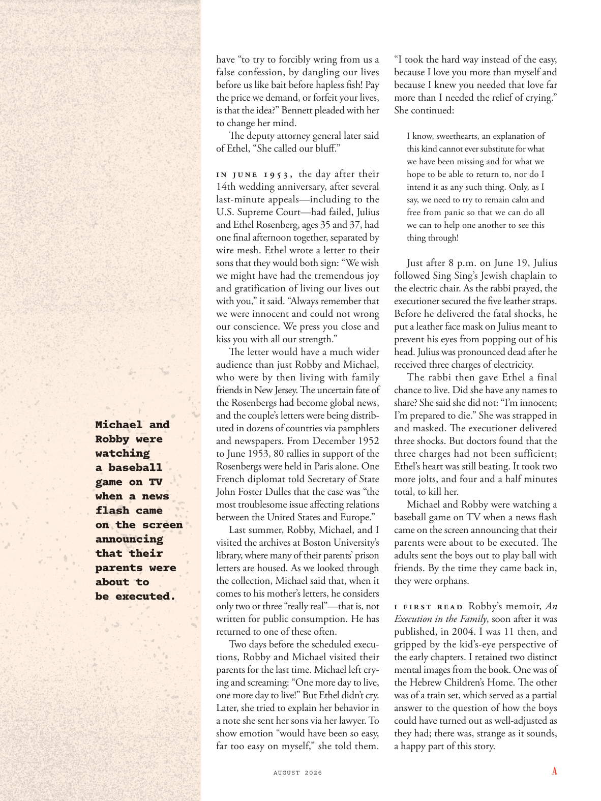

# The Atlantic — August 2026

## Page 34

---

Michael and Robby were watching a baseball game on TV when a news flash came on the screen announcing that their parents were about to be executed. have “to try to forcibly wring from us a false confession, by dangling our lives before us like bait before hapless fi sh! Pay the price we demand, or forfeit your lives, is that the idea?” Bennett pleaded with her to change her mind.

**【中文翻译】** 迈克尔和罗比正在电视上观看棒球比赛，这时屏幕上出现一条新闻，宣布他们的父母即将被处决。 “试图强行从我们口中逼出虚假供词，把我们的生命悬在我们面前，就像在倒霉的鱼面前悬挂诱饵一样！付出我们要求的代价，或者放弃你的生命，是这个想法吗？”贝内特恳求她改变主意。

The deputy attorney general later said of Ethel, “She called our bluff .” I n J u n e   1 9 5 3 , the day after their 14th wedding anniversary, after several lastminute appeals— including to the U.S. Supreme Court— had failed, Julius and Ethel Rosenberg, ages 35 and 37, had one final afternoon together, separated by wire mesh. Ethel wrote a letter to their sons that they would both sign: “We wish we might have had the tremendous joy and gratification of living our lives out with you,” it said. “Always remember that we were innocent and could not wrong our conscience. We press you close and kiss you with all our strength.”

**【中文翻译】** 司法部副部长后来这样评价埃塞尔：“她揭穿了我们的虚张声势。” 6 月 1 日 9 月 5 日，也就是他们结婚 14 周年纪念日的第二天，在几次最后一刻的上诉（包括向美国最高法院上诉）均失败后，分别为 35 岁和 37 岁的朱利叶斯和埃塞尔·罗森伯格，用铁丝网隔开，共度了最后一个下午。埃塞尔给他们的儿子写了一封信，他们都签署了这封信：“我们希望能和你一起生活，让我们拥有巨大的快乐和满足，”信中写道。 “永远记住，我们是无辜的，不能辜负我们的良心。我们用尽全力紧紧地拥抱你，亲吻你。”

The letter would have a much wider audience than just Robby and Michael, who were by then living with family friends in New Jersey. The uncertain fate of the Rosenbergs had become global news, and the couple’s letters were being distributed in dozens of countries via pamphlets and newspapers. From December 1952 to June 1953, 80 rallies in support of the Rosenbergs were held in Paris alone. One French diplomat told Secretary of State John Foster Dulles that the case was “the most troublesome issue aff ecting relations between the United States and Europe.”

**【中文翻译】** 这封信的受众不仅限于罗比和迈克尔，当时他们与新泽西州的家人朋友住在一起。罗森伯格夫妇的不确定命运已成为全球新闻，这对夫妇的信件通过小册子和报纸在数十个国家分发。从 1952 年 12 月到 1953 年 6 月，仅在巴黎就举行了 80 场支持罗森伯格家族的集会。一位法国外交官告诉国务卿约翰·福斯特·杜勒斯，此案是“影响美国和欧洲关系的最麻烦的问题”。

Last summer, Robby, Michael, and I visited the archives at Boston University’s library, where many of their parents’ prison letters are housed. As we looked through the collection, Michael said that, when it comes to his mother’s letters, he considers only two or three “really real”— that is, not written for public consumption. He has returned to one of these often.

**【中文翻译】** 去年夏天，罗比、迈克尔和我参观了波士顿大学图书馆的档案馆，那里存放着他们父母的许多监狱信件。当我们浏览这些收藏时，迈克尔说，当谈到他母亲的信件时，他认为只有两三封“真正真实”——也就是说，不是为了公众消费而写的。他经常回到其中之一。

Two days before the scheduled executions, Robby and Michael visited their parents for the last time. Michael left crying and screaming: “One more day to live, one more day to live!” But Ethel didn’t cry.

**【中文翻译】** 在预定处决的前两天，罗比和迈克尔最后一次拜访了他们的父母。迈克尔哭着尖叫着离开：“还剩一天，还剩一天！”但埃塞尔没有哭。

Later, she tried to explain her behavior in a note she sent her sons via her lawyer. To show emotion “would have been so easy, far too easy on myself,” she told them.

**【中文翻译】** 后来，她试图在通过律师发给儿子的一封信中解释自己的行为。她告诉他们，表达情感“对我自己来说太容易了”。

“I took the hard way instead of the easy, because I love you more than myself and because I knew you needed that love far more than I needed the relief of crying.”

**【中文翻译】** “我选择了艰难的道路，而不是简单的道路，因为我爱你胜过爱我自己，因为我知道你更需要那种爱，而不是我需要哭泣的安慰。”

She continued: I know, sweethearts, an explanation of this kind cannot ever substitute for what we have been missing and for what we hope to be able to return to, nor do I intend it as any such thing. Only, as I say, we need to try to remain calm and free from panic so that we can do all we can to help one another to see this thing through!

**【中文翻译】** 她继续说道：我知道，亲爱的，这种解释永远无法替代我们所失去的东西以及我们希望能够回归的东西，我也无意这样做。只是，正如我所说，我们需要保持冷静，不要惊慌，这样我们才能尽我们所能互相帮助，渡过难关！

Just after 8 p.m. on June 19, Julius followed Sing Sing’s Jewish chaplain to the electric chair. As the rabbi prayed, the executioner secured the five leather straps.

**【中文翻译】** 晚上 8 点刚过6 月 19 日，朱利叶斯跟随辛辛的犹太牧师上了电椅。当拉比祈祷时，刽子手固定好五个皮带。

Before he delivered the fatal shocks, he put a leather face mask on Julius meant to prevent his eyes from popping out of his head. Julius was pronounced dead after he received three charges of electricity.

**【中文翻译】** 在对朱利叶斯实施致命电击之前，他给朱利叶斯戴上了皮革面罩，以防止他的眼睛从头上掉出来。朱利叶斯在收到三项电费后被宣布死亡。

The rabbi then gave Ethel a final chance to live. Did she have any names to share? She said she did not: “I’m innocent; I’m prepared to die.” She was strapped in and masked. The executioner delivered three shocks. But doctors found that the three charges had not been sufficient; Ethel’s heart was still beating. It took two more jolts, and four and a half minutes total, to kill her.

**【中文翻译】** 拉比随后给了埃塞尔最后的生存机会。她有什么名字可以分享吗？她说她没有：“我是无辜的；我已经准备好去死了。”她被绑起来并戴着面具。刽子手发出了三下电击。但医生发现这三项指控还不够充分；埃塞尔的心还在跳动。又经历了两次颠簸，总共四分半钟，她才死去。

Michael and Robby were watching a baseball game on TV when a news flash came on the screen announcing that their parents were about to be executed. The adults sent the boys out to play ball with friends. By the time they came back in, they were orphans.

**【中文翻译】** 迈克尔和罗比正在电视上观看棒球比赛，这时屏幕上出现一条新闻，宣布他们的父母即将被处决。大人们送孩子们出去和朋友们打球。当他们回来时，他们已经成了孤儿。

I f i r s t re a d Robby’s memoir, An Execution in the Family , soon after it was published, in 2004. I was 11 then, and gripped by the kid’s-eye perspective of the early chapters. I retained two distinct mental images from the book. One was of the Hebrew Children’s Home. The other was of a train set, which served as a partial answer to the question of how the boys could have turned out as well-adjusted as they had; there was, strange as it sounds, a happy part of this story.

**【中文翻译】** 2004 年，我第一次读到罗比的回忆录《家庭处决》，该书出版后不久。当时我 11 岁，被前几章中孩子的视角所吸引。我保留了书中两个截然不同的心理形象。其中之一是希伯来儿童之家。另一个是火车组，它部分回答了男孩们如何才能像他们一样适应的问题；虽然听起来很奇怪，但这个故事中有一个令人愉快的部分。
