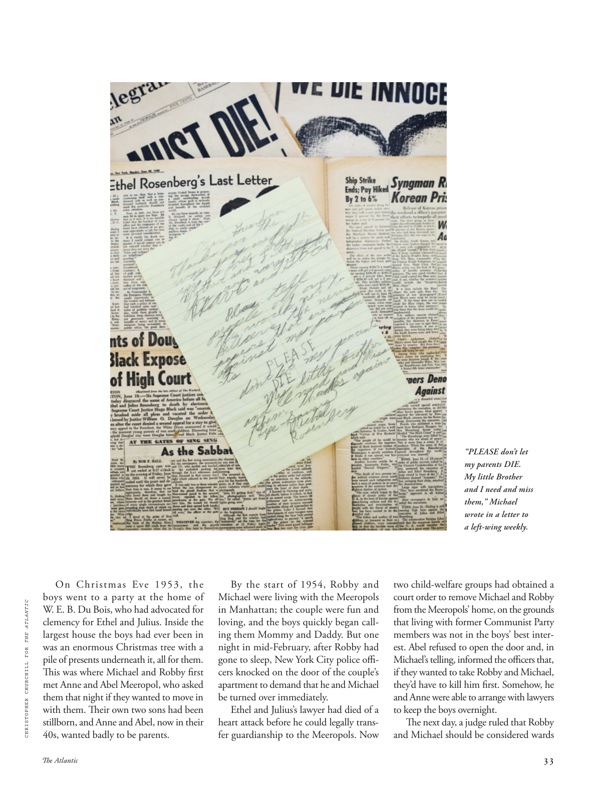

# The Atlantic — August 2026

## Page 35

---

On Christmas Eve  1953, the boys went to a party at the home of CHRISTOPHER CHURCHILL FOR THE ATLANTIC W. E. B. Du Bois, who had advocated for clemency for Ethel and Julius. Inside the largest house the boys had ever been in was an enormous Christmas tree with a pile of presents underneath it, all for them.

**【中文翻译】** 1953 年圣诞节前夕，男孩们去参加了在克里斯托弗·丘吉尔 (Christopher Churchill) 家中为大西洋 W. E. B. Du Bois 举办的派对，杜波依斯曾主张对埃塞尔和朱利叶斯采取宽大处理。男孩们住过的最大的房子里有一棵巨大的圣诞树，树下放着一堆礼物，都是给他们的。

This was where Michael and Robby first met Anne and Abel Meeropol, who asked them that night if they wanted to move in with them. Their own two sons had been stillborn, and Anne and Abel, now in their 40s, wanted badly to be parents.

**【中文翻译】** 这是迈克尔和罗比第一次见到安妮和亚伯·梅罗波尔，那天晚上安妮问他们是否愿意搬来和他们一起住。他们自己的两个儿子已经死产，现在 40 多岁的安妮和亚伯非常想成为父母。

By the start of 1954, Robby and Michael were living with the Meeropols in Manhattan; the couple were fun and loving, and the boys quickly began calling them Mommy and Daddy. But one night in mid-February, after Robby had gone to sleep, New York City police officers knocked on the door of the couple’s apartment to demand that he and Michael be turned over immediately.

**【中文翻译】** 1954 年初，罗比和迈克尔与曼哈顿的米罗波尔夫妇住在一起。这对夫妇很有趣，也很恩爱，男孩们很快就开始叫他们妈妈和爸爸。但二月中旬的一个晚上，罗比入睡后，纽约市警察敲开了这对夫妇公寓的门，要求立即将他和迈克尔移交。

Ethel and Julius’s lawyer had died of a heart attack before he could legally transfer guardianship to the Meeropols. Now “PLEASE don’t let my parents DIE.

**【中文翻译】** 埃塞尔和朱利叶斯的律师在他能够合法地将监护权转移给米罗波尔之前就因心脏病去世了。现在“请不要让我的父母死去。

My little Brother and I need and miss them,” Michael wrote in a letter to a left-wing weekly. two child-welfare groups had obtained a court order to remove Michael and Robby from the Meeropols’ home, on the grounds that living with former Communist Party members was not in the boys’ best interest. Abel refused to open the door and, in Michael’s telling, informed the officers that, if they wanted to take Robby and Michael, they’d have to kill him first. Somehow, he and Anne were able to arrange with lawyers to keep the boys overnight. The next day, a judge ruled that Robby and Michael should be considered wards

**【中文翻译】** 迈克尔在给左翼周刊的一封信中写道：“我和我的弟弟需要并想念他们。”两个儿童福利组织已获得法院命令，将迈克尔和罗比从米罗波尔夫妇的家中带走，理由是与前共产党员住在一起不符合孩子们的最佳利益。亚伯拒绝开门，据迈克尔的说法，他告诉警察，如果他们想带走罗比和迈克尔，就必须先杀了他。不知何故，他和安妮能够与律师安排让孩子们过夜，法官裁定罗比和迈克尔应被视为受监护人。
