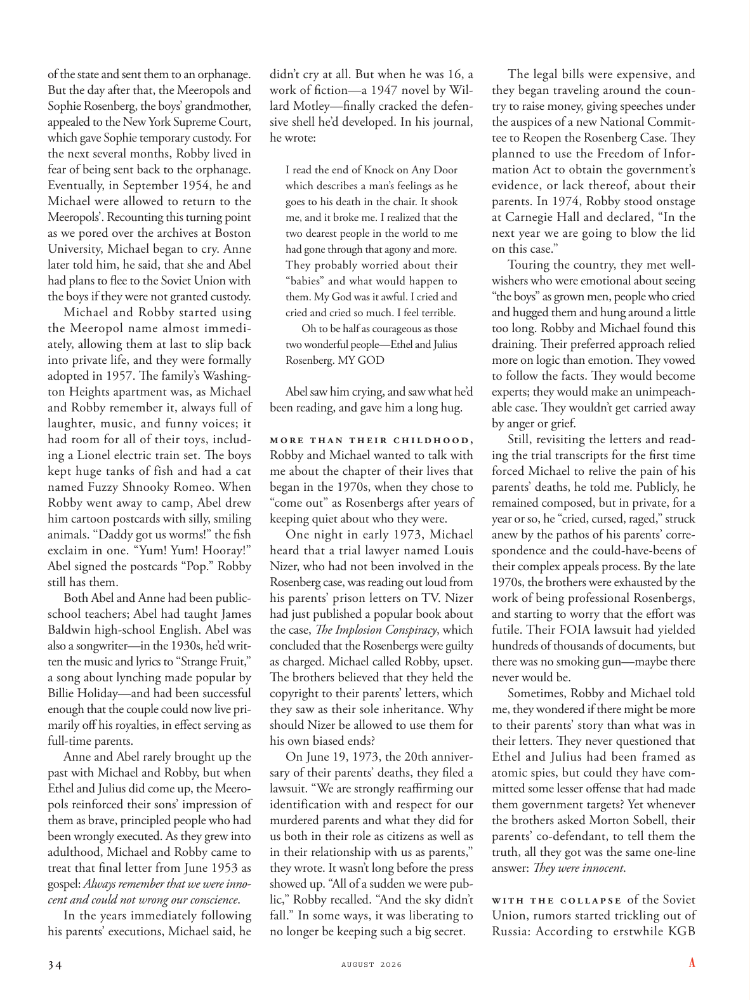

# The Atlantic — August 2026

## Page 36

---

of the state and sent them to an orphanage. But the day after that, the Meeropols and Sophie Rosenberg, the boys’ grandmother, appealed to the New York Supreme Court, which gave Sophie temporary custody. For the next several months, Robby lived in fear of being sent back to the orphanage.

**【中文翻译】** 国家并把他们送到孤儿院。但第二天，米罗波尔夫妇和孩子们的祖母索菲·罗森伯格向纽约最高法院提出上诉，最高法院给予了索菲临时监护权。接下来的几个月里，罗比一直生活在被送回孤儿院的恐惧之中。

Eventually, in September 1954, he and Michael were allowed to return to the Meeropols’. Recounting this turning point as we pored over the archives at Boston University, Michael began to cry. Anne later told him, he said, that she and Abel had plans to flee to the Soviet Union with the boys if they were not granted custody.

**【中文翻译】** 最终，1954 年 9 月，他和迈克尔被允许返回米罗波尔。当我们仔细研究波士顿大学的档案时，迈克尔回忆起这一转折点，他哭了起来。他说，安妮后来告诉他，如果不获得监护权，她和亚伯计划带着孩子们逃到苏联。

Michael and Robby started using the Meeropol name almost immediately, allowing them at last to slip back into private life, and they were formally adopted in 1957. The family’s Washington Heights apartment was, as Michael and Robby remember it, always full of laughter, music, and funny voices; it had room for all of their toys, including a Lionel electric train set. The boys kept huge tanks of fish and had a cat named Fuzzy Shnooky Romeo. When Robby went away to camp, Abel drew him cartoon postcards with silly, smiling animals. “Daddy got us worms!” the fish exclaim in one. “Yum! Yum! Hooray!”

**【中文翻译】** 迈克尔和罗比几乎立即开始使用米罗波尔这个名字，最终让他们回归私人生活，并于 1957 年被正式收养。正如迈克尔和罗比记忆中的那样，他们家位于华盛顿高地的公寓总是充满笑声、音乐和有趣的声音；它有足够的空间容纳他们所有的玩具，包括莱昂内尔电动火车套装。男孩们养了很多鱼，还养了一只名叫毛毛·史努基·罗密欧的猫。当罗比去露营时，亚伯给他画了一些卡通明信片，上面画着傻乎乎、微笑着的动物。 “爸爸给我们带来了虫子！”鱼儿齐声惊呼。 “嗯！嗯！万岁！”

Abel signed the postcards “Pop.” Robby still has them. Both Abel and Anne had been publicschool teachers; Abel had taught James Baldwin high-school English. Abel was also a song writer— in the 1930s, he’d written the music and lyrics to “Strange Fruit,” a song about lynching made popular by Billie Holiday— and had been successful enough that the couple could now live primarily off his royalties, in effect serving as full-time parents.

**【中文翻译】** 阿贝尔在明信片上签下了“Pop”。罗比还留着它们。亚伯和安妮都曾是公立学校的教师。阿贝尔曾教詹姆斯·鲍德温高中英语。埃布尔还是一名歌曲作家，在 20 世纪 30 年代，他为《奇怪的水果》创作了音乐和歌词，这首关于私刑的歌曲因比莉·哈乐黛而广受欢迎，他的成功足以让这对夫妇现在主要靠他的版税生活，实际上是全职父母。

Anne and Abel rarely brought up the past with Michael and Robby, but when Ethel and Julius did come up, the Meeropols reinforced their sons’ impression of them as brave, principled people who had been wrongly executed. As they grew into adulthood, Michael and Robby came to treat that final letter from June 1953 as gospel: Always remember that we were innocent and could not wrong our conscience .

**【中文翻译】** 安妮和亚伯很少与迈克尔和罗比提起过去的事情，但当埃塞尔和朱利叶斯确实提起时，米罗波尔夫妇强化了儿子们对他们的印象，认为他们是勇敢、有原则的人，但却被错误处决了。随着成年，迈克尔和罗比开始将 1953 年 6 月的最后一封信视为福音：永远记住，我们是无辜的，不能辜负我们的良心。

In the years immediately following his parents’ executions, Michael said, he didn’t cry at all. But when he was 16, a work of fiction— a 1947 novel by Willard Motley— finally cracked the defensive shell he’d developed. In his journal, he wrote: I read the end of Knock on Any Door which describes a man’s feelings as he goes to his death in the chair. It shook me, and it broke me. I realized that the two dearest people in the world to me had gone through that agony and more.

**【中文翻译】** 迈克尔说，在他父母被处决后的几年里，他根本没有哭过。但当他 16 岁时，一部小说——威拉德·莫特利 1947 年的小说——终于打破了他所形成的防御外壳。他在日记中写道： 我读到了《敲任何门》的结尾，它描述了一个人在椅子上走向死亡时的感受。它震撼了我，也让我心碎。我意识到世界上我最亲爱的两个人已经经历了那种痛苦和更多。

They probably worried about their “babies” and what would happen to them. My God was it awful. I cried and cried and cried so much. I feel terrible.

**【中文翻译】** 他们可能担心他们的“孩子”以及他们会发生什么。天哪，太可怕了。我哭了，哭了，哭得很厉害。我感觉很糟糕。

Oh to be half as courageous as those two wonderful people—Ethel and Julius Rosenberg. MY GOD Abel saw him crying, and saw what he’d been reading, and gave him a long hug.

**【中文翻译】** 噢，要有埃塞尔和朱利叶斯·罗森伯格这两个出色的人一半的勇气。我的上帝，亚伯看到他在哭，也看到他正在读的内容，给了他一个长长的拥抱。

More than their childhood, Robby and Michael wanted to talk with me about the chapter of their lives that began in the 1970s, when they chose to “come out” as Rosenbergs after years of keeping quiet about who they were.

**【中文翻译】** 罗比和迈克尔不仅想和我谈谈他们的童年，还想和我谈谈他们从 20 世纪 70 年代开始的人生篇章，当时他们在多年对自己的身份保持沉默后选择以罗森伯格夫妇的身份“出柜”。

One night in early 1973, Michael heard that a trial lawyer named Louis Nizer, who had not been involved in the Rosenberg case, was reading out loud from his parents’ prison letters on TV. Nizer had just published a popular book about the case, The Implosion Conspiracy , which concluded that the Rosenbergs were guilty as charged. Michael called Robby, upset.

**【中文翻译】** 1973 年初的一个晚上，迈克尔听说一位名叫路易斯·尼泽 (Louis Nizer) 的出庭律师（未参与罗森伯格案）正在电视上大声朗读他父母的监狱信件。尼泽刚刚出版了一本关于此案的畅销书《内爆阴谋》，该书的结论是罗森伯格夫妇有罪。迈克尔心烦意乱地给罗比打电话。

The brothers believed that they held the copyright to their parents’ letters, which they saw as their sole inheritance. Why should Nizer be allowed to use them for his own biased ends?

**【中文翻译】** 兄弟俩相信他们拥有父母信件的版权，他们认为这是他们唯一的遗产。为什么尼泽尔应该被允许将它们用于他自己的偏见目的？

On June 19, 1973, the 20th anniversary of their parents’ deaths, they filed a lawsuit. “We are strongly reaffirming our identification with and respect for our murdered parents and what they did for us both in their role as citizens as well as in their relationship with us as parents,” they wrote. It wasn’t long before the press showed up. “All of a sudden we were public,” Robby recalled. “And the sky didn’t fall.” In some ways, it was liberating to no longer be keeping such a big secret.

**【中文翻译】** 1973年6月19日，即父母去世20周年纪念日，他们提起诉讼。他们写道：“我们强烈重申我们对被谋杀的父母的认同和尊重，以及他们作为公民的角色以及他们作为父母与我们的关系为我们所做的一切。”没过多久，媒体就出现了。 “突然间我们就公开了，”罗比回忆道。 “天并没有塌下来。”从某些方面来说，不再保守这么大的秘密是一种解放。

The legal bills were expensive, and they began traveling around the country to raise money, giving speeches under the auspices of a new National Committee to Reopen the Rosenberg Case. They planned to use the Freedom of Information Act to obtain the government’s evidence, or lack thereof, about their parents. In 1974, Robby stood onstage at Carnegie Hall and declared, “In the next year we are going to blow the lid on this case.”

**【中文翻译】** 法律费用昂贵，他们开始在全国各地筹集资金，并在新成立的重新审理罗森伯格案全国委员会的主持下发表演讲。他们计划利用《信息自由法》来获取政府关于他们父母的证据或缺乏证据。 1974 年，罗比站在卡内基音乐厅的舞台上宣布：“明年我们将揭开这个案子。”

Touring the country, they met wellwishers who were emotional about seeing “the boys” as grown men, people who cried and hugged them and hung around a little too long. Robby and Michael found this draining. Their preferred approach relied more on logic than emotion. They vowed to follow the facts. They would become experts; they would make an unimpeachable case. They wouldn’t get carried away by anger or grief.

**【中文翻译】** 在全国各地巡回演出时，他们遇到了一些祝福者，他们对看到“男孩”成为成年男子感到激动，他们哭泣、拥抱他们，并在他们身边逗留了太久。罗比和迈克尔发现这让人筋疲力尽。他们更喜欢的方法更多地依赖逻辑而不是情感。他们发誓要遵循事实。他们会成为专家；他们会做出无懈可击的案子。他们不会被愤怒或悲伤冲昏头脑。

Still, revisiting the letters and reading the trial transcripts for the first time forced Michael to relive the pain of his parents’ deaths, he told me. Publicly, he remained composed, but in private, for a year or so, he “cried, cursed, raged,” struck anew by the pathos of his parents’ correspondence and the could-have-beens of their complex appeals process. By the late 1970s, the brothers were exhausted by the work of being professional Rosenbergs, and starting to worry that the effort was futile. Their FOIA lawsuit had yielded hundreds of thousands of documents, but there was no smoking gun— maybe there never would be.

**【中文翻译】** 尽管如此，迈克尔告诉我，重新审视这些信件并第一次阅读审判笔录仍迫使他重温父母去世的痛苦。在公开场合，他保持镇静，但在私下里，大约一年的时间里，他“哭泣、咒骂、愤怒”，再次被父母信件中的悲情和复杂的上诉过程所震惊。到了 20 世纪 70 年代末，兄弟俩因成为专业罗森伯格夫妇的工作而精疲力尽，并开始担心这些努力是徒劳的。他们的《信息自由法》诉讼已经产生了数十万份文件，但没有确凿的证据——也许永远不会有。

Sometimes, Robby and Michael told me, they wondered if there might be more to their parents’ story than what was in their letters. They never questioned that Ethel and Julius had been framed as atomic spies, but could they have committed some lesser offense that had made them government targets? Yet whenever the brothers asked Morton Sobell, their parents’ co-defendant, to tell them the truth, all they got was the same one-line answer: They were innocent . With the collapse of the Soviet Union, rumors started trickling out of Russia: According to erstwhile KGB

**【中文翻译】** 罗比和迈克尔告诉我，有时候，他们想知道父母的故事是否比他们信中的内容更多。他们从未质疑过埃塞尔和朱利叶斯被陷害为原子间谍，但他们是否可能犯下了一些较轻的罪行，导致他们成为政府的目标？然而，每当兄弟俩要求父母的同案被告莫顿·索贝尔告诉他们真相时，他们得到的只是同样一句话的答案：他们是无辜的。随着苏联解体，谣言开始从俄罗斯传出：根据前克格勃的说法
