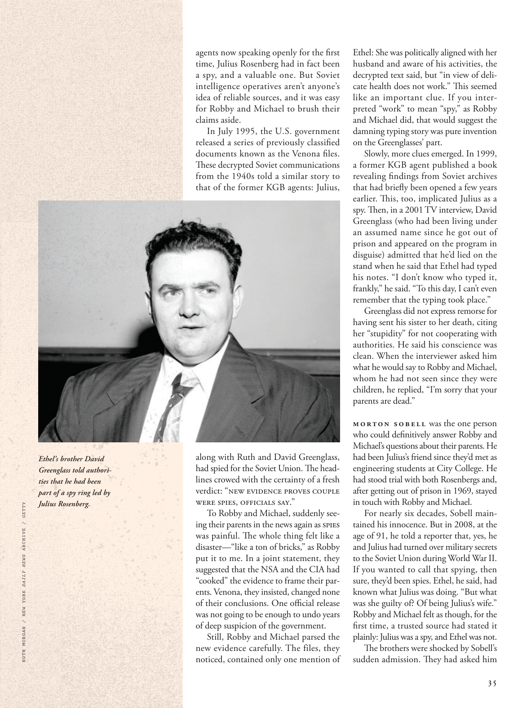

# The Atlantic — August 2026

## Page 37

---

Ethel’s brother David Greenglass told authorities that he had been part of a spy ring led by Julius Rosenberg.

**【中文翻译】** 埃塞尔的兄弟大卫·格林格拉斯告诉当局，他是朱利叶斯·罗森伯格领导的间谍团伙的成员。

*RUTH MORGAN / NEW YORK DAILY NEWS ARCHIVE / GETTY*

*【图注与署名】露丝·摩根/纽约每日新闻档案/盖蒂图片社*

*ART / PHOTO CREDIT TK*

*【图注与署名】艺术/照片来源 TK*

agents now speaking openly for the first time, Julius Rosenberg had in fact been a spy, and a valuable one. But Soviet intelligence operatives aren’t anyone’s idea of reliable sources, and it was easy for Robby and Michael to brush their claims aside.

**【中文翻译】** 特工们现在第一次公开发言，朱利叶斯·罗森伯格实际上是一名间谍，而且是一名有价值的间谍。但苏联情报人员并不是任何人心目中的可靠消息来源，罗比和迈克尔很容易忽视他们的说法。

In July 1995, the U.S. government released a series of previously classifi ed documents known as the Venona files. These de crypted Soviet communications from the 1940s told a similar story to that of the former KGB agents: Julius, along with Ruth and David Greenglass, had spied for the Soviet Union. The headlines crowed with the certainty of a fresh verdict: “NEW EVIDENCE PROVES COUPLE WERE SPIES, OFFICIALS SAY.”

**【中文翻译】** 1995 年 7 月，美国政府公布了一系列先前被列为机密的文件，即维诺纳档案。这些解密的 20 世纪 40 年代的苏联通讯讲述了与前克格勃特工类似的故事：朱利叶斯与露丝和大卫·格林格拉斯一起为苏联从事间谍活动。头条新闻充斥着新判决的确定性：“官员称，新证据证明这对夫妇是间谍。”

To Robby and Michael, suddenly seeing their parents in the news again as spies was painful. The whole thing felt like a disaster— “like a ton of bricks,” as Robby put it to me. In a joint statement, they suggested that the NSA and the CIA had “cooked” the evidence to frame their parents. Venona, they insisted, changed none of their conclusions. One offi cial release was not going to be enough to undo years of deep suspicion of the government.

**【中文翻译】** 对于罗比和迈克尔来说，突然再次在新闻中看到他们的父母成为间谍是痛苦的。整件事感觉就像一场灾难——“就像一堆砖头”，正如罗比对我所说的那样。在一份联合声明中，他们暗示美国国家安全局和中央情报局“伪造”了陷害他们父母的证据。他们坚称，维诺纳没有改变他们的任何结论。一次官方发布不足以消除多年来对政府的深深怀疑。

Still, Robby and Michael parsed the new evidence carefully. The files, they noticed, contained only one mention of Ethel: She was politically aligned with her husband and aware of his activities, the de crypted text said, but “in view of delicate health does not work.” This seemed like an important clue. If you interpreted “work” to mean “spy,” as Robby and Michael did, that would suggest the damning typing story was pure invention on the Green glasses’ part.

**【中文翻译】** 尽管如此，罗比和迈克尔还是仔细分析了新证据。他们注意到，这些文件只提到了埃塞尔一处：解密文本称，她在政治上与丈夫保持一致，并了解他的活动，但“鉴于她健康状况不佳，这不起作用”。这似乎是一个重要的线索。如果你像罗比和迈克尔那样将“工作”解释为“间谍”，那就表明该死的打字故事纯粹是绿眼镜的发明。

Slowly, more clues emerged. In 1999, a former KGB agent published a book revealing findings from Soviet archives that had briefly been opened a few years earlier. Th is, too, implicated Julius as a spy. Th en, in a 2001 TV interview, David Greenglass (who had been living under an assumed name since he got out of prison and appeared on the program in disguise) admitted that he’d lied on the stand when he said that Ethel had typed his notes. “I don’t know who typed it, frankly,” he said. “To this day, I can’t even remember that the typing took place.”

**【中文翻译】** 慢慢地，更多的线索出现了。 1999 年，一名前克格勃特工出版了一本书，揭示了几年前曾短暂公开的苏联档案的调查结果。这也暗示朱利叶斯是间谍。然后，在 2001 年的一次电视采访中，大卫·格林格拉斯（出狱后一直化名并乔装出现在节目中）承认，当他说埃塞尔打下了他的笔记时，他在证人席上撒了谎。 “坦白说，我不知道是谁打的，”他说。 “直到今天，我什至都不记得打字的过程了。”

Greenglass did not express remorse for having sent his sister to her death, citing her “stupidity” for not cooperating with authorities. He said his conscience was clean. When the interviewer asked him what he would say to Robby and Michael, whom he had not seen since they were children, he replied, “I’m sorry that your parents are dead.”

**【中文翻译】** 格林格拉斯没有对送死妹妹表示悔恨，称她不与当局合作是“愚蠢”的。他说他的良心是清白的。当采访者问他会对从小就没见过的罗比和迈克尔说些什么时，他回答说：“我很遗憾你的父母去世了。”

Morton Sobell was the one person who could defi nitively answer Robby and Michael’s questions about their parents. He had been Julius’s friend since they’d met as engineering students at City College. He had stood trial with both Rosenbergs and, after getting out of prison in 1969, stayed in touch with Robby and Michael.

**【中文翻译】** 莫顿·索贝尔是能够明确回答罗比和迈克尔有关父母的问题的人。自从他们在城市学院学习工程学时相识以来，他一直是朱利叶斯的朋友。他曾与罗森博格夫妇一起受审，1969 年出狱后，他与罗比和迈克尔保持着联系。

For nearly six decades, Sobell maintained his innocence. But in 2008, at the age of 91, he told a reporter that, yes, he and Julius had turned over military secrets to the Soviet Union during World War II.

**【中文翻译】** 近六十年来，索贝尔一直坚称自己是清白的。但在 2008 年，91 岁的他告诉记者，是的，他和朱利叶斯在二战期间向苏联移交了军事机密。

If you wanted to call that spying, then sure, they’d been spies. Ethel, he said, had known what Julius was doing. “But what was she guilty of? Of being Julius’s wife.”

**【中文翻译】** 如果你想称其为间谍，那么当然，他们就是间谍。他说，埃塞尔知道朱利叶斯在做什么。 “但是她有什么罪呢？作为朱利叶斯的妻子。”

Robby and Michael felt as though, for the first time, a trusted source had stated it plainly: Julius was a spy, and Ethel was not. The brothers were shocked by Sobell’s sudden admission. They had asked him

**【中文翻译】** 罗比和迈克尔感觉好像第一次有一个值得信赖的消息来源清楚地表明了这一点：朱利叶斯是间谍，而埃塞尔不是。索贝尔的突然承认让兄弟俩感到震惊。他们曾问过他
