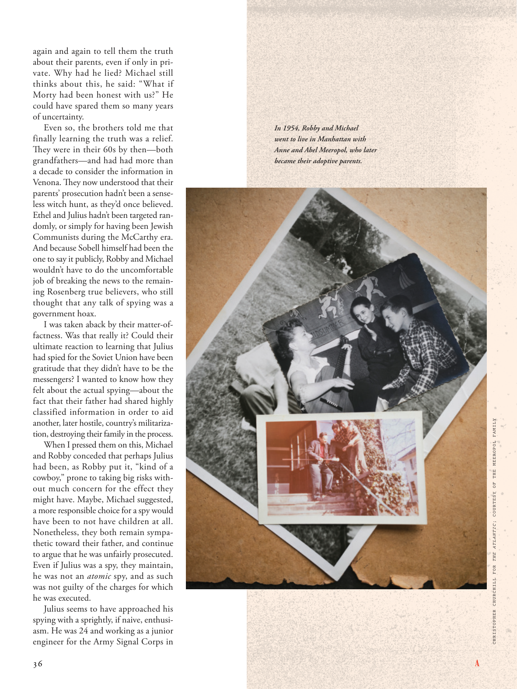

# The Atlantic — August 2026

## Page 38

---

again and again to tell them the truth about their parents, even if only in private. Why had he lied? Michael still thinks about this, he said: “What if Morty had been honest with us?” He could have spared them so many years of uncertainty.

**【中文翻译】** 一次又一次地告诉他们有关父母的真相，即使只是私下里。他为什么撒谎？迈克尔仍然在想这件事，他说：“如果莫蒂对我们诚实怎么办？”他本可以让他们免受这么多年的不确定性。

Even so, the brothers told me that finally learning the truth was a relief. They were in their 60s by then— both grandfathers— and had had more than a decade to consider the information in Venona. They now understood that their parents’ prosecution hadn’t been a senseless witch hunt, as they’d once believed.

**【中文翻译】** 即便如此，兄弟们告诉我，终于得知真相还是一种解脱。那时他们已经 60 多岁了——都是祖父——并且有十多年的时间来考虑维诺纳的信息。他们现在明白了，他们父母的起诉并不是像他们曾经认为的那样是一场毫无意义的政治迫害。

Ethel and Julius hadn’t been targeted randomly, or simply for having been Jewish Communists during the McCarthy era. And because Sobell himself had been the one to say it publicly, Robby and Michael wouldn’t have to do the uncomfortable job of breaking the news to the remaining Rosenberg true believers, who still thought that any talk of spying was a government hoax.

**【中文翻译】** 埃塞尔和朱利叶斯并不是随机成为攻击目标的，也不是仅仅因为他们是麦卡锡时代的犹太共产主义者。而且因为索贝尔本人就是公开说出这件事的人，所以罗比和迈克尔不必向剩下的罗森伯格忠实信徒透露这一消息，他们仍然认为任何有关间谍活动的言论都是政府的骗局，这让他们感到不舒服。

I was taken aback by their matter-offactness. Was that really it? Could their ultimate reaction to learning that Julius had spied for the Soviet Union have been gratitude that they didn’t have to be the messengers? I wanted to know how they felt about the actual spying— about the fact that their father had shared highly classified information in order to aid another, later hostile, country’s militarization, destroying their family in the process.

**【中文翻译】** 他们的实事求是让我大吃一惊。真的是这样吗？当他们得知朱利叶斯为苏联从事间谍活动时，他们的最终反应是否会感激他们不必成为信使？我想知道他们对实际的间谍活动有何感想——他们的父亲分享了高度机密的信息，以帮助另一个后来敌对的国家的军事化，并在此过程中摧毁了他们的家庭。

When I pressed them on this, Michael and Robby conceded that perhaps Julius had been, as Robby put it, “kind of a cowboy,” prone to taking big risks without much concern for the effect they might have. Maybe, Michael suggested, a more responsible choice for a spy would have been to not have children at all.

**【中文翻译】** 当我向迈克尔和罗比追问这一点时，他们承认，正如罗比所说，也许朱利叶斯是“有点牛仔”，倾向于承担巨大的风险，而不太关心风险可能产生的影响。迈克尔建议，对于间谍来说，也许更负责任的选择就是根本不生孩子。

Nonetheless, they both remain sympathetic toward their father, and continue to argue that he was unfairly prosecuted. Even if Julius was a spy, they maintain, he was not an atomic spy, and as such was not guilty of the charges for which he was executed.

**【中文翻译】** 尽管如此，他们仍然同情他们的父亲，并继续认为他受到了不公平的起诉。他们坚持认为，即使朱利叶斯是间谍，他也不是原子间谍，因此他并没有犯下被处决的罪名。

Julius seems to have approached his spying with a sprightly, if naive, enthusiasm. He was 24 and working as a junior engineer for the Army Signal Corps in In 1954, Robby and Michael went to live in Manhattan with Anne and Abel Meeropol, who later became their adoptive parents.

**【中文翻译】** 朱利叶斯似乎以一种活泼但天真的热情来从事他的间谍活动。 1954 年，罗比和迈克尔 24 岁，在陆军通信兵团担任初级工程师，与安妮和阿贝尔·梅罗波尔一起住在曼哈顿，安妮和阿贝尔·梅罗波尔后来成为了他们的养父母。

*CHRISTOPHER CHURCHILL FOR THE ATLANTIC ; COURTESY OF THE MEEROPOL FAMILY*

*【图注与署名】大西洋的克里斯托弗·丘吉尔；由米罗波尔家族提供*
