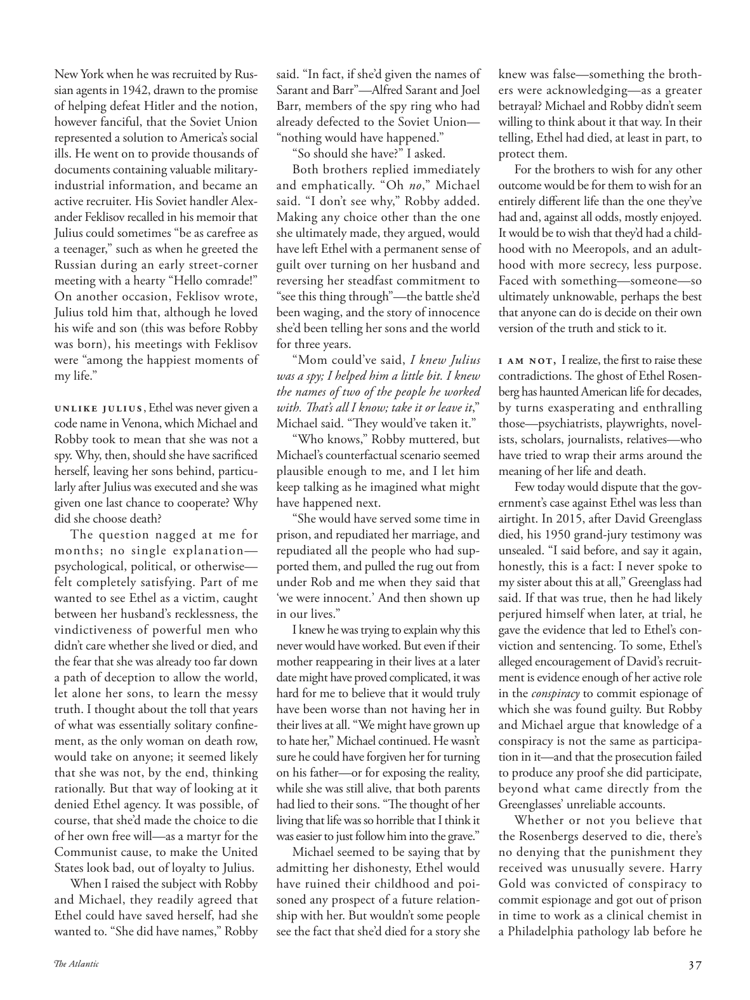

# The Atlantic — August 2026

## Page 39

---

New York when he was recruited by Russian agents in 1942, drawn to the promise of helping defeat Hitler and the notion, however fanciful, that the Soviet Union represented a solution to America’s social ills. He went on to provide thousands of documents containing valuable militaryindustrial information, and became an active recruiter. His Soviet handler Alexander Feklisov recalled in his memoir that Julius could sometimes “be as carefree as a teenager,” such as when he greeted the Russian during an early street-corner meeting with a hearty “Hello comrade!”

**【中文翻译】** 1942 年，他被俄罗斯特工招募，被俄罗斯特工招募，当时他被帮助打败希特勒的承诺以及苏联代表解决美国社会弊病的想法（无论多么幻想）所吸引。他继续提供了数千份包含有价值的军事工业信息的文件，并成为一名积极的招募人员。他的苏联经纪人亚历山大·费克利索夫（Alexander Feklisov）在回忆录中回忆道，朱利叶斯有时“像青少年一样无忧无虑”，例如当他在一次早期的街角会议上热情地向俄罗斯人打招呼时，“你好，同志！”

On another occasion, Feklisov wrote, Julius told him that, although he loved his wife and son (this was before Robby was born), his meetings with Feklisov were “among the happiest moments of my life.”

**【中文翻译】** 费克利索夫写道，在另一个场合，朱利叶斯告诉他，尽管他爱他的妻子和儿子（这是在罗比出生之前），但他与费克利索夫的会面是“我一生中最幸福的时刻之一”。

Unlike Julius , Ethel was never given a code name in Venona, which Michael and Robby took to mean that she was not a spy. Why, then, should she have sacrificed herself, leaving her sons behind, particularly after Julius was executed and she was given one last chance to cooperate? Why did she choose death?

**【中文翻译】** 与朱利叶斯不同，埃塞尔在维诺纳从未获得过代号，迈克尔和罗比认为这意味着她不是间谍。那么，为什么她应该牺牲自己，留下她的儿子们，特别是在朱利叶斯被处决并且她得到了最后一次合作的机会之后呢？她为何选择死亡？

The question nagged at me for months; no single explanation— psychological, political, or otherwise— felt completely satisfying. Part of me wanted to see Ethel as a victim, caught between her husband’s recklessness, the vindictive ness of powerful men who didn’t care whether she lived or died, and the fear that she was already too far down a path of deception to allow the world, let alone her sons, to learn the messy truth. I thought about the toll that years of what was essentially solitary confinement, as the only woman on death row, would take on anyone; it seemed likely that she was not, by the end, thinking rationally. But that way of looking at it denied Ethel agency. It was possible, of course, that she’d made the choice to die of her own free will— as a martyr for the Communist cause, to make the United States look bad, out of loyalty to Julius.

**【中文翻译】** 这个问题困扰了我好几个月。没有任何一种解释——无论是心理上的、政治上的还是其他方面的——让人感到完全满意。我的一部分希望将埃塞尔视为受害者，她夹在丈夫的鲁莽、有权势的男人不关心她生死的报复心以及担心她已经在欺骗的道路上走得太远，以至于无法让世界，更不用说她的儿子们，了解混乱的真相之间。我想到了作为死囚牢房中唯一的女性，多年来本质上是单独监禁的生活会给任何人带来的损失；到最后，她似乎并没有进行理性思考。但这种看待它的方式否定了埃塞尔的代理权。当然，她也有可能出于自己的自由意志而选择死亡——作为共产主义事业的烈士，为了让美国看起来很糟糕，出于对朱利叶斯的忠诚。

When I raised the subject with Robby and Michael, they readily agreed that Ethel could have saved herself, had she wanted to. “She did have names,” Robby said. “In fact, if she’d given the names of Sarant and Barr”— Alfred Sarant and Joel Barr, members of the spy ring who had already defected to the Soviet Union— “nothing would have happened.”

**【中文翻译】** 当我向罗比和迈克尔提出这个话题时，他们欣然同意，如果埃塞尔愿意的话，她本可以拯救自己。 “她确实有名字，”罗比说。 “事实上，如果她说出萨兰特和巴尔的名字——阿尔弗雷德·萨兰特和乔尔·巴尔，他们是已经叛逃到苏联的间谍团伙成员——“什么都不会发生。”

“So should she have?” I asked. Both brothers replied immediately and emphatically. “Oh no ,” Michael said. “I don’t see why,” Robby added. Making any choice other than the one she ultimately made, they argued, would have left Ethel with a permanent sense of guilt over turning on her husband and reversing her steadfast commitment to “see this thing through”—the battle she’d been waging, and the story of innocence she’d been telling her sons and the world for three years.

**【中文翻译】** “那她应该这么做吗？”我问。兄弟俩立即斩钉截铁地回答道。 “哦，不，”迈克尔说。 “我不明白为什么，”罗比补充道。他们认为，除了她最终做出的选择之外，做出任何选择都会让埃塞尔永远感到内疚，因为她背叛了她的丈夫，并违背了她“坚持到底”的坚定承诺——她一直在进行的斗争，以及她三年来一直向儿子们和全世界讲述的纯真故事。

“Mom could’ve said, I knew Julius was a spy; I helped him a little bit. I knew the names of two of the people he worked with. That’s all I know; take it or leave it ,” Michael said. “They would’ve taken it.”

**【中文翻译】** “妈妈可以说，我知道朱利叶斯是一名间谍；我帮了他一点忙。我知道与他共事的两个人的名字。这就是我所知道的；要么接受要么放弃，”迈克尔说。 “他们会接受的。”

“Who knows,” Robby muttered, but Michael’s counter factual scenario seemed plausible enough to me, and I let him keep talking as he imagined what might have happened next.

**【中文翻译】** “谁知道呢，”罗比嘀咕道，但迈克尔的反事实情景对我来说似乎很合理，我让他继续说下去，让他想象接下来可能发生的事情。

“She would have served some time in prison, and repudiated her marriage, and repudiated all the people who had supported them, and pulled the rug out from under Rob and me when they said that ‘we were innocent.’ And then shown up in our lives.”

**【中文翻译】** “她会在监狱里服刑一段时间，否认自己的婚姻，否认所有支持他们的人，当罗布和我说‘我们是无辜的’时，她就会从他们身边撤走。然后出现在我们的生活中。”

I knew he was trying to explain why this never would have worked. But even if their mother reappearing in their lives at a later date might have proved complicated, it was hard for me to believe that it would truly have been worse than not having her in their lives at all. “We might have grown up to hate her,” Michael continued. He wasn’t sure he could have forgiven her for turning on his father—or for exposing the reality, while she was still alive, that both parents had lied to their sons. “The thought of her living that life was so horrible that I think it was easier to just follow him into the grave.”

**【中文翻译】** 我知道他是想解释为什么这行不通。但即使他们的母亲稍后再次出现在他们的生活中可能会变得很复杂，我也很难相信这真的会比没有她在他们的生活中更糟糕。 “我们长大后可能会讨厌她，”迈克尔继续说道。他不确定自己能否原谅她背叛他的父亲，或者在她还活着的时候揭露了父母双方都对儿子撒谎的事实。 “一想到她过着那样的生活就太可怕了，我认为跟随他进入坟墓会更容易。”

Michael seemed to be saying that by admitting her dishonesty, Ethel would have ruined their childhood and poisoned any prospect of a future relationship with her. But wouldn’t some people see the fact that she’d died for a story she knew was false— something the brothers were acknowledging— as a greater betrayal? Michael and Robby didn’t seem willing to think about it that way. In their telling, Ethel had died, at least in part, to protect them.

**【中文翻译】** 迈克尔似乎在说，如果埃塞尔承认自己的不诚实，就会毁掉他们的童年，并毒害与她未来关系的任何前景。但难道有些人不会认为她为一个她明知是假的故事而死——兄弟们也承认这一点——是更大的背叛吗？迈克尔和罗比似乎不愿意这样想。在他们的讲述中，埃塞尔的死，至少部分是为了保护他们。

For the brothers to wish for any other outcome would be for them to wish for an entirely different life than the one they’ve had and, against all odds, mostly enjoyed.

**【中文翻译】** 对于兄弟俩来说，如果他们希望有任何其他结果，那就意味着他们希望过一种与他们现在所拥有的完全不同的生活，尽管困难重重，但他们大多都享受着这种生活。

It would be to wish that they’d had a childhood with no Meeropols, and an adulthood with more secrecy, less purpose. Faced with something— someone— so ultimately unknowable, perhaps the best that anyone can do is decide on their own version of the truth and stick to it.

**【中文翻译】** 他们希望他们的童年没有米罗波尔，成年后更加隐秘，更少目标。面对某些事——某个人——最终是不可知的，也许任何人能做的最好的事情就是决定自己对真相的看法并坚持下去。

I am not, I realize, the first to raise these contradictions. The ghost of Ethel Rosenberg has haunted American life for decades, by turns exasperating and enthralling those— psychiatrists, playwrights, novelists, scholars, journalists, relatives— who have tried to wrap their arms around the meaning of her life and death.

**【中文翻译】** 我意识到，我并不是第一个提出这些矛盾的人。埃塞尔·罗森伯格的幽灵几十年来一直困扰着美国人的生活，时而让那些试图理解她生与死意义的人——精神病学家、剧作家、小说家、学者、记者、亲戚——感到愤怒和着迷。

Few today would dispute that the government’s case against Ethel was less than airtight. In 2015, after David Greenglass died, his 1950 grand-jury testimony was unsealed. “I said before, and say it again, honestly, this is a fact: I never spoke to my sister about this at all,” Greenglass had said. If that was true, then he had likely perjured himself when later, at trial, he gave the evidence that led to Ethel’s conviction and sentencing. To some, Ethel’s alleged encouragement of David’s recruitment is evidence enough of her active role in the conspiracy to commit espionage of which she was found guilty. But Robby and Michael argue that knowledge of a conspiracy is not the same as participation in it— and that the prosecution failed to produce any proof she did participate, beyond what came directly from the Green glasses’ unreliable accounts.

**【中文翻译】** 如今，很少有人会质疑政府针对埃塞尔的指控并非无懈可击。 2015 年，大卫·格林格拉斯去世后，他 1950 年的大陪审团证词被公开。 “我之前说过，再说一遍，老实说，这是事实：我从来没有和我姐姐谈过这件事，”格林格拉斯说道。如果这是真的，那么他很可能在后来的审判中提供了导致埃塞尔定罪和判刑的证据时作了伪证。对一些人来说，埃塞尔所谓鼓励招募大卫的行为足以证明她在间谍活动中发挥了积极作用，并被判有罪。但罗比和迈克尔辩称，了解阴谋并不等同于参与阴谋——除了直接来自绿眼镜不可靠账户的证据之外，检方未能提供任何她参与阴谋的证据。

Whether or not you believe that the Rosenbergs deserved to die, there’s no denying that the punishment they received was unusually severe. Harry Gold was convicted of conspiracy to commit espionage and got out of prison in time to work as a clinical chemist in a Philadelphia pathology lab before he

**【中文翻译】** 无论你是否认为罗森博格一家该死，不可否认的是，他们受到的惩罚异常严厉。哈里·戈尔德 (Harry Gold) 被判串谋从事间谍活动，并及时出狱，在费城病理实验室担任临床化学家，之后才进入费城病理实验室。
