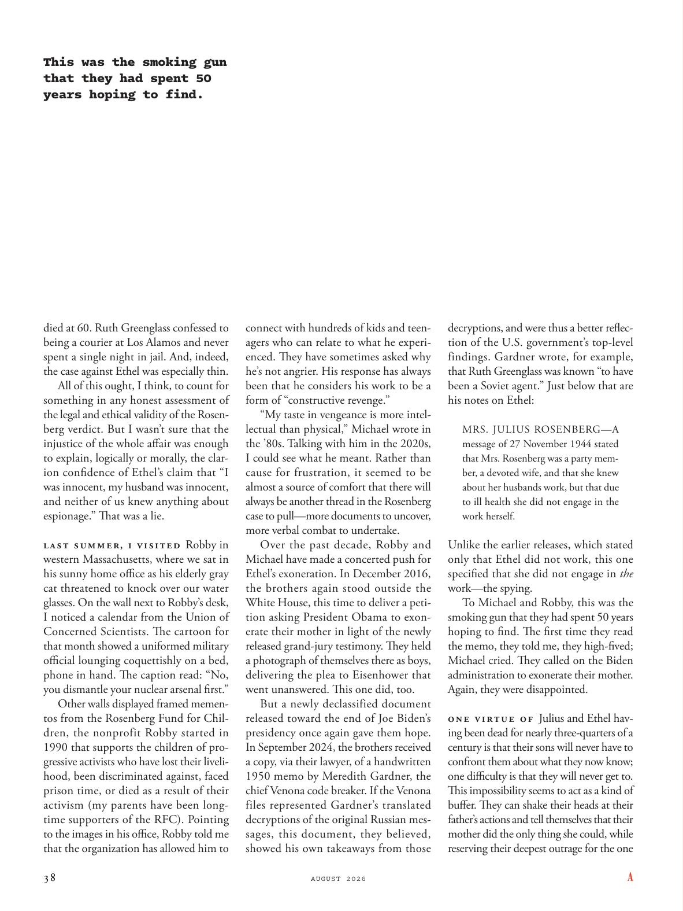

# The Atlantic — August 2026

## Page 40

---

This was the smoking gun that they had spent 50 years hoping to find. died at 60. Ruth Greenglass confessed to being a courier at Los Alamos and never spent a single night in jail. And, indeed, the case against Ethel was especially thin.

**【中文翻译】** 这就是他们花了 50 年希望找到的确凿证据。去世时享年 60 岁。露丝·格林格拉斯 (Ruth Greenglass) 承认自己是洛斯阿拉莫斯的一名信使，从未在监狱里度过过一夜。事实上，针对埃塞尔的案件尤其薄弱。

All of this ought, I think, to count for something in any honest assessment of the legal and ethical validity of the Rosenberg verdict. But I wasn’t sure that the injustice of the whole affair was enough to explain, logically or morally, the clarion confidence of Ethel’s claim that “I was innocent, my husband was innocent, and neither of us knew anything about espionage.” That was a lie.

**【中文翻译】** 我认为，所有这些都应该在对罗森伯格判决的法律和道德有效性的诚实评估中发挥作用。但我不确定整个事件的不公正是否足以从逻辑上或道德上解释埃塞尔声称“我是无辜的，我丈夫是无辜的，我们俩对间谍活动一无所知”的自信。那是一个谎言。

Last summer, I visited Robby in

**【中文翻译】** 去年夏天，我拜访了罗比

*— western Massachusetts, where we sat in*

*【作者署名】马萨诸塞州西部，我们坐在的地方*

his sunny home office as his elderly gray cat threatened to knock over our water glasses. On the wall next to Robby’s desk, I noticed a calendar from the Union of Concerned Scientists. The cartoon for that month showed a uniformed military official lounging coquettishly on a bed, phone in hand. The caption read: “No, you dismantle your nuclear arsenal first.”

**【中文翻译】** 他阳光明媚的家庭办公室，他那只年迈的灰猫威胁要打翻我们的水杯。在罗比桌子旁边的墙上，我注意到忧思科学家联盟的日历。当月的漫画展示了一名身穿制服的军官，手里拿着电话，风骚地躺在床上。标题写着：“不，你先拆除你的核武库。”

Other walls displayed framed mementos from the Rosenberg Fund for Children, the nonprofit Robby started in 1990 that supports the children of progressive activists who have lost their livelihood, been discriminated against, faced prison time, or died as a result of their activism (my parents have been longtime supporters of the RFC). Pointing to the images in his office, Robby told me that the organization has allowed him to connect with hundreds of kids and teenagers who can relate to what he experienced. They have sometimes asked why he’s not angrier. His response has always been that he considers his work to be a form of “constructive revenge.”

**【中文翻译】** 其他墙上挂着来自罗森博格儿童基金会的纪念品，这是罗比于 1990 年创立的非营利组织，旨在支持因激进主义而失去生计、受到歧视、面临牢狱之灾或死亡的进步活动家的孩子（我的父母一直是 RFC 的长期支持者）。罗比指着他办公室里的照片告诉我，这个组织让他能够与数百名能够理解他经历的孩子和青少年建立联系。他们有时会问他为什么不生气。他的回应一直是，他认为自己的工作是一种“建设性报复”。

“My taste in vengeance is more intellectual than physical,” Michael wrote in the ’80s. Talking with him in the 2020s, I could see what he meant. Rather than cause for frustration, it seemed to be almost a source of comfort that there will always be another thread in the Rosenberg case to pull— more documents to uncover, more verbal combat to undertake.

**【中文翻译】** “我对复仇的兴趣更多的是理智上的，而不是肉体上的，”迈克尔在 80 年代写道。在 2020 年代与他交谈时，我能明白他的意思。罗森伯格案中总会有另一条线索需要拉动——更多的文件需要揭露，更多的口水战需要进行，这似乎不是令人沮丧的原因，而是一种安慰。

Over the past decade, Robby and Michael have made a concerted push for Ethel’s exoneration. In December 2016, the brothers again stood outside the White House, this time to deliver a petition asking President Obama to exonerate their mother in light of the newly released grand-jury testimony. They held a photograph of themselves there as boys, delivering the plea to Eisenhower that went unanswered. This one did, too.

**【中文翻译】** 在过去的十年里，罗比和迈克尔齐心协力推动埃塞尔的无罪释放。 2016 年 12 月，兄弟俩再次站在白宫外，这次是递交请愿书，要求奥巴马总统根据新发布的大陪审团证词为他们的母亲开脱。他们拿着一张自己小时候的照片，向艾森豪威尔提出请求，但没有得到回应。这个也做到了。

But a newly declassified document released toward the end of Joe Biden’s presidency once again gave them hope. In September 2024, the brothers received a copy, via their lawyer, of a hand written 1950 memo by Meredith Gardner, the chief Venona code breaker. If the Venona files represented Gardner’s translated de cryptions of the original Russian messages, this document, they believed, showed his own takeaways from those decryptions, and were thus a better reflection of the U.S. government’s top-level findings. Gardner wrote, for example, that Ruth Greenglass was known “to have been a Soviet agent.” Just below that are his notes on Ethel: MRS. JULIUS ROSENBERG—A message of 27 November 1944 stated that Mrs. Rosenberg was a party member, a devoted wife, and that she knew about her husbands work, but that due to ill health she did not engage in the work herself.

**【中文翻译】** 但乔·拜登总统任期即将结束时公布的一份新解密文件再次给了他们希望。 2024 年 9 月，兄弟俩通过律师收到了一份由首席维诺纳密码破译者梅雷迪思·加德纳 (Meredith Gardner) 于 1950 年手写的备忘录副本。如果维诺纳文件代表了加德纳对原始俄罗斯信息的翻译解密，那么他们相信这份文件显示了他自己从这些解密中得出的结论，因此更好地反映了美国政府高层的调查结果。例如，加德纳写道，露丝·格林格拉斯“曾是一名苏联特工”。下面是他对埃塞尔的笔记：夫人。 朱利叶斯·罗森伯格——1944 年 11 月 27 日的消息称，罗森伯格夫人是一名党员、一位忠诚的妻子，她了解丈夫的工作，但由于健康状况不佳，她自己没有从事这项工作。

Unlike the earlier releases, which stated only that Ethel did not work, this one specified that she did not engage in the work— the spying. To Michael and Robby, this was the smoking gun that they had spent 50 years hoping to find. The first time they read the memo, they told me, they high-fived; Michael cried. They called on the Biden administration to exonerate their mother.

**【中文翻译】** 与之前的版本不同的是，之前的版本只说明埃塞尔没有工作，而这一版本则明确指出她没有从事间谍活动。对于迈克尔和罗比来说，这就是他们花了 50 年希望找到的确凿证据。他们告诉我，第一次读到这份备忘录时，他们击掌；迈克尔哭了。他们呼吁拜登政府为他们的母亲开脱。

Again, they were disappointed. One virtue of Julius and Ethel having been dead for nearly three-quarters of a century is that their sons will never have to confront them about what they now know; one difficulty is that they will never get to.

**【中文翻译】** 他们再次感到失望。朱利叶斯和埃塞尔已经去世近四分之三个世纪了，他们的一个优点是，他们的儿子永远不必面对他们现在所知道的事情；一个困难是他们永远无法到达。

This impossibility seems to act as a kind of buffer. They can shake their heads at their father’s actions and tell themselves that their mother did the only thing she could, while reserving their deepest outrage for the one

**【中文翻译】** 这种不可能性似乎起到了一种缓冲的作用。他们可以对父亲的行为摇头，告诉自己母亲做了她唯一能做的事，同时对父亲保留了最深切的愤怒。
