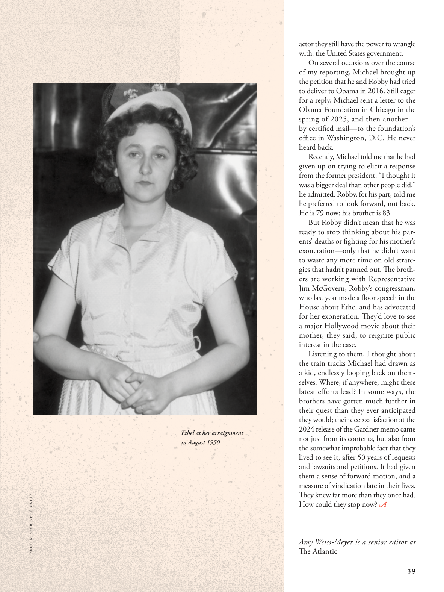

# The Atlantic — August 2026

## Page 41

---

*HULTON ARCHIVE / GETTY*

*【图注与署名】赫尔顿档案馆/盖蒂图片社*

*ART / PHOTO CREDIT TK*

*【图注与署名】艺术/照片来源 TK*

Ethel at her arraign ment in August 1950 actor they still have the power to wrangle with: the United States government. On several occasions over the course of my reporting, Michael brought up the petition that he and Robby had tried to deliver to Obama in 2016. Still eager for a reply, Michael sent a letter to the Obama Foundation in Chicago in the spring of 2025, and then another— by certifi ed mail—to the foundation’s

**【中文翻译】** 1950 年 8 月，埃塞尔在受审时，演员们仍然有权力与之争论：美国政府。在我的报道过程中，迈克尔多次提到他和罗比在 2016 年试图向奥巴马递交的请愿书。迈克尔仍然渴望得到答复，他于 2025 年春天向芝加哥的奥巴马基金会发送了一封信，然后又通过挂号信将另一封信寄给了该基金会的办公室。

*— offi ce in Washington, D.C. He never*

*【作者署名】华盛顿特区的办公室。他从来没有*

heard back. Recently, Michael told me that he had given up on trying to elicit a response from the former president. “I thought it was a bigger deal than other people did,” he admitted. Robby, for his part, told me he preferred to look forward, not back.

**【中文翻译】** 听到回音。最近，迈克尔告诉我，他已经放弃试图征求前总统的回应。 “我认为这比其他人认为的更重要，”他承认。罗比则告诉我，他更喜欢向前看，而不是向后看。

He is 79 now; his brother is 83. But Robby didn’t mean that he was ready to stop thinking about his parents’ deaths or fighting for his mother’s exoneration—only that he didn’t want to waste any more time on old strategies that hadn’t panned out. The brothers are working with Representative Jim McGovern, Robby’s congressman, who last year made a floor speech in the House about Ethel and has advocated for her exoneration. Th ey’d love to see a major Hollywood movie about their mother, they said, to reignite public interest in the case.

**【中文翻译】** 他现在79岁了；他的兄弟已经 83 岁了。但罗比并不意味着他准备好停止思考父母的死亡或为母亲的无罪而奋斗，只是他不想再把时间浪费在尚未成功的旧策略上。兄弟俩正在与罗比的国会议员吉姆·麦戈文合作，麦戈文去年在众议院发表了关于埃塞尔的演讲，并主张免除她的罪名。他们说，他们很想看一部关于他们母亲的好莱坞大电影，以重新激发公众对此案的兴趣。

Listening to them, I thought about the train tracks Michael had drawn as a kid, endlessly looping back on themselves. Where, if anywhere, might these latest efforts lead? In some ways, the brothers have gotten much further in their quest than they ever anticipated they would; their deep satisfaction at the 2024 release of the Gardner memo came not just from its contents, but also from the somewhat improbable fact that they lived to see it, after 50 years of requests and lawsuits and petitions. It had given them a sense of forward motion, and a measure of vindication late in their lives. They knew far more than they once had. How could they stop now? Amy Weiss-Meyer is a senior editor at The Atlantic .

**【中文翻译】** 听着他们的声音，我想起了迈克尔小时候画的铁轨，它们不断地循环。这些最新的努力可能会走向何方（如果有的话）？在某些方面，兄弟俩在他们的探索中取得的进展比他们预想的要远得多。他们对 2024 年加德纳备忘录的发布深感满意，不仅来自其内容，还来自一个有点不可思议的事实：经过 50 年的请求、诉讼和请愿，他们活着看到了它。它给了他们一种前进的动力，并在他们生命的后期给予了一定程度的辩护。他们知道的比以前多得多。他们现在怎么能停下来呢？艾米·韦斯-迈耶是《大西洋月刊》的高级编辑。
