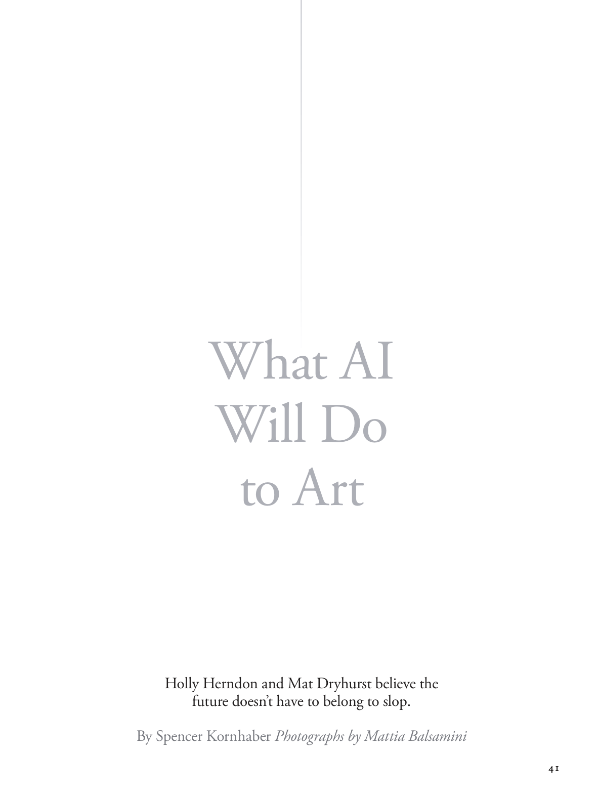

# The Atlantic — August 2026

## Page 43

---

### What AI

**【标题翻译】** 什么人工智能

### Will Do

**【标题翻译】** 会做

### to Art

**【标题翻译】** 走向艺术

#### Holly Herndon and Mat Dryhurst believe the

**【副标题翻译】** 霍莉·赫恩登 (Holly Herndon) 和马特·德莱赫斯特 (Mat Dryhurst) 认为

#### future doesn’t have to belong to slop.

**【副标题翻译】** 未来不一定属于slop。

#### By Spencer Kornhaber Photographs by Mattia Balsamini

**【副标题翻译】** 作者：Spencer Kornhaber 摄影：Mattia Balsamini
