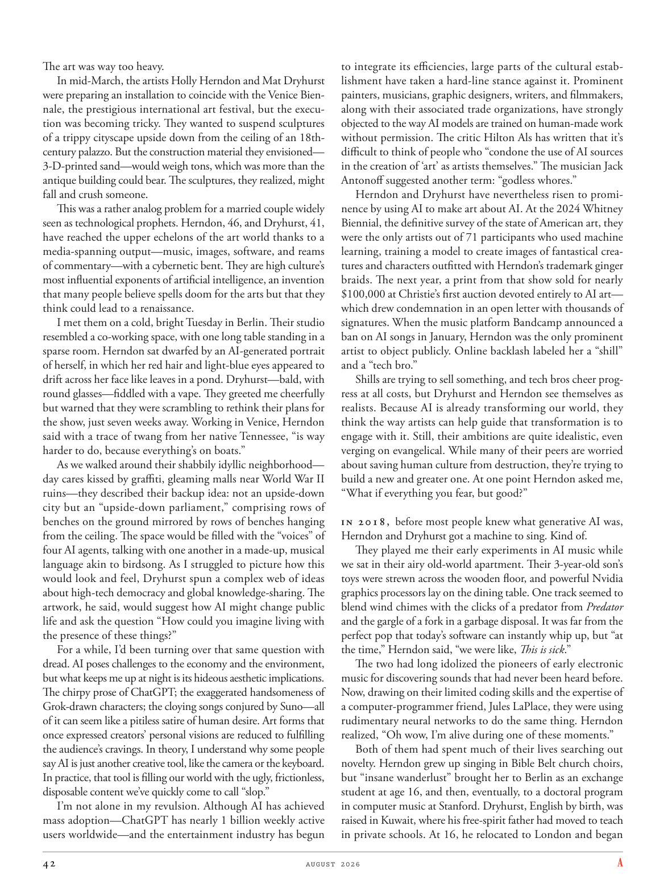

# The Atlantic — August 2026

## Page 44

---

The art was way too heavy. In mid-March, the artists Holly Herndon and Mat Dryhurst were preparing an installation to coincide with the Venice Biennale, the prestigious international art festival, but the execution was becoming tricky. They wanted to suspend sculptures of a trippy cityscape upside down from the ceiling of an 18thcentury palazzo. But the construction material they envisioned— 3-D-printed sand—would weigh tons, which was more than the antique building could bear. The sculptures, they realized, might fall and crush someone.

**【中文翻译】** 艺术太沉重了。三月中旬，艺术家 Holly Herndon 和 Mat Dryhurst 正在准备一件装置作品，以配合著名的国际艺术节威尼斯双年展，但执行过程变得棘手。他们想要将迷幻城市景观的雕塑倒挂在一座 18 世纪宫殿的天花板上。但他们设想的建筑材料——3D 打印的沙子——重达数吨，超出了这座古建筑的承受能力。他们意识到，这些雕塑可能会掉落并压伤某人。

This was a rather analog problem for a married couple widely seen as technological prophets. Herndon, 46, and Dryhurst, 41, have reached the upper echelons of the art world thanks to a media-spanning output—music, images, software, and reams of commentary— with a cyber netic bent. They are high culture’s most influential exponents of artificial intelligence, an invention that many people believe spells doom for the arts but that they think could lead to a renaissance.

**【中文翻译】** 对于一对被广泛视为技术预言家的已婚夫妇来说，这是一个相当类似的问题。 46 岁的赫恩登和 41 岁的德莱赫斯特凭借具有控制网络倾向的跨媒体作品——音乐、图像、软件和大量评论——已经跻身艺术界的高层。他们是高雅文化中最具影响力的人工智能倡导者，许多人认为人工智能的发明会给艺术带来厄运，但他们认为它可能会带来复兴。

I met them on a cold, bright Tuesday in Berlin. Their studio resembled a co-working space, with one long table standing in a sparse room. Herndon sat dwarfed by an AI-generated portrait of herself, in which her red hair and light-blue eyes appeared to drift across her face like leaves in a pond. Dryhurst—bald, with round glasses—fiddled with a vape. They greeted me cheerfully but warned that they were scrambling to rethink their plans for the show, just seven weeks away. Working in Venice, Herndon said with a trace of twang from her native Tennessee, “is way harder to do, because everything’s on boats.”

**【中文翻译】** 我在柏林遇见了他们，那是一个寒冷而明亮的星期二。他们的工作室就像一个联合办公空间，稀疏的房间里放着一张长桌。赫恩登坐在人工智能生成的自己的肖像面前，显得相形见绌，其中她的红色头发和浅蓝色眼睛似乎像池塘里的树叶一样飘过她的脸。德莱赫斯特——秃头，戴着圆眼镜——摆弄着电子烟。他们兴高采烈地跟我打招呼，但警告说，他们正在忙着重新考虑演出计划，距离演出只有七周了。在威尼斯工作的赫恩登带着一丝家乡田纳西州的口音说道，“要做起来要困难得多，因为一切都在船上。”

As we walked around their shabbily idyllic neighborhood— day cares kissed by graffiti, gleaming malls near World War II ruins— they described their backup idea: not an upside-down city but an “upside-down parliament,” comprising rows of benches on the ground mirrored by rows of benches hanging from the ceiling. The space would be filled with the “voices” of four AI agents, talking with one another in a made-up, musical language akin to birdsong. As I struggled to picture how this would look and feel, Dryhurst spun a complex web of ideas about hightech democracy and global knowledge-sharing. The artwork, he said, would suggest how AI might change public life and ask the question “How could you imagine living with the presence of these things?”

**【中文翻译】** 当我们在他们破旧的田园诗般的社区中漫步时——涂鸦亲吻的日托中心、二战废墟附近闪闪发光的购物中心——他们描述了他们的备用想法：不是一个颠倒的城市，而是一个“颠倒的议会”，包括地面上的一排长凳，与天花板上悬挂的一排长凳形成镜像。这个空间将充满四个人工智能代理的“声音”，他们用一种类似于鸟鸣的虚构音乐语言相互交谈。当我努力想象这会是什么样子和感觉时，德莱赫斯特编织了一个关于高科技民主和全球知识共享的复杂思想网络。他说，这件艺术品将表明人工智能如何改变公共生活，并提出这样的问题：“你如何想象生活中存在这些东西？”

For a while, I’d been turning over that same question with dread. AI poses challenges to the economy and the environment, but what keeps me up at night is its hideous aesthetic implications.

**【中文翻译】** 有一段时间，我一直怀着恐惧地思考同样的问题。人工智能对经济和环境提出了挑战，但让我夜不能寐的是它可怕的美学含义。

The chirpy prose of ChatGPT; the exaggerated handsomeness of Grok-drawn characters; the cloying songs conjured by Suno—all of it can seem like a pitiless satire of human desire. Art forms that once expressed creators’ personal visions are reduced to fulfilling the audience’s cravings. In theory, I understand why some people say AI is just another creative tool, like the camera or the keyboard.

**【中文翻译】** ChatGPT 欢快的散文； Grok 绘制的人物夸张的帅气；苏诺变出的令人腻味的歌曲——所有这些看起来都是对人类欲望的无情讽刺。曾经表达创作者个人愿景的艺术形式被简化为满足观众的渴望。从理论上讲，我理解为什么有些人说人工智能只是另一种创造性工具，就像相机或键盘一样。

In practice, that tool is filling our world with the ugly, frictionless, disposable content we’ve quickly come to call “slop.” I’m not alone in my revulsion. Although AI has achieved mass adoption— ChatGPT has nearly 1 billion weekly active users worldwide— and the entertainment industry has begun to integrate its efficiencies, large parts of the cultural establishment have taken a hard-line stance against it. Prominent painters, musicians, graphic designers, writers, and filmmakers, along with their associated trade organizations, have strongly objected to the way AI models are trained on human-made work without permission. The critic Hilton Als has written that it’s difficult to think of people who “condone the use of AI sources in the creation of ‘art’ as artists themselves.” The musician Jack Antonoff suggested another term: “godless whores.”

**【中文翻译】** 实际上，这个工具正在让我们的世界充满丑陋的、无摩擦的、一次性的内容，我们很快就称之为“垃圾”。我并不是唯一一个对此感到厌恶的人。尽管人工智能已获得大规模采用（ChatGPT 在全球拥有近 10 亿周活跃用户），并且娱乐业已开始整合其效率，但大部分文化机构仍对其采取强硬立场。著名画家、音乐家、平面设计师、作家和电影制作人及其相关贸易组织强烈反对未经许可对人工智能模型进行人造作品训练的方式。评论家希尔顿·阿尔斯 (Hilton Als) 写道，很难想象有人“会像艺术家一样纵容在‘艺术’创作中使用人工智能资源”。音乐家杰克·安东诺夫提出了另一个术语：“不信神的妓女”。

Herndon and Dryhurst have nevertheless risen to prominence by using AI to make art about AI. At the 2024 Whitney Biennial, the definitive survey of the state of American art, they were the only artists out of 71 participants who used machine learning, training a model to create images of fantastical creatures and characters outfitted with Herndon’s trademark ginger braids. The next year, a print from that show sold for nearly $100,000 at Christie’s first auction devoted entirely to AI art— which drew condemnation in an open letter with thousands of signatures. When the music platform Bandcamp announced a ban on AI songs in January, Herndon was the only prominent artist to object publicly. Online backlash labeled her a “shill” and a “tech bro.”

**【中文翻译】** 尽管如此，赫恩登和德莱赫斯特还是通过利用人工智能创作关于人工智能的艺术而声名鹊起。在 2024 年惠特尼双年展上，这是对美国艺术状况的权威调查，他们是 71 名参与者中唯一使用机器学习的艺术家，训练模型来创作带有赫恩登标志性姜辫子的奇幻生物和人物图像。第二年，该展览的一张印刷品在佳士得首次专门针对人工智能艺术的拍卖会上以近 10 万美元的价格售出，这引起了一封有数千人签名的公开信的谴责。当音乐平台 Bandcamp 一月份宣布禁止人工智能歌曲时，赫恩登是唯一公开反对的著名艺术家。网上的强烈反对给她贴上了“骗子”和“技术兄弟”的标签。

Shills are trying to sell something, and tech bros cheer progress at all costs, but Dryhurst and Herndon see themselves as realists. Because AI is already transforming our world, they think the way artists can help guide that transformation is to engage with it. Still, their ambitions are quite idealistic, even verging on evangelical. While many of their peers are worried about saving human culture from destruction, they’re trying to build a new and greater one. At one point Herndon asked me, “What if everything you fear, but good?”

**【中文翻译】** 托儿试图推销一些东西，科技兄弟不惜一切代价欢呼进步，但德莱赫斯特和赫恩登认为自己是现实主义者。因为人工智能已经在改变我们的世界，他们认为艺术家可以帮助引导这种转变的方式就是参与其中。尽管如此，他们的野心仍然相当理想主义，甚至接近福音派。尽管他们的许多同行担心如何拯救人类文化免遭破坏，但他们正在努力建立一种新的、更伟大的文化。有一次，赫恩登问我：“如果你所害怕的一切都是好的怎么办？”

In 2018, before most people knew what generative AI was, Herndon and Dryhurst got a machine to sing. Kind of. They played me their early experiments in AI music while we sat in their airy old-world apartment. Their 3-year-old son’s toys were strewn across the wooden floor, and powerful Nvidia graphics processors lay on the dining table. One track seemed to blend wind chimes with the clicks of a predator from Predator and the gargle of a fork in a garbage disposal. It was far from the perfect pop that today’s software can instantly whip up, but “at the time,” Herndon said, “we were like, This is sick .”

**【中文翻译】** 2018 年，在大多数人知道生成式人工智能是什么之前，赫恩登和德莱赫斯特就拥有了一台可以唱歌的机器。有点儿。当我们坐在他们通风良好的旧世界公寓里时，他们向我播放了他们早期的人工智能音乐实验。他们 3 岁儿子的玩具散落在木地板上，餐桌上放着强大的 Nvidia 图形处理器。其中一首歌曲似乎将风铃与《Predator》中捕食者的咔哒声和垃圾处理器中叉子的漱口声混合在一起。它远非今天的软件可以立即启动的完美流行，但“当时，”赫恩登说，“我们就像，这太恶心了。”

The two had long idolized the pioneers of early electronic music for discovering sounds that had never been heard before. Now, drawing on their limited coding skills and the expertise of a computerprogrammer friend, Jules LaPlace, they were using rudimentary neural networks to do the same thing. Herndon realized, “Oh wow, I’m alive during one of these moments.”

**【中文翻译】** 两人长期以来一直崇拜早期电子音乐的先驱者，因为他们发现了以前从未听过的声音。现在，利用他们有限的编码技能和计算机程序员朋友 Jules LaPlace 的专业知识，他们正在使用基本的神经网络来做同样的事情。赫恩登意识到，“哦，哇，在这些时刻我还活着。”

Both of them had spent much of their lives searching out novelty. Herndon grew up singing in Bible Belt church choirs, but “insane wanderlust” brought her to Berlin as an exchange student at age 16, and then, eventually, to a doctoral program in computer music at Stanford. Dryhurst, English by birth, was raised in Kuwait, where his free-spirit father had moved to teach in private schools. At 16, he relocated to London and began

**【中文翻译】** 他们俩一生中大部分时间都在寻找新奇事物。赫恩登在《圣经地带》教堂唱诗班中长大，但“疯狂的旅行癖”让她在 16 岁时作为交换生来到柏林，最终在斯坦福大学攻读计算机音乐博士学位。德莱赫斯特出生于英国，在科威特长大，他自由奔放的父亲搬到了科威特，在私立学校任教。 16 岁时，他搬到伦敦并开始
