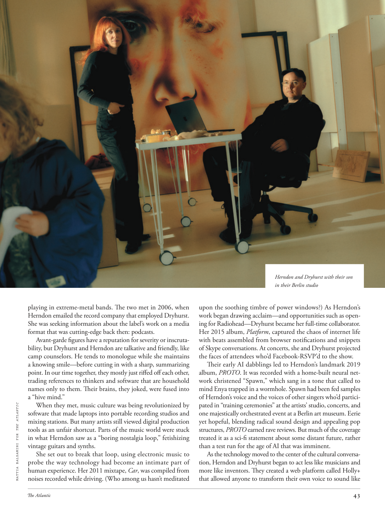

# The Atlantic — August 2026

## Page 45

---

playing in extreme-metal bands. The two met in 2006, when Herndon emailed the record company that employed Dryhurst. She was seeking information about the label’s work on a media format that was cutting-edge back then: podcasts.

**【中文翻译】** 在极端金属乐队中演奏。两人于 2006 年相识，当时赫恩登给聘用德莱赫斯特的唱片公司发了电子邮件。她正在寻找有关该品牌在当时最前沿的媒体格式上的工作的信息：播客。

Avant-garde figures have a reputation for severity or inscrutability, but Dryhurst and Herndon are talkative and friendly, like camp counselors. He tends to monologue while she maintains a knowing smile—before cutting in with a sharp, summarizing point. In our time together, they mostly just riffed off each other, trading references to thinkers and software that are household names only to them. Their brains, they joked, were fused into a “hive mind.”

**【中文翻译】** 前卫人物以严肃或神秘而闻名，但德利赫斯特和赫恩登却健谈且友好，就像营地辅导员一样。他倾向于独白，而她则保持会心的微笑——然后插入尖锐的总结性观点。在我们在一起的时间里，他们大多只是互相即兴发挥，交换对他们来说家喻户晓的思想家和软件的参考资料。他们开玩笑说，他们的大脑融合成了“蜂巢思维”。

When they met, music culture was being revolutionized by MATTIA BALSAMINI FOR THE ATLANTIC software that made laptops into portable recording studios and mixing stations. But many artists still viewed digital production tools as an unfair shortcut. Parts of the music world were stuck in what Herndon saw as a “boring nostalgia loop,” fetishizing vintage guitars and synths.

**【中文翻译】** 当他们相遇时，MATTIA BALSAMINI FOR THE ATLANTIC 软件正在彻底改变音乐文化，该软件将笔记本电脑变成便携式录音室和混音站。但许多艺术家仍然认为数字制作工具是一条不公平的捷径。音乐世界的一部分陷入了赫恩登所认为的“无聊的怀旧循环”，迷恋老式吉他和合成器。

She set out to break that loop, using electronic music to probe the way technology had become an intimate part of human experience. Her 2011 mixtape, Car , was compiled from noises recorded while driving. (Who among us hasn’t meditated upon the soothing timbre of power windows?) As Herndon’s work began drawing acclaim—and opportunities such as opening for Radiohead—Dryhurst became her full-time collaborator.

**【中文翻译】** 她着手打破这个循环，利用电子音乐来探索技术如何成为人类体验的亲密组成部分。她 2011 年的混音带《Car》是根据开车时录制的噪音编制的。 （我们当中谁没有沉思过电动车窗舒缓的音色？）随着赫恩登的作品开始赢得赞誉，以及为 Radiohead 开场等机会，德莱赫斯特成为了她的全职合作者。

Her 2015 album, Platform , captured the chaos of internet life with beats assembled from browser notifications and snippets of Skype conversations. At concerts, she and Dryhurst projected the faces of attendees who’d Facebook-RSVP’d to the show.

**【中文翻译】** 她 2015 年的专辑《Platform》用浏览器通知和 Skype 对话片段组合而成的节拍捕捉了互联网生活的混乱。在音乐会上，她和德莱赫斯特投射了在 Facebook 上回复演出的与会者的面孔。

Their early AI dabblings led to Herndon’s landmark 2019 album, PROTO . It was recorded with a home-built neural network christened “Spawn,” which sang in a tone that called to mind Enya trapped in a wormhole. Spawn had been fed samples of Herndon’s voice and the voices of other singers who’d participated in “training ceremonies” at the artists’ studio, concerts, and one majestically orchestrated event at a Berlin art museum. Eerie yet hopeful, blending radical sound design and appealing pop structures, PROTO earned rave reviews. But much of the coverage treated it as a sci-fi statement about some distant future, rather than a test run for the age of AI that was imminent.

**【中文翻译】** 他们早期对人工智能的涉猎催生了 Herndon 具有里程碑意义的 2019 年专辑《PROTO》。这首歌是用一个名为“Spawn”的自制神经网络录制的，它的歌声让人想起被困在虫洞里的恩雅。再生侠接受了赫恩登的声音样本以及其他歌手的声音样本，这些歌手参加了艺术家工作室的“培训仪式”、音乐会以及柏林艺术博物馆精心策划的一场活动。 PROTO 怪诞而又充满希望，融合了激进的声音设计和吸引人的流行结构，赢得了好评如潮。但大部分报道都将其视为对遥远未来的科幻陈述，而不是对即将到来的人工智能时代的试运行。

As the technology moved to the center of the cultural conversation, Herndon and Dryhurst began to act less like musicians and more like inventors. They created a web platform called Holly+ that allowed anyone to transform their own voice to sound like Herndon and Dryhurst with their son in their Berlin studio

**【中文翻译】** 随着技术成为文化对话的中心，赫恩登和德莱赫斯特开始表现得不再像音乐家，而更像发明家。他们创建了一个名为 Holly+ 的网络平台，允许任何人在柏林工作室中将自己的声音转变为赫恩登和德莱赫斯特及其儿子的声音
