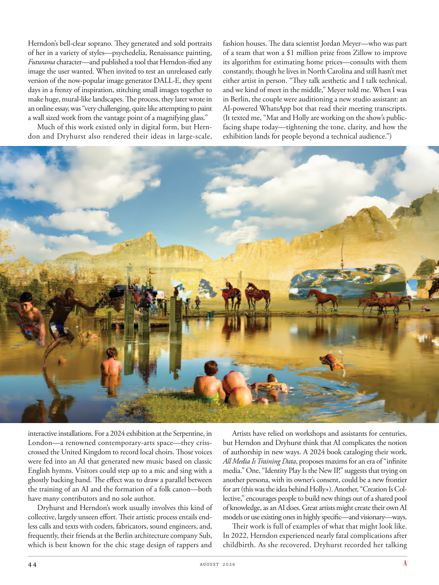

# The Atlantic — August 2026

## Page 46

---

Herndon’s bell-clear soprano. They generated and sold portraits of her in a variety of styles—psychedelia, Renaissance painting, Futurama character—and published a tool that Herndon-ified any image the user wanted. When invited to test an unreleased early version of the now-popular image generator DALL-E, they spent days in a frenzy of inspiration, stitching small images together to make huge, mural-like landscapes. The process, they later wrote in an online essay, was “very challenging, quite like attempting to paint a wall sized work from the vantage point of a magnifying glass.”

**【中文翻译】** 赫恩登的女高音清脆悦耳。他们制作并出售了各种风格的她的肖像——迷幻、文艺复兴绘画、未来世界人物——并发布了一个工具，赫恩登可以将用户想要的任何图像化。当受邀测试目前流行的图像生成器 DALL-E 的未发布早期版本时，他们花了几天的时间在疯狂的灵感中，将小图像拼接在一起，制作出巨大的、壁画般的风景。他们后来在一篇在线文章中写道，这个过程“非常具有挑战性，就像试图从放大镜的有利位置绘制墙壁大小的作品一样。”

Much of this work existed only in digital form, but Herndon and Dryhurst also rendered their ideas in large-scale, inter active installations. For a 2024 exhibition at the Serpentine, in London— a renowned contemporary-arts space—they crisscrossed the United Kingdom to record local choirs. Those voices were fed into an AI that generated new music based on classic English hymns. Visitors could step up to a mic and sing with a ghostly backing band. The effect was to draw a parallel between the training of an AI and the formation of a folk canon—both have many contributors and no sole author.

**【中文翻译】** 这些作品大部分仅以数字形式存在，但赫恩登和德莱赫斯特也以大型互动装置的形式呈现了他们的想法。为了 2024 年在伦敦蛇形画廊（著名的当代艺术空间）举行的展览，他们往返于英国录制当地合唱团的作品。这些声音被输入人工智能，根据经典英语赞美诗生成新音乐。参观者可以走到麦克风前，在幽灵般的伴奏乐队的伴奏下唱歌。其效果是在人工智能的训练和民间经典的形成之间进行类比——两者都有许多贡献者，但没有唯一的作者。

Dryhurst and Herndon’s work usually involves this kind of collective, largely unseen effort. Their artistic process entails endless calls and texts with coders, fabricators, sound engineers, and, frequently, their friends at the Berlin architecture company Sub, which is best known for the chic stage design of rappers and fashion houses. The data scientist Jordan Meyer— who was part of a team that won a $1 million prize from Zillow to improve its algorithm for estimating home prices— consults with them constantly, though he lives in North Carolina and still hasn’t met either artist in person. “They talk aesthetic and I talk technical, and we kind of meet in the middle,” Meyer told me. When I was in Berlin, the couple were auditioning a new studio assistant: an AI-powered WhatsApp bot that read their meeting transcripts.

**【中文翻译】** 德莱赫斯特和赫恩登的工作通常涉及这种集体的、很大程度上不为人所知的努力。他们的艺术创作过程需要与编码员、制造商、音响工程师以及他们在柏林建筑公司 Sub 的朋友进行无休止的电话和短信，该公司以说唱歌手和时装屋的别致舞台设计而闻名。数据科学家乔丹·迈耶 (Jordan Meyer) 所在的团队赢得了 Zillow 100 万美元的奖金，以改进其估算房价的算法。 尽管他住在北卡罗来纳州，但尚未亲自见过任何一位艺术家，但他经常向他们咨询。 “他们谈论美学，我谈论技术，我们在中间相遇，”迈耶告诉我。当我在柏林时，这对夫妇正在试镜一位新的工作室助理：一个由人工智能驱动的 WhatsApp 机器人，可以读取他们的会议记录。

(It texted me, “Mat and Holly are working on the show’s publicfacing shape today— tightening the tone, clarity, and how the exhibition lands for people beyond a technical audience.”) Artists have relied on workshops and assistants for centuries, but Herndon and Dryhurst think that AI complicates the notion of authorship in new ways. A 2024 book cataloging their work, All Media Is Training Data , proposes maxims for an era of “infinite media.” One, “Identity Play Is the New IP,” suggests that trying on another persona, with its owner’s consent, could be a new frontier for art (this was the idea behind Holly+). Another, “Creation Is Collective,” encourages people to build new things out of a shared pool of knowledge, as an AI does. Great artists might create their own AI models or use existing ones in highly specific— and visionary— ways.

**【中文翻译】** （它发短信给我，“马特和霍莉今天正在研究展览的公众形象——收紧基调、清晰度，以及展览如何面向技术观众之外的人。”）几个世纪以来，艺术家们一直依赖研讨会和助手，但赫恩登和德莱赫斯特认为人工智能以新的方式使作者身份的概念变得复杂化。 2024 年出版的一本对他们的工作进行分类的书《所有媒体都是训练数据》提出了“无限媒体”时代的格言。其中一则“身份游戏是新 IP”表明，在所有者同意的情况下尝试另一个角色可能会成为艺术的新领域（这就是 Holly+ 背后的想法）。另一个主题是“创造是集体的”，鼓励人们像人工智能一样，从共享的知识库中构建新事物。伟大的艺术家可能会创建自己的人工智能模型，或者以高度具体且富有远见的方式使用现有的模型。

Their work is full of examples of what that might look like. In 2022, Herndon experienced nearly fatal complications after childbirth. As she recovered, Dryhurst recorded her talking

**【中文翻译】** 他们的工作充满了可能是什么样子的例子。 2022 年，赫恩登在分娩后出现了几乎致命的并发症。当她康复后，德莱赫斯特录下了她的谈话
