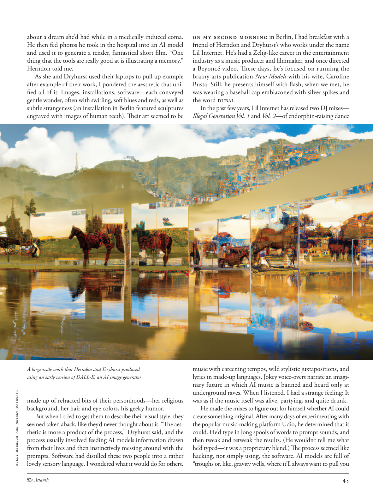

# The Atlantic — August 2026

## Page 47

---

about a dream she’d had while in a medically induced coma. He then fed photos he took in the hospital into an AI model and used it to generate a tender, fantastical short film. “One thing that the tools are really good at is illustrating a memory,” Herndon told me.

**【中文翻译】** 关于她在药物引起的昏迷期间所做的一个梦。然后，他将在医院拍摄的照片输入人工智能模型，并用它生成一部温柔、奇幻的短片。 “这些工具真正擅长的一件事是展示记忆，”赫恩登告诉我。

As she and Dryhurst used their laptops to pull up example after example of their work, I pondered the aesthetic that unified all of it. Images, installations, software—each conveyed gentle wonder, often with swirling, soft blues and reds, as well as subtle strangeness (an installation in Berlin featured sculptures engraved with images of human teeth). Their art seemed to be A large-scale work that Herndon and Dryhurst produced using an early version of DALL-E, an AI image generator HOLLY HERNDON AND MATHEW DRYHURST made up of refracted bits of their personhoods—her religious background, her hair and eye colors, his geeky humor.

**【中文翻译】** 当她和德莱赫斯特用他们的笔记本电脑调出一个又一个的工作示例时，我思考了将所有这些工作统一起来的美学。图像、装置、软件——每一个都传达了温和的奇迹，通常带有旋转、柔和的蓝色和红色，以及微妙的陌生感（柏林的一个装置以刻有人类牙齿图像的雕塑为特色）。他们的艺术似乎是 Herndon 和 Dryhurst 使用 DALL-E 的早期版本制作的大型作品，DALL-E 是一种人工智能图像生成器 HOLLY HERNDON 和 MATHEW DRYHURST 由他们人格的折射部分组成 - 她的宗教背景，她的头发和眼睛的颜色，他的极客幽默。

But when I tried to get them to describe their visual style, they seemed taken aback, like they’d never thought about it. “The aesthetic is more a product of the process,” Dryhurst said, and the process usually involved feeding AI models information drawn from their lives and then instinctively messing around with the prompts. Software had distilled these two people into a rather lovely sensory language. I wondered what it would do for others.

**【中文翻译】** 但当我试图让他们描述他们的视觉风格时，他们似乎大吃一惊，就像他们从未想过这一点一样。 “美学更多的是这个过程的产物，”德莱赫斯特说，这个过程通常涉及向人工智能模型提供从他们的生活中提取的信息，然后本能地处理提示。软件将这两个人提炼成一种相当可爱的感官语言。我想知道它会对其他人做什么。

On my second morning in Berlin, I had breakfast with a friend of Herndon and Dryhurst’s who works under the name Lil Internet. He’s had a Zelig-like career in the entertainment industry as a music producer and filmmaker, and once directed a Beyoncé video. These days, he’s focused on running the brainy arts publication New Models with his wife, Caroline Busta. Still, he presents himself with flash; when we met, he was wearing a baseball cap emblazoned with silver spikes and the word DUBAI.

**【中文翻译】** 在柏林的第二天早上，我与赫恩登和德莱赫斯特的一位朋友共进早餐，他的名字是 Lil Internet。作为一名音乐制作人和电影制片人，他在娱乐行业有着类似 Zelig 的职业生涯，还曾执导过碧昂斯 (Beyoncé) 的视频。如今，他与妻子卡罗琳·布斯塔 (Caroline Busta) 专注于经营聪明的艺术刊物《新模特》(New Models)。尽管如此，他还是以闪光的方式展现自己；当我们见面时，他戴着一顶棒球帽，上面印有银色尖刺和“迪拜”字样。

In the past few years, Lil Internet has released two DJ mixes— Illegal Generation Vol. 1 and Vol. 2 —of endorphin-raising dance music with careening tempos, wild stylistic juxtapositions, and lyrics in made-up languages. Jokey voice-overs narrate an imaginary future in which AI music is banned and heard only at underground raves. When I listened, I had a strange feeling: It was as if the music itself was alive, partying, and quite drunk.

**【中文翻译】** 在过去的几年里，Lil Internet 发行了两首 DJ 混音作品——Illegal Generation Vol. 1。 1 和卷。 2 —令人内啡肽分泌旺盛的舞曲，节奏跳跃，风格狂野并置，歌词是虚构的。诙谐的画外音讲述了一个想象中的未来，人工智能音乐被禁止，只能在地下狂欢中听到。当我听的时候，我有一种奇怪的感觉：就好像音乐本身是活的，在聚会，而且很醉。

He made the mixes to figure out for himself whether AI could create something original. After many days of experimenting with the popular music-making platform Udio, he determined that it could. He’d type in long spools of words to prompt sounds, and then tweak and re tweak the results. (He wouldn’t tell me what he’d typed— it was a proprietary blend.) The process seemed like hacking, not simply using, the software. AI models are full of “troughs or, like, gravity wells, where it’ll always want to pull you

**【中文翻译】** 他进行混音是为了自己弄清楚人工智能是否可以创造出原创的东西。在对流行音乐制作平台 Udio 进行了多天的试验后，他确定可以。他会输入一长串单词来提示声音，然后不断调整结果。 （他不会告诉我他输入的是什么——这是一种专有的混合物。）这个过程看起来像是黑客攻击，而不是简单地使用该软件。人工智能模型充满了“低谷或者重力井，它总是想把你拉到那里”
