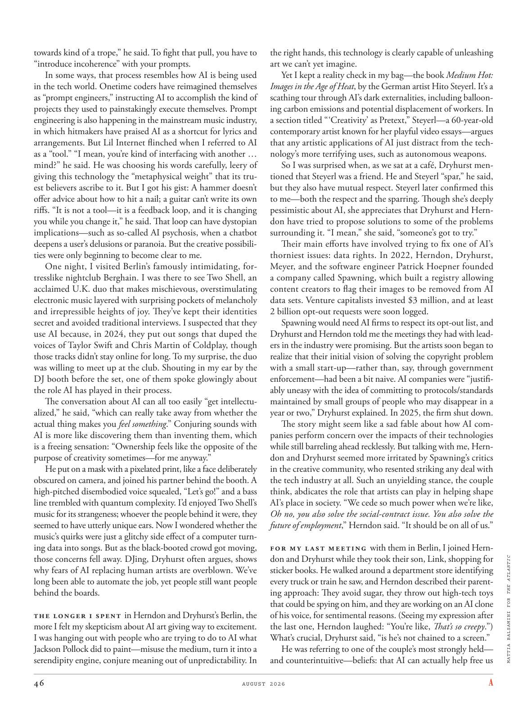

# The Atlantic — August 2026

## Page 48

---

towards kind of a trope,” he said. To fight that pull, you have to “introduce incoherence” with your prompts. In some ways, that process resembles how AI is being used in the tech world. Onetime coders have reimagined themselves as “prompt engineers,” instructing AI to accomplish the kind of projects they used to painstakingly execute themselves. Prompt engineering is also happening in the mainstream music industry, in which hitmakers have praised AI as a shortcut for lyrics and arrangements. But Lil Internet flinched when I referred to AI as a “tool.” “I mean, you’re kind of interfacing with another … mind?” he said. He was choosing his words carefully, leery of giving this technology the “metaphysical weight” that its truest believers ascribe to it. But I got his gist: A hammer doesn’t offer advice about how to hit a nail; a guitar can’t write its own riffs. “It is not a tool—it is a feedback loop, and it is changing you while you change it,” he said. That loop can have dystopian implications— such as so-called AI psychosis, when a chatbot deepens a user’s delusions or paranoia. But the creative possibilities were only beginning to become clear to me.

**【中文翻译】** 他说。为了对抗这种吸引力，你必须在提示中“引入不连贯性”。在某些方面，这个过程类似于人工智能在科技世界中的使用方式。曾经的程序员已经将自己重新想象为“提示工程师”，指导人工智能完成他们过去自己费力执行的那种项目。提示工程也在主流音乐行业中发生，其中流行音乐制作人称赞人工智能是歌词的捷径。但当我将人工智能称为“工具”时，Lil Internet 退缩了。 “我的意思是，你正在与另一个……心灵进行交流？”他说。他谨慎地选择措辞，小心翼翼地避免赋予这项技术最忠实的信徒所赋予的“形而上学的分量”。但我明白了他的要点：锤子并不提供如何敲钉子的建议；而是提供如何敲钉子的建议。吉他不能写出自己的即兴重复段。 “它不是一个工具，而是一个反馈循环，当你改变它时，它也在改变你，”他说。这种循环可能会产生反乌托邦的影响，例如所谓的人工智能精神病，即聊天机器人加深了用户的妄想或偏执。但我才刚刚开始意识到创造性的可能性。

One night, I visited Berlin’s famously intimidating, fortresslike nightclub Berghain. I was there to see Two Shell, an acclaimed U.K. duo that makes mischievous, overstimulating electronic music layered with surprising pockets of melancholy and irrepressible heights of joy. They’ve kept their identities secret and avoided traditional interviews. I suspected that they use AI because, in 2024, they put out songs that duped the voices of Taylor Swift and Chris Martin of Coldplay, though those tracks didn’t stay online for long. To my surprise, the duo was willing to meet up at the club. Shouting in my ear by the DJ booth before the set, one of them spoke glowingly about the role AI has played in their process.

**【中文翻译】** 一天晚上，我参观了柏林著名的令人生畏、堡垒般的夜总会 Berghain。我去那里是为了看 Two Shell，这是一支广受好评的英国二人组合，他们创作出顽皮、过度刺激的电子音乐，其中夹杂着令人惊讶的忧郁和难以抑制的欢乐。他们对自己的身份保密并避免传统采访。我怀疑他们使用人工智能，因为在 2024 年，他们发布了模仿酷玩乐队泰勒·斯威夫特和克里斯·马丁声音的歌曲，尽管这些歌曲并没有在网上停留很长时间。令我惊讶的是，两人愿意在俱乐部见面。演出前，其中一个人在 DJ 台旁对着我的耳朵大喊，热情洋溢地谈论着人工智能在他们的过程中所扮演的角色。

The conversation about AI can all too easily “get intellectualized,” he said, “which can really take away from whether the actual thing makes you feel something .” Conjuring sounds with AI is more like discovering them than inventing them, which is a freeing sensation: “Ownership feels like the opposite of the purpose of creativity sometimes— for me anyway.”

**【中文翻译】** 他说，关于人工智能的讨论很容易“变得智能化”，“这真的会影响实际事物是否让你感受到某种东西。”用人工智能召唤声音更像是发现它们，而不是发明它们，这是一种自由的感觉：“有时，所有权感觉与创造力的目的相反——无论如何对我来说。”

He put on a mask with a pixelated print, like a face deliberately obscured on camera, and joined his partner behind the booth. A high-pitched disembodied voice squealed, “Let’s go!” and a bass line trembled with quantum complexity. I’d enjoyed Two Shell’s music for its strangeness; whoever the people behind it were, they seemed to have utterly unique ears. Now I wondered whether the music’s quirks were just a glitchy side effect of a computer turning data into songs. But as the black-booted crowd got moving, those concerns fell away. DJing, Dryhurst often argues, shows why fears of AI replacing human artists are overblown. We’ve long been able to automate the job, yet people still want people behind the boards.

**【中文翻译】** 他戴上带有像素印花的面具，就像相机上故意模糊的脸一样，然后和他的搭档一起站在展位后面。一道高亢的、无形的声音尖叫道：“走吧！”低音线因量子复杂性而颤抖。我喜欢“Two Shell”的音乐，因为它的陌生感。不管背后的人是谁，他们的耳朵似乎都非常独特。现在我想知道音乐的怪癖是否只是计算机将数据转化为歌曲的一个小故障副作用。但随着黑靴子人群开始行动，这些担忧就消失了。德莱赫斯特经常认为，打碟表明了为什么对人工智能取代人类艺术家的担忧被夸大了。我们早已能够实现这项工作的自动化，但人们仍然希望有人在幕后。

The longer I spent in Herndon and Dryhurst’s Berlin, the more I felt my skepticism about AI art giving way to excitement. I was hanging out with people who are trying to do to AI what Jackson Pollock did to paint—misuse the medium, turn it into a serendipity engine, conjure meaning out of unpredictability. In the right hands, this technology is clearly capable of unleashing art we can’t yet imagine.

**【中文翻译】** 我在赫恩登和德莱赫斯特的柏林呆的时间越长，我就越感到自己对人工智能艺术的怀疑让位于兴奋。我和一些人一起闲逛，他们试图对人工智能做杰克逊·波洛克（Jackson Pollock）对绘画所做的事情——滥用媒介，将其变成机缘巧合的引擎，从不可预测性中变出意义。在正确的人手中，这项技术显然能够释放我们尚无法想象的艺术。

Yet I kept a reality check in my bag—the book Medium Hot: Images in the Age of Heat , by the German artist Hito Steyerl. It’s a scathing tour through AI’s dark externalities, including ballooning carbon emissions and potential displacement of workers. In a section titled “ ‘Creativity’ as Pretext,” Steyerl—a 60-year-old contemporary artist known for her playful video essays—argues that any artistic applications of AI just distract from the technology’s more terrifying uses, such as autonomous weapons.

**【中文翻译】** 然而，我在包里放了一份现实检查——德国艺术家 Hito Steyerl 的《Medium Hot: Images in the Age of Heat》一书。这是一次对人工智能黑暗外部性的严厉之旅，包括不断增加的碳排放和潜在的工人流离失所。在题为“以‘创造力’为借口”的部分中，60 岁的当代艺术家 Steyerl 以俏皮的视频文章而闻名，他认为人工智能的任何艺术应用只会分散人们对该技术更可怕的用途的注意力，例如自主武器。

So I was surprised when, as we sat at a café, Dryhurst mentioned that Steyerl was a friend. He and Steyerl “spar,” he said, but they also have mutual respect. Steyerl later confirmed this to me— both the respect and the sparring. Though she’s deeply pessimistic about AI, she appreciates that Dryhurst and Herndon have tried to propose solutions to some of the problems surrounding it. “I mean,” she said, “someone’s got to try.”

**【中文翻译】** 因此，当我们坐在咖啡馆时，德利赫斯特提到史德耶尔是我的朋友时，我感到很惊讶。他说，他和史德耶尔“发生了争执”，但他们也相互尊重。斯特耶尔后来向我证实了这一点——无论是尊重还是争论。尽管她对人工智能深感悲观，但她赞赏德莱赫斯特和赫恩登试图针对人工智能周围的一些问题提出解决方案。 “我的意思是，”她说，“总得有人去尝试。”

Their main efforts have involved trying to fix one of AI’s thorniest issues: data rights. In 2022, Herndon, Dryhurst, Meyer, and the software engineer Patrick Hoepner founded a company called Spawning, which built a registry allowing content creators to flag their images to be removed from AI data sets. Venture capitalists invested $3 million, and at least 2 billion opt-out requests were soon logged.

**【中文翻译】** 他们的主要努力涉及尝试解决人工智能最棘手的问题之一：数据权。 2022 年，Herndon、Dryhurst、Meyer 和软件工程师 Patrick Hoepner 创立了一家名为 Spawning 的公司，该公司建立了一个注册表，允许内容创建者标记要从 AI 数据集中删除的图像。风险投资家投资了 300 万美元，很快就有至少 20 亿个选择退出的请求被记录下来。

Spawning would need AI firms to respect its opt-out list, and Dryhurst and Herndon told me the meetings they had with leaders in the industry were promising. But the artists soon began to realize that their initial vision of solving the copyright problem with a small start-up—rather than, say, through government enforcement—had been a bit naive. AI companies were “justifiably uneasy with the idea of committing to protocols/standards maintained by small groups of people who may disappear in a year or two,” Dryhurst explained. In 2025, the firm shut down.

**【中文翻译】** 催生需要人工智能公司尊重其选择退出名单，德莱赫斯特和赫恩登告诉我，他们与行业领导者举行的会议很有希望。但艺术家们很快就开始意识到，他们最初通过一家小型初创企业而不是通过政府执法来解决版权问题的愿景有点天真。德莱赫斯特解释说，人工智能公司“对遵守由可能在一两年内消失的一小群人维护的协议/标准的想法感到不安”。 2025 年，该公司倒闭。

The story might seem like a sad fable about how AI companies perform concern over the impacts of their technologies while still barreling ahead recklessly. But talking with me, Herndon and Dryhurst seemed more irritated by Spawning’s critics in the creative community, who resented striking any deal with the tech industry at all. Such an unyielding stance, the couple think, abdicates the role that artists can play in helping shape AI’s place in society. “We cede so much power when we’re like, Oh no, you also solve the social-contract issue. You also solve the future of employment ,” Herndon said. “It should be on all of us.”

**【中文翻译】** 这个故事看起来像是一个悲伤的寓言，讲述了人工智能公司如何在不顾一切地向前推进的同时，对其技术的影响表现出担忧。但在与我交谈时，赫恩登和德莱赫斯特似乎对创意界对 Spawning 的批评更加恼火，他们根本不愿意与科技行业达成任何协议。这对夫妇认为，这种不屈不挠的立场放弃了艺术家在帮助塑造人工智能在社会中的地位方面可以发挥的作用。 “当我们想，哦不，你还解决了社会契约问题。你还解决了就业的未来时，我们就放弃了如此多的权力，”赫恩登说。 “这应该是我们所有人的责任。”

For my last meeting with them in Berlin, I joined Herndon and Dryhurst while they took their son, Link, shopping for sticker books. He walked around a department store identifying every truck or train he saw, and Herndon described their parenting approach: They avoid sugar, they throw out high-tech toys that could be spying on him, and they are working on an AI clone of his voice, for sentimental reasons. (Seeing my expression after the last one, Herndon laughed: “You’re like, That’s so creepy .”) What’s crucial, Dryhurst said, “is he’s not chained to a screen.”

**【中文翻译】** 上次在柏林与他们会面时，我加入了赫恩登和德莱赫斯特，他们带着儿子林克去买贴纸书。他在一家百货商店里走来走去，辨认出他看到的每一辆卡车或火车，赫恩登描述了他们的养育方式：他们避免吃糖，他们扔掉可能监视他的高科技玩具，出于情感原因，他们正在研究他声音的人工智能克隆。 （赫恩登看到我最后一张之后的表情，笑了：“你说，这太令人毛骨悚然了。”）德莱赫斯特说，最重要的是，“他没有被束缚在屏幕上。”

He was referring to one of the couple’s most strongly held— and counterintuitive—beliefs: that AI can actually help free us MATTIA BALSAMINI FOR THE ATLANTIC

**【中文翻译】** 他指的是这对夫妇最坚定且违反直觉的信念之一：人工智能实际上可以帮助我们将马蒂亚·巴尔萨米尼 (MATTIA BALSAMINI) 解放到大西洋上。
