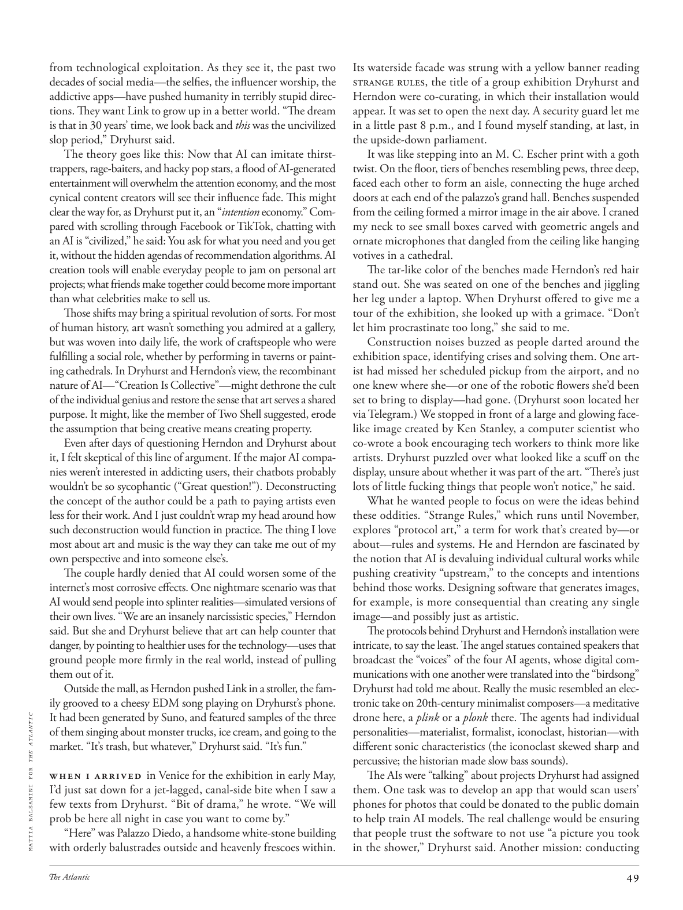

# The Atlantic — August 2026

## Page 51

---

from technological exploitation. As they see it, the past two decades of social media—the selfies, the influencer worship, the addictive apps—have pushed humanity in terribly stupid directions. They want Link to grow up in a better world. “The dream is that in 30 years’ time, we look back and this was the uncivilized slop period,” Dryhurst said.

**【中文翻译】** 来自技术开发。在他们看来，过去二十年的社交媒体——自拍、影响者崇拜、令人上瘾的应用程序——已经将人类推向了极其愚蠢的方向。他们希望林克在一个更美好的世界里成长。 “我们的梦想是，30 年后，当我们回首往事时，会发现这是一个不文明的泥水时代，”德莱赫斯特说。

The theory goes like this: Now that AI can imitate thirsttrappers, rage-baiters, and hacky pop stars, a flood of AIgenerated entertainment will overwhelm the attention economy, and the most cynical content creators will see their influence fade. This might clear the way for, as Dryhurst put it, an “ intention economy.” Compared with scrolling through Facebook or TikTok, chatting with an AI is “civilized,” he said: You ask for what you need and you get it, without the hidden agendas of recommendation algorithms. AI creation tools will enable everyday people to jam on personal art projects; what friends make together could become more important than what celebrities make to sell us.

**【中文翻译】** 该理论是这样的：既然人工智能可以模仿口渴者、愤怒引诱者和黑客流行歌星，人工智能产生的大量娱乐将压倒注意力经济，而最愤世嫉俗的内容创作者将看到他们的影响力逐渐消失。正如德莱赫斯特所说，这可能为“意图经济”扫清道路。他说，与浏览 Facebook 或 TikTok 相比，与人工智能聊天是“文明的”：你提出你需要的东西，你就会得到它，没有推荐算法的隐藏议程。人工智能创作工具将使人们能够专注于个人艺术项目；朋友们一起做的事情可能会比名人做的东西来推销我们更重要。

Those shifts may bring a spiritual revolution of sorts. For most of human history, art wasn’t something you admired at a gallery, but was woven into daily life, the work of craftspeople who were fulfilling a social role, whether by performing in taverns or painting cathedrals. In Dryhurst and Herndon’s view, the recombinant nature of AI—“Creation Is Collective”—might dethrone the cult of the individual genius and restore the sense that art serves a shared purpose. It might, like the member of Two Shell suggested, erode the assumption that being creative means creating property.

**【中文翻译】** 这些转变可能会带来某种精神革命。在人类历史的大部分时间里，艺术并不是你在画廊里欣赏的东西，而是融入了日常生活，是履行社会角色的工匠的作品，无论是在酒馆表演还是在大教堂绘画。在德莱赫斯特和赫恩登看来，人工智能的重组本质——“创造是集体的”——可能会推翻对个人天才的崇拜，并恢复艺术服务于共同目的的感觉。正如“两壳”成员所建议的那样，它可能会削弱创造性意味着创造财产的假设。

Even after days of questioning Herndon and Dryhurst about it, I felt skeptical of this line of argument. If the major AI companies weren’t interested in addicting users, their chatbots probably wouldn’t be so sycophantic (“Great question!”). Deconstructing the concept of the author could be a path to paying artists even less for their work. And I just couldn’t wrap my head around how such deconstruction would function in practice. The thing I love most about art and music is the way they can take me out of my own perspective and into someone else’s.

**【中文翻译】** 即使在向赫恩登和德莱赫斯特询问了几天之后，我仍然对这种论点感到怀疑。如果主要的人工智能公司对让用户上瘾不感兴趣，他们的聊天机器人可能不会如此阿谀奉承（“好问题！”）。解构作者的概念可能是向艺术家支付更少费用的一条途径。我就是无法理解这种解构在实践中将如何发挥作用。我最喜欢艺术和音乐的一点是，它们可以把我从自己的角度带入别人的角度。

The couple hardly denied that AI could worsen some of the internet’s most corrosive effects. One nightmare scenario was that AI would send people into splinter realities—simulated versions of their own lives. “We are an insanely narcissistic species,” Herndon said. But she and Dryhurst believe that art can help counter that danger, by pointing to healthier uses for the technology— uses that ground people more firmly in the real world, instead of pulling them out of it.

**【中文翻译】** 这对夫妇几乎否认人工智能可能会加剧互联网一些最具腐蚀性的影响。一个噩梦般的场景是人工智能会将人们带入支离破碎的现实——他们自己生活的模拟版本。 “我们是一个极度自恋的物种，”赫恩登说。但她和德莱赫斯特相信，艺术可以通过指出技术的更健康用途来帮助应对这种危险——让人们更牢固地融入现实世界，而不是把他们从现实世界中拉出来。

Outside the mall, as Herndon pushed Link in a stroller, the family grooved to a cheesy EDM song playing on Dryhurst’s phone. It had been generated by Suno, and featured samples of the three MATTIA BALSAMINI FOR THE ATLANTIC of them singing about monster trucks, ice cream, and going to the market. “It’s trash, but whatever,” Dryhurst said. “It’s fun.”

**【中文翻译】** 出了商场，赫恩登推着林克推着婴儿车，一家人随着德赫斯特手机上播放的一首俗气的 EDM 歌曲而欢欣鼓舞。它是由 Suno 制作的，其中包含三名 MATTIA BALSAMINI FOR THE ATLANTIC 的样本，其中他们唱着怪物卡车、冰淇淋和去市场的歌。 “这是垃圾，但无论如何，”德莱赫斯特说。 “这很有趣。”

When I arrived in Venice for the exhibition in early May, I’d just sat down for a jet-lagged, canal-side bite when I saw a few texts from Dryhurst. “Bit of drama,” he wrote. “We will prob be here all night in case you want to come by.”

**【中文翻译】** 当我五月初抵达威尼斯参加展览时，我刚刚倒时差，刚坐下来在运河边吃点东西，就看到了德赫斯特的几条短信。 “有点戏剧性，”他写道。 “如果你想过来的话，我们可能整夜都待在这里。”

“Here” was Palazzo Diedo, a handsome white-stone building with orderly balustrades outside and heavenly frescoes within. Its waterside facade was strung with a yellow banner reading STRANGE RULES, the title of a group exhibition Dryhurst and Herndon were co-curating, in which their installation would appear. It was set to open the next day. A security guard let me in a little past 8 p.m., and I found myself standing, at last, in the upside-down parliament.

**【中文翻译】** “这里”就是迭多宫，一座漂亮的白色石头建筑，外面有整齐的栏杆，里面有天堂般的壁画。它的水边立面挂着一条黄色横幅，上面写着“奇怪的规则”，这是德莱赫斯特和赫恩登共同策划的群展的标题，他们的装置作品也将出现在其中。原定于第二天开业。晚上八点多一点，保安让我进去了，我发现自己终于站在了颠倒的议会里。

It was like stepping into an M. C. Escher print with a goth twist. On the floor, tiers of benches resembling pews, three deep, faced each other to form an aisle, connecting the huge arched doors at each end of the palazzo’s grand hall. Benches suspended from the ceiling formed a mirror image in the air above. I craned my neck to see small boxes carved with geometric angels and ornate microphones that dangled from the ceiling like hanging votives in a cathedral.

**【中文翻译】** 这就像走进了带有哥特风格的 M. C. Escher 版画。地板上，一排排类似长凳的长凳，深三层，彼此相对，形成一条过道，连接着宫殿大厅两端的巨大拱形门。悬挂在天花板上的长凳在空中形成了镜像。我伸长脖子看到一些小盒子，上面雕刻着几何天使和华丽的麦克风，这些小盒子从天花板上垂下来，就像大教堂里悬挂的祈祷一样。

The tar-like color of the benches made Herndon’s red hair stand out. She was seated on one of the benches and jiggling her leg under a laptop. When Dryhurst offered to give me a tour of the exhibition, she looked up with a grimace. “Don’t let him procrastinate too long,” she said to me.

**【中文翻译】** 长凳的焦油色使赫恩登的红发显得格外引人注目。她坐在一张长凳上，在笔记本电脑下晃动着腿。当德莱赫斯特主动提出带我参观展览时，她抬起头，做了个鬼脸。 “别让他拖延太久，”她对我说。

Construction noises buzzed as people darted around the exhibition space, identifying crises and solving them. One artist had missed her scheduled pickup from the airport, and no one knew where she—or one of the robotic flowers she’d been set to bring to display— had gone. (Dryhurst soon located her via Telegram.) We stopped in front of a large and glowing facelike image created by Ken Stanley, a computer scientist who co-wrote a book encouraging tech workers to think more like artists. Dryhurst puzzled over what looked like a scuff on the display, unsure about whether it was part of the art. “There’s just lots of little fucking things that people won’t notice,” he said.

**【中文翻译】** 随着人们在展览空间中穿梭，发现危机并解决问题，建筑噪音嗡嗡作响。一位艺术家错过了预定的机场接机服务，没有人知道她——或者她准备展示的一朵机器花——去了哪里。 （德利赫斯特很快就通过 Telegram 找到了她。）我们在一张由计算机科学家肯·斯坦利 (Ken Stanley) 创建的巨大且发光的人脸图像前停下来，他与人合着了一本书，鼓励科技工作者像艺术家一样思考。德莱赫斯特对显示器上看起来像是磨损的东西感到困惑，不确定它是否是艺术品的一部分。 “有很多他妈的小事人们不会注意到，”他说。

What he wanted people to focus on were the ideas behind these oddities. “Strange Rules,” which runs until November, explores “protocol art,” a term for work that’s created by—or about—rules and systems. He and Herndon are fascinated by the notion that AI is devaluing individual cultural works while pushing creativity “upstream,” to the concepts and intentions behind those works. Designing software that generates images, for example, is more consequential than creating any single image—and possibly just as artistic.

**【中文翻译】** 他希望人们关注这些奇怪现象背后的想法。 “奇怪的规则”将持续到 11 月，探索“协议艺术”，这是一个由规则和系统创造的或关于规则和系统的作品的术语。他和赫恩登对这样一种观念很着迷：人工智能正在贬低个人文化作品的价值，同时将创造力“推向上游”，推向这些作品背后的概念和意图。例如，设计生成图像的软件比创建任何单个图像更重要，而且可能同样具有艺术性。

The protocols behind Dryhurst and Herndon’s installation were intricate, to say the least. The angel statues contained speakers that broadcast the “voices” of the four AI agents, whose digital communications with one another were translated into the “birdsong” Dryhurst had told me about. Really the music resembled an electronic take on 20th-century minimalist composers— a meditative drone here, a plink or a plonk there. The agents had individual personalities—materialist, formalist, iconoclast, historian— with different sonic characteristics (the iconoclast skewed sharp and percussive; the historian made slow bass sounds).

**【中文翻译】** 至少可以说，德利赫斯特和赫恩登的安装背后的协议非常复杂。天使雕像上的扬声器播放着四个人工智能代理的“声音”，他们之间的数字通信被翻译成德莱赫斯特告诉我的“鸟鸣”。实际上，这些音乐就像 20 世纪极简主义作曲家的电子音乐一样——这里有沉思的嗡嗡声，那里有叮当声或砰砰声。这些特工都有各自的个性——唯物主义者、形式主义者、传统破坏者、历史学家——具有不同的声音特征（传统破坏者的声音偏尖锐和有冲击力；历史学家发出缓慢的低音）。

The AIs were “talking” about projects Dryhurst had assigned them. One task was to develop an app that would scan users’ phones for photos that could be donated to the public domain to help train AI models. The real challenge would be ensuring that people trust the software to not use “a picture you took in the shower,” Dryhurst said. Another mission: conducting

**【中文翻译】** 人工智能正在“谈论”德赫斯特分配给他们的项目。其中一项任务是开发一款应用程序，可以扫描用户手机中的照片，并将这些照片捐赠给公共领域以帮助训练人工智能模型。德莱赫斯特说，真正的挑战是确保人们相信该软件不会使用“你在淋浴时拍摄的照片”。另一个使命：指挥
