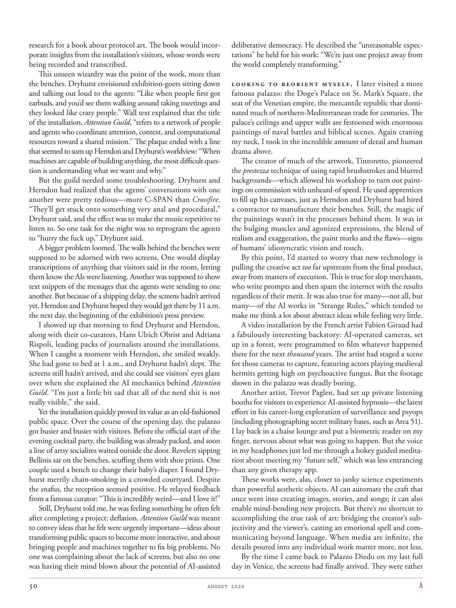

# The Atlantic — August 2026

## Page 52

---

research for a book about protocol art. The book would incorporate insights from the installation’s visitors, whose words were being recorded and transcribed.

**【中文翻译】** 研究一本关于协议艺术的书。这本书将吸收装置参观者的见解，他们的话被记录和转录。

This unseen wizardry was the point of the work, more than the benches. Dryhurst envisioned exhibition-goers sitting down and talking out loud to the agents: “Like when people first got earbuds, and you’d see them walking around taking meetings and they looked like crazy people.” Wall text explained that the title of the installation, Attention Guild , “refers to a network of people and agents who coordinate attention, context, and computational resources toward a shared mission.” The plaque ended with a line that seemed to sum up Herndon and Dryhurst’s worldview: “When machines are capable of building anything, the most difficult question is understanding what we want and why.”

**【中文翻译】** 这种看不见的魔法才是工作的重点，而不是长凳。德莱赫斯特设想参观者坐下来与代理商大声交谈：“就像人们第一次戴上耳机时，你会看到他们走来走去开会，他们看起来就像疯子一样。”墙上的文字解释说，该装置的标题“注意力协会”“指的是一个由人员和代理组成的网络，他们协调注意力、上下文和计算资源以实现共同的任务。”牌匾最后的一句话似乎总结了赫恩登和德莱赫斯特的世界观：“当机器能够建造任何东西时，最困难的问题是理解我们想要什么以及为什么。”

But the guild needed some troubleshooting. Dryhurst and Herndon had realized that the agents’ conversations with one another were pretty tedious—more C-SPAN than Crossfire .

**【中文翻译】** 但公会需要一些故障排除。德莱赫斯特和赫恩登意识到特工之间的对话相当乏味——更像是 C-SPAN，而不是交火。

“They’ll get stuck onto something very anal and procedural,” Dryhurst said, and the effect was to make the music repetitive to listen to. So one task for the night was to reprogram the agents to “hurry the fuck up,” Dryhurst said.

**【中文翻译】** “他们会陷入一些非常肛门和程序化的东西，”德莱赫斯特说，其效果是让音乐重复听。德莱赫斯特说，所以当晚的一项任务就是对特工进行重新编程，让他们“快点行动起来”。

A bigger problem loomed. The walls behind the benches were supposed to be adorned with two screens. One would display transcriptions of anything that visitors said in the room, letting them know the AIs were listening. Another was supposed to show text snippets of the messages that the agents were sending to one another. But because of a shipping delay, the screens hadn’t arrived yet. Herndon and Dryhurst hoped they would get there by 11 a.m. the next day, the beginning of the exhibition’s press preview.

**【中文翻译】** 一个更大的问题出现了。长凳后面的墙壁应该装饰有两个屏风。一个人会显示访客在房间里所说的任何内容的转录，让他们知道人工智能正在倾听。另一个应该显示代理相互发送的消息的文本片段。但由于运输延误，屏幕尚未到达。赫恩登和德莱赫斯特希望他们能在第二天上午 11 点之前到达那里，即展览新闻预览的开始。

I showed up that morning to find Dryhurst and Herndon, along with their co-curators, Hans Ulrich Obrist and Adriana Rispoli, leading packs of journalists around the installations.

**【中文翻译】** 那天早上我出现时，发现德利赫斯特和赫恩登以及他们的联合策展人汉斯·乌尔里希·奥布里斯特和阿德里亚娜·里斯波利正带领着一群记者参观了装置。

When I caught a moment with Herndon, she smiled weakly. She had gone to bed at 1 a.m., and Dryhurst hadn’t slept. The screens still hadn’t arrived, and she could see visitors’ eyes glaze over when she explained the AI mechanics behind Attention Guild . “I’m just a little bit sad that all of the nerd shit is not really visible,” she said.

**【中文翻译】** 当我看到赫恩登时，她虚弱地笑了笑。她凌晨 1 点就上床睡觉了，而德莱赫斯特还没有睡。屏幕还没有到达，当她解释注意力公会背后的人工智能机制时，她可以看到参观者的目光呆滞。 “我只是有点难过，因为所有的书呆子狗屎都没有真正可见，”她说。

Yet the installation quickly proved its value as an old-fashioned public space. Over the course of the opening day, the palazzo got busier and busier with visitors. Before the official start of the evening cocktail party, the building was already packed, and soon a line of artsy socialites waited outside the door. Revelers sipping Bellinis sat on the benches, scuffing them with shoe prints. One couple used a bench to change their baby’s diaper. I found Dryhurst merrily chain-smoking in a crowded courtyard. Despite the snafus, the reception seemed positive. He relayed feedback from a famous curator: “This is incredibly weird—and I love it!”

**【中文翻译】** 然而，该装置很快证明了其作为老式公共空间的价值。开幕当天，宫殿里的游客越来越忙碌。晚会鸡尾酒会还没正式开始，大楼里就已经挤满了人，很快门外就排满了文艺名流。狂欢者坐在长凳上喝着贝利尼酒，在长凳上留下了鞋印。一对夫妇用长凳给孩子换尿布。我发现德利赫斯特在拥挤的庭院里愉快地抽烟。尽管出现了混乱，但反响似乎很积极。他转达了一位著名策展人的反馈：“这太奇怪了——但我喜欢它！”

Still, Dryhurst told me, he was feeling something he often felt after completing a project: deflation. Attention Guild was meant to convey ideas that he felt were urgently important—ideas about transforming public spaces to become more interactive, and about bringing people and machines together to fix big problems. No one was complaining about the lack of screens, but also no one was having their mind blown about the potential of AI-assisted deliberative democracy. He described the “unreasonable expectations” he held for his work: “We’re just one project away from the world completely transforming.”

**【中文翻译】** 尽管如此，德莱赫斯特告诉我，他在完成一个项目后经常感受到某种感觉：通货紧缩。 Attention Guild 的目的是传达他认为迫切重要的想法——改变公共空间以使其更具互动性，以及将人和机器结合在一起解决重大问题。没有人抱怨缺乏屏幕，但也没有人对人工智能辅助协商民主的潜力感到震惊。他描述了他对自己的工作抱有的“不合理的期望”：“我们距离彻底改变的世界仅差一个项目。”

Looking to reorient myself, I later visited a more famous palazzo: the Doge’s Palace on St. Mark’s Square, the seat of the Venetian empire, the mercantile republic that dominated much of northern-Mediterranean trade for centuries. The palace’s ceilings and upper walls are festooned with enormous paintings of naval battles and biblical scenes. Again craning my neck, I took in the incredible amount of detail and human drama above.

**【中文翻译】** 为了重新定位自己，我后来参观了一座更著名的宫殿：圣马可广场上的总督宫，威尼斯帝国的所在地，威尼斯帝国是一个商业共和国，几个世纪以来主导了大部分地中海北部贸易。宫殿的天花板和上墙装饰着海战和圣经场景的巨幅画作。我再次伸长脖子，欣赏了上面令人难以置信的大量细节和人类戏剧。

The creator of much of the artwork, Tintoretto, pioneered the prestezza technique of using rapid brushstrokes and blurred backgrounds—which allowed his workshop to turn out paintings on commission with unheard-of speed. He used apprentices to fill up his canvases, just as Herndon and Dryhurst had hired a contractor to manufacture their benches. Still, the magic of the paintings wasn’t in the processes behind them. It was in the bulging muscles and agonized expressions, the blend of realism and exaggeration, the paint marks and the flaws—signs of humans’ idiosyncratic vision and touch.

**【中文翻译】** 大部分艺术品的创作者丁托列托（Tintoretto）开创了使用快速笔触和模糊背景的普雷斯特扎（prestezza）技术，这使得他的工作室能够以闻所未闻的速度创作委托画作。他使用学徒来填充他的画布，就像赫恩登和德莱赫斯特聘请承包商来制造他们的长凳一样。尽管如此，这些画作的魔力并不在于它们背后的过程。它存在于鼓起的肌肉和痛苦的表情中，存在于现实与夸张的混合之中，存在于油漆痕迹和缺陷中——人类特殊的视觉和触觉的迹象。

By this point, I’d started to worry that new technology is pulling the creative act too far upstream from the final product, away from matters of execution. This is true for slop merchants, who write prompts and then spam the internet with the results regardless of their merit. It was also true for many—not all, but many—of the AI works in “Strange Rules,” which tended to make me think a lot about abstract ideas while feeling very little.

**【中文翻译】** 此时，我开始担心新技术正在将创意行为从最终产品的上游拉得太远，远离执行问题。对于废品商人来说就是如此，他们写下提示，然后将结果发送到互联网上，而不管其优点如何。 《奇怪的规则》中的许多（不是全部，但很多）人工智能作品也是如此，这往往让我思考很多抽象的想法，但感觉却很少。

A video installation by the French artist Fabien Giraud had a fabulously interesting backstory: AI-operated cameras, set up in a forest, were programmed to film whatever happened there for the next thousand years. The artist had staged a scene for those cameras to capture, featuring actors playing medieval hermits getting high on psychoactive fungus. But the footage shown in the palazzo was deadly boring.

**【中文翻译】** 法国艺术家法比安·吉罗 (Fabien Giraud) 的一个视频装置有一个非常有趣的背景故事：人工智能操作的摄像机安装在森林中，被编程为拍摄接下来一千年那里发生的一切。艺术家为这些摄像机拍摄了一个场景，演员们扮演中世纪的隐士，因为服用了精神活性真菌而兴奋不已。但宫殿里播放的镜头却极其无聊。

Another artist, Trevor Paglen, had set up private listening booths for visitors to experience AI-assisted hypnosis— the latest effort in his career-long exploration of surveillance and psyops (including photographing secret military bases, such as Area 51).

**【中文翻译】** 另一位艺术家特雷弗·帕格伦 (Trevor Paglen) 设立了私人聆听室，供游客体验人工智能辅助催眠，这是他在整个职业生涯中探索监视和心理战（包括拍摄秘密军事基地，如 51 区）的最新成果。

I lay back in a chaise lounge and put a biometric reader on my finger, nervous about what was going to happen. But the voice in my headphones just led me through a hokey guided meditation about meeting my “future self,” which was less entrancing than any given therapy app.

**【中文翻译】** 我躺在躺椅上，把生物识别阅读器戴在手指上，对即将发生的事情感到紧张。但耳机里的声音只是引导我进行了一场关于遇见“未来的自己”的做作引导冥想，这比任何给定的治疗应用程序都不那么令人着迷。

These works were, alas, closer to janky science experiments than powerful aesthetic objects. AI can automate the craft that once went into creating images, stories, and songs; it can also enable mind-bending new projects. But there’s no shortcut to accomplishing the true task of art: bridging the creator’s subjectivity and the viewer’s, casting an emotional spell and communicating beyond language. When media are infinite, the details poured into any individual work matter more, not less.

**【中文翻译】** 唉，这些作品更接近于蹩脚的科学实验，而不是强大的审美对象。人工智能可以使曾经用于创建图像、故事和歌曲的工艺自动化；它还可以实现令人费解的新项目。但完成艺术的真正任务没有捷径：连接创作者的主观性和观众的主观性，施展情感咒语并进行超越语言的交流。当媒体无限时，任何个人作品中的细节都变得更加重要，而不是更少。

By the time I came back to Palazzo Diedo on my last full day in Venice, the screens had finally arrived. They were rather

**【中文翻译】** 当我在威尼斯的最后一整天回到帕拉佐迪耶多时，银幕终于到了。他们相当
