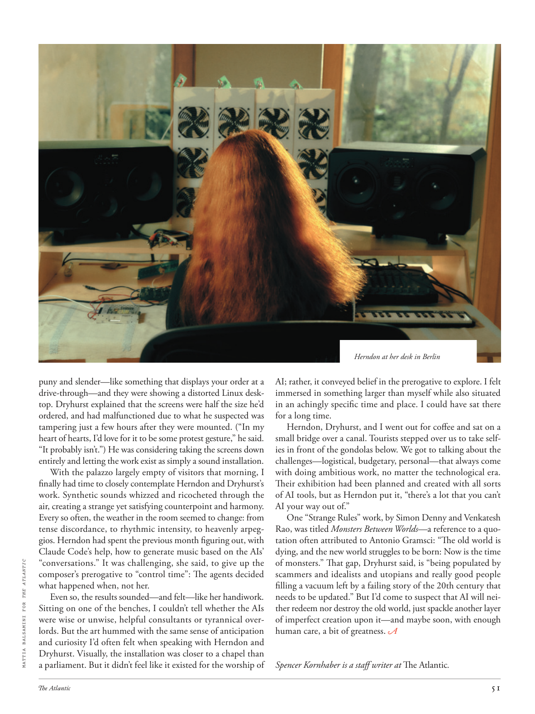

# The Atlantic — August 2026

## Page 53

---

puny and slender—like something that displays your order at a drive-through—and they were showing a distorted Linux desktop. Dryhurst explained that the screens were half the size he’d ordered, and had malfunctioned due to what he suspected was tampering just a few hours after they were mounted. (“In my heart of hearts, I’d love for it to be some protest gesture,” he said.

**【中文翻译】** 微弱而细长——就像在得来速餐厅显示你的订单的东西——而且他们展示了一个扭曲的Linux桌面。德莱赫斯特解释说，这些屏幕的尺寸只有他订购的一半，并且由于他怀疑在安装后几个小时就被篡改而发生了故障。 （“在我内心深处，我希望这是某种抗议姿态，”他说。

“It probably isn’t.”) He was considering taking the screens down entirely and letting the work exist as simply a sound installation. With the palazzo largely empty of visitors that morning, I finally had time to closely contemplate Herndon and Dryhurst’s work. Synthetic sounds whizzed and ricocheted through the air, creating a strange yet satisfying counterpoint and harmony.

**【中文翻译】** “可能不是。”）他正在考虑完全拆除屏幕，让作品仅仅作为一个声音装置而存在。那天早上，宫殿里基本上没有游客，我终于有时间仔细思考赫恩登和德莱赫斯特的作品。合成声音在空气中呼啸而过，创造出一种奇怪但令人满意的对位与和声。

Every so often, the weather in the room seemed to change: from tense discordance, to rhythmic intensity, to heavenly arpeggios. Herndon had spent the previous month figuring out, with Claude Code’s help, how to generate music based on the AIs’ “conversations.” It was challenging, she said, to give up the MATTIA BALSAMINI FOR THE ATLANTIC composer’s prerogative to “control time”: The agents decided what happened when, not her.

**【中文翻译】** 每隔一段时间，房间里的气氛似乎就会发生变化：从紧张的不和谐音，到节奏的强度，到天堂般的琶音。赫恩登上个月在克劳德·科德的帮助下弄清楚了如何根据人工智能的“对话”生成音乐。她说，放弃《大西洋》作曲家马蒂亚·巴尔萨米尼“控制时间”的特权是一项挑战：决定何时发生的事情是由特工决定的，而不是她。

Even so, the results sounded—and felt—like her handiwork. Sitting on one of the benches, I couldn’t tell whether the AIs were wise or unwise, helpful consultants or tyrannical overlords. But the art hummed with the same sense of anticipation and curiosity I’d often felt when speaking with Herndon and Dryhurst. Visually, the installation was closer to a chapel than a parliament. But it didn’t feel like it existed for the worship of AI; rather, it conveyed belief in the prerogative to explore. I felt immersed in something larger than myself while also situated in an achingly specific time and place. I could have sat there for a long time.

**【中文翻译】** 即便如此，结果听起来——而且感觉上——就像她的杰作。坐在其中一张长凳上，我无法判断人工智能是明智还是不明智，是乐于助人的顾问还是残暴的霸主。但艺术中充满了我在与赫恩登和德莱赫斯特交谈时经常感受到的同样的期待和好奇。从视觉上看，这个装置更接近教堂而不是议会。但感觉它的存在并不是为了崇拜人工智能；相反，它传达了对探索特权的信念。我感觉自己沉浸在比自己更大的事物中，同时又处于一个令人痛苦的特定时间和地点。我可以在那里坐很长时间。

Herndon, Dryhurst, and I went out for coffee and sat on a small bridge over a canal. Tourists stepped over us to take selfies in front of the gondolas below. We got to talking about the challenges—logistical, budgetary, personal—that always come with doing ambitious work, no matter the technological era.

**【中文翻译】** 赫恩登、德莱赫斯特和我出去喝咖啡，坐在运河上的一座小桥上。游客们跨过我们，在下面的缆车前自拍。我们讨论了无论在什么技术时代，雄心勃勃的工作总会带来的挑战——后勤、预算、个人。

Their exhibition had been planned and created with all sorts of AI tools, but as Herndon put it, “there’s a lot that you can’t AI your way out of.”

**【中文翻译】** 他们的展览是用各种人工智能工具策划和创建的，但正如赫恩登所说，“有很多东西是你无法通过人工智能摆脱的。”

One “Strange Rules” work, by Simon Denny and Venkatesh Rao, was titled Monsters Between Worlds —a reference to a quotation often attributed to Antonio Gramsci: “The old world is dying, and the new world struggles to be born: Now is the time of monsters.” That gap, Dryhurst said, is “being populated by scammers and idealists and utopians and really good people filling a vacuum left by a failing story of the 20th century that needs to be updated.” But I’d come to suspect that AI will neither redeem nor destroy the old world, just spackle another layer of imperfect creation upon it—and maybe soon, with enough human care, a bit of greatness.

**【中文翻译】** 西蒙·丹尼（Simon Denny）和文卡特什·拉奥（Venkatesh Rao）创作的一部《奇怪的规则》作品名为《世界之间的怪物》——引用了安东尼奥·葛兰西经常引用的一句话：“旧世界正在消亡，新世界正在努力诞生：现在是怪物的时代。”德莱赫斯特说，这个缺口“被骗子、理想主义者、乌托邦主义者和真正的好人所填补，填补了 20 世纪一个需要更新的失败故事留下的真空。”但我开始怀疑人工智能既不会拯救也不会摧毁旧世界，只会在其上涂抹另一层不完美的创造——也许很快，只要有足够的人类关怀，就会有一点伟大。

*— Spencer Kornhaber is a staff writer at The Atlantic .*

*【作者署名】斯宾塞·科恩哈伯 (Spencer Kornhaber) 是《大西洋月刊》的特约撰稿人。*

Herndon at her desk in Berlin

**【中文翻译】** 赫恩登在柏林的办公桌前
