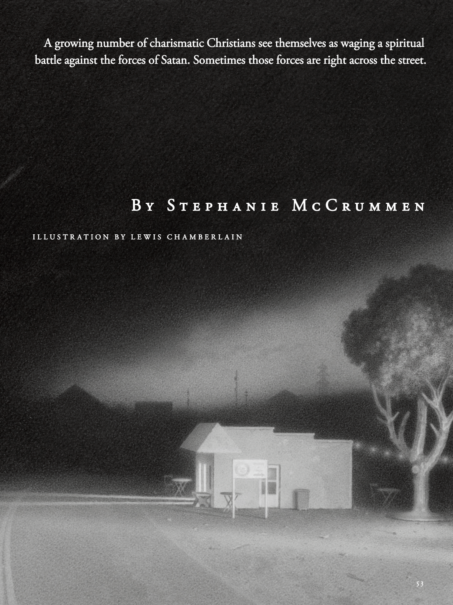

# The Atlantic — August 2026

## Page 55

---

#### A growing number of charismatic Christians see themselves as waging a spiritual

**【副标题翻译】** 越来越多有魅力的基督徒认为自己正在开展一场精神活动

#### battle against the forces of Satan. Sometimes those forces are right across the street.

**【副标题翻译】** 与撒但的势力作战。有时这些力量就在街对面。

### B y S t e p h a n i e M c C r u m m e n

**【标题翻译】** 作者：斯蒂芬妮·麦克克鲁曼

I L L U S T R A T I O N B Y L E W I S C H A M B E R L A I N

**【中文翻译】** 插图作者：L W I S C A M B E R L A I N
