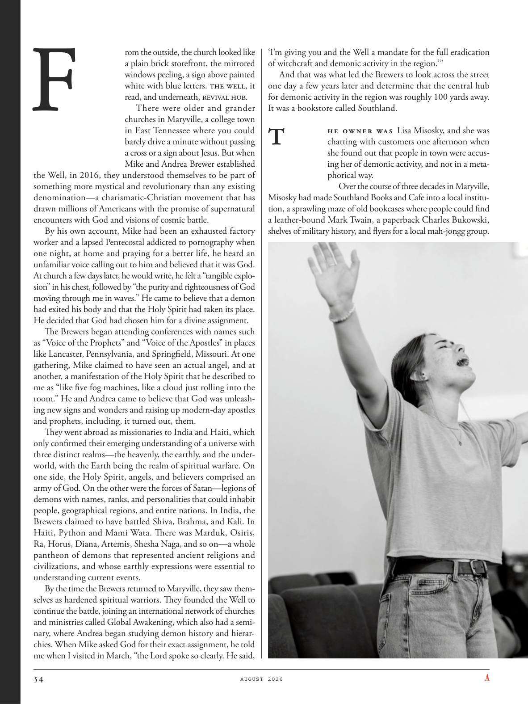

# The Atlantic — August 2026

## Page 56

---

rom the outside, the church looked like a plain brick storefront, the mirrored windows peeling, a sign above painted white with blue letters. The Well, it read, and underneath, Revival Hub.

**【中文翻译】** 从外面看，教堂就像一个朴素的砖砌店面，镜面窗户剥落，上面的标志漆成白色，蓝色字母。上面写着“井”，下面是“复兴中心”。

There were older and grander churches in Maryville, a college town in East Tennessee where you could barely drive a minute without passing a cross or a sign about Jesus. But when Mike and Andrea Brewer established the Well, in 2016, they understood themselves to be part of something more mystical and revolutionary than any existing denomination—a charismatic-Christian movement that has drawn millions of Americans with the promise of supernatural encounters with God and visions of cosmic battle.

**【中文翻译】** 玛丽维尔是田纳西州东部的一个大学城，那里有更古老、更宏伟的教堂，在那里开车一分钟都会经过一个十字架或有关耶稣的标志。但当迈克和安德里亚·布鲁尔 (Mike and Andrea Brewer) 在 2016 年创立“The Well”时，他们明白自己是比任何现有教派都更神秘、更具革命性的组织的一部分，这是一场具有超凡魅力的基督教运动，它以与上帝超自然相遇和宇宙战争愿景的承诺吸引了数百万美国人。

By his own account, Mike had been an exhausted factory worker and a lapsed Pentecostal addicted to pornography when one night, at home and praying for a better life, he heard an un familiar voice calling out to him and believed that it was God.

**【中文翻译】** 根据迈克自己的说法，他曾是一名精疲力尽的工厂工人，也是一名沉迷于色情作品的五旬节派信徒，有一天晚上，他在家里祈祷更好的生活，听到一个陌生的声音在呼唤他，并相信那是上帝。

At church a few days later, he would write, he felt a “tangible explosion” in his chest, followed by “the purity and righteousness of God moving through me in waves.” He came to believe that a demon had exited his body and that the Holy Spirit had taken its place.

**【中文翻译】** 几天后，在教堂里，他写道，他感到胸口有“明显的爆炸”，随后“上帝的纯洁和公义如波浪般流过我的身体”。他开始相信恶魔已经离开了他的身体，圣灵取代了它的位置。

He decided that God had chosen him for a divine assignment. The Brewers began attending conferences with names such as “Voice of the Prophets” and “Voice of the Apostles” in places like Lancaster, Pennsylvania, and Springfield, Missouri. At one gathering, Mike claimed to have seen an actual angel, and at another, a manifestation of the Holy Spirit that he described to me as “like five fog machines, like a cloud just rolling into the room.” He and Andrea came to believe that God was unleashing new signs and wonders and raising up modern-day apostles and prophets, including, it turned out, them.

**【中文翻译】** 他认定上帝选择了他来执行一项神圣的任务。酿酒人开始参加在宾夕法尼亚州兰卡斯特和密苏里州斯普林菲尔德等地举行的名为“先知之声”和“使徒之声”的会议。在一次聚会上，迈克声称看到了一位真正的天使，而在另一次聚会上，他向我描述了圣灵的显现，“就像五台造雾机，就像一朵云刚刚滚进房间。”他和安德里亚开始相信上帝正在释放新的神迹和奇事，并兴起了现代的使徒和先知，事实证明，也包括他们。

They went abroad as missionaries to India and Haiti, which only confirmed their emerging understanding of a universe with three distinct realms—the heavenly, the earthly, and the underworld, with the Earth being the realm of spiritual warfare. On one side, the Holy Spirit, angels, and believers comprised an army of God. On the other were the forces of Satan—legions of demons with names, ranks, and personalities that could inhabit people, geographical regions, and entire nations. In India, the Brewers claimed to have battled Shiva, Brahma, and Kali. In Haiti, Python and Mami Wata. There was Marduk, Osiris, Ra, Horus, Diana, Artemis, Shesha Naga, and so on— a whole pantheon of demons that represented ancient religions and civilizations, and whose earthly expressions were essential to understanding current events.

**【中文翻译】** 他们作为传教士前往印度和海地，这只是证实了他们对宇宙的新认识，宇宙具有三个不同的领域——天上、地上和地狱，而地球是精神战争的领域。一方面，圣灵、天使和信徒组成了神的军队。另一方面是撒旦的势力——恶魔军团，它们的名字、等级和个性可以居住在人民、地理区域和整个国家。在印度，酿酒人声称曾与湿婆、梵天和卡利战斗。在海地，Python 和 Mami Wata。有马杜克、奥西里斯、拉、荷鲁斯、戴安娜、阿耳忒弥斯、示莎娜迦等等——代表古代宗教和文明的一整套恶魔万神殿，他们的尘世表达对于理解时事至关重要。

By the time the Brewers returned to Maryville, they saw themselves as hardened spiritual warriors. They founded the Well to continue the battle, joining an international network of churches and ministries called Global Awakening, which also had a seminary, where Andrea began studying demon history and hierarchies. When Mike asked God for their exact assignment, he told me when I visited in March, “the Lord spoke so clearly. He said, ‘I’m giving you and the Well a mandate for the full eradication of witchcraft and demonic activity in the region.’” And that was what led the Brewers to look across the street one day a few years later and determine that the central hub for demonic activity in the region was roughly 100 yards away.

**【中文翻译】** 当酿酒人回到玛丽维尔时，他们将自己视为坚强的精神战士。他们建立了井来继续战斗，加入了一个名为“全球觉醒”的国际教会和事工网络，该网络也有一所神学院，安德里亚开始在那里研究恶魔的历史和等级制度。当迈克向上帝询问他们的具体任务时，他在我三月份访问时告诉我，“主说得很清楚。他说，‘我给你和井的一项任务是彻底根除该地区的巫术和恶魔活动。’”这就是导致酿酒人在几年后的某一天向街对面望去并确定该地区恶魔活动的中心枢纽就在大约 100 码之外的原因。

It was a bookstore called Southland.

**【中文翻译】** 那是一家叫Southland的书店。

### T

he owner was Lisa Misosky, and she was chatting with customers one afternoon when she found out that people in town were accusing her of demonic activity, and not in a metaphorical way.

**【中文翻译】** 店主是丽莎·米索斯基（Lisa Misosky），一天下午，她正在与顾客聊天时，发现镇上的人们指责她从事恶魔活动，而且不是以隐喻的方式。

Over the course of three decades in Maryville, Misosky had made Southland Books and Cafe into a local institution, a sprawling maze of old bookcases where people could find a leather-bound Mark Twain, a paperback Charles Bukowski, shelves of military history, and flyers for a local mah-jongg group.

**【中文翻译】** 在玛丽维尔的三十年里，米索斯基把南国书店和咖啡馆打造成当地的一个机构，一个由旧书柜组成的庞大迷宫，人们可以在那里找到皮革装订的马克·吐温、平装本查尔斯·布考斯基、军事历史的书架以及当地麻将团体的传单。
