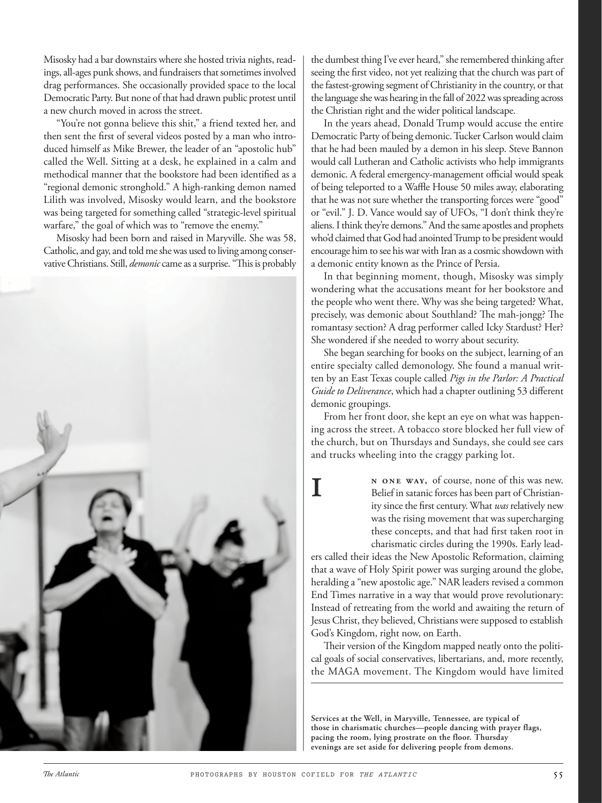

# The Atlantic — August 2026

## Page 57

---

Misosky had a bar downstairs where she hosted trivia nights, readings, all-ages punk shows, and fundraisers that sometimes involved drag performances. She occasionally provided space to the local Democratic Party. But none of that had drawn public protest until a new church moved in across the street.

**【中文翻译】** 米索斯基在楼下有一家酒吧，她在那里举办问答之夜、读书会、全年龄段的朋克表演和筹款活动，有时还包括变装表演。她偶尔为当地民主党提供空间。但直到街对面一座新教堂搬入之前，这一切都没有引起公众抗议。

“You’re not gonna believe this shit,” a friend texted her, and then sent the first of several videos posted by a man who introduced himself as Mike Brewer, the leader of an “apostolic hub” called the Well. Sitting at a desk, he explained in a calm and methodical manner that the bookstore had been identified as a “regional demonic stronghold.” A high-ranking demon named Lilith was involved, Misosky would learn, and the bookstore was being targeted for something called “strategic-level spiritual warfare,” the goal of which was to “remove the enemy.”

**【中文翻译】** “你不会相信这些狗屎，”一位朋友给她发短信，然后发送了一个男子发布的几段视频中的第一个，该男子自称是迈克·布鲁尔（Mike Brewer），他是一个名为“The Well”的“使徒中心”的领导人。他坐在办公桌前，冷静而有条理地解释说，该书店已被认定为“地区恶魔据点”。米索斯基了解到，一个名叫莉莉丝的高级恶魔参与其中，而这家书店正成为所谓“战略级精神战争”的目标，其目标是“消灭敌人”。

Misosky had been born and raised in Maryville. She was 58, Catholic, and gay, and told me she was used to living among conservative Christians. Still, demonic came as a surprise. “This is probably

**【中文翻译】** 米索斯基在玛丽维尔出生并长大。她今年 58 岁，天主教徒，同性恋，她告诉我她习惯了和保守的基督徒生活在一起。尽管如此，恶魔的到来还是令人惊讶。 “这大概是

*PHOTOGRAPHS BY HOUSTON COFIELD FOR THE ATLANTIC*

*【图注与署名】休斯顿·科菲尔德为《大西洋》拍摄的照片*

the dumbest thing I’ve ever heard,” she remembered thinking after seeing the first video, not yet realizing that the church was part of the fastest-growing segment of Christianity in the country, or that the language she was hearing in the fall of 2022 was spreading across the Christian right and the wider political landscape.

**【中文翻译】** 我听过的最愚蠢的事情。”她记得在看到第一个视频后这样想，但她还没有意识到教会是该国基督教发展最快的部分的一部分，也没有意识到她在 2022 年秋天听到的语言正在基督教右翼和更广泛的政治格局中传播。

In the years ahead, Donald Trump would accuse the entire Democratic Party of being demonic. Tucker Carlson would claim that he had been mauled by a demon in his sleep. Steve Bannon would call Lutheran and Catholic activists who help immigrants demonic. A federal emergencymanagement official would speak of being teleported to a Waffle House 50 miles away, elaborating that he was not sure whether the transporting forces were “good” or “evil.” J. D. Vance would say of UFOs, “I don’t think they’re aliens. I think they’re demons.” And the same apostles and prophets who’d claimed that God had anointed Trump to be president would encourage him to see his war with Iran as a cosmic showdown with a demonic entity known as the Prince of Persia.

**【中文翻译】** 在未来的几年里，唐纳德·特朗普将指责整个民主党都是恶魔。塔克·卡尔森声称他在睡梦中被恶魔殴打。史蒂夫·班农（Steve Bannon）将帮助移民的路德教和天主教活动人士称为恶魔。一位联邦应急管理官员谈到被传送到 50 英里外的华夫饼屋时，详细说明他不确定运输部队是“善”还是“恶”。 J. D. 万斯谈到不明飞行物时会说：“我不认为它们是外星人。我认为它们是恶魔。”那些声称上帝任命特朗普为总统的使徒和先知会鼓励他将与伊朗的战争视为与被称为波斯王子的恶魔实体的宇宙对决。

In that beginning moment, though, Misosky was simply wondering what the accusations meant for her bookstore and the people who went there. Why was she being targeted? What, precisely, was demonic about Southland? The mah-jongg? The romantasy section? A drag performer called Icky Stardust? Her?

**【中文翻译】** 然而，从一开始，米索斯基只是想知道这些指控对她的书店和去那里的人意味着什么。为什么她会成为攻击目标？南国到底有什么魔性？麻将？浪漫爱情区？一个叫 Icky Stardust 的变装表演者？她？

She wondered if she needed to worry about security. She began searching for books on the subject, learning of an entire specialty called demonology. She found a manual written by an East Texas couple called Pigs in the Parlor: A Practical Guide to Deliverance , which had a chapter outlining 53 different demonic groupings.

**【中文翻译】** 她想知道是否需要担心安全问题。她开始寻找有关这个主题的书籍，学习一门叫做恶魔学的专业。她找到了一本由德克萨斯州东部的一对夫妇写的手册，名为《客厅里的猪：拯救实用指南》，其中有一章概述了 53 个不同的恶魔群体。

From her front door, she kept an eye on what was happening across the street. A tobacco store blocked her full view of the church, but on Thursdays and Sundays, she could see cars and trucks wheeling into the craggy parking lot.

**【中文翻译】** 她从前门注视着街对面发生的事情。一家烟草店挡住了她对教堂的全景，但在周四和周日，她可以看到汽车和卡车驶进崎岖的停车场。

### I

n one way, of course, none of this was new. Belief in satanic forces has been part of Christianity since the first century. What was relatively new was the rising movement that was super charging these concepts, and that had first taken root in charismatic circles during the 1990s. Early leaders called their ideas the New Apostolic Reformation, claiming that a wave of Holy Spirit power was surging around the globe, heralding a “new apostolic age.” NAR leaders revised a common End Times narrative in a way that would prove revolutionary: Instead of retreating from the world and awaiting the return of Jesus Christ, they believed, Christians were supposed to establish God’s Kingdom, right now, on Earth.

**【中文翻译】** 当然，从某种意义上说，这一切都不是什么新鲜事。自一世纪以来，对撒旦势力的信仰一直是基督教的一部分。相对较新的是兴起的运动，它对这些概念进行了大力推动，并在 20 世纪 90 年代首次在魅力圈子中扎根。早期领袖将他们的想法称为新使徒宗教改革，声称一股圣灵力量的浪潮正在全球涌动，预示着“新使徒时代”的到来。 NAR 领导人以革命性的方式修改了常见的末日叙述：他们相信，基督徒应该立即在地球上建立上帝的王国，而不是从世界撤退并等待耶稣基督的回归。

Their version of the Kingdom mapped neatly onto the political goals of social conservatives, libertarians, and, more recently, the MAGA movement. The Kingdom would have limited Services at the Well, in Maryville, Tennessee, are typical of those in charismatic churches—people dancing with prayer flags, pacing the room, lying prostrate on the floor. Thursday evenings are set aside for delivering people from demons.

**【中文翻译】** 他们的王国版本完美地反映了社会保守派、自由主义者以及最近的 MAGA 运动的政治目标。田纳西州玛丽维尔的“The Well”教堂的礼拜仪式是有限的，这是典型的超凡魅力教堂的仪式——人们举着经旗跳舞，在房间里踱来踱去，趴在地板上。周四晚上专门用来拯救人们脱离恶魔。
