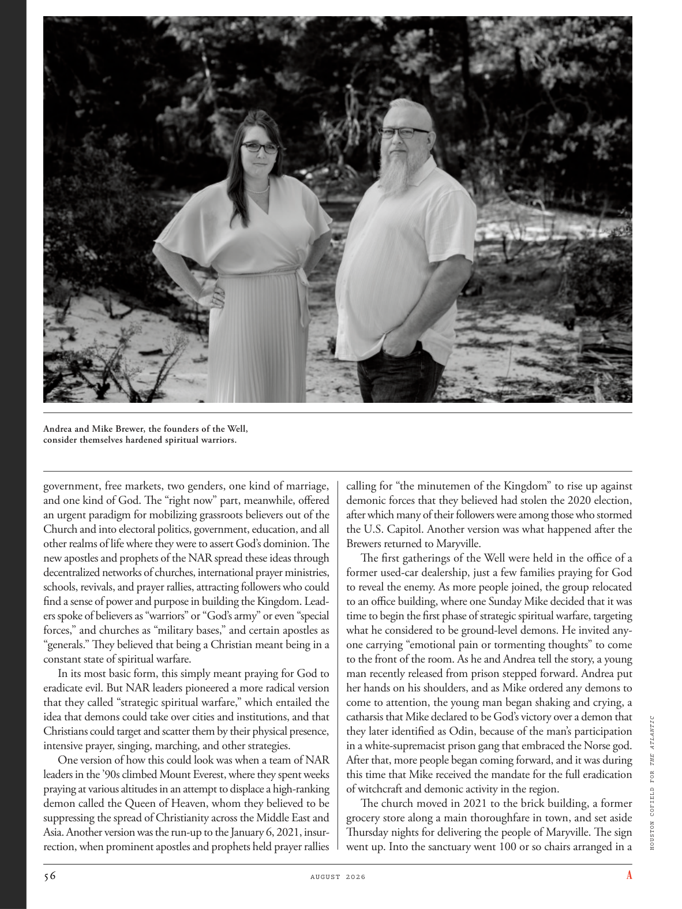

# The Atlantic — August 2026

## Page 58

---

Andrea and Mike Brewer, the founders of the Well, consider themselves hardened spiritual warriors. government, free markets, two genders, one kind of marriage, and one kind of God. The “right now” part, meanwhile, offered an urgent paradigm for mobilizing grassroots believers out of the Church and into electoral politics, government, education, and all other realms of life where they were to assert God’s dominion. The new apostles and prophets of the NAR spread these ideas through decentralized networks of churches, international prayer ministries, schools, revivals, and prayer rallies, attracting followers who could find a sense of power and purpose in building the Kingdom. Leaders spoke of believers as “warriors” or “God’s army” or even “special forces,” and churches as “military bases,” and certain apostles as “generals.” They believed that being a Christian meant being in a constant state of spiritual warfare.

**【中文翻译】** Well 的创始人安德里亚·布鲁尔 (Andrea Brewer) 和迈克·布鲁尔 (Mike Brewer) 认为自己是坚强的精神战士。政府、自由市场、两种性别、一种婚姻和一种上帝。与此同时，“现在”部分提供了一个紧迫的范式，动员基层信徒离开教会，进入选举政治、政府、教育和所有其他生活领域，以维护上帝的统治。 NAR 的新使徒和先知通过分散的教会网络、国际祈祷事工、学校、复兴和祈祷集会传播这些思想，吸引追随者，他们可以在建设王国的过程中找到力量和目标感。领袖们将信徒称为“战士”或“上帝的军队”，甚至“特种部队”，将教堂称为“军事基地”，将某些使徒称为“将军”。他们相信，成为一名基督徒就意味着不断处于属灵争战的状态。

In its most basic form, this simply meant praying for God to eradicate evil. But NAR leaders pioneered a more radical version that they called “strategic spiritual warfare,” which entailed the idea that demons could take over cities and institutions, and that Christians could target and scatter them by their physical presence, intensive prayer, singing, marching, and other strategies.

**【中文翻译】** 就其最基本的形式而言，这仅仅意味着祈求上帝消除邪恶。但NAR领导人开创了一种更激进的版本，他们称之为“战略性精神战争”，其中包含这样一种想法：恶魔可以占领城市和机构，而基督徒可以通过他们的实际存在、密集的祈祷、唱歌、游行和其他策略来瞄准和驱散它们。

One version of how this could look was when a team of NAR leaders in the ’90s climbed Mount Everest, where they spent weeks praying at various altitudes in an attempt to displace a high-ranking demon called the Queen of Heaven, whom they believed to be suppressing the spread of Christianity across the Middle East and Asia. Another version was the run-up to the January 6, 2021, insurrection, when prominent apostles and prophets held prayer rallies calling for “the minutemen of the Kingdom” to rise up against demonic forces that they believed had stolen the 2020 election, after which many of their followers were among those who stormed the U.S. Capitol. Another version was what happened after the Brewers returned to Maryville.

**【中文翻译】** 一个版本的说法是，20世纪90年代，一群NAR领导人攀登珠穆朗玛峰，他们花了数周的时间在不同的海拔高度祈祷，试图取代一个被称为天后的高级恶魔，他们相信天后正在压制基督教在中东和亚洲的传播。另一个版本是 2021 年 1 月 6 日叛乱前夕，当时著名的使徒和先知举行祈祷集会，呼吁“王国的民兵”起来反抗他们认为窃取了 2020 年选举的恶魔势力，此后他们的许多追随者成为了袭击美国国会大厦的人之一。另一个版本是酿酒人队返回玛丽维尔后发生的事情。

The first gatherings of the Well were held in the office of a former used-car dealership, just a few families praying for God to reveal the enemy. As more people joined, the group relocated to an office building, where one Sunday Mike decided that it was time to begin the first phase of strategic spiritual warfare, targeting what he considered to be ground-level demons. He invited anyone carrying “emotional pain or tormenting thoughts” to come to the front of the room. As he and Andrea tell the story, a young man recently released from prison stepped forward. Andrea put her hands on his shoulders, and as Mike ordered any demons to come to attention, the young man began shaking and crying, a catharsis that Mike declared to be God’s victory over a demon that they later identified as Odin, because of the man’s participation in a white-supremacist prison gang that embraced the Norse god.

**【中文翻译】** 井的第一次聚会是在一家前二手车经销商的办公室里举行的，只有几个家庭祈祷上帝揭露敌人。随着越来越多的人加入，该组织搬到了一座办公楼，周日，迈克决定是时候开始第一阶段的战略精神战争了，目标是他认为是地面的恶魔。他邀请任何带着“情感上的痛苦或折磨人的想法”的人来到房间的前面。当他和安德里亚讲述这个故事时，一名刚出狱的年轻人走上前来。安德里亚把手放在他的肩膀上，当迈克命令任何恶魔都注意时，这个年轻人开始颤抖和哭泣，迈克宣称这是上帝战胜恶魔的宣泄，他们后来认定这个恶魔是奥丁，因为这个男人参与了一个信奉挪威神的白人至上主义监狱团伙。

After that, more people began coming forward, and it was during this time that Mike received the mandate for the full eradication of witchcraft and demonic activity in the region.

**【中文翻译】** 此后，更多的人开始站出来，正是在这段时间里，迈克收到了彻底根除该地区巫术和恶魔活动的任务。

The church moved in 2021 to the brick building, a former grocery store along a main thoroughfare in town, and set aside Thursday nights for delivering the people of Maryville. The sign went up. Into the sanctuary went 100 or so chairs arranged in a HOUSTON COFIELD FOR THE ATLANTIC

**【中文翻译】** 教堂于 2021 年搬到了一座砖砌建筑，这里以前是镇上主干道旁的一家杂货店，并在周四晚上为玛丽维尔的人们提供救助。牌子升起来了。进入庇护所的有大约 100 张椅子，排列在休斯敦 COFIELD FOR THE ATLANTIC 中
