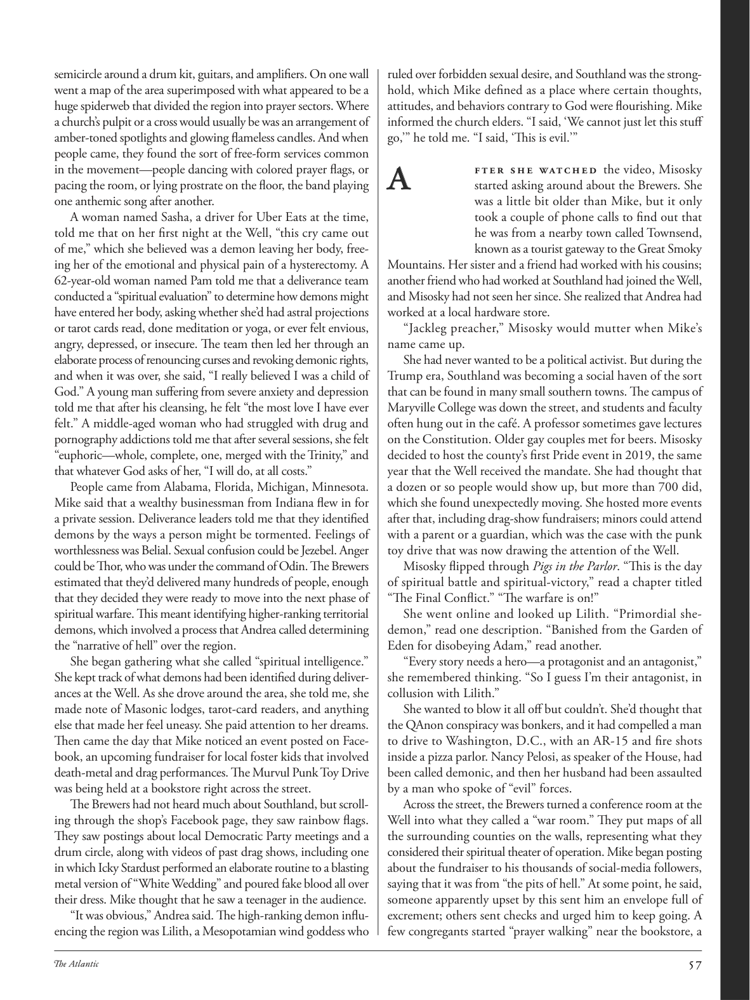

# The Atlantic — August 2026

## Page 59

---

semicircle around a drum kit, guitars, and amplifiers. On one wall went a map of the area superimposed with what appeared to be a huge spiderweb that divided the region into prayer sectors. Where a church’s pulpit or a cross would usually be was an arrangement of amber-toned spotlights and glowing flameless candles. And when people came, they found the sort of free-form services common in the movement—people dancing with colored prayer flags, or pacing the room, or lying prostrate on the floor, the band playing one anthemic song after another.

**【中文翻译】** 围绕架子鼓、吉他和扩音器的半圆形。一面墙上贴着该地区的地图，上面叠加着一张巨大的蜘蛛网，将该地区划分为祈祷区。教堂的讲坛或十字架通常放置着琥珀色的聚光灯和发光的无焰蜡烛。当人们来到时，他们发现了运动中常见的那种自由形式的服务——人们拿着彩色经幡跳舞，或者在房间里踱步，或者趴在地板上，乐队演奏一首又一首国歌。

A woman named Sasha, a driver for Uber Eats at the time, told me that on her first night at the Well, “this cry came out of me,” which she believed was a demon leaving her body, freeing her of the emotional and physical pain of a hysterectomy. A 62-year-old woman named Pam told me that a deliverance team conducted a “spiritual evaluation” to determine how demons might have entered her body, asking whether she’d had astral projections or tarot cards read, done meditation or yoga, or ever felt envious, angry, depressed, or insecure. The team then led her through an elaborate process of renouncing curses and revoking demonic rights, and when it was over, she said, “I really believed I was a child of God.” A young man suffering from severe anxiety and depression told me that after his cleansing, he felt “the most love I have ever felt.” A middle-aged woman who had struggled with drug and pornography addictions told me that after several sessions, she felt “euphoric—whole, complete, one, merged with the Trinity,” and that whatever God asks of her, “I will do, at all costs.”

**【中文翻译】** 一位名叫萨莎的女士当时是 Uber Eats 优食的司机，她告诉我，在她到达 Well 的第一个晚上，“我发出了一声哭声”，她相信这是恶魔离开了她的身体，让她摆脱了子宫切除术带来的情感和身体上的痛苦。一位名叫帕姆的 62 岁女性告诉我，一个拯救小组进行了一次“精神评估”，以确定恶魔可能如何进入她的身体，询问她是否进行过星体预测或塔罗牌，进行过冥想或瑜伽，或者曾经感到嫉妒、愤怒、抑郁或不安全感。然后，团队带领她经历了一个放弃诅咒和撤销恶魔权利的复杂过程，当过程结束时，她说，“我真的相信我是上帝的孩子。”一位患有严重焦虑和抑郁的年轻人告诉我，在净化后，他感受到了“我所感受到的最多的爱”。一位曾与毒品和色情成瘾作斗争的中年妇女告诉我，经过几次治疗后，她感到“欣快——完整、完整、合一，与三位一体融为一体”，无论上帝对她有什么要求，“我都会做，不惜一切代价。”

People came from Alabama, Florida, Michigan, Minnesota. Mike said that a wealthy businessman from Indiana flew in for a private session. Deliverance leaders told me that they identified demons by the ways a person might be tormented. Feelings of worthlessness was Belial. Sexual confusion could be Jezebel. Anger could be Thor, who was under the command of Odin. The Brewers estimated that they’d delivered many hundreds of people, enough that they decided they were ready to move into the next phase of spiritual warfare. This meant identifying higher-ranking territorial demons, which involved a process that Andrea called determining the “narrative of hell” over the region.

**【中文翻译】** 人们来自阿拉巴马州、佛罗里达州、密歇根州、明尼苏达州。迈克说，一位来自印第安纳州的富商飞来参加私人会议。拯救运动的领导人告诉我，他们通过一个人可能遭受折磨的方式来识别恶魔。感觉自己毫无价值，这就是恶魔。性混乱可能是耶洗别。愤怒可能是奥丁麾下的托尔。酿酒人估计他们已经救了数百人，足以让他们决定准备进入下一阶段的精神战争。这意味着要识别更高级别的领地恶魔，这涉及安德里亚称之为确定该地区“地狱叙事”的过程。

She began gathering what she called “spiritual intelligence.” She kept track of what demons had been identified during deliverances at the Well. As she drove around the area, she told me, she made note of Masonic lodges, tarot-card readers, and anything else that made her feel uneasy. She paid attention to her dreams.

**【中文翻译】** 她开始收集她所谓的“精神智慧”。她记录了井中解救过程中发现的恶魔。她告诉我，当她开车绕行该地区时，她记下了共济会的小屋、塔罗牌占卜师以及其他任何让她感到不安的东西。她关注自己的梦想。

Then came the day that Mike noticed an event posted on Facebook, an upcoming fundraiser for local foster kids that involved death-metal and drag performances. The Murvul Punk Toy Drive was being held at a bookstore right across the street.

**【中文翻译】** 然后有一天，迈克注意到 Facebook 上发布了一项活动，即将为当地寄养儿童举办筹款活动，其中涉及死亡金属和变装表演。 Murvul Punk Toy Drive 活动在街对面的一家书店举行。

The Brewers had not heard much about Southland, but scrolling through the shop’s Facebook page, they saw rainbow flags. They saw postings about local Democratic Party meetings and a drum circle, along with videos of past drag shows, including one in which Icky Stardust performed an elaborate routine to a blasting metal version of “White Wedding” and poured fake blood all over their dress. Mike thought that he saw a teenager in the audience.

**【中文翻译】** 酿酒人队对南国知之甚少，但在浏览商店的 Facebook 页面时，他们看到了彩虹旗。他们看到了有关当地民主党会议和鼓圈的帖子，以及过去变装表演的视频，其中包括 Icky Stardust 为爆炸金属版本的“白色婚礼”表演了精心设计的动作，并将假血泼在衣服上。迈克以为他在观众席上看到了一个少年。

“It was obvious,” Andrea said. The high-ranking demon influencing the region was Lilith, a Mesopotamian wind goddess who ruled over forbidden sexual desire, and Southland was the stronghold, which Mike defined as a place where certain thoughts, attitudes, and behaviors contrary to God were flourishing. Mike informed the church elders. “I said, ‘We cannot just let this stuff go,’” he told me. “I said, ‘This is evil.’”

**【中文翻译】** “这是显而易见的，”安德里亚说。影响该地区的高级恶魔是莉莉丝，她是美索不达米亚的风之女神，掌管禁忌的性欲，南国是据点，迈克将其定义为某些与上帝相反的思想、态度和行为盛行的地方。迈克通知了教会的长老们。 “我说，‘我们不能就这么放过这些东西，’”他告诉我。 “我说，‘这是邪恶的。’”

### A

fter she watched the video, Misosky started asking around about the Brewers. She was a little bit older than Mike, but it only took a couple of phone calls to find out that he was from a nearby town called Townsend, known as a tourist gateway to the Great Smoky Mountains. Her sister and a friend had worked with his cousins; another friend who had worked at Southland had joined the Well, and Misosky had not seen her since. She realized that Andrea had worked at a local hardware store.

**【中文翻译】** 看完视频后，米索斯基开始询问酿酒人队的情况。她比迈克大一点，但只打了几个电话就知道他来自附近一个名叫汤森德的小镇，该小镇被誉为通往大烟山的旅游门户。她的姐姐和一个朋友曾与他的表兄弟一起工作。另一位曾在南国工作过的朋友也加入了井，从那以后米索斯基就再也没有见过她。她意识到安德里亚曾在当地一家五金店工作。

“Jackleg preacher,” Misosky would mutter when Mike’s name came up. She had never wanted to be a political activist. But during the Trump era, Southland was becoming a social haven of the sort that can be found in many small southern towns. The campus of Maryville College was down the street, and students and faculty often hung out in the café. A professor sometimes gave lectures on the Constitution. Older gay couples met for beers. Misosky decided to host the county’s first Pride event in 2019, the same year that the Well received the mandate. She had thought that a dozen or so people would show up, but more than 700 did, which she found unexpectedly moving. She hosted more events after that, including drag-show fundraisers; minors could attend with a parent or a guardian, which was the case with the punk toy drive that was now drawing the attention of the Well.

**【中文翻译】** “杰克勒格传教士，”当迈克的名字出现时，米索斯基会嘀咕道。她从来没想过成为一名政治活动家。但在特朗普时代，南地正成为许多南方小镇中常见的社交天堂。玛丽维尔学院的校园就在街上，学生和教师经常在咖啡馆里闲逛。一位教授有时会讲授宪法。年长的同性恋夫妇相聚喝啤酒。米索斯基决定在 2019 年举办该县首届骄傲活动，同年 Well 获得了授权。她原本以为会来十几个人，结果来了七百多人，这让她意外地感动。此后，她主持了更多活动，包括变装秀筹款活动；未成年人可以在父母或监护人的陪同下参加，现在引起威尔关注的朋克玩具活动就是这种情况。

Misosky flipped through Pigs in the Parlor . “This is the day of spiritual battle and spiritual-victory,” read a chapter titled “The Final Conflict.” “The warfare is on!”

**【中文翻译】** 米索斯基翻阅了《客厅里的猪》。 “这是精神战斗和精神胜利的一天，”标题为“最后的冲突”的一章写道。 “战争开始了！”

She went online and looked up Lilith. “Primordial shedemon,” read one description. “Banished from the Garden of Eden for disobeying Adam,” read another.

**【中文翻译】** 她上网查找莉莉丝。一篇描述中写道：“原始的恶魔”。另一位写道：“因不服从亚当而被逐出伊甸园。”

“Every story needs a hero—a protagonist and an antagonist,” she remembered thinking. “So I guess I’m their antagonist, in collusion with Lilith.”

**【中文翻译】** “每个故事都需要一个英雄——一个主角和一个反派，”她回忆道。 “所以我猜我是他们的对手，与莉莉丝勾结。”

She wanted to blow it all off but couldn’t. She’d thought that the QAnon conspiracy was bonkers, and it had compelled a man

**【中文翻译】** 她想把这一切都吹掉，但做不到。她认为 QAnon 阴谋是疯狂的，它迫使一个男人

*— to drive to Washington, D.C., with an AR-15 and fire shots*

*【作者署名】带着 AR-15 和射击前往华盛顿特区*

inside a pizza parlor. Nancy Pelosi, as speaker of the House, had been called demonic, and then her husband had been assaulted by a man who spoke of “evil” forces.

**【中文翻译】** 披萨店内。众议院议长南希·佩洛西被称为恶魔，然后她的丈夫遭到一名谈论“邪恶”力量的男子的袭击。

Across the street, the Brewers turned a conference room at the Well into what they called a “war room.” They put maps of all the surrounding counties on the walls, representing what they considered their spiritual theater of operation. Mike began posting about the fundraiser to his thousands of social-media followers, saying that it was from “the pits of hell.” At some point, he said, someone apparently upset by this sent him an envelope full of excrement; others sent checks and urged him to keep going. A few congregants started “prayer walking” near the bookstore, a

**【中文翻译】** 街对面，酿酒人队将威尔球场的一间会议室变成了他们所谓的“作战室”。他们把周围所有县的地图贴在墙上，代表他们认为的精神行动剧场。迈克开始向他的数千名社交媒体粉丝发布有关筹款活动的信息，称这是来自“地狱的深渊”。他说，有一次，有人显然对此感到不安，给他寄了一个装满排泄物的信封；其他人寄来支票并敦促他继续前进。一些会众开始在书店附近“步行祈祷”，
