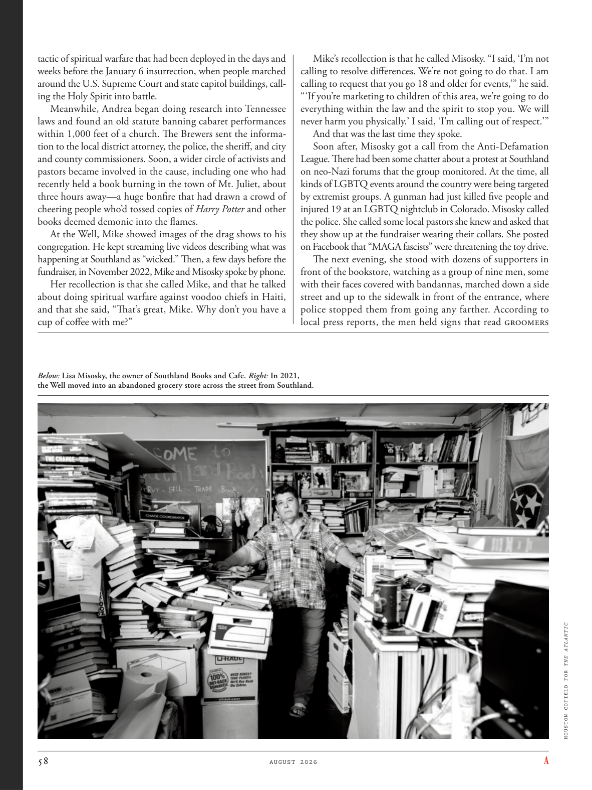

# The Atlantic — August 2026

## Page 60

---

tactic of spiritual warfare that had been deployed in the days and weeks before the January 6 insurrection, when people marched around the U.S. Supreme Court and state capitol buildings, calling the Holy Spirit into battle.

**【中文翻译】** 1 月 6 日起义之前几天和几周内部署的精神战争策略，当时人们在美国最高法院和州议会大厦周围游行，呼唤圣灵参战。

Meanwhile, Andrea began doing research into Tennessee laws and found an old statute banning cabaret performances within 1,000 feet of a church. The Brewers sent the information to the local district attorney, the police, the sheriff, and city and county commissioners. Soon, a wider circle of activists and pastors became involved in the cause, including one who had recently held a book burning in the town of Mt. Juliet, about three hours away—a huge bonfire that had drawn a crowd of cheering people who’d tossed copies of Harry Potter and other books deemed demonic into the flames.

**【中文翻译】** 与此同时，Andrea 开始研究田纳西州的法律，发现一条旧法规禁止在教堂 1000 英尺范围内进行歌舞表演。酿酒人队将信息发送给当地地方检察官、警察、治安官以及市县专员。很快，更多的活动家和牧师加入了这项事业，其中一位牧师最近在距朱丽叶山镇大约三小时路程的地方焚烧了一本书——一场巨大的篝火吸引了一群欢呼的人们，他们把《哈利·波特》和其他被认为是恶魔的书籍扔进了火里。

At the Well, Mike showed images of the drag shows to his congregation. He kept streaming live videos describing what was happening at Southland as “wicked.” Then, a few days before the fundraiser, in November 2022, Mike and Misosky spoke by phone.

**【中文翻译】** 在井边，迈克向他的会众展示了变装表演的图像。他不断播放现场视频，将南地发生的事情描述为“邪恶”。然后，在 2022 年 11 月筹款活动前几天，迈克和米索斯基通了电话。

Her recollection is that she called Mike, and that he talked about doing spiritual warfare against voodoo chiefs in Haiti, and that she said, “That’s great, Mike. Why don’t you have a cup of coffee with me?”

**【中文翻译】** 她的回忆是，她打电话给迈克，他谈到了在海地与巫毒首领进行精神战争，她说：“太好了，迈克。你为什么不和我一起喝杯咖啡呢？”

Below : Lisa Misosky, the owner of Southland Books and Cafe. Right : In 2021, the Well moved into an abandoned grocery store across the street from Southland.

**【中文翻译】** 下图：丽莎·米索斯基 (Lisa Misosky)，南国书店和咖啡馆的老板。右图：2021 年，The Well 搬进了 Southland 街对面的一家废弃杂货店。

Mike’s recollection is that he called Misosky. “I said, ‘I’m not calling to resolve differences. We’re not going to do that. I am calling to request that you go 18 and older for events,’” he said.

**【中文翻译】** 迈克的回忆是他给米索斯基打了电话。 “我说，‘我打电话不是为了解决分歧。我们不会那样做。我打电话是要求你年满 18 岁才能参加活动，’”他说。

“ ‘If you’re marketing to children of this area, we’re going to do everything within the law and the spirit to stop you. We will never harm you physically.’ I said, ‘I’m calling out of respect.’” And that was the last time they spoke.

**【中文翻译】** “‘如果你向这个地区的儿童推销，我们将在法律和精神范围内尽一切努力阻止你。我们永远不会伤害你的身体。’我说，‘我打电话是出于尊重。’”那是他们最后一次说话。

Soon after, Misosky got a call from the Anti-Defamation League. There had been some chatter about a protest at Southland on neo-Nazi forums that the group monitored. At the time, all kinds of LGBTQ events around the country were being targeted by extremist groups. A gunman had just killed five people and injured 19 at an LGBTQ nightclub in Colorado. Misosky called the police. She called some local pastors she knew and asked that they show up at the fundraiser wearing their collars. She posted on Facebook that “MAGA fascists” were threatening the toy drive.

**【中文翻译】** 不久之后，米索斯基接到了反诽谤联盟的电话。该组织监控的新纳粹论坛上有一些关于南国抗议活动的讨论。当时，全国各地各类LGBTQ活动都成为极端组织的攻击目标。科罗拉多州一家 LGBTQ 夜总会内，一名枪手刚刚造成 5 人死亡、19 人受伤。米索斯基报了警。她打电话给一些她认识的当地牧师，要求他们戴着项圈出现在筹款活动上。她在脸书上发帖称，“MAGA 法西斯分子”正在威胁玩具活动。

The next evening, she stood with dozens of supporters in front of the bookstore, watching as a group of nine men, some with their faces covered with bandannas, marched down a side street and up to the sidewalk in front of the entrance, where police stopped them from going any farther. According to local press reports, the men held signs that read Groomers HOUSTON COFIELD FOR THE ATLANTIC

**【中文翻译】** 第二天晚上，她和数十名支持者站在书店门前，看着九名男子（其中一些人脸上蒙着大手帕）沿着一条小街游行，一直走到入口处的人行道上，警察阻止他们继续前进。据当地媒体报道，这些人举着标语，上面写着“Groomers HOUSTON COFIELD FOR THE ATLANTIC”
