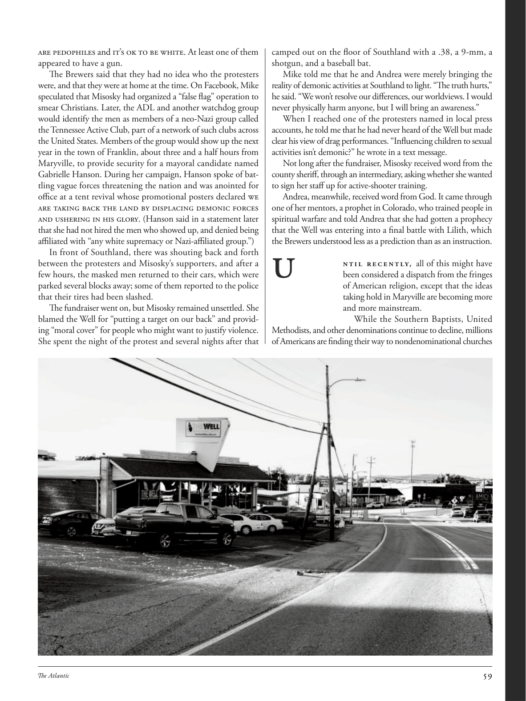

# The Atlantic — August 2026

## Page 61

---

are Pedophiles and Ie’s OK To Be Whiee. At least one of them appeared to have a gun. The Brewers said that they had no idea who the protesters were, and that they were at home at the time. On Facebook, Mike speculated that Misosky had organized a “false flag” operation to smear Christians. Later, the ADL and another watchdog group would identify the men as members of a neo-Nazi group called the Tennessee Active Club, part of a network of such clubs across the United States. Members of the group would show up the next year in the town of Franklin, about three and a half hours from Maryville, to provide security for a mayoral candidate named Gabrielle Hanson. During her campaign, Hanson spoke of battling vague forces threatening the nation and was anointed for office at a tent revival whose promotional posters declared we are eaking back ehe land by displacing demonic forces and ushering in His Glory. (Hanson said in a statement later that she had not hired the men who showed up, and denied being affiliated with “any white supremacy or Nazi-affiliated group.”) In front of Southland, there was shouting back and forth between the protesters and Misosky’s supporters, and after a few hours, the masked men returned to their cars, which were parked several blocks away; some of them reported to the police that their tires had been slashed.

**【中文翻译】** 是恋童癖，Ie's OK To Be Whiee。其中至少一人似乎有枪。酿酒人队表示，他们不知道抗议者是谁，而且当时他们在家。迈克在脸书上推测米索斯基组织了一次“假旗”行动来抹黑基督徒。后来，反诽谤联盟和另一个监督组织将这些人确认为名为“田纳西活跃俱乐部”的新纳粹组织的成员，该组织是全美此类俱乐部网络的一部分。该组织的成员将于明年出现在距玛丽维尔约三个半小时车程的富兰克林镇，为一位名叫加布里埃尔·汉森的市长候选人提供安全保障。在竞选期间，汉森谈到了与威胁国家的模糊势力作斗争，并在一次帐篷复兴中被任命为公职，其宣传海报宣称我们正在通过驱逐恶魔势力并迎来他的荣耀来夺回土地。 （汉森后来在一份声明中表示，她没有雇用出现的男子，并否认与“任何白人至上或纳粹附属团体有联系。”）在南国前，抗议者和米索斯基的支持者之间不断喊叫，几个小时后，蒙面男子回到了停在几个街区外的汽车上；其中一些人向警方报告说他们的轮胎被割破了。

The fundraiser went on, but Misosky remained unsettled. She blamed the Well for “putting a target on our back” and providing “moral cover” for people who might want to justify violence.

**【中文翻译】** 筹款活动继续进行，但米索斯基仍然心神不宁。她指责井“把目标放在我们的背上”，并为那些可能想要为暴力辩护的人提供“道德掩护”。

She spent the night of the protest and several nights after that camped out on the floor of Southland with a .38, a 9-mm, a shotgun, and a baseball bat.

**【中文翻译】** 她在抗议期间度过了当晚，并在抗议后的几个晚上带着 0.38 口径、9 毫米口径、一把霰弹枪和一根棒球棒在 Southland 的地板上露营。

Mike told me that he and Andrea were merely bringing the reali ty of demonic activities at Southland to light. “The truth hurts,” he said. “We won’t resolve our differences, our worldviews. I would never physically harm anyone, but I will bring an awareness.”

**【中文翻译】** 迈克告诉我，他和安德里亚只是将南国恶魔活动的真相曝光。 “真相很伤人，”他说。 “我们不会解决我们的分歧和世界观。我永远不会伤害任何人，但我会带来一种意识。”

When I reached one of the protesters named in local press accounts, he told me that he had never heard of the Well but made clear his view of drag performances. “Influencing children to sexual activities isn’t demonic?” he wrote in a text message.

**【中文翻译】** 当我找到当地媒体报道中提到的一位抗议者时，他告诉我，他从未听说过“井”，但明确表达了他对变装表演的看法。 “影响孩子发生性行为，这不是邪教吗？”他在短信中写道。

Not long after the fundraiser, Misosky received word from the county sheriff, through an intermediary, asking whether she wanted to sign her staff up for active-shooter training.

**【中文翻译】** 筹款活动结束后不久，米索斯基通过中间人收到了县治安官的消息，询问她是否愿意让她的工作人员报名参加主动射击训练。

Andrea, meanwhile, received word from God. It came through one of her mentors, a prophet in Colorado, who trained people in spiritual warfare and told Andrea that she had gotten a prophecy that the Well was entering into a final battle with Lilith, which the Brewers understood less as a prediction than as an instruction.

**【中文翻译】** 与此同时，安德里亚收到了上帝的话语。它来自她的一位导师，科罗拉多州的一位先知，他在精神战争中训练人们，并告诉安德里亚，她得到了一个预言，即井将与莉莉丝进行最后的战斗，酿酒人将其理解为一个预言，而不是一个指令。

### U

ntil recently, all of this might have been considered a dispatch from the fringes of American religion, except that the ideas taking hold in Maryville are becoming more and more mainstream.

**【中文翻译】** 直到最近，所有这一切都可能被认为是来自美国宗教边缘的快讯，只不过在玛丽维尔流行的思想正变得越来越主流。

Methodists, and other denominations continue to decline, millions of Americans are finding their way to nondenominational churches While the Southern Baptists, United

**【中文翻译】** 卫理公会和其他教派继续衰落，数以百万计的美国人正在寻找非宗派教会的道路，而美南浸信会、联合教会
