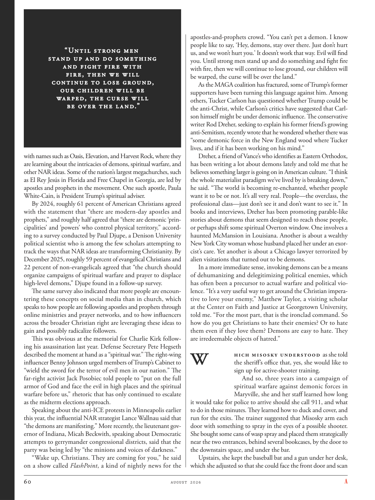

# The Atlantic — August 2026

## Page 62

---

“Uneil serong men sea nd up a nd do somee hing a nd fighe fir e w ie h fir e, e hen w e w ill coneinue eo lose grou nd, our childr en w ill be wa r ped, e he cur se w ill be ov er e he l a nd.”

**【中文翻译】** “人们出海做点事，用火来对抗，一旦我们继续失去阵地，我们的孩子就会被扭曲，他的诅咒将笼罩这片土地。”

with names such as Oasis, Elevation, and Harvest Rock, where they are learning about the intricacies of demons, spiritual warfare, and other NAR ideas. Some of the nation’s largest megachurches, such as El Rey Jesús in Florida and Free Chapel in Georgia, are led by apostles and prophets in the movement. One such apostle, Paula White-Cain, is President Trump’s spiritual adviser.

**【中文翻译】** 他们的名字包括“绿洲”、“高地”和“收获岩石”，在那里他们了解错综复杂的恶魔、精神战争和其他 NAR 想法。美国一些最大的大型教堂，例如佛罗里达州的国王耶稣教堂和乔治亚州的自由教堂，都是由该运动中的使徒和先知领导的。其中一位使徒保拉·怀特-凯恩 (Paula White-Cain) 是特朗普总统的精神顾问。

By 2024, roughly 61 percent of American Christians agreed with the statement that “there are modern-day apostles and prophets,” and roughly half agreed that “there are demonic ‘principalities’ and ‘powers’ who control physical territory,” according to a survey conducted by Paul Djupe, a Denison University political scientist who is among the few scholars attempting to track the ways that NAR ideas are transforming Christianity. By December 2025, roughly 59 percent of evangelical Christians and 22 percent of non-evangelicals agreed that “the church should organize campaigns of spiritual warfare and prayer to displace high-level demons,” Djupe found in a follow-up survey.

**【中文翻译】** 丹尼森大学政治学家保罗·朱佩 (Paul Djupe) 进行的一项调查显示，到 2024 年，大约 61% 的美国基督徒同意“存在现代使徒和先知”这一说法，大约一半的基督徒同意“存在控制物质领土的恶魔‘公国’和‘权力’”。保罗·朱佩是少数几位试图追踪 NAR 思想如何改变基督教的学者之一。朱佩在后续调查中发现，到 2025 年 12 月，大约 59% 的福音派基督徒和 22% 的非福音派基督徒同意“教会应该组织属灵争战和祈祷运动，以取代高层恶魔”。

The same survey also indicated that more people are encountering these concepts on social media than in church, which speaks to how people are following apostles and prophets through online ministries and prayer networks, and to how influencers across the broader Christian right are leveraging these ideas to gain and possibly radicalize followers.

**【中文翻译】** 同一项调查还表明，更多的人在社交媒体上遇到这些概念，而不是在教堂里，这说明人们如何通过在线事工和祈祷网络追随使徒和先知，以及更广泛的基督教右翼的影响者如何利用这些想法来获得并可能激化追随者。

This was obvious at the memorial for Charlie Kirk following his assassination last year. Defense Secretary Pete Hegseth described the moment at hand as a “spiritual war.” The right-wing influencer Benny Johnson urged members of Trump’s Cabinet to “wield the sword for the terror of evil men in our nation.” The far-right activist Jack Posobiec told people to “put on the full armor of God and face the evil in high places and the spiritual warfare before us,” rhetoric that has only continued to escalate as the midterm elections approach.

**【中文翻译】** 这在去年查理·柯克遇刺后的追悼会上显而易见。国防部长皮特·赫格斯将当前时刻描述为一场“精神战争”。右翼影响者本尼·约翰逊敦促特朗普内阁成员“挥舞利剑，打击我们国家恶人的恐怖”。极右翼活动家杰克·波索比克告诉人们“穿上上帝的全副军装，面对高层的邪恶和我们面前的精神战争”，随着中期选举的临近，这种言论只会继续升级。

Speaking about the anti-ICE protests in Minneapolis earlier this year, the influential NAR strategist Lance Wallnau said that “the demons are manifesting.” More recently, the lieutenant governor of Indiana, Micah Beckwith, speaking about Democratic attempts to gerrymander congressional districts, said that the party was being led by “the minions and voices of darkness.”

**【中文翻译】** 在谈到今年早些时候明尼阿波利斯发生的反 ICE 抗议活动时，颇具影响力的 NAR 策略师兰斯·瓦尔诺 (Lance Wallnau) 表示，“恶魔正在显现”。最近，印第安纳州副州长米卡·贝克威斯 (Micah Beckwith) 在谈到民主党对国会选区进行不公正划分的企图时表示，该党是由“黑暗的爪牙和声音”领导的。

“Wake up, Christians. They are coming for you,” he said on a show called FlashPoint , a kind of nightly news for the apostles-and-prophets crowd. “You can’t pet a demon. I know people like to say, ‘Hey, demons, stay over there. Just don’t hurt us, and we won’t hurt you.’ It doesn’t work that way. Evil will find you. Until strong men stand up and do something and fight fire with fire, then we will continue to lose ground, our children will be warped, the curse will be over the land.”

**【中文翻译】** “醒醒吧，基督徒们。他们正在追杀你们，”他在一个名为“FlashPoint”的节目中说道，该节目是为使徒和先知人群提供的晚间新闻节目。 “你不能抚摸恶魔。我知道人们喜欢说，‘嘿，恶魔，呆在那儿。别伤害我们，我们也不会伤害你。’这样行不通。邪恶会找到你。直到强者站出来采取行动，以牙还牙，否则我们将继续节节败退，我们的孩子将被扭曲，诅咒将笼罩这片土地。”

As the MAGA coalition has fractured, some of Trump’s former supporters have been turning this language against him. Among others, Tucker Carlson has questioned whether Trump could be the anti-Christ, while Carlson’s critics have suggested that Carlson himself might be under demonic influence. The conservative writer Rod Dreher, seeking to explain his former friend’s growing anti-Semitism, recently wrote that he wondered whether there was “some demonic force in the New England wood where Tucker lives, and if it has been working on his mind.”

**【中文翻译】** 随着 MAGA 联盟的分裂，特朗普的一些前支持者开始用这种语言来反对他。其中，塔克·卡尔森质疑特朗普是否可能是反基督，而卡尔森的批评者则暗示卡尔森本人可能受到恶魔的影响。保守派作家罗德·德雷尔(Rod Dreher)试图解释他的前朋友日益高涨的反犹太主义，他最近写道，他想知道“塔克居住的新英格兰森林中是否存在某种恶魔力量，以及它是否一直在影响他的思想”。

Dreher, a friend of Vance’s who identifies as Eastern Orthodox, has been writing a lot about demons lately and told me that he believes something larger is going on in American culture. “I think the whole materialist paradigm we’ve lived by is breaking down,” he said. “The world is becoming re-enchanted, whether people want it to be or not. It’s all very real. People—the overclass, the professional class—just don’t see it and don’t want to see it.” In books and interviews, Dreher has been promoting parable-like stories about demons that seem designed to reach those people, or perhaps shift some spiritual Overton window. One involves a haunted McMansion in Louisiana. Another is about a wealthy New York City woman whose husband placed her under an exorcist’s care. Yet another is about a Chicago lawyer terrorized by alien visitations that turned out to be demons.

**【中文翻译】** 德雷尔是万斯的朋友，自称是东正教徒，最近写了很多关于恶魔的文章，他告诉我，他相信美国文化中正在发生一些更大的事情。 “我认为我们赖以生存的整个唯物主义范式正在崩溃，”他说。 “无论人们愿意与否，世界正在变得重新迷人。这一切都是非常真实的。人们——上层阶级、专业阶级——只是看不到它，也不想看到它。”在书籍和采访中，德雷尔一直在宣传有关恶魔的寓言式故事，这些故事似乎旨在影响那些人，或者可能改变奥弗顿的一些精神窗口。其中之一涉及路易斯安那州一座闹鬼的麦克豪宅。另一个故事是关于一位富有的纽约市妇女的故事，她的丈夫将她置于驱魔师的照顾之下。还有一则故事是关于一位芝加哥律师因外星人来访而感到恐惧的故事，而这些外星人竟然是恶魔。

In a more immediate sense, invoking demons can be a means of dehumanizing and delegitimizing political enemies, which has often been a precursor to actual warfare and political violence. “It’s a very useful way to get around the Christian imperative to love your enemy,” Matthew Taylor, a visiting scholar at the Center on Faith and Justice at Georgetown University, told me. “For the most part, that is the ironclad command. So how do you get Christians to hate their enemies? Or to hate them even if they love them? Demons are easy to hate. They are ir redeemable objects of hatred.”

**【中文翻译】** 从更直接的意义上来说，召唤恶魔可以成为使政敌失去人性和合法性的一种手段，这往往是实际战争和政治暴力的先兆。乔治城大学信仰与正义中心的访问学者马修·泰勒告诉我：“这是一种非常有用的方法，可以绕过基督徒爱敌人的命令。” “在大多数情况下，这是铁定的命令。那么你如何让基督徒恨他们的敌人？或者即使他们爱他们也要恨他们？魔鬼很容易被恨。他们是不可挽回的仇恨对象。”

### W

hich Misosky understood as she told the sheriff’s office that, yes, she would like to sign up for active-shooter training. And so, three years into a campaign of spiritual warfare against demonic forces in Maryville, she and her staff learned how long it would take for police to arrive should she call 911, and what to do in those minutes. They learned how to duck and cover, and run for the exits. The trainer suggested that Misosky arm each door with something to spray in the eyes of a possible shooter.

**【中文翻译】** 米索斯基明白这一点，她告诉治安官办公室，是的，她想报名参加主动射击训练。因此，在玛丽维尔与恶魔势力进行精神战争的三年后，她和她的工作人员了解到，如果她拨打 911，警察需要多长时间才能到达，以及在这几分钟内该怎么做。他们学会了如何躲避和掩护，以及如何逃向出口。教练建议米索斯基在每扇门上都喷上一些东西，喷到可能是枪手的眼睛里。

She bought some cans of wasp spray and placed them strategically near the two entrances, behind several bookcases, by the door to the downstairs space, and under the bar.

**【中文翻译】** 她买了几罐黄蜂喷雾剂，战略性地把它们放在两个入口附近、几个书柜后面、楼下空间的门旁边和吧台下面。

Upstairs, she kept the baseball bat and a gun under her desk, which she adjusted so that she could face the front door and scan

**【中文翻译】** 在楼上，她把棒球棒和枪放在桌子下面，她调整了桌子，以便她可以面向前门进行扫描
