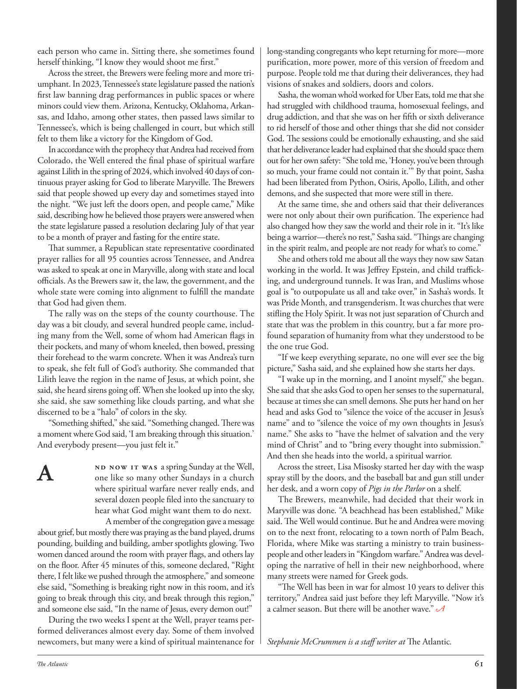

# The Atlantic — August 2026

## Page 63

---

each person who came in. Sitting there, she sometimes found herself thinking, “I know they would shoot me first.” Across the street, the Brewers were feeling more and more triumphant. In 2023, Tennessee’s state legislature passed the nation’s first law banning drag performances in public spaces or where minors could view them. Arizona, Kentucky, Oklahoma, Arkansas, and Idaho, among other states, then passed laws similar to Tennessee’s, which is being challenged in court, but which still felt to them like a victory for the Kingdom of God.

**【中文翻译】** 每个进来的人。坐在那里，她有时会想，“我知道他们会先开枪射杀我。”街对面，酿酒人队的胜利感越来越强烈。 2023 年，田纳西州立法机关通过了美国第一部法律，禁止在公共场所或未成年人可以观看的变装表演。亚利桑那州、肯塔基州、俄克拉荷马州、阿肯色州和爱达荷州等州随后通过了与田纳西州类似的法律，该法律正在法庭上受到质疑，但他们仍然觉得这是上帝王国的胜利。

In accordance with the prophecy that Andrea had received from Colorado, the Well entered the final phase of spiritual warfare against Lilith in the spring of 2024, which involved 40 days of continuous prayer asking for God to liberate Maryville. The Brewers said that people showed up every day and sometimes stayed into the night. “We just left the doors open, and people came,” Mike said, describing how he believed those prayers were answered when the state legislature passed a resolution declaring July of that year to be a month of prayer and fasting for the entire state.

**【中文翻译】** 根据安德莉亚从科罗拉多收到的预言，2024年春天，圣井进入了针对莉莉丝的精神战争的最后阶段，其中包括持续40天的祈祷，祈求上帝解放玛丽维尔。酿酒人说，人们每天都会出现，有时甚至会待到深夜。 “我们只是把门敞开，人们就来了，”迈克说，他描述了当州立法机构通过一项决议，宣布当年 7 月为全州祈祷和禁食的月份时，他如何相信这些祈祷得到了回应。

That summer, a Republican state representative coordinated prayer rallies for all 95 counties across Tennessee, and Andrea was asked to speak at one in Maryville, along with state and local officials. As the Brewers saw it, the law, the government, and the whole state were coming into alignment to fulfill the mandate that God had given them.

**【中文翻译】** 那年夏天，一位共和党州代表协调了田纳西州所有 95 个县的祈祷集会，安德里亚被要求与州和地方官员一起在玛丽维尔的一次集会上发言。在酿酒人看来，法律、政府和整个国家正在齐心协力，以履行上帝赋予他们的使命。

The rally was on the steps of the county courthouse. The day was a bit cloudy, and several hundred people came, including many from the Well, some of whom had American flags in their pockets, and many of whom kneeled, then bowed, pressing their forehead to the warm concrete. When it was Andrea’s turn to speak, she felt full of God’s authority. She commanded that Lilith leave the region in the name of Jesus, at which point, she said, she heard sirens going off. When she looked up into the sky, she said, she saw something like clouds parting, and what she discerned to be a “halo” of colors in the sky.

**【中文翻译】** 集会在县法院大楼的台阶上举行。那天有点阴天，有数百人来了，其中包括许多来自井的人，其中一些人的口袋里揣着美国国旗，许多人跪下，然后鞠躬，将额头按在温暖的混凝土上。当轮到安德莉亚说话时，她感觉自己充满了神的权柄。她以耶稣的名义命令莉莉丝离开该地区，她说，此时她听到警报声响起。她说，当她抬头望向天空时，她看到了一些像云朵分开的东西，她认为天空中有一个彩色的“光环”。

“Something shifted,” she said. “Something changed. There was a moment where God said, ‘I am breaking through this situation.’ And everybody present—you just felt it.”

**【中文翻译】** “有些事情发生了变化，”她说。 “有些事情发生了变化。有那么一刻，上帝说，‘我正在突破这个局面。’在场的每个人都感觉到了。”

### A

nd now it was a spring Sunday at the Well, one like so many other Sundays in a church where spiritual warfare never really ends, and several dozen people filed into the sanctuary to hear what God might want them to do next.

**【中文翻译】** 现在是井边的一个春天的周日，就像教堂里的许多其他周日一样，属灵的战争永远不会真正结束，几十个人鱼贯进入圣所，想听听上帝希望他们下一步做什么。

A member of the congregation gave a message about grief, but mostly there was praying as the band played, drums pounding, building and building, amber spotlights glowing. Two women danced around the room with prayer flags, and others lay on the floor. After 45 minutes of this, someone declared, “Right there, I felt like we pushed through the atmosphere,” and someone else said, “Something is breaking right now in this room, and it’s going to break through this city, and break through this region,” and someone else said, “In the name of Jesus, every demon out!”

**【中文翻译】** 会众中的一名成员发表了关于悲伤的信息，但大多数时候都是在祈祷，乐队演奏，鼓声敲响，建筑又建筑，琥珀色的聚光灯闪闪发光。两名妇女举着经旗在房间里跳舞，其他妇女则躺在地板上。 45分钟后，有人宣称，“就在那里，我感觉我们穿过了大气层，”还有人说，“这个房间里现在有东西正在破裂，它将突破这座城市，突破这个地区，”还有人说，“奉耶稣的名，所有的恶魔都滚出去！”

During the two weeks I spent at the Well, prayer teams performed deliverances almost every day. Some of them involved newcomers, but many were a kind of spiritual maintenance for long-standing congregants who kept returning for more—more purification, more power, more of this version of freedom and purpose. People told me that during their deliverances, they had visions of snakes and soldiers, doors and colors.

**【中文翻译】** 我在井里度过的两周里，祈祷队几乎每天都进行拯救活动。其中一些涉及新来者，但许多是对长期会众的一种精神维护，他们不断返回以获得更多——更多的净化，更多的力量，更多的自由和目标。人们告诉我，在他们被释放的过程中，他们看到了蛇和士兵、门和颜色的幻象。

Sasha, the woman who’d worked for Uber Eats, told me that she had struggled with childhood trauma, homosexual feelings, and drug addiction, and that she was on her fifth or sixth deliverance to rid herself of those and other things that she did not consider God. The sessions could be emotionally exhausting, and she said that her deliverance leader had explained that she should space them out for her own safety: “She told me, ‘Honey, you’ve been through so much, your frame could not contain it.’” By that point, Sasha had been liberated from Python, Osiris, Apollo, Lilith, and other demons, and she suspected that more were still in there.

**【中文翻译】** 曾在 Uber Eats 工作的萨莎告诉我，她一直在与童年创伤、同性恋情感和毒瘾作斗争，她正在第五次或第六次解脱，以摆脱那些她不认为是上帝的东西。这些治疗可能会让人精神疲惫，她说，她的解救领袖解释说，为了自己的安全，她应该把它们分开：“她告诉我，‘亲爱的，你经历了这么多，你的身体无法容纳它。’”到那时，萨莎已经从蟒蛇、奥西里斯、阿波罗、莉莉丝和其他恶魔的手中解放出来，她怀疑还有更多恶魔在里面。

At the same time, she and others said that their deliverances were not only about their own purification. The experience had also changed how they saw the world and their role in it. “It’s like being a warrior— there’s no rest,” Sasha said. “Things are changing in the spirit realm, and people are not ready for what’s to come.”

**【中文翻译】** 同时，她和其他人也表示，他们的解脱不仅仅是为了净化自己。这段经历也改变了他们看待世界以及他们在其中的角色的方式。 “这就像成为一名战士——没有休息，”萨沙说。 “精神领域的事情正在发生变化，人们还没有为即将到来的事情做好准备。”

She and others told me about all the ways they now saw Satan working in the world. It was Jeffrey Epstein, and child trafficking, and underground tunnels. It was Iran, and Muslims whose goal is “to outpopulate us all and take over,” in Sasha’s words. It was Pride Month, and transgenderism. It was churches that were stifling the Holy Spirit. It was not just separation of Church and state that was the problem in this country, but a far more profound separation of humanity from what they understood to be the one true God.

**【中文翻译】** 她和其他人告诉我他们现在看到撒旦在世界上运作的所有方式。这是杰弗里·爱泼斯坦、贩卖儿童和地下隧道。用萨沙的话来说，伊朗和穆斯林的目标是“超越我们所有人并接管”。那是骄傲月和跨性别主义。是教会压制了圣灵。这个国家的问题不仅仅是教会与国家的分离，而是人类与他们所理解的独一真神的分离。

“If we keep everything separate, no one will ever see the big picture,” Sasha said, and she explained how she starts her days. “I wake up in the morning, and I anoint myself,” she began.

**【中文翻译】** “如果我们把一切分开，没有人会看到大局，”萨莎说，并解释了她如何开始新的一天。 “我早上醒来，然后给自己涂油，”她开始说道。

She said that she asks God to open her senses to the supernatural, because at times she can smell demons. She puts her hand on her head and asks God to “silence the voice of the accuser in Jesus’s name” and to “silence the voice of my own thoughts in Jesus’s name.” She asks to “have the helmet of salvation and the very mind of Christ” and to “bring every thought into submission.”

**【中文翻译】** 她说她请求上帝打开她对超自然现象的感官，因为有时她能闻到恶魔的味道。她把手放在头上，请求上帝“奉耶稣的名压制原告的声音”，并“奉耶稣的名压制我自己思想的声音”。她要求“戴上救恩的头盔和基督的思想”，并“让每一个想法都屈服”。

And then she heads into the world, a spiritual warrior. Across the street, Lisa Misosky started her day with the wasp spray still by the doors, and the baseball bat and gun still under her desk, and a worn copy of Pigs in the Parlor on a shelf.

**【中文翻译】** 然后她作为一名精神战士走进了这个世界。街对面，丽莎·米索斯基开始了新的一天，门上还放着黄蜂喷雾，桌子底下还放着棒球棒和枪，书架上放着一本破旧的《客厅里的猪》。

The Brewers, meanwhile, had decided that their work in Maryville was done. “A beachhead has been established,” Mike said. The Well would continue. But he and Andrea were moving on to the next front, relocating to a town north of Palm Beach, Florida, where Mike was starting a ministry to train businesspeople and other leaders in “Kingdom warfare.” Andrea was developing the narrative of hell in their new neighborhood, where many streets were named for Greek gods.

**【中文翻译】** 与此同时，酿酒人队决定他们在玛丽维尔的工作已经完成。 “滩头阵地已经建立，”迈克说。井将继续。但他和安德里亚正在走向下一个前线，搬到佛罗里达州棕榈滩以北的一个小镇，迈克在那里开始了一个部门，培训商人和其他领导人进行“王国战争”。安德里亚正在他们的新社区发展地狱的叙事，那里的许多街道都以希腊众神命名。

“The Well has been in war for almost 10 years to deliver this territory,” Andrea said just before they left Maryville. “Now it’s a calmer season. But there will be another wave.”

**【中文翻译】** “为了争夺这片领土，‘井’号已经打了近十年的战争，”安德里亚在他们离开玛丽维尔之前说道。 “现在是一个比较平静的季节。但还会有另一波浪潮。”

*— Stephanie McCrummen is a staff writer at The Atlantic .*

*【作者署名】斯蒂芬妮·麦克鲁门 (Stephanie McCrummen) 是《大西洋月刊》的特约撰稿人。*
