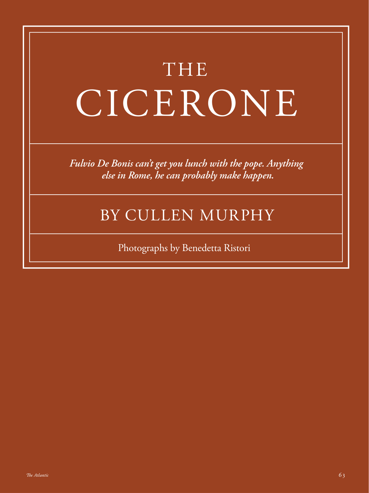

# The Atlantic — August 2026

## Page 65

---

### THE

**【标题翻译】** 这

### CICERONE

**【标题翻译】** 西塞罗内

#### Fulvio De Bonis can’t get you lunch with the pope. Anything

**【副标题翻译】** 富尔维奥·德博尼斯无法为您提供与教皇共进午餐的机会。任何事物

#### else in Rome, he can probably make happen.

**【副标题翻译】** 在罗马的其他地方，他也许可以实现这一目标。

### BY CULLEN MURPHY

**【标题翻译】** 作者：卡伦·墨菲

#### Photographs by Benedetta Ristori

**【副标题翻译】** 摄影：贝内黛塔·里斯托里
