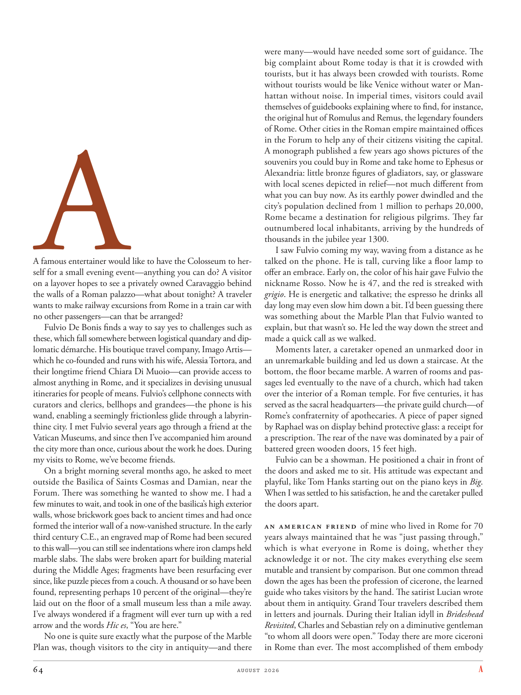

# The Atlantic — August 2026

## Page 66

---

### A

A famous entertainer would like to have the Colosseum to herself for a small evening event—anything you can do? A visitor on a layover hopes to see a privately owned Caravaggio behind the walls of a Roman palazzo—what about tonight? A traveler wants to make railway excursions from Rome in a train car with no other passengers—can that be arranged?

**【中文翻译】** 一位著名艺人想要独占罗马斗兽场举办一场小型晚间活动 - 您能做些什么吗？一位中途停留的游客希望在罗马宫殿的围墙后面看到私人拥有的卡拉瓦乔的作品——今晚怎么样？一位旅客想要乘坐火车从罗马出发，在没有其他乘客的情况下进行火车旅行，可以安排吗？

Fulvio De Bonis finds a way to say yes to challenges such as these, which fall somewhere between logistical quandary and diplomatic démarche. His boutique travel company, Imago Artis— which he co-founded and runs with his wife, Alessia Tortora, and their longtime friend Chiara Di Muoio—can provide access to almost anything in Rome, and it specializes in devising unusual itineraries for people of means. Fulvio’s cellphone connects with curators and clerics, bellhops and grandees— the phone is his wand, enabling a seemingly frictionless glide through a labyrinthine city. I met Fulvio several years ago through a friend at the Vatican Museums, and since then I’ve accompanied him around the city more than once, curious about the work he does. During my visits to Rome, we’ve become friends.

**【中文翻译】** 富尔维奥·德博尼斯找到了一种方法来应对此类挑战，这些挑战介于后勤困境和外交策略之间。他的精品旅游公司 Imago Artis 是他与妻子 Alessia Tortora 以及他们的老朋友 Chiara Di Muoio 共同创立并经营的公司，可以提供游览罗马几乎任何地方的服务，并且专门为有钱人设计不寻常的行程。富尔维奥的手机与策展人、神职人员、侍者和达官贵人联系——手机就是他的魔杖，让他在迷宫般的城市中看似毫无摩擦地滑行。几年前，我通过梵蒂冈博物馆的一位朋友认识了富尔维奥，从那时起，我不止一次地陪他游览了这座城市，对他所做的工作感到好奇。在我访问罗马期间，我们成为了朋友。

On a bright morning several months ago, he asked to meet outside the Basilica of Saints Cosmas and Damian, near the Forum. There was something he wanted to show me. I had a few minutes to wait, and took in one of the basilica’s high exterior walls, whose brickwork goes back to ancient times and had once formed the interior wall of a now-vanished structure. In the early third century C.E., an engraved map of Rome had been secured to this wall—you can still see indentations where iron clamps held marble slabs. The slabs were broken apart for building material during the Middle Ages; fragments have been resurfacing ever since, like puzzle pieces from a couch. A thousand or so have been found, representing perhaps 10 percent of the original—they’re laid out on the floor of a small museum less than a mile away.

**【中文翻译】** 几个月前一个阳光明媚的早晨，他要求在论坛附近的圣科斯马斯和达米安大教堂外见面。他想给我看一些东西。我等了几分钟，欣赏了大教堂的一堵高高的外墙，其砖砌结构可以追溯到远古时代，曾经构成了现已消失的建筑的内墙。公元三世纪初，一幅罗马雕刻地图被固定在这堵墙上——你仍然可以看到铁夹子固定大理石板时的凹痕。在中世纪，这些石板被拆开作为建筑材料。从那时起，碎片就不断重新出现，就像沙发上的拼图一样。现已发现了大约 1000 件，大约占原件的 10%，它们被放置在不到一英里外的一家小博物馆的地板上。

I’ve always wondered if a fragment will ever turn up with a red arrow and the words Hic es , “You are here.” No one is quite sure exactly what the purpose of the Marble Plan was, though visitors to the city in antiquity—and there were many—would have needed some sort of guidance. The big complaint about Rome today is that it is crowded with tourists, but it has always been crowded with tourists. Rome without tourists would be like Venice without water or Manhattan without noise. In imperial times, visitors could avail themselves of guidebooks explaining where to find, for instance, the original hut of Romulus and Remus, the legendary founders of Rome. Other cities in the Roman empire maintained offices in the Forum to help any of their citizens visiting the capital.

**【中文翻译】** 我一直想知道是否会出现一个带有红色箭头和希克斯“你在这里”字样的片段。没有人确切知道大理石计划的目的是什么，尽管古代这座城市的游客——而且有很多——需要某种指导。今天对罗马最大的抱怨是游客拥挤，但它一直都是游客众多。没有游客的罗马就像没有水的威尼斯或没有噪音的曼哈顿。在帝国时代，游客可以利用旅游指南来解释在哪里可以找到罗马传奇创始人罗慕路斯和雷穆斯最初的小屋。罗马帝国的其他城市在论坛设有办事处，以帮助任何访问首都的公民。

A monograph published a few years ago shows pictures of the souvenirs you could buy in Rome and take home to Ephesus or Alexandria: little bronze figures of gladiators, say, or glassware with local scenes depicted in relief—not much different from what you can buy now. As its earthly power dwindled and the city’s population declined from 1 million to perhaps 20,000, Rome became a destination for religious pilgrims. They far outnumbered local inhabitants, arriving by the hundreds of thousands in the jubilee year 1300.

**【中文翻译】** 几年前出版的一本专着展示了你可以在罗马购买并带回家以弗所或亚历山大的纪念品的图片：例如，角斗士的小青铜雕像，或者带有浮雕的当地场景的玻璃器皿 - 与你现在可以买到的没有太大区别。随着地上权力的衰落，城市人口从 100 万减少到大约 20,000 人，罗马成为宗教朝圣者的目的地。他们的数量远远多于当地居民，在 1300 年禧年抵达的人数达数十万。

I saw Fulvio coming my way, waving from a distance as he talked on the phone. He is tall, curving like a floor lamp to offer an embrace. Early on, the color of his hair gave Fulvio the nickname Rosso. Now he is 47, and the red is streaked with grigio . He is energetic and talkative; the espresso he drinks all day long may even slow him down a bit. I’d been guessing there was something about the Marble Plan that Fulvio wanted to explain, but that wasn’t so. He led the way down the street and made a quick call as we walked.

**【中文翻译】** 我看到富尔维奥向我走来，一边打电话一边从远处挥手。他身材高大，身体弯曲得像一盏落地灯，可以拥抱。早期，富尔维奥的头发颜色给了他绰号“Rosso”。现在他已经 47 岁了，红色上有灰色条纹。他精力充沛、健谈；他整天喝的浓缩咖啡甚至可能会减慢他的速度。我一直猜测富尔维奥想要解释有关大理石计划的一些事情，但事实并非如此。他在街上带路，我们一边走一边快速地打了个电话。

Moments later, a caretaker opened an unmarked door in an unremarkable building and led us down a staircase. At the bottom, the floor became marble. A warren of rooms and passages led eventually to the nave of a church, which had taken over the interior of a Roman temple. For five centuries, it has served as the sacral headquarters— the private guild church—of Rome’s confraternity of apothecaries. A piece of paper signed by Raphael was on display behind protective glass: a receipt for a prescription. The rear of the nave was dominated by a pair of battered green wooden doors, 15 feet high.

**【中文翻译】** 过了一会儿，一名看门人在一座不起眼的建筑中打开了一扇没有标记的门，带我们走下楼梯。在底部，地板变成了大理石。拥挤的房间和通道最终通向一座教堂的中殿，这座教堂占据了罗马神庙的内部空间。五个世纪以来，它一直是罗马药剂师联合会的神圣总部——私人行会教堂。防护玻璃后面展示着一张由拉斐尔签名的纸：一张处方收据。中殿的后部是一对 15 英尺高、破旧的绿色木门。

Fulvio can be a showman. He positioned a chair in front of the doors and asked me to sit. His attitude was expectant and playful, like Tom Hanks starting out on the piano keys in Big .

**【中文翻译】** 富尔维奥可以成为一名表演者。他在门前放了一把椅子，请我坐下。他的态度充满期待和俏皮，就像汤姆·汉克斯在《Big》中开始弹奏钢琴键一样。

When I was settled to his satisfaction, he and the caretaker pulled the doors apart. An American friend of mine who lived in Rome for 70 years always maintained that he was “just passing through,” which is what everyone in Rome is doing, whether they acknowledge it or not. The city makes everything else seem mutable and transient by comparison. But one common thread down the ages has been the profession of cicerone, the learned guide who takes visitors by the hand. The satirist Lucian wrote about them in antiquity. Grand Tour travelers described them in letters and journals. During their Italian idyll in Brideshead Revisited , Charles and Sebastian rely on a diminutive gentleman “to whom all doors were open.” Today there are more ciceroni in Rome than ever. The most accomplished of them embody

**【中文翻译】** 当我让他满意后，他和看门人把门打开了。我的一位在罗马生活了70年的美国朋友始终坚称自己“只是路过”，这是罗马每个人都在做的事情，无论他们承认与否。相比之下，这座城市让其他一切都显得不稳定和短暂。但自古以来，一个共同的线索就是“cicerone”这个职业，他是一位博学的导游，拉着游客的手。讽刺作家卢西恩在古代就曾描写过它们。伟大旅行的旅行者在信件和日记中描述了它们。在《故园重游》的意大利田园生活中，查尔斯和塞巴斯蒂安依靠的是一位“所有大门都向他敞开”的矮个子绅士。今天，罗马的西塞罗尼比以往任何时候都多。其中最有成就的体现是
