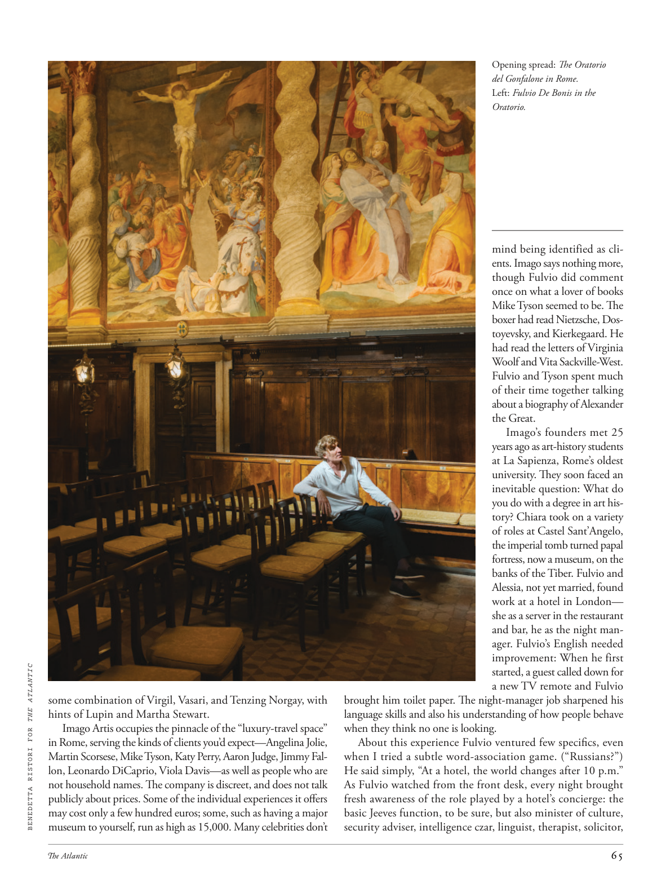

# The Atlantic — August 2026

## Page 67

---

BENEDETTA RISTORI FOR THE ATLANTIC some combination of Virgil, Vasari, and Tenzing Norgay, with hints of Lupin and Martha Stewart. Imago Artis occupies the pinnacle of the “luxury-travel space” in Rome, serving the kinds of clients you’d expect—Angelina Jolie, Martin Scorsese, Mike Tyson, Katy Perry, Aaron Judge, Jimmy Fallon, Leonardo DiCaprio, Viola Davis—as well as people who are not household names. The company is discreet, and does not talk publicly about prices. Some of the individual experiences it offers may cost only a few hundred euros; some, such as having a major museum to yourself, run as high as 15,000. Many celebrities don’t brought him toilet paper. The night-manager job sharpened his language skills and also his understanding of how people behave when they think no one is looking.

**【中文翻译】** Benedetta Ristori for the Atlantic 是 Virgil、Vasari 和 Tenzing Norgay 的结合体，还夹杂着 Lupin 和 Martha Stewart 的影子。 Imago Artis 占据了罗马“豪华旅行空间”的顶峰，为您所期望的各类客户提供服务——安吉丽娜·朱莉、马丁·斯科塞斯、迈克·泰森、凯蒂·佩里、亚伦·贾吉、吉米·法伦、莱昂纳多·迪卡普里奥、维奥拉·戴维斯——以及那些不家喻户晓的人。该公司行事谨慎，不会公开谈论价格。它提供的一些个人体验可能只需几百欧元；有些，比如自己拥有一个大型博物馆，则高达 15,000 美元。很多名人都不给他带卫生纸。夜班经理的工作提高了他的语言能力，也提高了他对人们在没有人注意时的行为方式的理解。

About this experience Fulvio ventured few specifics, even when I tried a subtle word-association game. (“Russians?”) He said simply, “At a hotel, the world changes after 10 p.m.”

**【中文翻译】** 关于这次经历，富尔维奥没有透露太多细节，即使我尝试了一个微妙的单词联想游戏。 （“俄罗斯人？”）他简单地说，“在酒店，晚上 10 点之后世界就会发生变化。”

As Fulvio watched from the front desk, every night brought fresh awareness of the role played by a hotel’s concierge: the basic Jeeves function, to be sure, but also minister of culture, security adviser, intelligence czar, linguist, therapist, solicitor, Opening spread: The Oratorio del Gonfalone in Rome.

**【中文翻译】** 当富尔维奥在前台观看时，每晚都会让人们对酒店礼宾部所扮演的角色产生新的认识：当然，吉夫斯的基本职能，但也是文化部长、安全顾问、情报沙皇、语言学家、治疗师、律师、开场传播：罗马的贡法隆清唱剧。

Left: Fulvio De Bonis in the Oratorio. mind being identified as clients. Imago says nothing more, though Fulvio did comment once on what a lover of books Mike Tyson seemed to be. The boxer had read Nietzsche, Dostoyevsky, and Kierkegaard. He had read the letters of Virginia Woolf and Vita Sackville-West.

**【中文翻译】** 左：清唱剧中的富尔维奥·德博尼斯。介意被识别为客户。伊马戈没有再说什么，尽管富尔维奥曾经评论过迈克·泰森似乎是一个书迷。这位拳击手读过尼采、陀思妥耶夫斯基和克尔凯郭尔的著作。他读过弗吉尼亚·伍尔夫和维塔·萨克维尔-韦斯特的信。

Fulvio and Tyson spent much of their time together talking about a biography of Alexander the Great. Imago’s founders met 25 years ago as art-history students at La Sapienza, Rome’s oldest university. They soon faced an inevitable question: What do you do with a degree in art history? Chiara took on a variety of roles at Castel Sant’Angelo, the imperial tomb turned papal fortress, now a museum, on the banks of the Tiber. Fulvio and Alessia, not yet married, found work at a hotel in London— she as a server in the restaurant and bar, he as the night manager. Fulvio’s English needed improvement: When he first started, a guest called down for a new TV remote and Fulvio

**【中文翻译】** 富尔维奥和泰森花了很多时间在一起讨论亚历山大大帝的传记。 Imago 的创始人于 25 年前在罗马最古老的大学 La Sapienza 学习艺术史时相识。他们很快就面临一个不可避免的问题：你拿艺术史学位做什么？基娅拉在圣天使城堡扮演了各种角色，这座位于台伯河畔的帝国陵墓变成了教皇堡垒，现在是一座博物馆。尚未结婚的富尔维奥和阿莱西亚在伦敦的一家酒店找到了工作——她在餐厅和酒吧担任服务员，他担任夜班经理。富尔维奥的英语需要提高：当他第一次开始时，一位客人打电话要一个新的电视遥控器，富尔维奥
