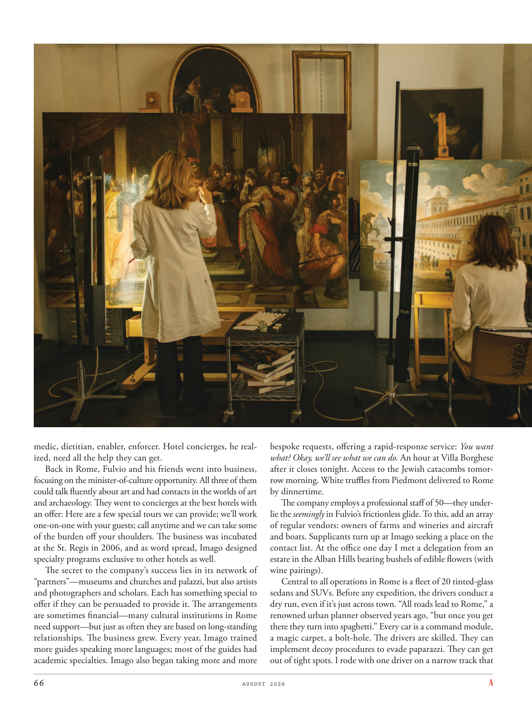

# The Atlantic — August 2026

## Page 68

---

medic, dietitian, enabler, enforcer. Hotel concierges, he realized, need all the help they can get. Back in Rome, Fulvio and his friends went into business, focusing on the minister-of-culture opportunity. All three of them could talk fluently about art and had contacts in the worlds of art and archaeology. They went to concierges at the best hotels with an offer: Here are a few special tours we can provide; we’ll work one-on-one with your guests; call anytime and we can take some of the burden off your shoulders. The business was incubated at the St. Regis in 2006, and as word spread, Imago designed specialty programs exclusive to other hotels as well.

**【中文翻译】** 医生、营养师、推动者、执行者。他意识到，酒店礼宾部需要他们能得到的所有帮助。回到罗马后，富尔维奥和他的朋友们开始经商，专注于担任文化部长的机会。他们三人都能流利地谈论艺术，并且在艺术和考古领域都有接触。他们去了最好的酒店的礼宾部，提出了一个优惠：以下是我们可以提供的一些特别旅行；我们将与您的客人进行一对一的合作；请随时致电，我们可以减轻您肩上的一些负担。该业务于 2006 年在瑞吉酒店孵化，随着消息的传播，Imago 也为其他酒店设计了专属的特色项目。

The secret to the company’s success lies in its network of “partners”—museums and churches and palazzi, but also artists and photographers and scholars. Each has something special to offer if they can be persuaded to provide it. The arrangements are sometimes financial—many cultural institutions in Rome need support—but just as often they are based on longstanding relationships. The business grew. Every year, Imago trained more guides speaking more languages; most of the guides had academic specialties. Imago also began taking more and more bespoke requests, offering a rapid-response service: You want what? Okay, we’ll see what we can do. An hour at Villa Borghese after it closes tonight. Access to the Jewish catacombs tomorrow morning. White truffles from Piedmont delivered to Rome by dinnertime.

**【中文翻译】** 该公司成功的秘诀在于其“合作伙伴”网络——博物馆、教堂和宫殿，还有艺术家、摄影师和学者。如果可以说服他们提供一些特别的东西，那么每个人都可以提供一些特别的东西。这些安排有时是财务方面的——罗马的许多文化机构都需要支持——但它们往往是建立在长期关系的基础上的。业务增长了。每年，Imago 都会培训更多的导游，讲更多的语言；大多数导游都有学术专长。 Imago 还开始接受越来越多的定制请求，提供快速响应服务：您想要什么？好吧，我们看看能做什么。今晚博尔盖塞别墅闭馆后一小时。明天早上进入犹太地下墓穴。来自皮埃蒙特的白松露在晚餐时间运抵罗马。

The company employs a professional staff of 50—they underlie the seemingly in Fulvio’s frictionless glide. To this, add an array of regular vendors: owners of farms and wineries and aircraft and boats. Supplicants turn up at Imago seeking a place on the contact list. At the office one day I met a delegation from an estate in the Alban Hills bearing bushels of edible flowers (with wine pairings).

**【中文翻译】** 该公司拥有 50 名专业员工，他们是 Fulvio 看似无摩擦滑行的基础。除此之外，还要添加一系列常规供应商：农场、酿酒厂、飞机和船只的所有者。恳求者出现在 Imago 寻求在联系人名单上占有一席之地。有一天，我在办公室遇到了来自奥尔本山一处庄园的代表团，他们带来了成蒲式耳的食用花卉（搭配葡萄酒）。

Central to all operations in Rome is a fleet of 20 tinted-glass sedans and SUVs. Before any expedition, the drivers conduct a dry run, even if it’s just across town. “All roads lead to Rome,” a renowned urban planner observed years ago, “but once you get there they turn into spaghetti.” Every car is a command module, a magic carpet, a bolt-hole. The drivers are skilled. They can implement decoy procedures to evade paparazzi. They can get out of tight spots. I rode with one driver on a narrow track that

**【中文翻译】** 罗马所有业务的核心是一支由 20 辆有色玻璃轿车和 SUV 组成的车队。在任何探险之前，司机都会进行一次预演，即使只是穿过城镇。 “条条大路通罗马，”一位著名的城市规划师多年前说道，“但一旦到达那里，它们就会变成意大利面条。”每辆车都是一个命令模块、一块魔毯、一个螺栓孔。司机们技术精湛。他们可以实施诱饵程序来躲避狗仔队。他们可以摆脱困境。我和一位司机一起在一条狭窄的轨道上骑行
