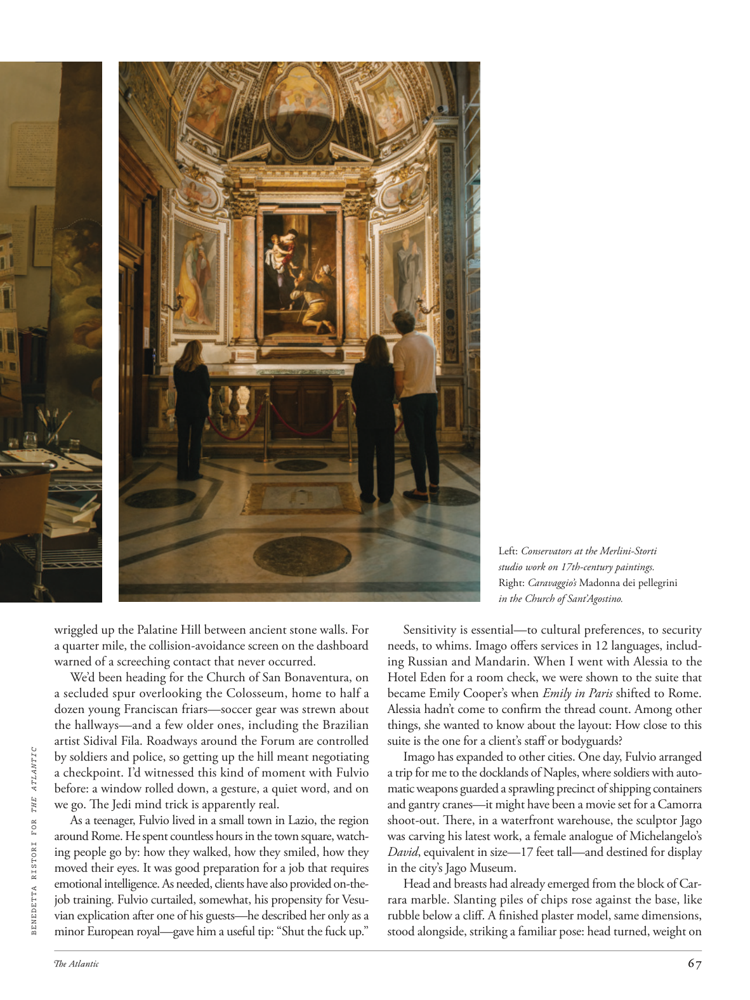

# The Atlantic — August 2026

## Page 69

---

wriggled up the Palatine Hill between ancient stone walls. For a quarter mile, the collision-avoidance screen on the dashboard warned of a screeching contact that never occurred.

**【中文翻译】** 在古老的石墙之间蜿蜒爬上帕拉蒂尼山。行驶了四分之一英里后，仪表板上的防撞屏幕发出了尖锐的接触警告，但从未发生过。

We’d been heading for the Church of San Bonaventura, on a secluded spur overlooking the Colosseum, home to half a dozen young Franciscan friars—soccer gear was strewn about the hallways—and a few older ones, including the Brazilian artist Sidival Fila. Roadways around the Forum are controlled BENEDETTA RISTORI FOR THE ATLANTIC by soldiers and police, so getting up the hill meant negotiating a checkpoint. I’d witnessed this kind of moment with Fulvio before: a window rolled down, a gesture, a quiet word, and on we go. The Jedi mind trick is apparently real.

**【中文翻译】** 我们当时正前往圣博纳文图拉教堂，该教堂位于一个僻静的山坡上，俯瞰着罗马斗兽场，那里有六名年轻的方济会修道士——足球装备散落在走廊上——还有一些年长的修道士，其中包括巴西艺术家西迪瓦尔·菲拉。论坛周围的道路由士兵和警察控制，因此上山意味着要通过检查站。我以前和富尔维奥一起见证过这样的时刻：一扇车窗摇下，一个手势，一句安静的话语，然后我们就出发了。绝地心灵戏法显然是真实的。

As a teenager, Fulvio lived in a small town in Lazio, the region around Rome. He spent countless hours in the town square, watching people go by: how they walked, how they smiled, how they moved their eyes. It was good preparation for a job that requires emotional intelligence. As needed, clients have also provided on-thejob training. Fulvio curtailed, somewhat, his propensity for Vesuvian explication after one of his guests—he described her only as a minor European royal—gave him a useful tip: “Shut the fuck up.”

**【中文翻译】** 青少年时期，富尔维奥住在罗马周边地区拉齐奥的一个小镇。他在城镇广场上度过了无数个小时，看着人们走过：他们如何走路，他们如何微笑，他们如何移动眼睛。这是为需要情商的工作做好的良好准备。根据需要，客户还提供了在职培训。富尔维奥在某种程度上减少了他对维苏威解释的倾向，因为他的一位客人——他形容她只是一位欧洲小皇室——给了他一个有用的建议：“他妈的闭嘴。”

Sensitivity is essential—to cultural preferences, to security needs, to whims. Imago offers services in 12 languages, including Russian and Mandarin. When I went with Alessia to the Hotel Eden for a room check, we were shown to the suite that became Emily Cooper’s when Emily in Paris shifted to Rome.

**【中文翻译】** 对文化偏好、安全需求、突发奇想的敏感性至关重要。 Imago 提供 12 种语言的服务，包括俄语和普通话。当我和阿莱西亚一起去伊甸酒店检查房间时，我们被带到了艾米丽·库珀在巴黎搬到罗马后成为艾米丽·库珀的套房。

Alessia hadn’t come to confirm the thread count. Among other things, she wanted to know about the layout: How close to this suite is the one for a client’s staff or bodyguards?

**【中文翻译】** 阿莱西亚没有来确认线程数。除其他事项外，她想了解布局：客户员工或保镖的套房离这套套房有多远？

Imago has expanded to other cities. One day, Fulvio arranged a trip for me to the docklands of Naples, where soldiers with automatic weapons guarded a sprawling precinct of shipping containers and gantry cranes—it might have been a movie set for a Camorra shoot-out. There, in a waterfront warehouse, the sculptor Jago was carving his latest work, a female analogue of Michelangelo’s David , equivalent in size—17 feet tall—and destined for display in the city’s Jago Museum.

**【中文翻译】** Imago 已扩展到其他城市。有一天，富尔维奥为我安排了一次去那不勒斯港区的旅行，那里有手持自动武器的士兵守卫着一个由集装箱和龙门起重机组成的广阔区域——这可能是一部以卡莫拉枪战为背景的电影。在那里，在一个海滨仓库里，雕塑家 Jago 正在雕刻他的最新作品，这是米开朗基罗的《大卫》的女性雕像，尺寸相当，高 17 英尺，并将在该市的 Jago 博物馆展出。

Head and breasts had already emerged from the block of Carrara marble. Slanting piles of chips rose against the base, like rubble below a cliff. A finished plaster model, same dimensions, stood alongside, striking a familiar pose: head turned, weight on Left: Conservators at the Merlini-Storti studio work on 17th-century paintings. Right: Caravaggio’s Madonna dei pellegrini in the Church of Sant’Agostino.

**【中文翻译】** 头和胸部已经从卡拉拉大理石块中露出来。倾斜的木屑堆堆在底座上，就像悬崖下的瓦砾一样。一个尺寸相同的成品石膏模型站在旁边，摆出熟悉的姿势：转过头，重心放在左边：Merlini-Storti 工作室的管理员正在研究 17 世纪的绘画。右：圣阿戈斯蒂诺教堂内卡拉瓦乔的《佩莱格里尼圣母》。
