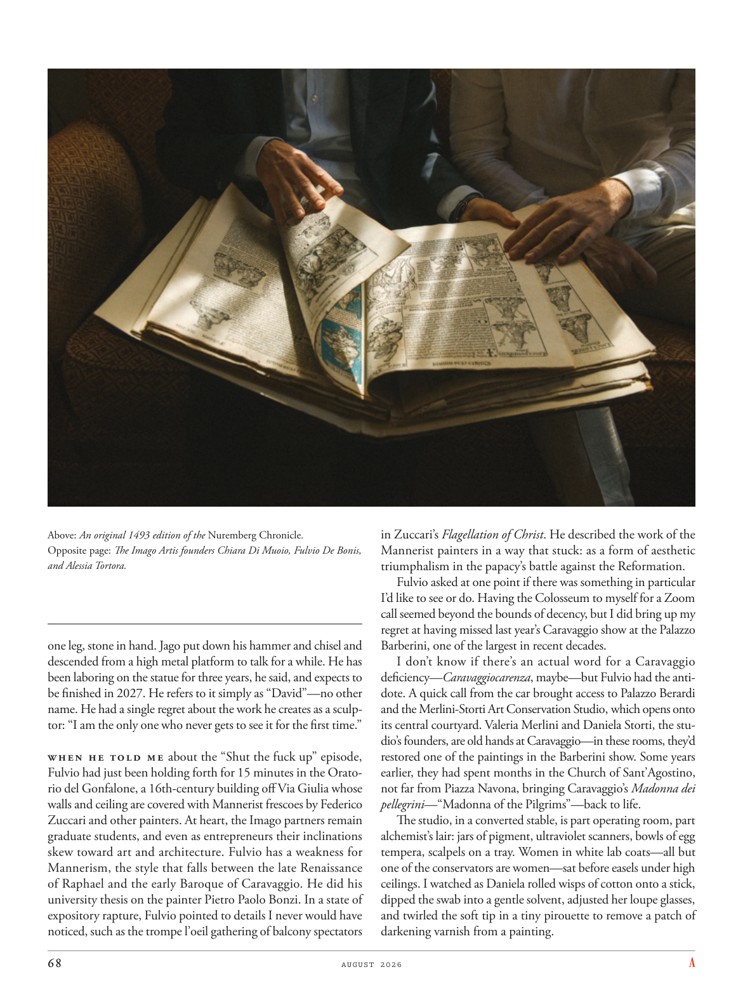

# The Atlantic — August 2026

## Page 70

---

Above: An original 1493 edition of the Nuremberg Chronicle . Opposite page: The Imago Artis founders Chiara Di Muoio, Fulvio De Bonis, and Alessia Tortora.

**【中文翻译】** 上图：1493 年原版《纽伦堡纪事报》。对页：Imago Artis 创始人 Chiara Di Muoio、Fulvio De Bonis 和 Alessia Tortora。

one leg, stone in hand. Jago put down his hammer and chisel and descended from a high metal platform to talk for a while. He has been laboring on the statue for three years, he said, and expects to be finished in 2027. He refers to it simply as “David”—no other name. He had a single regret about the work he creates as a sculptor: “I am the only one who never gets to see it for the first time.”

**【中文翻译】** 一只腿，手里拿着石头。贾戈放下锤子和凿子，从高高的金属平台上下来，聊了一会儿。他说，这座雕像他已经花了三年时间建造，预计将于 2027 年完工。他简称为“大卫”，没有其他名字。他对自己作为雕塑家创作的作品有一个遗憾：“我是唯一一个从未第一次看到它的人。”

When he told me about the “Shut the fuck up” episode, Fulvio had just been holding forth for 15 minutes in the Oratorio del Gonfalone, a 16th-century building off Via Giulia whose walls and ceiling are covered with Mannerist frescoes by Federico Zuccari and other painters. At heart, the Imago partners remain graduate students, and even as entrepreneurs their inclinations skew toward art and architecture. Fulvio has a weakness for Mannerism, the style that falls between the late Renaissance of Raphael and the early Baroque of Caravaggio. He did his university thesis on the painter Pietro Paolo Bonzi. In a state of expository rapture, Fulvio pointed to details I never would have noticed, such as the trompe l’oeil gathering of balcony spectators in Zuccari’s Flagellation of Christ . He described the work of the Mannerist painters in a way that stuck: as a form of aesthetic triumphal ism in the papacy’s battle against the Reformation.

**【中文翻译】** 当富尔维奥向我讲述“他妈的闭嘴”那一集时，他刚刚在贡法隆清唱剧里滔滔不绝地讲了 15 分钟。这是一栋位于朱利亚大道 (Via Giulia) 旁的 16 世纪建筑，其墙壁和天花板上都挂满了费德里科·祖卡里 (Federico Zuccari) 和其他画家的风格主义壁画。本质上，Imago 的合作伙伴仍然是研究生，即使作为企业家，他们的倾向也偏向于艺术和建筑。富尔维奥对矫饰主义有弱点，这种风格介于拉斐尔文艺复兴晚期和卡拉瓦乔早期巴洛克风格之间。他的大学论文是关于画家彼得罗·保罗·邦齐（Pietro Paolo Bonzi）的。在解说狂喜的状态下，富尔维奥指出了我永远不会注意到的细节，例如祖卡里的《鞭打基督》中阳台观众的错视画。他以一种固定的方式描述风格主义画家的作品：作为教皇反对宗教改革的斗争中的一种审美胜利主义形式。

Fulvio asked at one point if there was something in particular I’d like to see or do. Having the Colosseum to myself for a Zoom call seemed beyond the bounds of decency, but I did bring up my regret at having missed last year’s Caravaggio show at the Palazzo Barberini, one of the largest in recent decades.

**【中文翻译】** 富尔维奥曾问我是否有什么特别想看或做的事情。独自在罗马斗兽场进行 Zoom 通话似乎超出了体面的范围，但我确实对错过去年在巴贝里尼宫举行的卡拉瓦乔展览感到遗憾，这是近几十年来最大的展览之一。

I don’t know if there’s an actual word for a Caravaggio deficiency— Caravaggiocarenza , maybe—but Fulvio had the antidote. A quick call from the car brought access to Palazzo Berardi and the Merlini-Storti Art Conservation Studio, which opens onto its central courtyard. Valeria Merlini and Daniela Storti, the studio’s founders, are old hands at Caravaggio—in these rooms, they’d restored one of the paintings in the Barberini show. Some years earlier, they had spent months in the Church of Sant’Agostino, not far from Piazza Navona, bringing Caravaggio’s Madonna dei pellegrini —“Madonna of the Pilgrims”—back to life.

**【中文翻译】** 我不知道是否有一个真正的词来形容卡拉瓦乔的缺陷——也许是卡拉瓦乔卡伦扎——但富尔维奥有解药。从车上打个电话就可以进入贝拉尔迪宫和梅里尼-斯托蒂艺术保护工作室，该工作室通向中央庭院。该工作室的创始人瓦莱里娅·梅里尼 (Valeria Merlini) 和丹妮拉·斯托蒂 (Daniela Storti) 都是卡拉瓦乔的老手，他们在这些房间里修复了巴贝里尼展览中的一幅画。几年前，他们在距离纳沃纳广场不远的圣阿戈斯蒂诺教堂花了几个月的时间，让卡拉瓦乔的《朝圣者的圣母》复活。

The studio, in a converted stable, is part operating room, part alchemist’s lair: jars of pigment, ultraviolet scanners, bowls of egg tempera, scalpels on a tray. Women in white lab coats—all but one of the conservators are women—sat before easels under high ceilings. I watched as Daniela rolled wisps of cotton onto a stick, dipped the swab into a gentle solvent, adjusted her loupe glasses, and twirled the soft tip in a tiny pirouette to remove a patch of darkening varnish from a painting.

**【中文翻译】** 工作室位于一座经过改造的马厩里，部分是手术室，部分是炼金术士的巢穴：颜料罐、紫外线扫描仪、蛋彩画碗、托盘上的手术刀。穿着白色实验服的女性——除了一名管理员外，其他都是女性——坐在高高的天花板下的画架前。我看着丹妮拉将几缕棉花卷到一根棍子上，将棉签浸入温和的溶剂中，调整她的放大镜，然后以微小的旋转旋转柔软的尖端，以去除画上的一块变暗的清漆。
