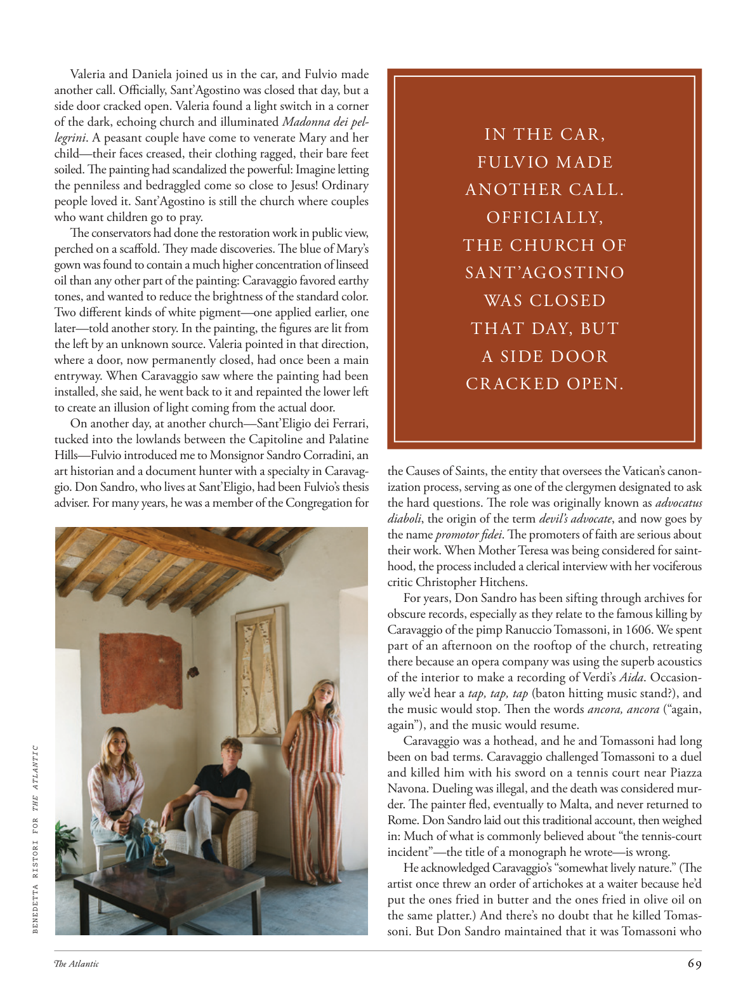

# The Atlantic — August 2026

## Page 71

---

Valeria and Daniela joined us in the car, and Fulvio made another call. Officially, Sant’Agostino was closed that day, but a side door cracked open. Valeria found a light switch in a corner of the dark, echoing church and illuminated Madonna dei pellegrini . A peasant couple have come to venerate Mary and her child—their faces creased, their clothing ragged, their bare feet soiled. The painting had scandalized the powerful: Imagine letting the penni less and bedraggled come so close to Jesus! Ordinary people loved it. Sant’Agostino is still the church where couples who want children go to pray.

**【中文翻译】** 瓦莱里娅和丹妮拉开车加入我们，富尔维奥又打了一个电话。按官方规定，圣阿戈斯蒂诺当天已关闭，但一扇侧门却打开了。瓦莱里娅在黑暗的角落里发现了一个电灯开关，与教堂的回声相呼应，照亮了佩莱格里尼圣母像。一对农民夫妇前来祭拜玛丽和她的孩子——他们满脸皱纹，衣服破烂，赤脚脏兮兮的。这幅画震惊了当权者：想象一下，让身无分文、衣衫褴褛的人如此接近耶稣！普通人都喜欢它。圣阿戈斯蒂诺教堂仍然是想要孩子的夫妇去祈祷的地方。

The conservators had done the restoration work in public view, perched on a scaffold. They made discoveries. The blue of Mary’s gown was found to contain a much higher concentration of linseed oil than any other part of the painting: Caravaggio favored earthy tones, and wanted to reduce the brightness of the standard color.

**【中文翻译】** 修复人员坐在脚手架上，在公众视野中完成了修复工作。他们有了发现。人们发现玛丽礼服的蓝色比画作的任何其他部分含有更高浓度的亚麻籽油：卡拉瓦乔喜欢泥土色调，并希望降低标准颜色的亮度。

Two different kinds of white pigment— one applied earlier, one later— told another story. In the painting, the figures are lit from the left by an unknown source. Valeria pointed in that direction, where a door, now permanently closed, had once been a main entryway. When Caravaggio saw where the painting had been installed, she said, he went back to it and repainted the lower left to create an illusion of light coming from the actual door.

**【中文翻译】** 两种不同的白色颜料——一种较早使用，一种较晚使用——讲述了另一个故事。在这幅画中，人物从左侧被未知的光源照亮。瓦莱里娅指着那个方向，那里曾经是一个主要入口，现在已经永久关闭了。她说，当卡拉瓦乔看到这幅画的安装位置时，他回到画作并重新绘制了左下角，以创造出光线从实际门发出的错觉。

On another day, at another church—Sant’Eligio dei Ferrari, tucked into the lowlands between the Capitoline and Palatine Hills—Fulvio introduced me to Monsignor Sandro Corradini, an art historian and a document hunter with a specialty in Caravaggio. Don Sandro, who lives at Sant’Eligio, had been Fulvio’s thesis adviser. For many years, he was a member of the Congregation for BENEDETTA RISTORI FOR THE ATLANTIC IN THE CAR, FULVIO MADE ANOTHER CALL.

**【中文翻译】** 另一天，在另一座教堂——位于卡比托利欧山和帕拉蒂尼山之间的低地的圣埃利希奥·德·法拉利教堂——富尔维奥向我介绍了桑德罗·科拉迪尼主教，他是一位艺术史学家和专门研究卡拉瓦乔的文献猎人。住在圣埃利吉奥的唐·桑德罗 (Don Sandro) 曾是富尔维奥的论文导师。多年来，他一直是大西洋贝内黛塔·里斯托里会众的成员。在汽车里，富尔维奥又打了一个电话。

OFFICIALLY, THE CHURCH OF SANT’AGOSTINO WAS CLOSED THAT DAY, BUT A SIDE DOOR CR ACKED OPEN. the Causes of Saints, the entity that oversees the Vatican’s canonization process, serving as one of the clergymen designated to ask the hard questions. The role was originally known as advocatus diaboli , the origin of the term devil’s advocate , and now goes by the name promotor fidei . The promoters of faith are serious about their work. When Mother Teresa was being considered for sainthood, the process included a clerical interview with her vociferous critic Christopher Hitchens.

**【中文翻译】** 按照官方规定，圣阿戈斯蒂诺教堂当天关闭，但一扇侧门却打开了。圣人事业是监督梵蒂冈封圣过程的实体，是被指定提出棘手问题的神职人员之一。这个角色最初被称为“advocatus diaboli”，即魔鬼代言人一词的起源，现在被称为“promotor fidei”。信仰的推动者对待他们的工作是认真的。当特蕾莎修女被考虑封为圣人时，这一过程包括对她的批评者克里斯托弗·希钦斯进行一次牧师访谈。

For years, Don Sandro has been sifting through archives for obscure records, especially as they relate to the famous killing by Caravaggio of the pimp Ranuccio Tomassoni, in 1606. We spent part of an afternoon on the rooftop of the church, retreating there because an opera company was using the superb acoustics of the interior to make a recording of Verdi’s Aida . Occasionally we’d hear a tap, tap, tap (baton hitting music stand?), and the music would stop. Then the words ancora, ancora (“again, again”), and the music would resume.

**【中文翻译】** 多年来，唐·桑德罗一直在档案中筛选晦涩的记录，尤其是与 1606 年卡拉瓦乔杀害皮条客拉努乔·托马索尼的著名事件有关的记录。我们在教堂的屋顶上度过了一个下午的时间，因为一家歌剧团正在利用教堂内部一流的音响效果来录制威尔第的《阿依达》。偶尔我们会听到敲击、敲击、敲击的声音（指挥棒敲击乐谱架？），然后音乐就会停止。然后单词 ancora，ancora（“再次，再次”）和音乐将恢复。

Caravaggio was a hothead, and he and Tomassoni had long been on bad terms. Caravaggio challenged Tomassoni to a duel and killed him with his sword on a tennis court near Piazza Navona. Dueling was illegal, and the death was considered murder. The painter fled, eventually to Malta, and never returned to Rome. Don Sandro laid out this traditional account, then weighed in: Much of what is commonly believed about “the tennis-court incident”—the title of a monograph he wrote—is wrong.

**【中文翻译】** 卡拉瓦乔性情急躁，他和托马索尼的关系长期以来一直不和。卡拉瓦乔向托马索尼发起决斗挑战，并在纳沃纳广场附近的网球场上用剑杀死了他。决斗是非法的，死亡被视为谋杀。画家逃亡，最终逃到马耳他，再也没有回到罗马。唐·桑德罗（Don Sandro）阐述了这个传统的说法，然后发表评论：人们普遍认为的“网球场事件”（他写的一本专着的标题）的大部分内容都是错误的。

He acknowledged Caravaggio’s “somewhat lively nature.” (The artist once threw an order of artichokes at a waiter because he’d put the ones fried in butter and the ones fried in olive oil on the same platter.) And there’s no doubt that he killed Tomassoni. But Don Sandro maintained that it was Tomassoni who

**【中文翻译】** 他承认卡拉瓦乔“有些活泼的天性”。 （这位艺术家曾经向服务员扔了一份洋蓟，因为他把用黄油煎的洋蓟和用橄榄油煎的洋蓟放在同一个盘子上。）毫无疑问，他杀死了托马索尼。但唐·桑德罗坚持认为是托马索尼
