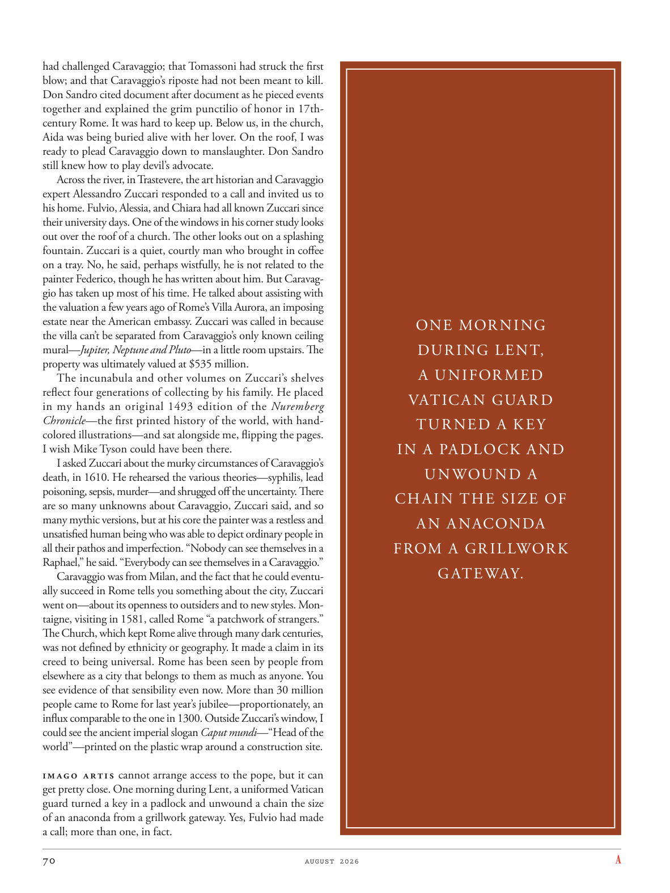

# The Atlantic — August 2026

## Page 72

---

had challenged Caravaggio; that Tomassoni had struck the first blow; and that Caravaggio’s riposte had not been meant to kill. Don Sandro cited document after document as he pieced events together and explained the grim punctilio of honor in 17thcentury Rome. It was hard to keep up. Below us, in the church, Aida was being buried alive with her lover. On the roof, I was ready to plead Caravaggio down to manslaughter. Don Sandro still knew how to play devil’s advocate.

**【中文翻译】** 曾挑战卡拉瓦乔；托马索尼先发制人了；卡拉瓦乔的反击并不是为了杀人。唐·桑德罗 (Don Sandro) 引用了一份又一份文件，将事件拼凑起来，解释了 17 世纪罗马关于荣誉的严酷细节。很难跟上。在我们下面的教堂里，阿伊达和她的情人被活埋。在屋顶上，我准备恳求卡拉瓦乔犯下过失杀人罪。唐·桑德罗仍然知道如何唱反调。

Across the river, in Trastevere, the art historian and Caravaggio expert Alessandro Zuccari responded to a call and invited us to his home. Fulvio, Alessia, and Chiara had all known Zuccari since their university days. One of the windows in his corner study looks out over the roof of a church. The other looks out on a splashing fountain. Zuccari is a quiet, courtly man who brought in coffee on a tray. No, he said, perhaps wistfully, he is not related to the painter Federico, though he has written about him. But Caravaggio has taken up most of his time. He talked about assisting with the valuation a few years ago of Rome’s Villa Aurora, an imposing estate near the American embassy. Zuccari was called in because the villa can’t be separated from Caravaggio’s only known ceiling mural— Jupiter, Neptune and Pluto —in a little room upstairs. The property was ultimately valued at $535 million.

**【中文翻译】** 河对岸的特拉斯提弗列，艺术历史学家兼卡拉瓦乔专家亚历山德罗·祖卡里 (Alessandro Zuccari) 接到电话，邀请我们去他家。富尔维奥、阿莱西亚和基亚拉从大学时代起就认识祖卡里。他角落书房的一扇窗户俯瞰着一座教堂的屋顶。另一个则眺望着喷水的喷泉。祖卡里是一个安静、彬彬有礼的人，他用托盘送咖啡。不，他也许有些渴望地说，他与画家费德里科没有关系，尽管他写过关于他的文章。但卡拉瓦乔占据了他大部分的时间。他谈到几年前协助对罗马奥罗拉别墅（Villa Aurora）进行估价，这是美国大使馆附近的一处宏伟庄园。祖卡里被叫进来是因为别墅与卡拉瓦乔唯一已知的天花板壁画——木星、海王星和冥王星——在楼上的一个小房间里密不可分。该房产最终估值为 5.35 亿美元。

The incunabula and other volumes on Zuccari’s shelves reflect four generations of collecting by his family. He placed in my hands an original 1493 edition of the Nuremberg Chronicle — the first printed history of the world, with handcolored illustrations— and sat alongside me, flipping the pages.

**【中文翻译】** 祖卡里书架上的古版和其他书籍反映了他家族四代人的收藏。他把 1493 年版的《纽伦堡纪事报》原版放在我手里——这是世界上第一本印刷版历史，配有手绘插图——然后坐在我旁边，翻着书页。

I wish Mike Tyson could have been there. I asked Zuccari about the murky circumstances of Caravaggio’s death, in 1610. He rehearsed the various theories—syphilis, lead poisoning, sepsis, murder—and shrugged off the un certainty. There are so many unknowns about Caravaggio, Zuccari said, and so many mythic versions, but at his core the painter was a restless and unsatisfied human being who was able to depict ordinary people in all their pathos and imperfection. “Nobody can see themselves in a Raphael,” he said. “Everybody can see themselves in a Caravaggio.”

**【中文翻译】** 我希望迈克·泰森能够在那里。我向祖卡里询问了 1610 年卡拉瓦乔死亡的隐秘情况。他阐述了各种理论——梅毒、铅中毒、败血症、谋杀——并对不确定性不屑一顾。祖卡里说，关于卡拉瓦乔有太多的未知数，也有太多的神话版本，但在他的核心，这位画家是一个不安分、不满足的人，他能够描绘普通人的所有悲伤和不完美。 “没有人能在拉斐尔的作品中看到自己，”他说。 “每个人都可以在卡拉瓦乔的作品中看到自己。”

Caravaggio was from Milan, and the fact that he could eventually succeed in Rome tells you something about the city, Zuccari went on—about its openness to outsiders and to new styles. Montaigne, visiting in 1581, called Rome “a patchwork of strangers.”

**【中文翻译】** 卡拉瓦乔来自米兰，他最终能在罗马取得成功的事实告诉你有关这座城市的一些事情，祖卡里接着说——关于它对外来者和新风格的开放态度。蒙田于 1581 年访问罗马，称罗马为“陌生人的拼凑而成”。

The Church, which kept Rome alive through many dark centuries, was not defined by ethnicity or geography. It made a claim in its creed to being universal. Rome has been seen by people from elsewhere as a city that belongs to them as much as anyone. You see evidence of that sensibility even now. More than 30 million people came to Rome for last year’s jubilee—proportionately, an influx comparable to the one in 1300. Outside Zuccari’s window, I could see the ancient imperial slogan Caput mundi —“Head of the world”—printed on the plastic wrap around a construction site.

**【中文翻译】** 教会使罗马在许多黑暗的世纪中得以生存，它不受种族或地理的限制。它在其信条中声称具有普遍性。罗马被其他地方的人们视为一座属于他们的城市，就像属于任何人一样。即使现在你也能看到这种敏感性的证据。超过 3000 万人来到罗马参加去年的禧年——按比例来说，这一人数与 1300 年的人数相当。在祖卡里的窗外，我可以看到古老的帝国口号 Caput mundi——“世界之首”——印在建筑工地周围的保鲜膜上。

Imago Artis cannot arrange access to the pope, but it can get pretty close. One morning during Lent, a uniformed Vatican guard turned a key in a padlock and unwound a chain the size of an anaconda from a grillwork gateway. Yes, Fulvio had made a call; more than one, in fact.

**【中文翻译】** Imago Artis 无法安排与教皇的接触，但可以非常接近。四旬斋期间的一天早上，一名身穿制服的梵蒂冈警卫转动挂锁中的钥匙，从格栅入口上解开了一条蟒蛇大小的链条。是的，富尔维奥打了电话；事实上，不止一个。

ONE MOR NING DUR ING LENT, A UNIFOR MED VATICAN GUARD TUR NED A KEY IN A PADLOCK AND UNWOUND A CHAIN THE SIZE OF AN ANACONDA FROM A GR ILLWORK GATEWAY.

**【中文翻译】** 四旬斋期间的一天早上，一名身穿制服的梵蒂冈医疗警卫转动挂锁上的钥匙，从 GR ILLWORK 网关上解开了一条蟒蛇大小的链条。
